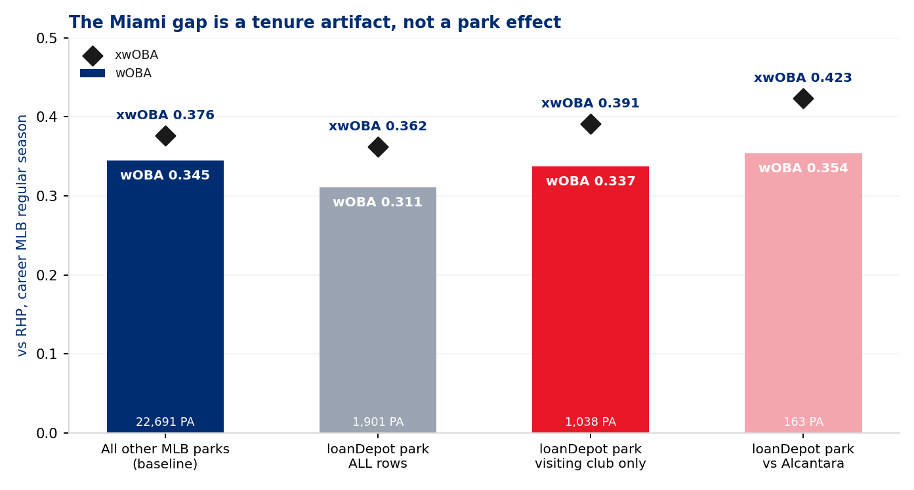
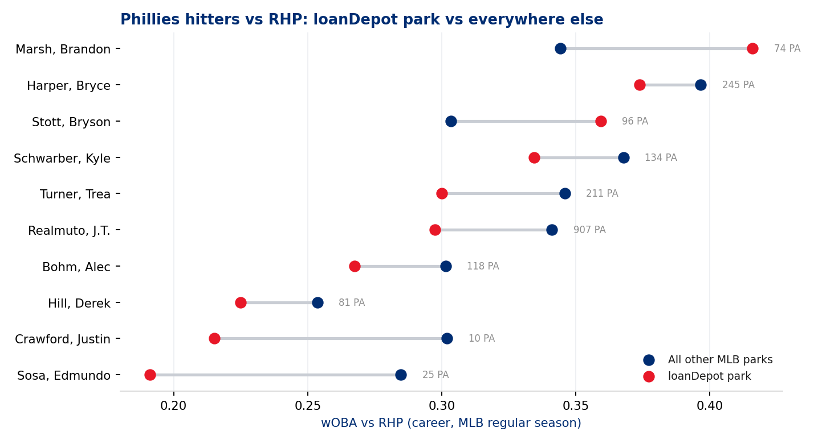
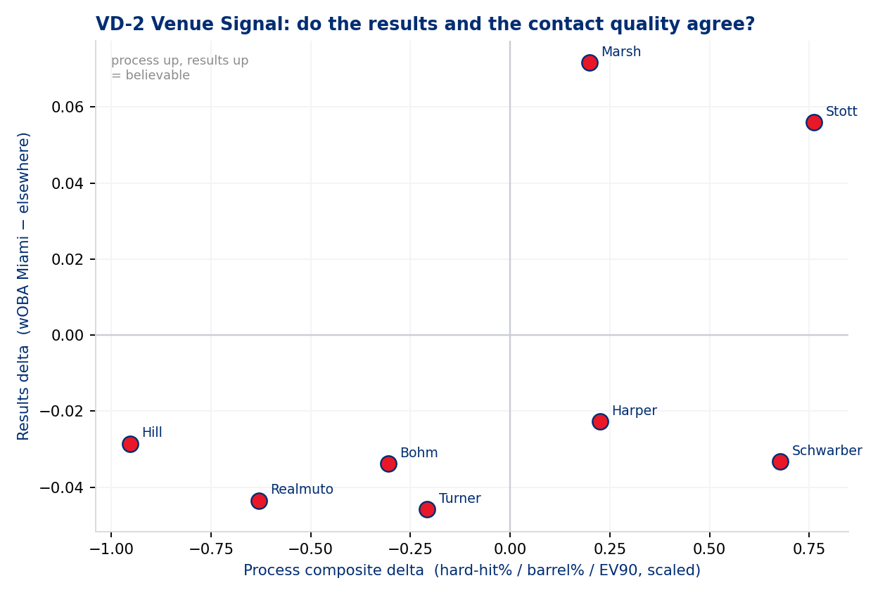
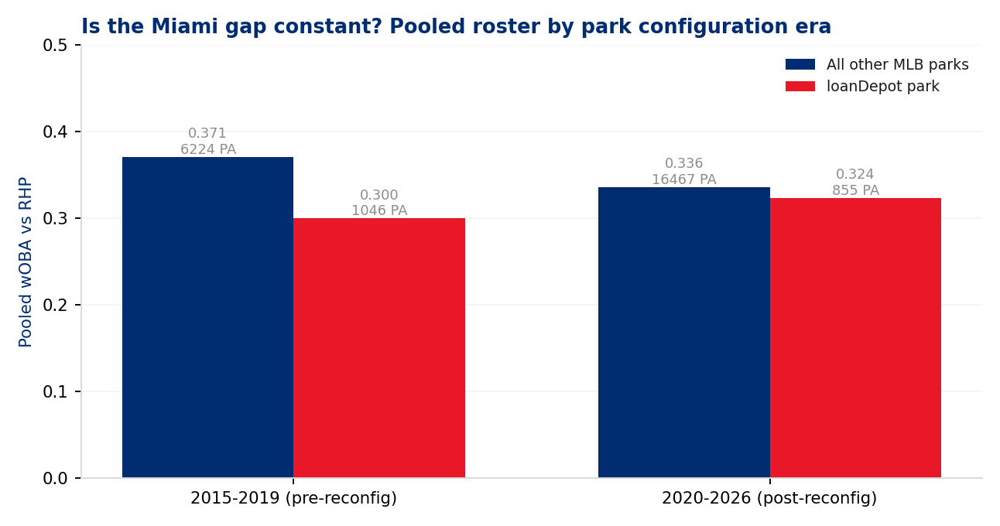
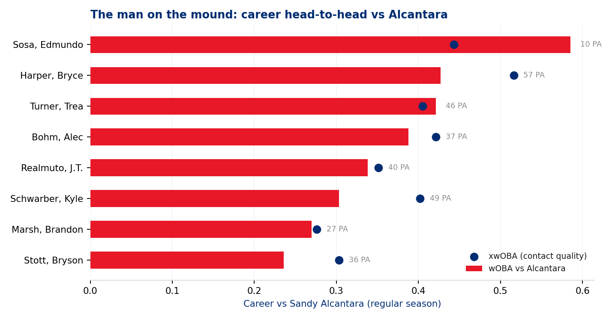

# Offensive Preview — Phillies hitters at loanDepot park
### Philadelphia @ Miami · loanDepot park · 2026-07-28 · 6:40 pm ET · Sandy Alcantara (RHP) vs Aaron Nola (RHP)

**Prepared for:** hitting coach / manager / advance scout / front office — pre-series offensive meeting
**Question asked:** do Phillies hitters perform differently in Miami than everywhere else, and what does that mean against Alcantara?
**Governance:** Use Case #28 (`uc-pos-007`) · build `dp_uc27` · 18 locked KPIs inherited verbatim from `dp_uc24` / *Baseball Functions* · 2 new PROVISIONAL KPIs (VD-1 Venue Delta, VD-2 Venue Signal Class) · 256/256 independent verification checks reconcile

> ⚠️ **Read this first — data window, sample sizes, and one large confound.**
>
> * **Window:** career MLB regular season, 2015–2026, **vs RHP only**. 24,592 plate appearances across 11 hitters after governance filters.
> * **Freshness:** Phillies cache is current through **2026-07-22** (T-5). Sandy Alcantara's own parquet stops at **2025-04-12** — his 2026 season is visible *only* through the 103 pitches Phillies hitters saw on 2026-06-17. Nothing in this report describes his league-wide 2026 form.
> * **The confound that runs through everything:** 863 of the 1,901 Miami plate appearances belong to hitters who were *playing for the Marlins at the time* — J.T. Realmuto (783 PA, 2015–18) and Derek Hill (80 PA, 2024–25). Every "Miami" number is reported twice: **all rows**, and **visiting club only**. Only the second one describes July 28.
> * **Small samples, printed everywhere:** Marsh 74 PA in Miami, Stott 96, Schwarber 134, Bohm 118. Below the publishing gate and banner-flagged: **Sosa (25 PA), Crawford (10 PA)**. **Rincones Jr. has never batted at loanDepot park** and is absent from the venue tables.
> * **Excluded on purpose:** minor-league rows (Lehigh Valley / Clearwater frames — 45% of Rincones' and 33% of Crawford's non-Miami pitch log), the three 2017 "Marlins home" games actually played at Miller Park during the Hurricane Irma relocation, and Bryan De La Cruz (no parquet pulled).
> * **Manual carry-in:** the 2026-07-28 probable-starter pairing.

---

## Bottom line

1. **The "Phillies can't hit in Miami" split is real in the results and mostly fake in the cause.** All-rows, the group hits `.720` OPS / `.311` wOBA at loanDepot against `.804` / `.345` everywhere else — a 34-point wOBA hole. Strip out the two hitters who were *Marlins* at the time and the hole nearly closes: **`.783` OPS / `.337` wOBA on 1,038 visiting-club PA**, an 8-point gap. On expected quality it doesn't just close, it inverts: **xwOBA `.391` in Miami vs `.376` on the road baseline.**

2. **As visitors, this group's contact quality at loanDepot is the best it is anywhere.** Hard-hit `44.8%` vs `43.7%` baseline, barrel rate `11.0%` vs `9.4%`, EV90 `105.3` vs `105.7`, home-run rate identical at `4.1%`. The ground-ball tilt that shows up in the all-rows cut (`46.5%` GB) also evaporates for visitors (`44.2%` vs `43.9%`). There is no batted-ball suppression signature here.

3. **Against Alcantara specifically, this roster has hit him — and hit him hardest in Miami.** 309 career PA, `.311/.356/.463`, wOBA `.353` against an xwOBA of `.388`; they have been *under*-rewarded. In Miami against him: **163 PA, `.354` wOBA, `.423` xwOBA, 47.5% hard-hit, 9.0% barrel, one homer every 27 PA.** Away from Miami against him: `.349` xwOBA, 38.0% hard-hit, one homer in 146 PA.

4. **The slider is the pitch to hunt; the curveball is the pitch that has beaten them.** Alcantara's slider has yielded `.495` wOBA / `.496` xwOBA and **55.2% hard-hit** to this group across 191 pitches — his worst pitch by a wide margin, and they don't chase it (27.7%). His curveball has held them to `.123` wOBA, and in the 2025–26 window he has more than doubled its usage (4.6% career vs this group → **11.6%**), while four-seam usage has dropped from 24.6% to 16.2%.

5. **So-what for July 28:** the venue is not a reason to change the lineup. Two Phillies hitters have a genuine, process-backed Miami lift (**Stott, Marsh**), two have elite expected numbers against Alcantara that the box score has not paid them for (**Harper, Schwarber**), and one has a 21-PA Miami-only Alcantara line that is the loudest split in the file and the least trustworthy (**Realmuto, 1.333 OPS**). Play the matchup, not the park.

---

## 1. The venue split, as asked

Career vs RHP, MLB regular season, all rows. This is the direct answer to the question as posed.

| Cohort | PA | AVG | OBP | SLG | OPS | wOBA | xwOBA | Hard-hit% | Barrel% | EV90 | K% | BB% | P/PA |
|---|---|---|---|---|---|---|---|---|---|---|---|---|---|
| All other MLB parks | 22,691 | .268 | .338 | .466 | **.804** | **.345** | .376 | 43.7% | 9.4% | 105.7 | 22.2% | 9.0% | 3.96 |
| loanDepot park | 1,901 | .250 | .308 | .411 | **.720** | **.311** | .362 | 40.7% | 8.5% | 104.2 | 20.1% | 7.4% | 3.93 |
| **Delta (VD-1)** | | −.018 | −.030 | −.055 | **−.084** | **−.034** | **−.014** | −3.0pp | −0.9pp | −1.5 | −2.1pp | −1.6pp | −0.03 |

The results gap is loud. The expected gap is quiet — `−.014` of xwOBA against `−.034` of wOBA means well over half of the shortfall is sequencing and outcome luck, not contact. That alone would be enough to say "don't over-read it." The provenance check says something stronger.

### Per-hitter detail

| Hitter | Miami PA | Miami OPS | Miami wOBA | Other wOBA | Δ wOBA | Δ xwOBA | Δ Hard-hit | Δ Barrel | VD-2 class |
|---|---|---|---|---|---|---|---|---|---|
| Marsh, Brandon | 74 | .980 | .416 | .344 | **+.072** | +.067 | −2.0pp | +3.5pp | Miami boost — results and process agree |
| Stott, Bryson | 96 | .851 | .359 | .303 | **+.056** | +.051 | +2.9pp | +5.3pp | Miami boost — results and process agree |
| Harper, Bryce | 245 | .882 | .374 | .396 | −.023 | +.002 | +2.9pp | +1.9pp | Process-only lift — under-rewarded |
| Hill, Derek | 81 | .500 | .225 | .254 | −.029 | +.020 | −6.6pp | −1.6pp | Miami drag — results and process agree |
| Schwarber, Kyle | 134 | .787 | .335 | .368 | −.033 | −.011 | +4.3pp | +4.3pp | Process-only lift — under-rewarded |
| Bohm, Alec | 118 | .599 | .268 | .301 | −.034 | −.025 | −0.9pp | −2.0pp | Miami drag — results and process agree |
| Realmuto, J.T. | 907 | .687 | .298 | .341 | −.044 | −.024 | −3.7pp | −1.5pp | Miami drag *(see §2 — confounded)* |
| Turner, Trea | 211 | .693 | .300 | .346 | −.046 | −.004 | −0.7pp | +0.1pp | Miami drag — results only |
| Crawford, Justin | 10 | .500 | .215 | .302 | −.087 | +.057 | +1.9pp | −1.1pp | **Insufficient sample** |
| Sosa, Edmundo | 25 | .376 | .191 | .285 | −.094 | −.093 | −11.1pp | −5.2pp | **Insufficient sample** |
| Rincones Jr., Gabriel | 0 | — | — | .224 | — | — | — | — | **No Miami history** |

**Turner is the cleanest illustration of the report's thesis.** A `−.046` wOBA gap on 211 PA looks like a park problem until you see the expected gap: `−.004`. Same hard-hit rate, same barrel rate, essentially the same EV90. That is 211 plate appearances of noise wearing a costume.

---

## 2. Why the all-rows number is the wrong number

`home_team == 'MIA'` collects two very different populations: Phillies hitters *visiting* loanDepot, and hitters who *worked there*. Realmuto caught for the Marlins from 2015 to 2018; Derek Hill played there in 2024 and 2025. Between them they supply **863 of 1,901 Miami plate appearances — 45% of the entire Miami cohort.**

| Miami sub-cohort | PA | OPS | wOBA | xwOBA | Hard-hit% |
|---|---|---|---|---|---|
| **All home-club rows** (Realmuto + Hill) | **863** | — | **.281** | **.326** | 36.1% |
| Realmuto as the home club (2015–18 Marlins) | 783 | .658 | .286 | .331 | 37.0% |
| Realmuto as a visitor (2019–26 Phillies) | 124 | .868 | **.371** | **.427** | 42.9% |
| Hill as the home club (2024–25 Marlins) | 80 | .507 | .228 | .287 | 25.5% |

Realmuto's Miami line as a *visitor* is better than his career line anywhere else (`.341` wOBA). His Miami line as a *Marlin* — a 24-to-27-year-old catcher on four last-place teams — is what drags the roster average down. That is a tenure effect and an aging-curve effect wearing a park's name.

Rebuild the cohort with visiting-club rows only:

| Cohort | PA | AVG | OBP | SLG | OPS | wOBA | **xwOBA** | Hard-hit% | Barrel% | EV90 | HR% |
|---|---|---|---|---|---|---|---|---|---|---|---|
| All other MLB parks | 22,691 | .268 | .338 | .466 | .804 | .345 | .376 | 43.7% | 9.4% | 105.7 | 4.1% |
| loanDepot park — **visitors only** | 1,038 | .260 | .327 | .457 | **.783** | **.337** | **.391** | **44.8%** | **11.0%** | 105.3 | 4.1% |

Eight points of wOBA, and *fifteen points of xwOBA in the other direction*. Batted-ball shape confirms it — the visiting-club ground-ball rate at loanDepot is `44.2%` against a `43.9%` baseline, a difference of nothing.

**Verdict: loanDepot park is not suppressing this offense.** The park has a reputation; this roster does not have the evidence for it.

### Does the park era matter?

loanDepot's playing surface has not been constant — the centre-field sculpture came out in 2019 and the outfield walls were brought in for 2020. Splitting on that boundary:

| Cohort | Era | PA | OPS | wOBA | Hard-hit% | Barrel% |
|---|---|---|---|---|---|---|
| Miami — all rows | 2015–2019 | 1,046 | .693 | .300 | 37.4% | 6.6% |
| Miami — all rows | 2020–2026 | 855 | .752 | .324 | 44.9% | 10.8% |
| Miami — visitors only | 2015–2019 | 263 | .800 | .343 | 38.8% | 10.3% |
| Miami — visitors only | 2020–2026 | 775 | .778 | .334 | 46.7% | 11.2% |

All-rows, the post-reconfiguration park looks 24 points of wOBA friendlier — but that is the same confound again, because Realmuto's Marlins years all sit in the pre-2020 bucket. Visitors-only, the two eras are within 9 points of each other on 263 and 775 PA. **The park-configuration hypothesis does not survive the provenance fix.** Do not build a story on it.

---

## 3. The second perspective — Sandy Alcantara

Alcantara is announced for Tuesday. He has thrown 1,117 tracked pitches to these eleven hitters across 2018–2026, and this is one of the more experienced lineups he will face.

| Cohort vs Alcantara | PA | AVG | OBP | SLG | OPS | wOBA | xwOBA | Hard-hit% | Barrel% | K% | HR% |
|---|---|---|---|---|---|---|---|---|---|---|---|
| All venues | 309 | .311 | .356 | .463 | **.819** | .353 | **.388** | 43.0% | 7.0% | 17.8% | 2.3% |
| At loanDepot park | 163 | .302 | .350 | .477 | .826 | .354 | **.423** | **47.5%** | 9.0% | 16.6% | **3.7%** |
| Everywhere else | 146 | .321 | .363 | .448 | .811 | .351 | .349 | 38.0% | 4.6% | 19.2% | 0.7% |

Two things stand out. First, the group's xwOBA against him (`.388`) sits 35 points above their actual wOBA (`.353`) — they have hit him harder than the results say. Second, **the venue effect against Alcantara runs the opposite way to the naive park story**: 47.5% hard-hit and a home run every 27 PA in Miami, against 38.0% and one home run in 146 PA elsewhere.

### Arsenal — what he has thrown this group, and what it cost him

| Pitch | Pitches | Usage | Velo | PA | wOBA | xwOBA | Whiff% | Chase% | Hard-hit% |
|---|---|---|---|---|---|---|---|---|---|
| Sinker | 288 | 25.8% | 97.2 | 92 | .311 | .381 | 13.6% | 31.1% | 38.9% |
| 4-Seam | 275 | 24.6% | 97.6 | 70 | .382 | .409 | 19.1% | 29.2% | 48.9% |
| Changeup | 274 | 24.5% | 91.2 | 87 | .367 | .375 | 25.1% | **42.2%** | 44.8% |
| **Slider** | 191 | 17.1% | 89.1 | 35 | **.495** | **.496** | 31.0% | 27.7% | **55.2%** |
| Curveball | 51 | 4.6% | 84.3 | 13 | **.123** | .270 | 16.7% | 22.7% | 25.0% |
| Cutter | 23 | 2.1% | 90.1 | 7 | .255 | .267 | 42.9% | 33.3% | 0.0% |
| Sweeper | 15 | 1.3% | 85.4 | 5 | .178 | .200 | 66.7% | 37.5% | 0.0% |

The slider is a two-way problem for him: it misses bats (31.0% whiff) but when it is put in play it is destroyed (55.2% hard-hit, `.496` xwOBA), and this group does not chase it out of the zone. The changeup is his chase pitch and the sinker is his contact-management pitch — `.381` xwOBA on 92 PA is a fine workhorse result at 97 mph.

**The usage is moving.** In the 2025–26 window (277 pitches to this group) the mix reads: changeup 24.5%, sinker 21.7%, four-seam **16.2%**, slider 12.3%, curveball **11.6%**, cutter **8.3%**, sweeper 5.4%. Relative to the career-vs-this-group baseline that is four-seam usage cut by a third, and the two pitches they have handled worst — curveball and cutter — more than doubled and quadrupled. Post-surgery Alcantara is pitching backwards more.

> ⚠️ **Sample and freshness caveat on the arsenal shift.** The 2025–26 mix rests on 277 pitches from a handful of appearances, and the local cache carries no Alcantara data between 2025-04-12 and the single 2026-06-17 look. Treat the direction as real and the magnitudes as provisional. In that June start he generated weak contact — 26 PA, 10.5% hard-hit, EV90 92.2 — the softest single-game contact profile in his file against this group.

### Per hitter, career vs Alcantara

| Hitter | PA | AVG | SLG | OPS | wOBA | xwOBA | Hard-hit% | K% | Miami PA | Miami OPS | Miami xwOBA |
|---|---|---|---|---|---|---|---|---|---|---|---|
| Harper, Bryce | 57 | .326 | .609 | **1.030** | .427 | **.516** | 62.2% | 19.3% | 27 | 1.111 | **.568** |
| Schwarber, Kyle | 49 | .238 | .310 | .656 | .303 | **.402** | 53.8% | 30.6% | 29 | .519 | .400 |
| Turner, Trea | 46 | .386 | .568 | **.981** | .421 | .405 | 37.1% | 19.6% | 25 | 1.040 | .441 |
| Realmuto, J.T. | 40 | .300 | .500 | .800 | .338 | .351 | 29.0% | 20.0% | 21 | **1.333** | .475 |
| Bohm, Alec | 37 | .371 | .486 | .891 | .388 | .421 | 50.0% | 13.5% | 21 | .649 | .373 |
| Stott, Bryson | 36 | .242 | .303 | .553 | .236 | .303 | 40.6% | 8.3% | 19 | .380 | .326 |
| Marsh, Brandon | 27 | .259 | .370 | .630 | .270 | .276 | 37.5% | 11.1% | 17 | .588 | .332 |
| Sosa, Edmundo | 10 | .556 | .778 | 1.378 | .585 | .443 | 22.2% | 0.0% | 3 | 1.333 | .440 |
| Crawford, Justin | 3 | .333 | .333 | .667 | .297 | .154 | 0.0% | 33.3% | 0 | — | — |
| Rincones Jr., Gabriel | 3 | .000 | .000 | .000 | .000 | .091 | 0.0% | 0.0% | 0 | — | — |
| Hill, Derek | 1 | .000 | .000 | .000 | .000 | .398 | 100% | 0.0% | 1 | .000 | .398 |

---

## 4. Players to watch

**Bryce Harper — the one who needs no adjustment.** `.516` xwOBA on 57 career PA against Alcantara is the highest mark in the file by 95 points, and it rises to `.568` on his 27 PA at loanDepot. His Miami venue split reads `−.023` wOBA but `+.002` xwOBA with hard-hit and barrel rates *above* his own road baseline. Nothing in this dataset argues for anything other than letting him hunt.

**Kyle Schwarber — the loudest gap between what he did and what he earned.** `.303` wOBA vs Alcantara on `.402` xwOBA, and 53.8% hard-hit. In Miami generally: 56.4% hard-hit and a **21.8% barrel rate** against a 17.5% road baseline, EV90 109.3 — the highest contact-quality numbers of any hitter in this study — for a `.335` wOBA. He is also carrying the highest strikeout rate in the Miami cohort (30.6%). The profile is "when he connects it is over; he connects slightly less often here."

**Bryson Stott — the most believable positive split.** `+.056` wOBA in Miami with the process agreeing on all three axes: barrel rate `10.3%` vs `4.9%` elsewhere, EV90 `+0.7`, strikeout rate `11.5%` vs `16.6%`, whiff `12.7%` vs `16.3%`. On 96 PA it is directional, not proven, but it is the only hitter here whose results, contact quality, and plate discipline all move the same direction. His Alcantara history is poor (`.553` OPS, 36 PA) — but with an 8.3% strikeout rate against him, the at-bats are competitive.

**Brandon Marsh — the biggest number, the thinnest evidence.** `.980` OPS and `+.072` wOBA in Miami, but on **74 PA**, and the process composite is carried entirely by barrel rate (+3.5pp) while hard-hit rate and EV90 both fall. Treat as a lineup tiebreaker, not a plan.

**J.T. Realmuto — read the right split.** His headline Miami line (`.687` OPS, 907 PA) is a Marlins-tenure artifact. As a visiting Phillie at loanDepot he has posted `.868` OPS / `.371` wOBA / `.427` xwOBA on 124 PA, better than his own career baseline. Against Alcantara in Miami: 21 PA, 1.333 OPS. That last one is the single loudest cell in the entire product and the single least reliable.

**Trea Turner — the null result worth stating out loud.** A 46-point wOBA hole in Miami with a 4-point expected hole. No adjustment warranted.

**Edmundo Sosa and Justin Crawford — do not act on these.** 25 PA and 10 PA respectively. Both are below the publishing gate and appear in the tables only so their absence is not mistaken for an omission. **Gabriel Rincones Jr. has zero career plate appearances at loanDepot park.**

---

## 5. Actions by persona

**Hitting coach.**
Lead the room with the visitors-only frame, not the raw split — the raw split will be in a broadcast graphic by first pitch and it is misleading. The concrete plan against Alcantara is slider-first: it is the only pitch in his arsenal this group has both laid off (27.7% chase) and punished (55.2% hard-hit, `.496` xwOBA). The counter-adjustment to expect is more curveball and cutter, which he has already leaned into in 2025–26 and which have held this group to `.123` and `.255` wOBA. Get the two-strike look at the curveball into cage work before Tuesday.

**Manager / lineup card.**
The park is not a lineup input. If a marginal call comes down to it, Stott is the one hitter with a coherent Miami case (results, contact quality, and contact rate all agreeing on 96 PA). Marsh's `.980` Miami OPS is a 74-PA tiebreaker, not a reason to move anyone up. Against Alcantara specifically, the strongest expected-quality cases are Harper, Schwarber and Bohm (`.421` xwOBA on 37 PA, 13.5% K rate).

**Advance scout / analyst.**
Two things to carry forward. First, the provenance rule this build had to invent — a "Miami" cohort that silently includes a player's own tenure with that club is not a venue cohort, and the same trap exists for every ex-Marlin, ex-National and ex-Cardinal on the roster. Second, the naive union in the source snippet double-counted 6–18% of every hitter's Miami pitches; any future park study should inherit the deduplication and competition-level filters from `dp_uc27` rather than re-derive them.

**Front office / deadline desk.**
Alcantara is on the market and this organisation has been publicly linked to him. This product is not a valuation, but two facts from it belong in the room: the arsenal shift toward curveball and cutter with reduced four-seam usage is consistent with a pitcher managing diminished stuff, and his most recent look against a good lineup (2026-06-17) produced the weakest contact in his file against this group (10.5% hard-hit on 26 PA). Those two facts point in opposite directions and both rest on small samples. Ask for the full 2026 pitch log before anyone forms a view — the local cache cannot answer it.

**Communications / broadcast.**
If the "Phillies struggle at loanDepot" line comes up, the honest version is: as visitors, this group has hit the ball harder at loanDepot than at their own average venue (44.8% hard-hit, 11.0% barrel rate), and the historical gap is driven by two players who used to work there.

---

## 6. Trends worth tracking

1. **Alcantara's arsenal is migrating away from the four-seam.** 24.6% career against this group → 16.2% in 2025–26, with curveball up from 4.6% to 11.6% and cutter from 2.1% to 8.3%. If that holds Tuesday, the game-plan input is a soft-first pitcher, not a 98-mph pitcher. Worth a same-day check against a fresh pull.

2. **The group's Miami contact quality has climbed with the roster turnover, not with the park.** Visitors-only barrel rate at loanDepot is `10.3%` pre-2020 and `11.2%` post-2020 — flat. The all-rows series moves from `6.6%` to `10.8%` purely because Realmuto's Marlins years age out of the sample. Any future "the park changed" claim needs the visitors-only series to move.

3. **Two hitters carry a persistent under-reward signature in Miami** (Harper and Schwarber: positive process delta, negative results delta). If that pattern holds another season it stops being noise and starts being worth a batted-ball-direction study against loanDepot's specific outfield geometry — which this product deliberately does not attempt.

4. **Realmuto's visiting-club Miami line is the most interesting unexplored thread in the file.** `.427` xwOBA on 124 PA in a park he knows better than anyone on the roster. Familiarity effects are hard to identify and easy to imagine; a dedicated use case with a proper comparison population would be needed before anyone says the word "comfort."

---

## 7. Candid data-window and freshness caveats

* **Alcantara's 2026 form is not in this product.** `data/opponents/alcantara.parquet` ends 2025-04-12. Everything said about his 2026 season rests on 103 pitches from one start against Philadelphia. A fresh pull before first pitch would materially improve the arsenal section. *(Receipt: `out/dp_uc27_freshness.csv`)*
* **No league-wide park baseline.** This study benchmarks the roster against itself. It cannot say whether loanDepot suppresses offense *in general* — only that it has not suppressed *this group as visitors*. A proper park-factor study needs a league-wide batted-ball population that the local cache does not hold.
* **The venue cohort is a proxy.** `home_team == 'MIA'` is the only venue identifier available in the pitch log; there is no `venue_id` field. It was hand-corrected for the one known relocation (three 2017 games at Miller Park) but would miss any other undocumented relocation.
* **`pitches_per_pa` is computed as total pitches ÷ plate appearances** and therefore includes pitches thrown in plate appearances that ended against a different pitcher-handedness within the same at-bat. The effect is small and identical across cohorts, so venue deltas are safe; the absolute level is a slight overstatement.
* **VD-1 and VD-2 are PROVISIONAL KPIs.** The process composite's scaling divisors (`0.06` hard-hit, `0.035` barrel, `2.5` EV90) are house-set approximations of population dispersion, not fitted values. The classification boundaries (`±.020` wOBA, `±0.30` composite) are conventions. No downstream use case may inherit these definitions until they are ratified. *(Spec: `04_architecture_and_kpi_specs.md`)*
* **Two hitters are published below the sample gate** (Sosa 25 PA, Crawford 10 PA) and one has no Miami history at all (Rincones Jr.). They are shown for completeness and are excluded from every pooled figure and every conclusion.
* **Bryan De La Cruz was excluded** at the requester's instruction — no parquet has been pulled for him. If he is on the July 28 card, this product does not cover him.

---

**Artifacts.** Build: `dp_uc27_phillies_at_loandepot.py`. Verification: `dp_uc27_verification.py` (256 checks, 0 failures, `out/dp_uc27_verification_results.csv`). Receipts: 24 CSVs and 5 figures under `out/`. Governance trail: `00_`–`07_` in this package.
