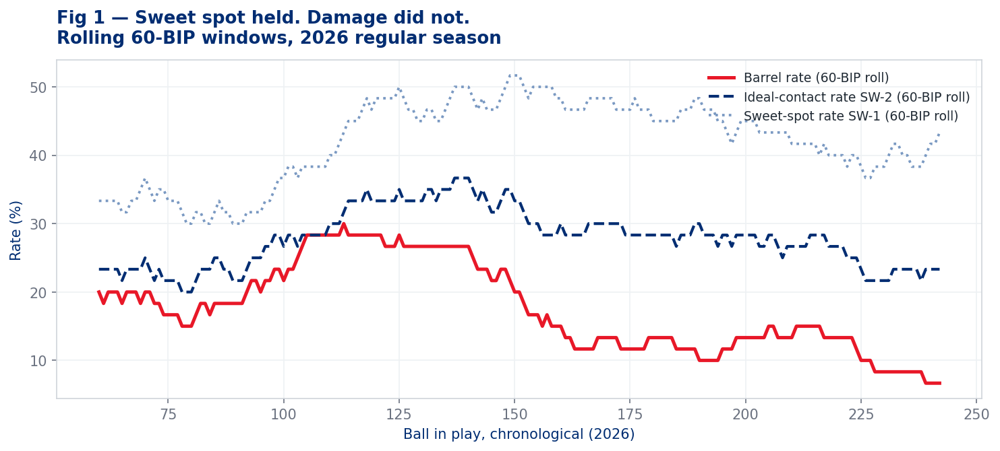
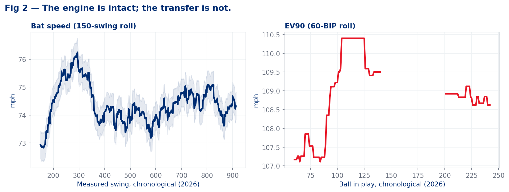
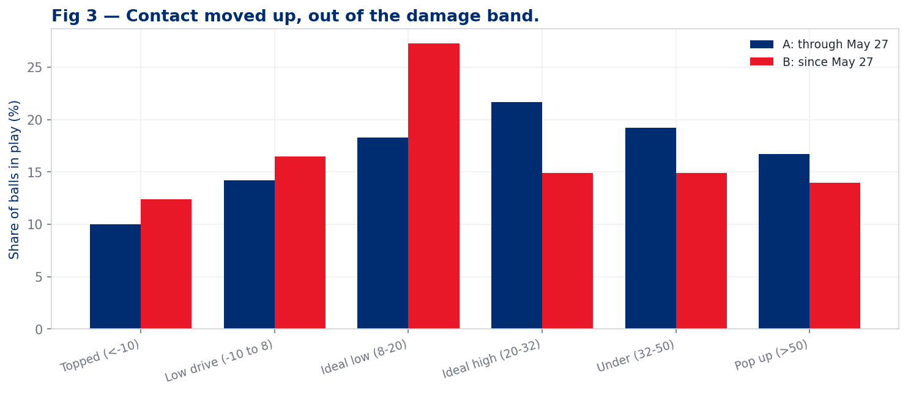
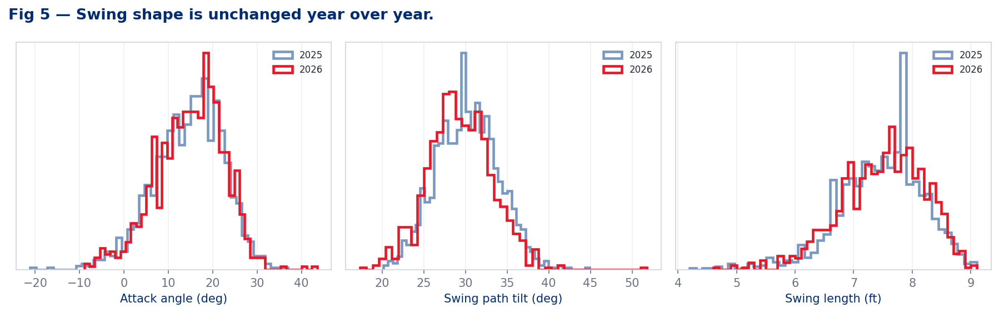
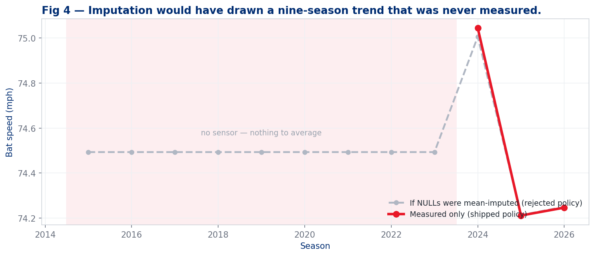

# Kyle Schwarber — The State of the Swing

**Use case** `uc-pos-009-schwarber-swing-decay-001` · **Build** `dp_uc32` · **Ledger** UC #33
**Prepared for** Kellen Short (Data Product Owner) · **Value stream** `pos` — Phillies position players
**Evidence window** 2026-03-26 → **2026-08-07** (T-1) · career backfill 2015 → 2021 via `schwarber.parquet`
**Entity lock** `batter == 656941` · regular season only · 24,891 pitches · **Certification** 24/24 DQ, 59/59 verification

> **Read this first.** Every number below was computed by `dp_uc32_schwarber_swing_decay.py` in this session and traces to a CSV receipt in `out/`. Bat-tracking metrics exist only from 2024 (bat speed) and 2025 (swing path). Seasons before those dates are printed as *not measured* — never as an estimate. See §7.

---

## Bottom line

**The bat is fine. The decisions are not.**

Kyle Schwarber's bat speed in 2026 is **74.2 mph** — identical to 2025 (74.2) and within a rounding error of 2024 (75.0). His 90th-percentile swing is **81.0 mph** in both halves of this season. His swing *shape* — attack angle, path tilt, swing length — is statistically indistinguishable from last year. There is no evidence in the bat-tracking data of physical decline.

What has changed is **what he swings at, and where the ball goes when he hits it.**

- **Chase rate is 25.5%** — his highest in a full season since 2017, up from 21.5% last year.
- **Strikeout rate is 34.8%** — a career high, up from 27.4%.
- Since **May 27**, his barrel rate has fallen from **24.2% to 9.8%** — a 59.5% collapse — while his bat speed moved by **0.006 mph**.

The mechanism is a **launch-angle redistribution, not a power loss**. He is still hitting the ball hard; he is hitting it hard at the wrong angles. Contact in his home-run band (20–32°) fell from 21.7% of balls in play to 14.9%. Contact in the line-drive band (8–20°) rose from 18.3% to 27.3%. He traded home runs for singles and doubles.

**And a warning about the metric you asked for.** Sweet-spot % — the standard 8–32° band — went **up** during the collapse, from 40.8% to 43.4%. So did hard-hit rate (50.8% → 53.3%) and squared-up rate (56.0% → 62.5%). Every "is he making good contact" metric improved while his slugging fell 27%. **Sweet-spot % is the wrong instrument for this hitter** and the report explains why in §3.

---

## 1. Is the season actually bad? Mostly no — and that matters

Before diagnosing a decline, price the baseline honestly.

| Season | PA | HR | SLG | ISO | OPS | xwOBAcon | Barrel % | Hard-hit % | EV90 | Bat speed |
|---|---:|---:|---:|---:|---:|---:|---:|---:|---:|---:|
| 2022 | 666 | 46 | .504 | .286 | .824 | .501 | 20.1% | 54.4% | 109.6 | *not measured* |
| 2023 | 716 | 47 | .473 | .277 | .811 | .459 | 16.4% | 48.8% | 108.1 | *not measured* |
| 2024 | 689 | 38 | .484 | .237 | .845 | .489 | 15.6% | 55.5% | 109.2 | 75.0 |
| **2025** | 719 | 56 | **.561** | **.322** | **.918** | **.536** | **20.8%** | **59.6%** | **109.8** | 74.2 |
| **2026** | 494 | 33 | .518 | .276 | .878 | .519 | 16.9% | 52.1% | 108.9 | **74.2** |

*Receipt: `a1_career_season_spine`*

**2026 is a normal Schwarber season.** SLG .518 and ISO .276 sit above his 2023 and 2024 marks. 33 home runs in 494 PA is a 46-homer pace over a full year. The comparison that makes 2026 look alarming is **2025 — the best offensive season of his career.** Some of the gap you are feeling is regression from a career year, not decay.

**Two numbers are genuinely bad, and neither is about power:**

- **Strikeout rate .348** — a career high. Prior high in a meaningful sample was .309 (2017).
- **Chase rate 25.5%** — up 4.0 points year over year, his worst full season since 2017.

Hold those. They are the thread.

---

## 2. Within the season, the decline is real and it is steep

You said the pop has drained *as the season has progressed*. That is correct, and it is sharper than the season line suggests.

The build splits 2026 at the chronological midpoint of balls in play — **2026-05-27** — so both phases carry equal contact weight (120 BIP vs 122 BIP).

| Metric | Through May 27 | Since May 27 | Change |
|---|---:|---:|---:|
| Plate appearances | 235 | 259 | — |
| Balls in play | 120 | 122 | — |
| **Barrel rate** | **24.2%** | **9.8%** | **−59.5%** |
| **ISO** | **.372** | **.187** | **−49.7%** |
| SLG | .603 | .439 | −27.2% |
| OPS | .952 | .810 | −14.9% |
| xwOBA on contact | .551 | .487 | −11.6% |
| Ideal-contact rate (SW-2) | 28.3% | 25.4% | −10.2% |
| Mean launch angle | 23.9° | 19.1° | −4.8° |
| — | — | — | — |
| **Bat speed** | **74.249** | **74.243** | **−0.006 mph** |
| Bat speed, 90th pct | 81.07 | 81.00 | −0.07 mph |
| Fast-swing rate (≥75 mph) | 68.1% | 66.7% | −2.1% |
| Swing length | 7.438 ft | 7.441 ft | +0.0% |
| Attack angle | 14.5° | 15.2° | +4.7% |
| Swing path tilt | 29.2° | 29.5° | +1.1% |
| — | — | — | — |
| Sweet-spot rate (SW-1) | 40.8% | 43.4% | **+6.4%** |
| Hard-hit rate | 50.8% | 53.3% | **+4.9%** |
| Squared-up rate (SW-4) | 56.0% | 62.5% | **+11.6%** |
| — | — | — | — |
| Chase rate | 24.1% | 26.7% | +10.8% |
| Whiff rate | 32.9% | 36.6% | +11.5% |
| In-zone whiff rate | 22.7% | 24.4% | +7.5% |

*Receipts: `b5_phase_split_2026`, `b6_phase_delta`*

**Read the middle block again.** Bat speed moved six thousandths of a mile per hour. The swing did not get slower, shorter, or flatter. Whatever is happening, it is not in the engine.

Monthly, the shape is unambiguous:

| Month | PA | BIP | Barrel % | SLG | HR | Bat speed | Chase % |
|---|---:|---:|---:|---:|---:|---:|---:|
| Mar | 22 | 10 | 30.0% | .474 | 2 | 71.8 | 24.1% |
| Apr | 118 | 61 | 19.7% | .613 | 9 | 74.8 | 20.4% |
| May | 112 | 57 | 26.3% | .592 | 11 | 74.1 | 30.3% |
| Jun | 115 | 58 | 12.1% | .558 | 8 | 74.1 | 25.2% |
| Jul | 95 | 45 | 8.9% | .385 | 3 | 74.4 | 25.3% |
| Aug | 32 | 11 | 0.0% | .160 | 0 | 74.6 | 29.9% |

*Receipt: `b1_monthly_2026`.* **August is 11 balls in play — directional only, do not read the .160.**

---

## 3. The mechanism: he is hitting it hard at the wrong angle

This is the finding.

Balls in play, bucketed by launch angle, with the xwOBA each bucket actually produced:

| Launch-angle band | xwOBAcon | Share, through May 27 | Share, since May 27 | Change |
|---|---:|---:|---:|---:|
| Topped (< −10°) | .088 | 10.0% | 12.4% | +2.4 pts |
| Low drive (−10 to 8°) | .266 | 14.2% | 16.5% | +2.3 pts |
| Ideal low (8–20°) | .736 | 18.3% | **27.3%** | **+9.0 pts** |
| **Ideal high (20–32°)** | **1.243** | **21.7%** | **14.9%** | **−6.8 pts** |
| Under (32–50°) | .515 | 19.2% | 14.9% | −4.3 pts |
| Pop up (> 50°) | .008 | 16.7% | 14.0% | −2.7 pts |

*Receipt: `c1_la_distribution`. xwOBAcon shown from the Phase A window.*

The **20–32° band is where Kyle Schwarber's value lives.** It produced an xwOBA on contact of **1.243** — it is, essentially, his home-run band. He lost nearly a third of it (21.7% → 14.9%). What he gained was the 8–20° band at **.736** — good contact, worth roughly 60% as much.

**This is why sweet-spot % misled.** The standard band is 8–32°. An 8° line drive and a 30° fly ball both count as "sweet spot." For a league-average hitter that is a reasonable simplification. For a hitter whose entire offensive identity is the top third of that band, it hides exactly the movement that matters. His sweet-spot % **improved** while his slugging fell 27%.

**Recommendation:** for this hitter, replace sweet-spot % in any dashboard or report with the **20–32° share** — call it *Damage-Band Rate* — or with **SW-2 Ideal-Contact Rate** (8–32° *and* EV ≥ 95), which at least requires the contact to be hard. SW-2 caught the decline (−10.2%); SW-1 did not. This is logged as **OI-2** for glossary ratification.

### Where it shows up

**By pitch group** — the loss is concentrated on breaking balls:

| Pitch group | Phase | PA | BIP | Barrel % | xwOBAcon | Whiff % |
|---|---|---:|---:|---:|---:|---:|
| Breaking | through May 27 | 81 | 35 | 25.7% | .602 | 41.5% |
| Breaking | since May 27 | 99 | 41 | **4.9%** | **.378** | **47.2%** |
| Fastballs | through May 27 | 115 | 67 | 22.4% | .520 | 23.0% |
| Fastballs | since May 27 | 130 | 73 | 11.0% | .528 | 27.2% |
| Offspeed | through May 27 | 38 | 18 | 27.8% | .566 | 41.8% |
| Offspeed | since May 27 | 27 | 8 | 25.0% | .684 | 37.0% |

*Receipt: `c2_pitch_group_phase`. Offspeed Phase B is 8 balls in play — directional only.*

Breaking-ball plate appearances rose from 81 to 99 while his barrel rate against them fell to 4.9% and his whiff rate climbed to 47.2%. **Opposing clubs found something and are leaning on it.**

**By velocity** — it is not a velocity problem. Barrel rate fell across every band:

| Velocity band | Phase A barrel % | Phase B barrel % | Bat speed A | Bat speed B |
|---|---:|---:|---:|---:|
| < 88 mph | 27.7% | 13.2% | 72.2 | 72.1 |
| 88–93 | 21.9% | 8.9% | 75.7 | 75.7 |
| 93–96 | 21.4% | 4.5% | 76.8 | 76.3 |
| 96+ | 23.1% | 11.8% | 74.2 | 74.9 |

*Receipt: `c4_velocity_band_phase`*

He is still swinging **hardest at the hardest pitches** (76.3 mph vs 93–96). He is not getting beaten by velocity. The damage loss is uniform across speeds — consistent with a timing/angle issue, not a reaction-time issue.

**By direction** — the pull-side power went first:

| Direction | Phase | BIP | Share | Barrel % | xwOBAcon |
|---|---|---:|---:|---:|---:|
| Pull | through May 27 | 75 | 63.0% | 24.0% | .555 |
| Pull | since May 27 | 71 | 58.2% | **12.7%** | .529 |
| Straightaway | through May 27 | 19 | 16.0% | 31.6% | .798 |
| Straightaway | since May 27 | 33 | 27.0% | 9.1% | .514 |
| Oppo | through May 27 | 25 | 21.0% | 16.0% | .292 |
| Oppo | since May 27 | 18 | 14.8% | **0.0%** | .274 |

*Receipt: `c6_spray_direction_phase`*

---

## 4. Swing path — what the new tracking data says

2025 is the first season with attack angle, attack direction and swing-path tilt. That gives exactly **one prior season** of comparison. Treat it as a year-over-year check, not a trend.

| Metric | 2025 | 2026 | Coverage 2026 |
|---|---:|---:|---:|
| Attack angle | 14.5° | 14.9° | 98.1% of swings |
| Swing path tilt | 30.2° | 29.3° | 98.1% |
| Swing length | 7.46 ft | 7.44 ft | 98.1% |
| Attack-angle fit rate (5–20°) | — | 62.7% (Phase B) | 98.1% |
| Contact depth | 31.98 in | 32.90 in | 97.5% of BIP |

*Receipts: `d1_swing_path_year`, `d4_contact_depth`, `a2_bat_tracking_coverage`*

**The swing is the same swing.** Attack angle up 0.4°, tilt down 0.9°, length unchanged. The distributions overlap almost completely.

**Contact depth deserves an honest caveat.** Phase A contact averaged **33.79 inches** out front; Phase B **32.03 inches**. That reads as "he lost 1.8 inches of extension." But his **2025 full-season average was 31.98 inches** — meaning **Phase B is his normal, and Phase A was the anomaly.** He was hitting the ball unusually far out front through May, which is precisely the mechanical condition that lifts launch angle into the 20–32° band. He did not break; he stopped doing something exceptional.

This is the most important interpretive point in the report, and it is why "Phase A → Phase B" should not be read as a straight decline. **Phase A was a heater above even his career-best 2025** (24.2% barrel rate vs 20.8% for 2025 as a whole). Phase B (9.8%) is genuinely below his career norm. The truth is in between, and the season line (16.9%) reflects it.

### Attack angle actually predicts his damage

| Attack angle | 2026 BIP | Mean LA | Barrel % | xwOBAcon |
|---|---:|---:|---:|---:|
| < 5° | 18 | 5.7° | 0.0% | .467 |
| 5–10° | 47 | 22.0° | 17.0% | .455 |
| 10–15° | 81 | 19.0° | 18.5% | .545 |
| 15–20° | 74 | 26.8° | 18.9% | .554 |
| 20–25° | 13 | 20.4° | 7.7% | .391 |

*Receipt: `d3_attack_angle_outcome`*

His productive window is **10–20° of attack angle**, and he is in it 62.7% of the time in Phase B, down from 66.9% in Phase A. Small, but directionally consistent with everything else.

---

## 5. Peer context — Phillies left-handed batters

Secondary framing, included because your original query set it up. Pool: Phillies LHB, Statcast era, ≥100 PA in the season.

Among the **five** Phillies LHB with measured bat tracking in 2026:

| Metric | Schwarber | Pool median | Percentile |
|---|---:|---:|---:|
| Bat speed | 74.2 | 69.9 | 80th (highest) |
| Fast-swing rate | 67.4% | 15.4% | 80th (highest) |
| Barrel rate | 16.9% | 8.6% | 80th (highest) |
| EV90 | 108.9 | 103.6 | 80th (highest) |
| Ideal-contact rate | 26.9% | 20.6% | 80th (highest) |
| Sweet-spot rate | 42.1% | 38.4% | 60th |
| **Squared-up rate** | **59.3%** | **65.3%** | **0th (lowest)** |
| Swing path tilt | 29.3° | 31.0° | 20th |

*Receipt: `e2_lhb_percentiles_2026`. **Pool n = 5. Percentiles from a five-player pool are labels, not statistics.***

He is still the hardest and fastest swinger on the roster by a distance. The one place he ranks last is **squared-up rate** — the share of contact that converts the available bat-and-pitch energy into exit velocity. That is the efficiency metric, and it is consistent with the launch-angle story: he is generating the energy and not fully converting it.

---

## 6. What this is, and what it is not

**It is not** a bat-speed decline. Three independent measures (mean, 90th percentile, fast-swing rate) are flat across the season and flat year over year.

**It is not** a swing-mechanics change. Attack angle, path tilt and swing length are unchanged within measurement noise.

**It is not** a velocity problem. He swings hardest at premium velocity and his damage fell uniformly across all speeds.

**It is** a **swing-decision** problem compounded by a **launch-angle** drift:

1. Chase rate up 4.0 points year over year to a nine-year high. Chasing pulls contact deeper and flatter.
2. Strikeout rate at a career-high 34.8%, so fewer balls in play to do damage with.
3. Breaking-ball damage collapsed (25.7% → 4.9% barrel) while breaking-ball usage against him rose — opponents have adjusted and he has not adjusted back.
4. Contact drifted out of the 20–32° band that carries his value, back toward his 2025 baseline depth.

**Sample-size honesty:** Phase B is 122 balls in play. A 122-BIP barrel-rate estimate has wide error bars. The *direction* is corroborated by four independent measures (barrel, ISO, xwOBAcon, damage-band share) and by the monthly series, which is why the report treats it as real. The *magnitude* should be expected to regress.

---

## 7. On the NULL question you raised

You imputed Schwarber's mean bat speed into the missing values and were unsure. **The instinct to question it was right, and imputation here would have been actively harmful.** The DPO decision recorded for this build is **no imputation, coverage gate**.

Measured coverage, by season:

| Season window | Bat speed | Swing path | Status |
|---|---:|---:|---|
| 2015–2023 | 0.0% | 0.0% | **not measured** |
| 2024 | 93.1% | 0.0% | bat tracking only |
| 2025 | 99.1% | 99.1% | bat tracking + swing path |
| 2026 | 98.1% | 98.1% | bat tracking + swing path |

*Receipt: `a2_bat_tracking_coverage`. Note: **2023 coverage is 0.0%, not "limited."** Your note suggested partial 2023 availability; for this batter in this dataset there is none.*

What mean-imputation would have done, quantified:

| | Value |
|---|---:|
| Career mean that would have been imputed | 74.49 mph |
| Seasons with zero coverage | **9** |
| Swings that would have received a fabricated value | **7,021** |
| Share of career swings fabricated | **67.7%** |
| Measured standard deviation, 2026 | 10.06 mph |

*Receipt: `x1_imputation_harm`*

**Two-thirds of the career series would have been invented**, and every fabricated season would have landed at exactly 74.49 mph with zero variance. The chart would have shown a perfectly flat bat-speed line from 2015 to 2023, then real movement from 2024 — and a reader would reasonably conclude "his bat speed has been rock-steady for a decade." That conclusion would be an artifact of the fill, not a finding.

**The general rule this establishes for the repository** (proposed as a governance standard, logged as **OI-1**):

> When a field is missing because the **instrument did not exist**, that is not missing data — it is **out-of-scope data**. Imputation is only defensible when a value existed and was not captured. Sensor-era fields (`bat_speed`, `swing_length` from 2024; `attack_angle`, `attack_direction`, `swing_path_tilt`, `intercept_*` from 2025) must be computed on measured rows only, must publish coverage alongside every aggregate, and must render pre-sensor periods as *not measured* rather than as a number.

Mechanically enforced in this build by four DQ rules — **DQ-08, DQ-09, DQ-10, DQ-11** — which fail the build if any pre-sensor value is published. All four pass.

---

## 8. Personas and the actions available to them

Seven personas in the value stream. Each gets the finding that is actionable *for them*, and the lever they actually control.

### 8.1 Hitting Coach / Hitting Strategist
**The finding:** Not a mechanics problem. Do not rebuild the swing.
**Levers:**
- **Do not chase attack angle.** 14.9° is where he was in his career-best season. Any cue that steepens or flattens the path is solving a problem that does not exist.
- **Work contact depth, not swing shape.** The 20–32° band returns when he meets the ball further out front. Phase A shows what 33.8 inches produces. Cues: earlier lower-half initiation, timing work against breaking-ball speeds — not swing-plane drills.
- **Breaking-ball plan is the priority.** 4.9% barrel, 47.2% whiff against breaking balls in Phase B. Rebuild the recognition and take strategy there before touching anything else.
**KPI to hold him to:** Damage-Band Rate (20–32° share), not sweet-spot %. Target: back above 20%.

### 8.2 The Player
**The finding:** Your bat is exactly as fast as it was in your best season. Nothing has been lost physically.
**Levers:**
- The problem is **which pitches**, not **how hard**. Chase rate is the single number to move: 25.5% back toward 21.5% recovers most of the damage without touching the swing.
- Fewer two-strike counts. Two-strike PAs carry a .199 SLG in Phase B; every chase earlier in the count feeds that.
**KPI:** chase rate, weekly.

### 8.3 Advance Scouting / Game Planning (own club)
**The finding:** Opponents have a plan and it is working. Breaking-ball usage up, damage down 80%.
**Levers:**
- Reverse-engineer the specific breaking-ball shapes and locations doing the damage; build the counter-plan into pre-series prep.
- Feed the pattern to the hitting group as *scouting intelligence*, not as a mechanical fault.
**KPI:** breaking-ball barrel rate and whiff rate, by series.

### 8.4 Manager / Lineup Construction
**The finding:** Season-level production (.518 SLG, .878 OPS, 46-HR pace) remains top-of-lineup quality. The slump is real but the floor is high.
**Levers:**
- Resist a reactive lineup demotion on 122 balls in play. The corroborating evidence points to regression, not cliff.
- **Do** consider matchup protection against heavy breaking-ball staffs while the plan is rebuilt.
- Rest days are a legitimate lever — see 8.6 before using them.
**KPI:** rolling 60-BIP barrel rate (Fig 1) as the trigger, not the box score.

### 8.5 Front Office / Roster & Contract
**The finding:** The single most valuable input to a valuation decision — **bat speed** — shows zero decline. This is not an aging curve.
**Levers:**
- Any projection model that reads a 2026 power decline as physical decay is mis-specified for this player. Feed it the bat-tracking evidence.
- The risk is **contact quality and strikeout rate**, which are volatile and often recoverable, not **bat speed**, which is not.
**Caution:** the 34.8% strikeout rate is a career high and *is* a legitimate ageing-adjacent signal. Do not dismiss it because the bat speed is intact.
**KPI:** K rate and chase rate over the next 200 PA.

### 8.6 Performance / Sports Science
**The finding:** No fatigue signature in the bat-tracking data. Bat speed is flat month over month (74.8 / 74.1 / 74.1 / 74.4 / 74.6 from April to August) — the opposite of what accumulated fatigue looks like.
**Levers:**
- Do not attribute this to workload without independent evidence; the swing-speed data actively argues against it.
- If rest is used, it should be justified on decision-making/recovery grounds, not power output.
**KPI:** monthly bat speed and fast-swing rate — currently a clean bill of health, worth continuing to monitor as the falsification test.

### 8.7 Opposing Advance Scout (mirror view — what they already know)
Included because knowing what the other side sees is itself actionable.
- Chase rate up 4 points. **Expand the zone earlier.**
- Breaking balls: 47.2% whiff, 4.9% barrel. **Increase usage.**
- Oppo-field barrel rate is 0.0% in Phase B. **He cannot punish the outer third right now.**

**The counter-plan writes itself from this list.** Anything the hitting group does should start by neutralising these three.

---

## 9. What would change this read

Three falsifiable projections. Re-run at **150 additional plate appearances** (roughly 2026-09-10):

1. **Bat speed stays at 74 ± 0.5 mph.** If it drops below 73, this report's central claim is wrong and the aging interpretation returns.
2. **Damage-Band Rate (20–32°) recovers above 18%.** If it stays below 15% with bat speed intact, the problem is durable mechanical timing, not a slump.
3. **Chase rate falls below 24%.** If it does not, the decision-making explanation hardens and the intervention should shift entirely to approach.

If (1) fails, supersede this UC rather than amend it.

---

## 10. Candid caveats

- **Phase B is 122 balls in play.** Every rate in the phase split carries a wide interval. Direction is corroborated; magnitude will regress.
- **Phase A was a heater**, not a baseline. Its 24.2% barrel rate exceeded his career-best full season. Reading A → B as a pure decline overstates the fall by roughly half.
- **Swing path has exactly one comparison season.** 2025 vs 2026 is a year-over-year check. It cannot establish a trend.
- **The LHB peer pool has five players with measured bat tracking.** Percentiles from n=5 are descriptive labels.
- **August is 11 balls in play.** It appears in the monthly table for completeness and carries no weight.
- **Squared-up rate (SW-4) is provisional.** It applies Statcast's published max-EV formula to a plate-crossing speed derived from the 9-parameter trajectory fit. The derivation is exact physics (validated: release-minus-plate gap 7.18 mph) but the 1.23 / 0.2306 constants are published approximations. Treated as directional; see OI-3.
- **No park adjustment.** All contact-quality figures are raw.
- **No opponent-quality adjustment.** The breaking-ball finding could partly reflect who he faced.

---

*Build: `dp_uc32_schwarber_swing_decay.py` · 24 CSV receipts · 5 figures · DQ 24/24 · verification 59/59*
*Governance trail: `00_DPO_delivery_spine.md` through `07_certification_and_publish_readiness.md`*
