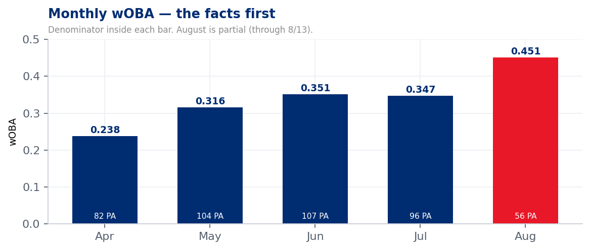
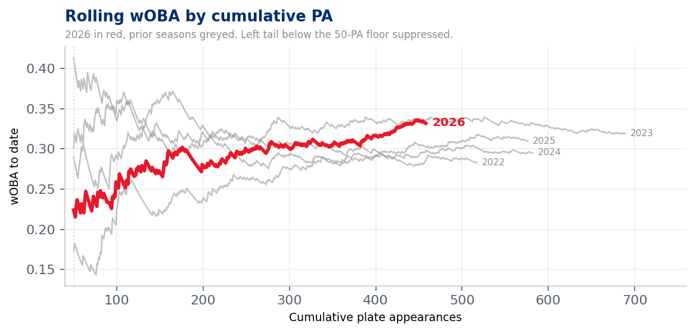
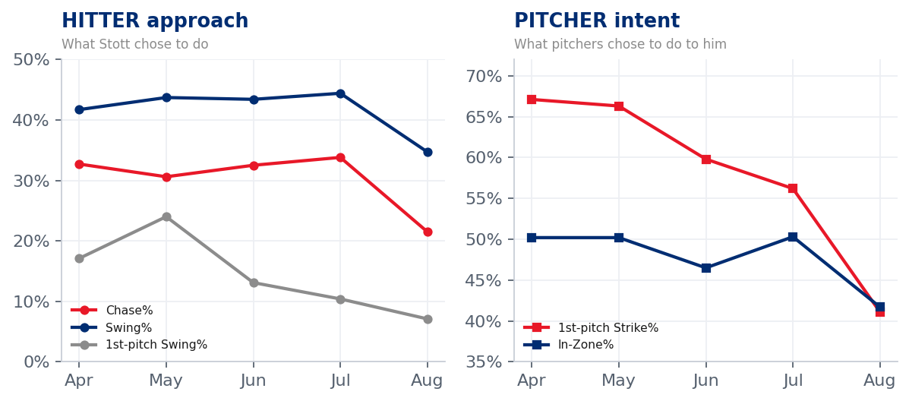
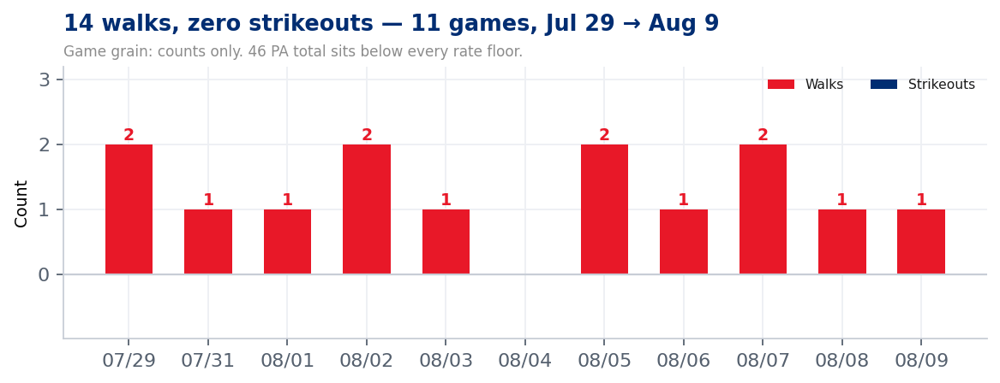
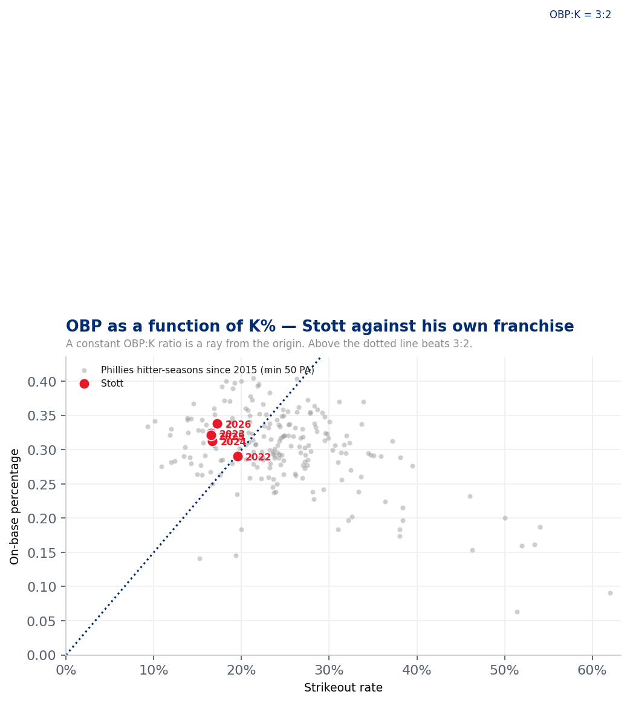

# Bryson Stott — Approach Change Read

### 2026 season through Aug 13 · Phillies Offense · UC #34 / uc-pos-010 / dp_uc33

> **DATA WINDOW:** `pos` pitch log, 2015 → **2026-08-13**. Regular season + postseason
> (`game_type` not in S/E). All 2026 figures are **as-of 8/13 and August is a partial month.**
> Receipts: `out/dp_uc33_*.csv` (5 files + 5 figures). Verification: `dp_uc33_verification.py`,
> **86/86 PASS**, recomputed from inline masks with no import of the build kernel.
> Any line below the 50-PA floor is flagged and is directional only.
> **Manual carry-ins (not derivable from the pitch log): none.**

---

## The short version

Bryson Stott's results did improve steadily after a bad April, and he did change his approach.
**Both halves of that sentence verify.** But the read is incomplete without a third fact the
approach panel alone will not show you: **pitchers changed too, and more sharply than he did.**

His first-pitch strike rate fell from **67.1% in April to 41.1% in August** — a 26-point collapse
in how often opponents come at him with a strike. Over the same window his chase rate fell from
32.7% to **21.5%**. Those two moves are not independent, and this data product cannot tell you
which one caused the other.

What it *can* tell you is that the improvement is **not** an outcome-only artifact. The approach
metrics moved, in the right direction, by margins that dwarf their month-to-month noise.

---

## 1 · The facts first — how the results actually moved

| Month | PA | BA | OBP | SLG | OPS | wOBA |
|---|---|---|---|---|---|---|
| March | 13 | 0.250 | 0.308 | 0.250 | 0.558 | 0.259 |
| April | 82 | 0.200 | 0.250 | 0.280 | 0.530 | 0.238 |
| May | 104 | 0.227 | 0.269 | 0.474 | 0.743 | 0.316 |
| June | 107 | 0.287 | 0.374 | 0.415 | 0.789 | 0.351 |
| July | 96 | 0.287 | 0.344 | 0.460 | 0.804 | 0.347 |
| August* | 56 | 0.381 | 0.527 | 0.476 | 1.003 | 0.451 |

<small>\* August is a partial month (through 8/13). March is 13 PA — **below the 50-PA floor,
shown for completeness and not to be interpreted.**</small>

The "grown steadily" claim **holds, with one correction**: the climb is not monotonic. June
(.351) and July (.347) are effectively flat, so the shape is a **step up in May, a plateau
through July, then a second step in August** — not a smooth ramp. That distinction matters for
coaching: two step changes invite the question *what changed at each step*, which a smooth ramp
does not.

Indexed to cumulative plate appearances rather than calendar months, 2026 is the **lowest of
Stott's five seasons through roughly 150 PA and the highest of them by PA 450.** No prior season
traces that path. The calendar-month view compresses this into five bars; the rolling view shows
it is one continuous climb rather than five separate months.

---

## 2 · Did he change his approach? Yes — and it is concentrated in August

### Hitter approach — what Stott chose to do

| Month | Swing% | 1st-Pitch Swing% | Chase% | Whiff% | OOZ Whiff% |
|---|---|---|---|---|---|
| March | 46.2% | 0.0% | 48.3% | 12.5% | 21.4% |
| April | 41.7% | 17.1% | 32.7% | 19.5% | 38.0% |
| May | 43.7% | 24.0% | 30.6% | 16.6% | 28.6% |
| June | 43.4% | 13.1% | 32.5% | 17.8% | 25.9% |
| July | 44.4% | 10.4% | 33.8% | 25.9% | 45.5% |
| August* | 34.7% | 7.1% | 21.5% | 12.8% | 23.5% |

### Pitcher intent — what pitchers chose to do to him

| Month | 1st-Pitch Strike% | In-Zone% | Pitches/PA |
|---|---|---|---|
| March | 53.8% | 44.2% | 4.00 |
| April | 67.1% | 50.2% | 3.74 |
| May | 66.3% | 50.2% | 3.98 |
| June | 59.8% | 46.5% | 4.35 |
| July | 56.2% | 50.3% | 4.08 |
| August* | 41.1% | 41.7% | 4.84 |

> **These are two different panels on purpose.** First-Pitch Strike% and In-Zone% describe the
> *opponent's* execution, not Stott's behaviour. Reading them as hitter metrics is the single
> easiest way to misinterpret this report.

**The discriminating test.** The question posed at intake was: *"He chased, but he did not whiff.
Or did he just not chase anymore?"* Four outcomes were possible, and they are separable:

| Branch | Chase% | OOZ Whiff% | Reading | Verdict |
|---|---|---|---|---|
| H1 | flat | ↓ | Same aggression, better contact | partial |
| H2 | ↓ | flat | Genuine decision change | partial |
| H3 | ↓ | ↓ | Both moved | **✅ this one** |
| H4 | flat | flat | Pitchers missed; Stott unchanged | rejected |

Chase fell **33.8% → 21.5%** from July to August. Out-of-zone whiff rate fell **45.5% → 23.5%**
over the same span. **Both moved, and chase moved on a larger base** — he is seeing 34 out-of-zone
swings a month now against 66–81 earlier in the season. The narrative claim *"he does not expand,
he does not chase"* is **supported by the data.**

*"He takes the first pitch all the time"* is also supported, and it is the sharpest single number
in the report: **first-pitch swing rate 24.0% in May → 7.1% in August.**

---

## 3 · The headline — 14 walks between strikeouts

| Game | PA | BB | K | H |
|---|---|---|---|---|
| Jul 29 | 4 | **2** | 0 | 1 |
| Jul 31 | 4 | **1** | 0 | 0 |
| Aug 01 | 4 | **1** | 0 | 1 |
| Aug 02 | 3 | **2** | 0 | 0 |
| Aug 03 | 4 | **1** | 0 | 1 |
| Aug 04 | 4 | **0** | 0 | 2 |
| Aug 05 | 4 | **2** | 0 | 1 |
| Aug 06 | 4 | **1** | 0 | 2 |
| Aug 07 | 4 | **2** | 0 | 0 |
| Aug 08 | 5 | **1** | 0 | 2 |
| Aug 09 | 6 | **1** | 0 | 2 |
| **Total** | **46** | **14** | **0** | **12** |

**The claim verifies exactly.** 14 walks, zero strikeouts, across **11 games** from July 29 to
August 9 — 46 plate appearances. It is the longest such run of Stott's career by a wide margin:

| Season | Longest walk run between strikeouts | Games |
|---|---|---|
| 2022 | 8 | 7 |
| 2023 | 3 | 3 |
| 2024 | 9 | 5 |
| 2025 | 4 | 3 |
| **2026** | **14** | **11** |

> **⚠ Read this window as an illustration, not as evidence.** It was selected *because* it
> contains 14 walks and no strikeouts, so its walk rate and strikeout rate are guaranteed to be
> extraordinary — they are the selection criterion. The **monthly** panels in §2 are the
> inferential evidence; this section is the story. Metrics not used in the selection — chase rate,
> first-pitch swing rate, out-of-zone whiff rate — carry information here. BB% and K% do not.

---

## 4 · Context — is this who he is, or is this new?

| Season | PA | BB% | K% | BB/K | OBP | OBP:K |
|---|---|---|---|---|---|---|
| 2022 | 517 | 8.3% | 19.5% | 0.426 | 0.291 | 1.49 |
| 2023 | 689 | 6.0% | 16.5% | 0.360 | 0.324 | 1.96 |
| 2024 | 582 | 9.1% | 16.7% | 0.546 | 0.313 | 1.88 |
| 2025 | 576 | 9.2% | 16.5% | 0.558 | 0.321 | 1.95 |
| 2026 | 458 | 9.6% | 17.2% | 0.557 | 0.338 | 1.96 |

Against **217 Phillies hitter-seasons since 2015** (98 players, minimum 50 PA), Stott's career
OBP:K ratio of **1.85** sits at the **83rd percentile**; the pool median is 1.29. His BB/K of 0.49
is at the **83rd percentile** against a 0.32 median.

**The DPO's stated 3:2 is understated.** Stott has run closer to **1.85:1**, and he has cleared
the 3:2 line in every season since 2022. On the chart, a constant OBP:K ratio is a **ray from the
origin** — every point above the dotted line beats 3:2. All five of his seasons are above it.

| Month | PA | BB% | K% | BB/K |
|---|---|---|---|---|
| March | 13 | 7.7% | 15.4% | 0.500 |
| April | 82 | 4.9% | 19.5% | 0.250 |
| May | 104 | 5.8% | 14.4% | 0.400 |
| June | 107 | 11.2% | 18.7% | 0.600 |
| July | 96 | 8.3% | 22.9% | 0.364 |
| August* | 56 | 23.2% | 7.1% | 3.250 |

August's **BB/K of 3.25** — 13 walks to 4 strikeouts — is not a variation on his baseline. It is
roughly six times his career rate.

---

## 5 · What a coach should and should not conclude

**Supported:**

- The approach change is real, measurable, and concentrated in August.
- It is a **swing-decision** change first — chase and first-pitch swing rate moved most.
- It is consistent with, but larger than, an established career-long strength.

**Not supported — and the reason to be careful:**

- **That Stott caused the improvement by himself.** First-pitch strike rate fell 26 points and
  in-zone rate fell 8. Pitchers are working around him. A hitter who is thrown fewer strikes will
  chase less and walk more *without changing anything*. Chase rate is conditioned on out-of-zone
  pitches, so it is not a pure mix artifact — but the feedback loop is real and this data product
  cannot break it.
- **That it will hold.** August is 56 PA, partial, and above his career line by a margin no
  56-PA sample can confirm.
- **Opponent quality and platoon mix are uncontrolled.** No adjustment was made for who he faced.

**The one thing worth acting on:** the first-pitch behaviour. Taking 93% of first pitches while
seeing first-pitch strikes only 41% of the time is a coherent, repeatable plan, and it is the part
of this that is entirely within Stott's control. If any single element deserves reinforcement, it
is that one.

---

## 6 · Governance

| | |
|---|---|
| **Use case** | `uc-pos-010-stott-approach-change-001` · value stream `pos` |
| **Verification** | `dp_uc33_verification.py` — **86 PASS / 0 FAIL** |
| **Grain** | `player_name` × `game_year` × `month`; drill to `game_pk`; context at `player_name` × `game_year` |
| **Floors** | 50 PA (inherited standard), 40 BIP for EV90. Below-floor rows flagged, never dropped |
| **New KPIs** | AP-2 `swing_rate`, AP-3 `srfp`, AP-6 rolling wOBA, AP-9 `discipline_ratio`, AP-10 `walks_between_ks` — **all provisional pending DPO ratification** |
| **Inherited** | `fpsr` (approved `cde.fpsr`), SWINGS/WHIFFS lists, PA definition, wOBA constants |
| **Open items** | 6 — see `00_dpo_orchestration_record.md` |

> **Three defects were found in the governed kernel during this build** — `whiff_rate`,
> `hard_hit_rate` and `fpsr` all inner-merge their numerator and **silently drop groups where the
> numerator is zero**. They are reported in `05_quality_certification.md`, not patched in place.
