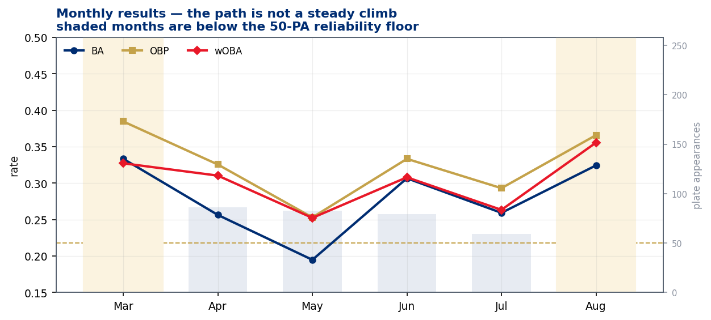
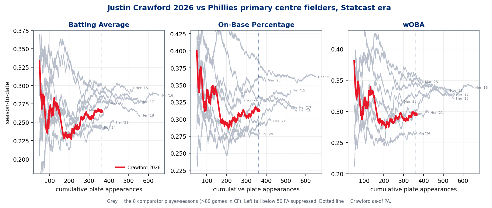
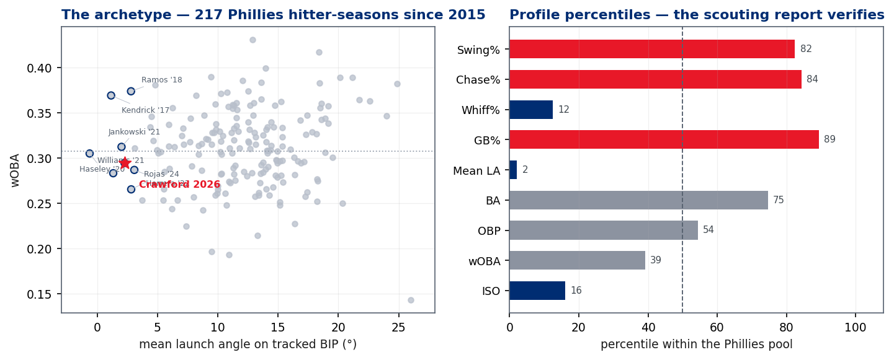
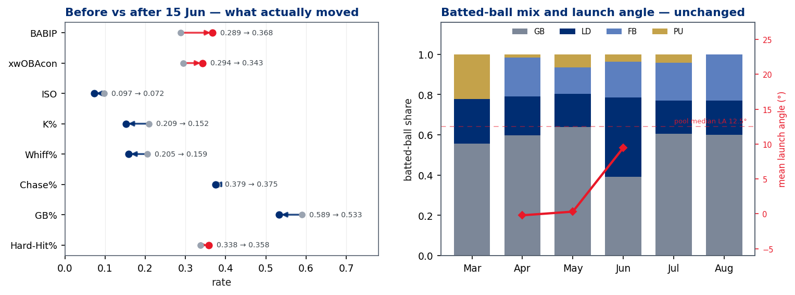
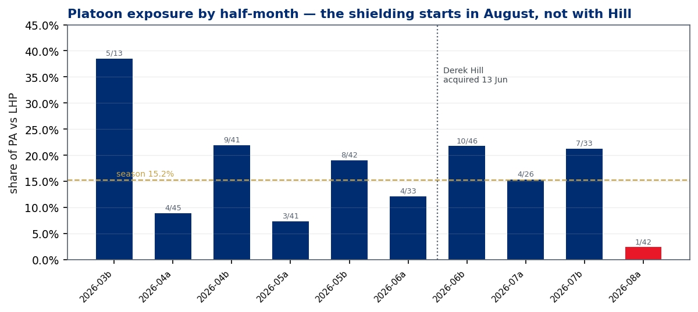
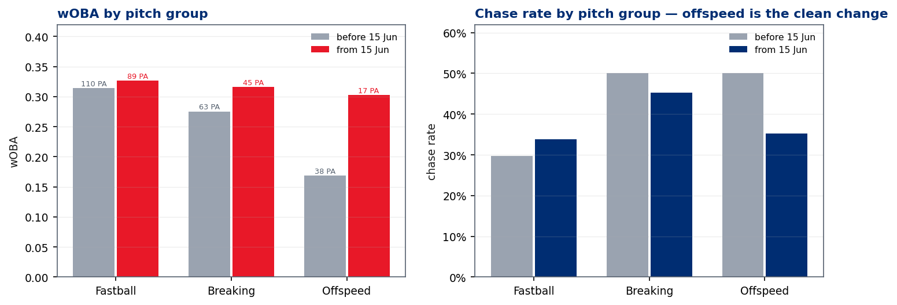

# Justin Crawford — Year-to-Date Read

### Phillies Offense · UC #35 · `uc-pos-011-crawford-ytd-001` · `dp_uc34` · data through **13 Aug 2026** · verification **127/127 PASS**

> **Read this first.** The premise holds directionally and the mechanism is not what the premise assumes.
> Crawford's results *are* better since mid-June — wOBA .276 → .321, BA .231 → .312, OBP .289 → .345.
> But **on-base gains came entirely from batting average; his walk rate fell** (6.6% → 4.6%). **His power fell**
> (ISO .097 → .072, zero home runs after 15 June). **His ground-ball rate and launch angle did not meaningfully
> change** — the two indicators the development path has always flagged. And **the Derek Hill platoon hypothesis
> is falsified over the window it was proposed for**: Crawford's share of plate appearances against left-handers
> is 15.0% after Hill arrived versus 15.3% before. The shielding is real, but it starts in **August**, not in June.
> What did durably improve is **contact** — strikeout rate 20.9% → 15.2%.

---

## 1 · The premise, tested

The submitted use case makes four testable assertions. Each is answered against the governed monthly panel
before any explanation is attempted.

| # | Assertion as submitted | Verdict | Evidence |
|---|---|---|---|
| 1 | "Since roughly mid-June he has been hitting the ball much better" | **Directionally supported, mechanism differs** | wOBA .276 → .321 across 15 Jun. But *hitting the ball* barely moved — mean launch angle 2.28° → 2.22°, hard-hit rate .338 → .358, ISO **down** .097 → .072 |
| 2 | "His batting average slowly climbing up" | **Supported — but not slowly, and not monotonic** | .231 → .312. Monthly wOBA path is .327 / .310 / .252 / .308 / .263 / .356. **July is a relapse month**, not a step on a ramp |
| 3 | "His OBP bouncing back" | **Supported, with a caveat that matters** | .289 → .345. **All of it is batting average.** Walk rate fell 6.6% → 4.6%. This is a hit-dependent OBP, not a plate-discipline OBP |
| 4 | "His wOBA coming up" | **Supported** | .276 → .321. Above the .316 league wOBA baseline for 2026, for the first time in his career |

### Season line, through 13 August

| PA | AB | H | HR | BB | K | BA | OBP | SLG | OPS | ISO | wOBA | BABIP |
|---|---|---|---|---|---|---|---|---|---|---|---|---|
| 362 | 333 | 88 | 2 | 21 | 67 | **.264** | **.312** | **.351** | .663 | **.087** | **.295** | .323 |

*109 games, 1,323 pitches. Left-handed. Regular season plus postseason; Spring and Exhibition excluded.*

### The breakpoint is not robust — and this matters

The "mid-June" boundary was supplied by the requester, and the finding is sensitive to it. Every candidate
breakpoint was priced, per the `uc-pos-008` both-framings rule:

| Breakpoint | Pre PA | Pre wOBA | Post PA | Post wOBA | Δ |
|---|---|---|---|---|---|
| 1 May | 99 | .313 | 263 | .288 | **−.025** |
| 15 May | 135 | .332 | 227 | .272 | **−.060** |
| 1 Jun | 182 | .285 | 180 | .304 | +.019 |
| 8 Jun | 199 | .280 | 163 | .313 | +.034 |
| **15 Jun** *(as submitted)* | 211 | .276 | 151 | **.321** | **+.045** |
| 22 Jun | 230 | .285 | 132 | .312 | +.026 |
| 1 Jul | 261 | .292 | 101 | .302 | +.010 |
| 15 Jul | 287 | .296 | 75 | .288 | −.008 |
| 1 Aug | 320 | .287 | 42 | .356 | **+.069** |

> **A mid-May breakpoint reverses the sign entirely.** The improvement is real at the 15 June boundary, but
> the boundary was chosen after seeing the outcome. Everything downstream of it is reported as
> **descriptive**, not inferential. The strongest available split is 1 August — which is 42 plate appearances,
> **below the 50-PA reliability floor**.

---

## 2 · Context — Crawford against Phillies centre field, Statcast era

The comparison population is **Phillies primary centre fielders since 2015**: any player-season with more
than 80 games in centre, restricted to games in which he actually played the position. Eight comparator
seasons qualify. Crawford's 110 centre-field games in 2026 place him squarely in the group.

The shape of the red line is the most honest summary of the season. Through roughly 200 plate appearances
Crawford was **the worst of the nine seasons on all three measures**. From plate appearance 200 forward he
climbs while most of the grey lines flatten — the visual signature of a genuine mid-season turn. He has
climbed from last to mid-pack, not from mid-pack to good.

### At matched volume — 361 plate appearances

| Rank | Season | BA | OBP | wOBA |
|---|---|---|---|---|
| 1 | Herrera 2016 | .303 | .388 | **.360** |
| 2 | Marsh 2023 | .284 | .361 | .353 |
| 3 | Herrera 2018 | .282 | .334 | .346 |
| 4 | Herrera 2015 | .291 | .320 | .325 |
| 5 | Herrera 2017 | .259 | .291 | .301 |
| 6 | Herrera 2021 | .246 | .298 | .300 |
| **7** | **Crawford 2026** | **.265** | **.313** | **.295** |
| 8 | Rojas 2024 | .243 | .278 | .265 |

**Seventh of eight in wOBA, fourth of eight in OBP.** The gap between those two ranks is the season in
miniature: he gets on base at a respectable rate for the group and does nothing once there. He is ahead of
only Johan Rojas 2024 — the closest stylistic comparison in the set, and not the comparison anyone wants.

---

## 3 · The profile — the scouting report verifies, including the parts nobody wants

Crawford is benchmarked against **217 Phillies hitter-seasons since 2015** (98 players, ≥ 50 PA). Launch-angle
percentiles use the 186 seasons clearing 50 tracked balls in play.

| Trait | Crawford | Pool median | Percentile | Reads as |
|---|---|---|---|---|
| Swing rate | .537 | .486 | **82nd** | High-swing — **confirmed** |
| Chase rate | .377 | .301 | **84th** | High-chase — **confirmed** |
| Whiff rate | .186 | .262 | **12th** | Low-whiff — **confirmed, and it is his best skill** |
| Ground-ball rate | .565 | .445 | **89th** | The knock — **confirmed** |
| **Mean launch angle** | **2.26°** | 12.51° | **2nd** | The knock — **confirmed, and it is extreme** |
| BABIP | .323 | .296 | 74th | Speed shows up here |
| BA | .264 | .245 | 75th | |
| OBP | .312 | .307 | 54th | |
| ISO | .087 | .150 | **16th** | |
| wOBA | .295 | .308 | **39th** | The profile's net value |

> **He swings a lot, he chases a lot, and he almost never misses.** That combination is unusual and it is
> genuinely valuable — a 12th-percentile whiff rate on an 84th-percentile chase rate means he is putting bat
> on balls other hitters swing through entirely. It is also precisely why the launch-angle number is what it
> is: making contact with pitches you should not have swung at produces ground balls.

### The archetype, and what it has historically been worth

The nine lowest launch angles among Phillies hitter-seasons since 2015:

| Player-season | PA | Mean LA | GB% | BA | ISO | wOBA |
|---|---|---|---|---|---|---|
| Haseley 2020 | 91 | −0.6° | .561 | .278 | .063 | .305 |
| Kendrick 2017 | 156 | 1.1° | .571 | .340 | .113 | **.369** |
| Williams 2021 | 108 | 1.3° | .600 | .245 | .071 | .283 |
| Jankowski 2021 | 153 | 2.0° | .538 | .252 | .099 | .312 |
| **Crawford 2026** | **362** | **2.3°** | **.565** | **.264** | **.087** | **.295** |
| Ramos 2018 | 100 | 2.8° | .625 | .337 | .146 | .374 |
| Rojas 2024 | 369 | 2.8° | .591 | .242 | .079 | .265 |
| Herrera 2022 | 197 | 3.1° | .576 | .238 | .141 | .287 |
| Revere 2015 | 388 | 3.1° | .596 | .298 | .077 | .311 |

Two observations. First, **Crawford's is the largest sample in the cohort** — most of these are partial
seasons or bench roles; his is a full-time job. Second, the only cohort members who cleared a .350 wOBA
(Kendrick, Ramos) did it on 100–156 plate appearances and with meaningfully more power. **Ben Revere 2015
is the honest ceiling case for this batted-ball profile over a full season: .298/.077/.311.**

---

## 4 · What actually changed — and what did not

| Metric | Before 15 Jun | From 15 Jun | Read |
|---|---|---|---|
| Plate appearances | 211 | 151 | |
| **BABIP** | .289 | **.368** | **+79 points.** The single largest mover in the dataset |
| xwOBA on contact | .294 | .343 | Contact quality improved — but by less than results did |
| **Strikeout rate** | .209 | **.152** | **The most durable improvement** |
| Whiff rate | .205 | .159 | Confirms the K-rate move is a contact skill, not luck |
| Chase rate | .379 | .375 | **Unchanged.** He did not become more selective |
| Swing rate | .523 | .559 | He became *more* aggressive |
| Walk rate | .066 | .046 | **Fell** |
| ISO | .097 | .072 | **Fell.** Zero home runs after 15 June |
| Ground-ball rate | .589 | .533 | Down 5.6 pts — real but modest |
| Mean launch angle | 2.28° | 2.22° | **Unchanged** |
| Hard-hit rate | .338 | .358 | Marginal |

### The ground-ball detail that settles it

| Window | Ground balls | GB hits | GB BA | Mean EV on GB | GB xBA | GB hits ≤ 90 ft |
|---|---|---|---|---|---|---|
| Before 15 Jun | 89 | 23 | .258 | **84.9 mph** | .282 | 18 |
| From 15 Jun | 64 | 20 | **.312** | **80.4 mph** | .275 | 17 |

**He is hitting ground balls *softer* and getting *more* hits on them.** Expected batting average on those
grounders actually fell (.282 → .275) while actual batting average rose 54 points. Thirty-five of his 43
ground-ball hits on the season travelled 90 feet or less. This is legs, placement and defensive positioning —
not improved contact. It is a genuine skill, and it is a **volatile** one.

> **The honest decomposition.** Roughly speaking: strikeout rate is the improvement he earned and can hold;
> BABIP is the improvement he is currently being given. xwOBAcon rose 49 points while BABIP rose 79 —
> the gap is the part most likely to regress.

---

## 5 · Platoon — the Derek Hill hypothesis, tested and falsified as posed

Derek Hill's first Phillies game was **13 June 2026** — two days before the requester's breakpoint, which
makes the hypothesis a serious one. It does not survive contact with the exposure data.

| Window | PA vs LHP | PA vs RHP | LHP share |
|---|---|---|---|
| Before 13 Jun (pre-Hill) | 32 | 177 | **15.3%** |
| From 13 Jun (post-Hill) | 23 | 130 | **15.0%** |

**Direct standardisation** — holding the post-Hill within-split rates fixed and re-weighting them to the
pre-Hill platoon mix — puts the entire mix effect at **−0.0001 on BA, −0.0001 on OBP, and −0.0000 on wOBA.**
The platoon mix explains none of the improvement across the window the hypothesis was proposed for.

**But the instinct behind the question is correct, and the timing is different.** August tells another story:

| Half-month | PA vs LHP | Total PA | LHP share |
|---|---|---|---|
| 2026-06b | 10 | 46 | 21.7% |
| 2026-07a | 4 | 26 | 15.4% |
| 2026-07b | 7 | 33 | 21.2% |
| **2026-08a** | **1** | **42** | **2.4%** |

The shielding is real and it is severe — but it begins roughly seven weeks after Hill arrived, which points
at a deliberate August decision rather than a roster-driven one. **The practical consequence: August's .356
wOBA is very nearly a pure right-handed-pitching sample and must not be read as a step forward in overall
quality.** It is also 42 plate appearances, below the reliability floor.

One further wrinkle worth flagging, precisely because it cuts against the shielding decision: Crawford's
line against left-handers actually *improved* after 13 June (.143/.250/.143 → .333/.391/.333). That is
23 plate appearances and proves nothing — but it is the opposite of the pattern that would justify a
platoon, and it deserves a larger sample before the shielding hardens into policy.

---

## 6 · Pitch types — where he is beating people, and where he is not

| Pitch group | Window | Pitches | PA | BA | SLG | wOBA | K% | Whiff% | Chase% |
|---|---|---|---|---|---|---|---|---|---|
| Fastball | before | 516 | 110 | .263 | .364 | .314 | .209 | .213 | .298 |
| Fastball | from 15 Jun | 335 | 89 | .308 | .372 | **.327** | **.157** | **.142** | .338 |
| Breaking | before | 180 | 63 | .220 | .356 | .275 | .238 | .188 | .500 |
| Breaking | from 15 Jun | 138 | 45 | .318 | .432 | **.316** | .178 | .173 | .453 |
| Offspeed | before | 97 | 38 | .162 | .189 | **.168** | .158 | .197 | **.500** |
| Offspeed | from 15 Jun | 57 | 17 | .312 | .312 | .303 | .059 | .226 | **.353** |

**The offspeed change is the cleanest approach signal in the dataset** — chase against changeups and splitters
fell from 50.0% to 35.3%, and the wOBA against them went from .168 to .303. It is also **17 plate appearances**,
far below any floor. Treat it as a hypothesis to re-test in September, not a finding.

### Season, by pitch type (≥ 40 pitches)

| Pitch | Pitches | PA | BA | SLG | wOBA | K% | Whiff% | Chase% |
|---|---|---|---|---|---|---|---|---|
| Four-seam (FF) | 533 | 113 | .297 | .376 | .321 | .221 | .191 | .274 |
| Sinker (SI) | 230 | 63 | .291 | .400 | **.350** | .175 | **.136** | .349 |
| Slider (SL) | 132 | 43 | .262 | .357 | .261 | .140 | **.080** | .479 |
| Changeup (CH) | 112 | 41 | .231 | .256 | **.238** | .171 | .224 | .480 |
| Curveball (CU) | 89 | 31 | .200 | .333 | .241 | **.290** | .222 | .489 |
| Cutter (FC) | 88 | 23 | .190 | .238 | **.231** | .043 | .240 | .417 |
| Sweeper (ST) | 76 | 26 | .320 | .520 | **.372** | .308 | .289 | .550 |
| Splitter (FS) | 41 | 14 | .143 | .143 | **.127** | .000 | .160 | .375 |

**Call-outs for the advance group:**

- **Sinkers are his best pitch** (.350 wOBA, 13.6% whiff). A sinker to a hitter with a 2° average launch angle
  should be a ground ball, and often is — but he beats enough of them out that the pitch is not working.
- **Sliders: he barely misses them (8.0% whiff, the lowest of any pitch) but chases them 47.9% of the time.**
  The resulting contact is weak. This is the pitch that most rewards throwing it out of the zone.
- **Splitters and cutters are the two genuine holes** — .127 and .231 wOBA. He has never struck out against a
  splitter (0 K in 14 PA) and he has not hit one either.
- **Sweepers are a warning** — .372 wOBA against, but on a 28.9% whiff rate and a 55.0% chase rate. The results
  are ahead of the process; this is the pitch most likely to turn on him.

---

## 7 · Count leverage — the one clear regression

| Window | Count state | PA | BA | OBP | SLG | wOBA | K% |
|---|---|---|---|---|---|---|---|
| Before 15 Jun | Ahead | 26 | .429 | .538 | .762 | **.545** | — |
| Before 15 Jun | Even/behind | 72 | .239 | .250 | .338 | .256 | — |
| Before 15 Jun | Two strikes | 113 | .184 | .257 | .233 | .228 | **.389** |
| From 15 Jun | Ahead | 24 | .300 | .391 | .350 | **.340** | — |
| From 15 Jun | Even/behind | 57 | .434 | .418 | .528 | **.405** | — |
| From 15 Jun | Two strikes | 70 | .215 | .271 | .277 | .248 | **.329** |

Two-strike survival improved (K rate 38.9% → 32.9%), which is consistent with the whiff-rate move. But
**his production when ahead in the count collapsed** — .545 wOBA to .340. He is doing more damage in neutral
counts and less in the counts where a hitter should be hunting. Combined with a first-pitch swing rate that
rose from 33.6% to 43.0%, the picture is a hitter who has become *more* aggressive, not more selective, and
is currently being rewarded for it by ball-in-play luck.

---

## 8 · What this means

**For the hitting coach.** The contact gains are real and worth reinforcing: whiff rate down 4.6 points,
strikeout rate down 5.7. The thing to *not* reinforce is the aggression — chase rate is flat at 37.5%, first-pitch
swing rate is up 9 points, and production in hitter's counts fell by 200 points of wOBA. The single highest-value
target remains launch angle: at 2.3° he sits in the 2nd percentile of Phillies hitter-seasons since 2015, and
nothing in this window moved it. Ground-ball rate fell 5.6 points; average launch angle fell 0.06°.

**For the manager.** The improvement is real and it is smaller than it looks. Two-thirds of the wOBA gain traces
to a 79-point BABIP jump on *softer* contact, against a 49-point rise in expected value on contact. The August
line is 42 plate appearances against one left-hander. If the platoon shielding is deliberate, note that his
production against left-handers has been better, not worse, since Hill arrived — on a sample too small to act
on, which is itself the argument for giving him the plate appearances that would settle it.

**For the player-development group.** The developmental question is unchanged by this season. He has proven the
contact skill translates — 12th-percentile whiff rate as a rookie is a genuine major-league tool. He has not
proven the batted-ball profile can support a major-league regular, and the honest comparison set says a full
season of this profile is worth roughly a .295–.315 wOBA. **The gap between "he is figuring it out" and "he is
a good major-league hitter" is entirely launch angle**, and it is the same gap the reports flagged three years ago.

**For the analytics group.** Re-run after 31 August. The two signals to watch are (1) whether BABIP holds above
.330 as the sample grows — it should not, and the size of the fall is the size of the correction to this report —
and (2) whether launch angle moves at all. Everything else is downstream of those two.

---

 

*Governance: `uc-pos-011-crawford-ytd-001` · `dp_uc34` · Phillies Offense value stream · sensitivity **Internal** ·
127/127 independent verification assertions PASS · six defects in the governed KPI kernel reported in
`05_quality_certification.md` (five inherited, one new) · restricted from external and media distribution ·
any figure quoted after **13 Aug 2026** must state the as-of date.*
