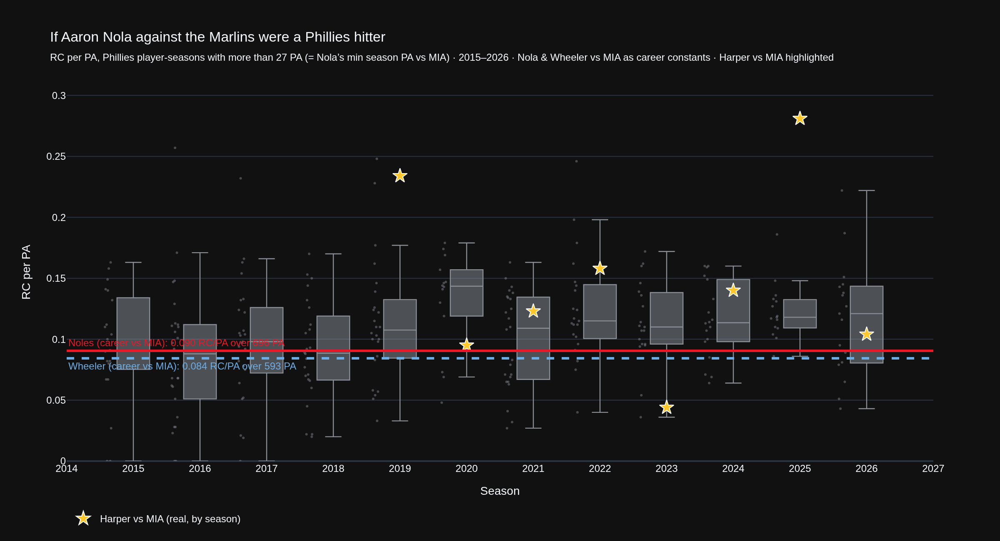
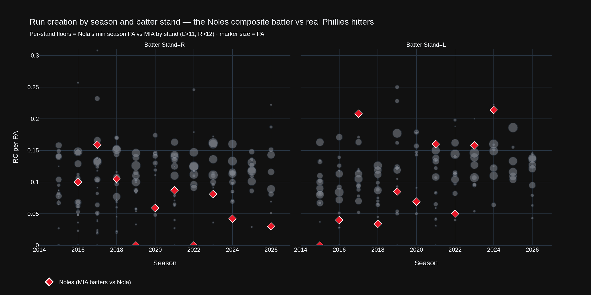
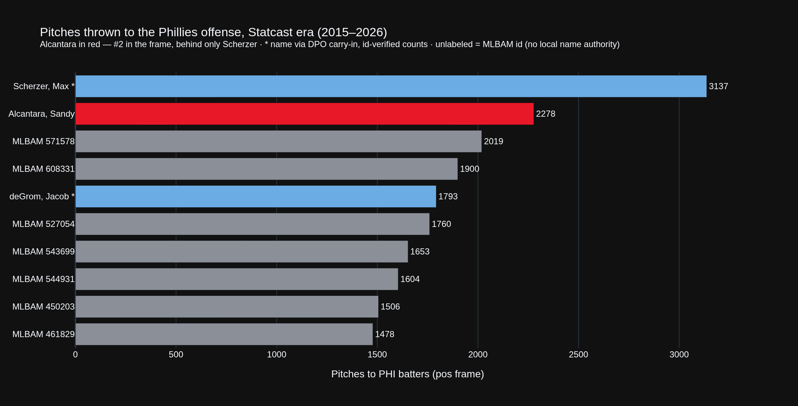
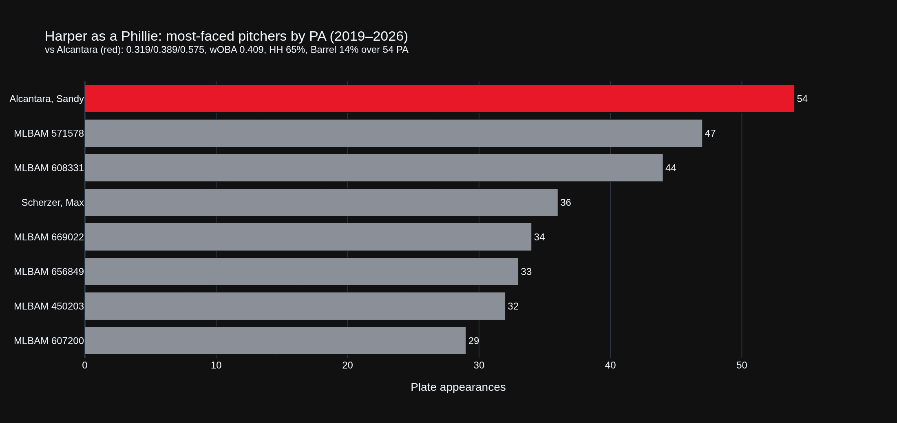
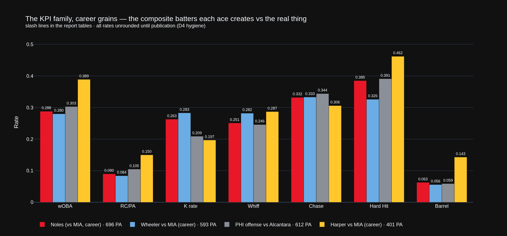

# If Aaron Nola Against the Marlins Were a Phillies Hitter

### The Nola–Alcantara showdown, read from the Phillies Offense value stream · Aaron Nola (PHI) vs Sandy Alcantara (MIA) · Citizens Bank Park · Wednesday, August 19, 2026, 6:05 PM ET · UC #36 · uc-pos-012 · dp_uc35

> **Data window.** Statcast pitch-level data through **2026-08-17** (T-1 at intake). Nola's most recent start (8/13 vs MIN, the Field of Dreams broadcast) is in-frame; his most recent Marlins start is **7/28 — against Alcantara**, a 1–0 Miami win. All KPIs computed by the governed kernel (`dp_uc35_kernel.py`); every number below traces to a CSV receipt in this folder and survived a **79/79** independent verification (`dp_uc35_verification.py`). Comparison floor per the human DPO's intake ruling: **Nola's own minimum season PA vs MIA = 27** (11 L / 12 R at the stand grain) — a governed deviation from the house 50-PA floor, flagged wherever it bites.

---

## 1 · Bottom line

**The composite batter Aaron Nola turns the Marlins into is a bad Phillies hitter — and that is a compliment.** Pooled across 28 starts and 696 PA since 2015, "Noles" hits **.239/.278/.381 (wOBA .288)** with a **26.3% K rate** and creates **0.090 runs per plate appearance**. Drawn as a constant across the Phillies player-season distribution (fig. 1), that line sits below the season median of every Phillies box since 2019 — Miami's collective output against Nola is a down-roster bat, year after year, in a period when Nola himself has swung from ace to this season's 5.47-ERA struggle. Wheeler's Marlins constant is lower still (**0.084 RC/PA**, wOBA .280 over 593 PA): two gunslingers, one conclusion.

**The flip side is sharper than the intake prose assumed.** Alcantara is not the most-seen pitcher in the Phillies offense's Statcast era — he is **#2 at 2,278 pitches, behind only Max Scherzer's 3,137** — but he is the most-seen *active, still-facing-them* arm, and within the governed frame he is **Bryce Harper's single most-faced pitcher, not his third** (54 PA — the "third most" claim lives in Harper's full career including his Nationals years, which this data plane does not carry; both framings are priced in §3). And Harper owns the book: **.319/.389/.574, wOBA .409, 64.9% hard-hit, 13.5% barrel over those 54 PA**, including a .413 wOBA in 6 PA against the 2026 rebuilt-velocity version.

**Tonight's tension:** the 7/28 meeting was the duel this matchup promises — Alcantara held the Phillies to a .171 wOBA over 27 PA and won 1–0; the only run against Nola was one PA's worth. The 2026 season-to-date says Alcantara vs PHI (.226 wOBA, 55 PA) is beating the Noles constant (.270 wOBA vs MIA, 45 PA). The rematch decides whose composite batter blinks.

---

## 2 · Intake premises — verdicts first

The DPO's prose carried five testable or design premises. Per the house rule (uc-pos-011), all verdicts up front:

| # | Premise (as posed) | Verdict | Evidence |
|---|---|---|---|
| P1 | Replace Nola's per-season box-plot points with a career **constant**; same for Wheeler; highlight the real Harper vs MIA | **IMPLEMENTED** | Fig. 1 — Noles 0.090 RC/PA (696 PA), Wheeler 0.084 (593 PA), Harper's 8 seasons as stars |
| P2 | Alcantara has thrown **more pitches to the Phillies offense** in the Statcast era than anyone | **FALSIFIED as posed** | He is **#2: 2,278 pitches / 612 PA**. Scherzer leads at **3,137 / 778 PA** (2015–2026). deGrom sits #5 (1,793) |
| P3 | Harper has faced Alcantara **third-most of any pitcher since 2015** | **NOT REPRODUCIBLE as posed / #1 in-frame** | The governed plane holds Harper only as a Phillie (2019–). In it, Alcantara is his **most-faced pitcher: 54 PA**, ahead of MLBAM 571578 (47) and MLBAM 608331 (44). A full-career rank needs data outside this plane |
| P4 | Scherzer was Harper's teammate for much of his PHI-exposure years; deGrom was oft-injured | **CONSISTENT, partly out of plane** | Scherzer's pitches to PHI span 2015–2026 with Harper opposite him only from 2019; deGrom's 1,793 pitches stop accruing after 2025 (last in-frame year). Teammate/injury history itself is not in the data plane |
| P5 | Nola faced MIA "every year of his career" | **FALSIFIED, one gap** | 11 seasons of 12: **no Marlins meeting in 2025**. First 2015-08-23, latest 2026-07-28, 28 games |

---

## 3 · The Noles constant (fig. 1)

The design change the DPO asked for does real analytical work. As per-season points, Nola-vs-MIA is noise — 27-to-97 PA season samples that bounce from a .149 wOBA (2015, 27 PA) to .400 (2017, 97 PA). As a career constant on 696 PA, it becomes a benchmark you can read every Phillies box against:

| Entity | PA | BA | OBP | SLG | wOBA | K% | Whiff | Chase | Hard-Hit | Barrel | RC/PA |
|---|---|---|---|---|---|---|---|---|---|---|---|
| **Noles** (MIA vs Nola, career) | **696** | .239 | .278 | .381 | .288 | 26.3% | 25.1% | 33.2% | 38.5% | 6.3% | **0.090** |
| Wheeler vs MIA, career (2017–26¹) | 593 | .229 | .273 | .365 | .280 | 28.3% | 28.2% | 33.3% | 32.6% | 5.6% | 0.084 |
| Harper vs MIA, career (2019–26) | 401 | .282 | .380 | .522 | .389 | 19.7% | 28.7% | 30.6% | 46.2% | 14.3% | 0.150 |
| PHI offense vs Alcantara, career | 612 | .255 | .303 | .386 | .303 | 20.9% | 24.6% | 34.4% | 39.1% | 5.9% | 0.105 |

¹ *Wheeler's 2017–2019 Mets seasons come from the `wheeler.parquet` cache; 2020–2026 from the PHI pitching frame. Season coverage verified disjoint — no double counting.*

Reading fig. 1: the Noles line (red) runs under the box median in every season since 2019 and under the 25th percentile in the strong offense years (2022–2024). In plain terms, **Nola has spent a decade turning an entire major-league lineup into a hitter the Phillies would bench**. The one crack is visible in the season receipts rather than the constant: 2017 (.400 wOBA, 97 PA) and the 2023–24 pair (.366/.370) are the years Miami actually reached him; 2026 so far is quiet again (.270 wOBA, 45 PA, 20.0% K, **0.022 RC/PA** — one run in 45 PA across two starts).

The gold stars are the reality check the DPO asked for: the real Bryce Harper against these same Marlins clears the Noles constant in **seven of his eight** Phillies seasons (2023 — 0.044 over 45 PA — is the lone exception), typically by half again or more, and in 2025 (0.281 RC/PA, 32 PA — small sample, above the floor by five) nearly reached the top of the whole distribution.

**The joke that writes itself:** Nola's *own* 2026 line against everybody (.362 wOBA-against, 0.130 RC/PA allowed, 568 PA) is a worse "hitter" — from his side of the ball — than Noles-vs-MIA has ever been. The Marlins remain the opponent that makes him look like the 2018 version.

---

## 4 · Season scatter, faceted by batter stand (fig. 2)

The DPO's granularity ask — *Phillies hitters with PA similar to Nola against Miami, split by stand* — is the right cut, because the Noles composite is not one batter:

| Noles by stand | PA | BA | OBP | SLG | wOBA | K% | Whiff | Chase | Hard-Hit | Barrel | RC/PA |
|---|---|---|---|---|---|---|---|---|---|---|---|
| vs **LHB** | 262 | .204 | .252 | .359 | **.267** | 28.2% | 25.2% | 30.2% | 43.6% | 7.0% | 0.073 |
| vs **RHB** | 434 | .260 | .294 | .393 | .300 | 25.1% | 25.1% | **35.4%** | 35.5% | 5.9% | 0.101 |

Nola's Marlins mastery is **left-handed-batter mastery**: the LHB composite (.267 wOBA) would be one of the worst qualified bats in the Phillies frame, and it chases less yet produces less — the damage suppression is contact-quality-shaped (43.6% hard-hit but only .359 SLG means the hard contact goes nowhere useful). Against righties he leans on chase (35.4%) instead. This is the *opposite polarity* of his 2026 league-wide lefty leak documented in uc-pps-021 — against this one club, the old pattern still holds.

> **Small-sample flag (governed).** The per-stand floors are Nola's own minimums — **11 PA (L)** and **12 PA (R)** — per the DPO ruling. Points near those floors, including several red Noles diamonds and many grey player-season-stand dots, are directional only. No ranking or roster inference may be built from a sub-50-PA cell; the two career-stand rows above (262/434 PA) are the citable ones.

---

## 5 · The flip side: Alcantara's 2,278 pitches (figs. 3–4)

Since his first Phillies meeting in 2018, Alcantara has thrown **2,278 pitches over 612 PA in 24 games** against the Phillies offense — more than anyone in the frame except Scherzer, whose 3,137 accrued across four uniforms and eleven seasons. The exposure table is the *institutional memory* argument for tonight: no active pitcher knows this lineup better, and vice versa.

What has all that familiarity bought him? Career, roughly a draw tilted his way: **.255/.303/.386, wOBA .303, 0.105 RC/PA** — the Phillies hit Alcantara a little better than Miami hits Nola (.288), which is the polite way of saying both aces beat both offenses. But the 2026 version is different: across two starts (6/17, 7/28), the Phillies have managed **.226 wOBA in 55 PA with a 20.0% K rate and 0.055 RC/PA** — and on 7/28 he beat Nola 1–0 on a .171-wOBA, 27-PA shutout line. Post-surgery Alcantara vs PHI, 2025–26 pooled: .402 wOBA in '25 (59 PA) collapsing to .226 in '26 — the rebuild found its finish this year.

His platoon seam runs opposite Nola's: PHI **lefties** hit .294 wOBA off him with a 18.8% K rate (340 PA) while righties manage .314 but strike out 23.5% (272 PA). The Phillies' left-heavy core is the right test for him; it just failed the last exam.

**The Harper file.** In-frame, Alcantara is Harper's most-faced pitcher, and Harper has won the argument: **.319/.389/.574, wOBA .409, 10 runs created in 54 PA**, with a hard-hit rate (64.9%) that is outlier-high even for Harper and a 13.5% barrel rate. The season receipts show it is not one hot year — .435 ('19, 10 PA), .648 ('21, 8 PA), .815 ('25, 5 PA), .413 ('26, 6 PA), against two cold pockets ('22 .271/13 PA, '23 .147/6 PA). Every one of those cells is below 15 PA — the *career* 54-PA line is the only citable number, and it says: when the Marlins' ace faces the Phillies' franchise player, the franchise player has been the predator.

| Harper vs | PA | Pitches | BA | OBP | SLG | wOBA | Hard-Hit | Barrel | RC/PA |
|---|---|---|---|---|---|---|---|---|---|
| **Alcantara** (#1 in-frame) | 54 | 208 | .319 | .389 | .574 | **.409** | 64.9% | 13.5% | 0.185 |
| Scherzer* (#4 in-frame) | 36 | 151 | .276 | .417 | .862 | .514 | 50.0% | 22.2% | 0.167 |
| deGrom* (in-frame) | 17 | 80 | .154 | .353 | .154 | .271 | 40.0% | 0.0% | 0.000 |

\* *Display names for Scherzer/deGrom are a logged manual carry-in from the DPO's intake prose (annotation only — every count is keyed and verified on MLBAM id). The unlabeled bars in figs. 3–4 are ids with no local name authority; resolving them is an offered fast-follow.*

---

## 6 · The KPI family, side by side (fig. 5)

One figure to hold the whole use case: the two composite batters the aces create (Noles, Wheeler-vs-MIA) live at the bottom of every production KPI while the real hitter (Harper-vs-MIA) towers over both — and the Phillies-vs-Alcantara composite sits in between, closer to the pitchers' side of the room than an offense this good should accept. The full season-grain receipts behind every bar: `dp_uc35_nola_mia_seasons.csv`, `dp_uc35_wheeler_mia_seasons.csv`, `dp_uc35_harper_mia_seasons.csv`, `dp_uc35_alcantara_phi_seasons.csv`.

**What to watch tonight, stated as falsifiable calls:**

1. **The Noles LHB constant (.267 wOBA / 262 PA) holds.** Miami's left-handed bats have no decade-scale evidence they solve Nola, whatever his 2026 league-wide lefty leak says.
2. **Alcantara's 2026-vs-PHI line (.226 wOBA / 55 PA) regresses toward his career .303.** Two starts is two starts; the career book says the Phillies reach him roughly once a game (0.105 RC/PA ≈ 4 runs per 38 PA).
3. **Harper is the leverage.** A .409-wOBA/54-PA book against a pitcher whose 2026 weakness is left-handed contact (.294 wOBA allowed) is the single best hitter-vs-pitcher edge on either side of the card.

---

## 7 · Caveats — read before citing

- **Floor deviation.** Every population floor here is **27 PA** (season grain) or **11/12 PA** (stand grain) by explicit DPO ruling, not the house 50-PA batter floor. Cells between the ruling floor and 50 PA are flagged `below_house_floor` in the receipts; nothing below 50 PA should migrate into a ranking or roster document without re-derivation at the house floor.
- **A composite batter is not a batter.** "Noles" pools eleven different Marlins lineups; its stability is roster-dependent. It answers "what does Nola allow," not "how does any Marlin hit."
- **Career-grain wOBA uses 2026 constants** (kernel behavior when `game_year` is not in the grain — disclosed since dp_uc34); season-grain receipts use each season's constants and their numerators reconcile in verification (check 12).
- **`runs_created` on a pitching frame** counts runs scoring during PAs thrown by the subject pitcher (max post-score − min pre-score within the PA), so inherited-runner and mid-PA baserunning runs are attributed to the PA in which they scored. It is the governed definition, applied symmetrically to every entity here.
- **Harper's "third-most" premise** is likely true at full-career scope (Nationals years included) — this plane cannot see it. In-frame (PHI batting, 2015–2026) he is #1. Do not quote either rank without its scope.
- **Name resolution.** The exposure tables are id-keyed; only Alcantara/Wheeler/Nola names carry a local cache authority. Scherzer/deGrom names are logged manual carry-ins. Unresolved top-10 ids ship as `MLBAM <id>`.
- **`alcantara.parquet` is stale (max 2025-04-12)** and was used for entity-lock only; all vs-PHI rates come from the fresh `pos` frame (through 2026-08-17).
- **2020 and 2025** are structural small-samples (60-game season; no Nola-MIA meeting in 2025). The 2025 Wheeler row (26 PA) and Harper row (32 PA) sit above the ruling floor but below the house floor.

---

*UC #36 · uc-pos-012-nola-alcantara-showdown-001 · dp_uc35 · built 2026-08-18/19 from Statcast through 2026-08-17 · kernel: governed Baseball Functions transcriptions + uc-pos-010/011 `_fix` variants (D1–D5 register carried, no new defects opened) · verification: 79/79 PASS · receipts: `out/dp_uc35_*.csv` · Phillies Offense value stream.*
