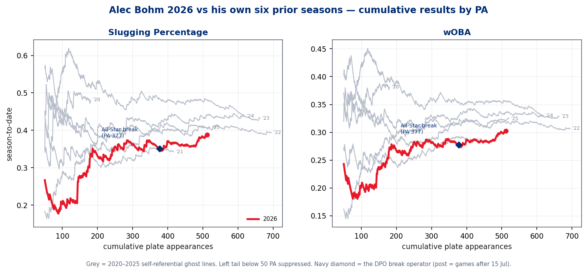
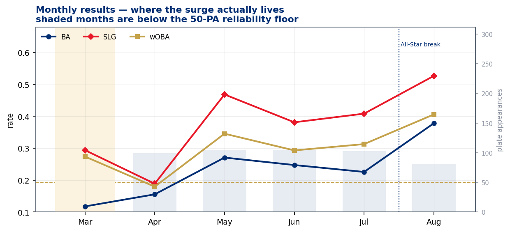
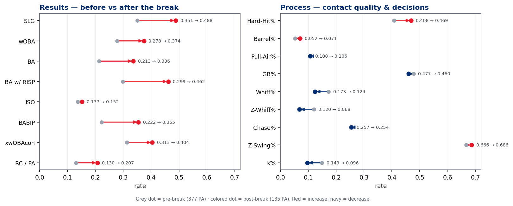
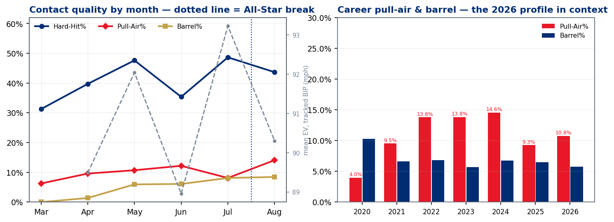
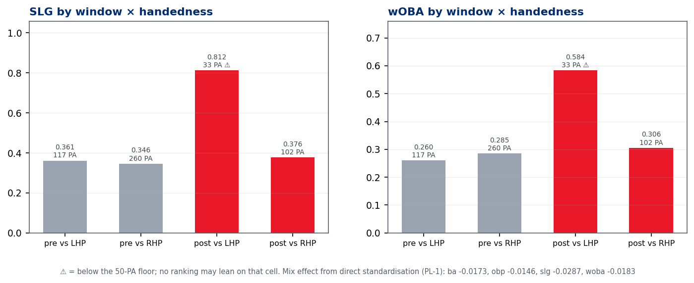
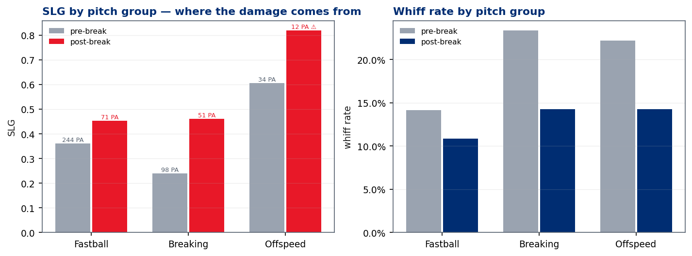

# Alec Bohm — The Second-Half Turnaround, Audited

### UC #38 · `uc-pos-013-bohm-second-half-turnaround-001` · `dp_uc37` · Phillies Offense value stream · as of **2026-08-22**

> **Data window & reliability.** All Phillies batting Statcast, 2015 → 2026-08-22 (2026 data is complete
> through last night's game). Bohm locked to MLBAM **664761**; 512 PA in 2026 — **377 pre-break, 135
> post-break**, both above the standing 50-PA floor. The break operator is the DPO's submitted
> `game_date > '2026-07-15'` (first game back: 16 Jul; last game before: 12 Jul). Cells below the 50-PA
> floor are marked **⚠** everywhere they appear and no ranking leans on them. Every number in this report
> was recomputed on an independent code path: **227/227 PASS**.

---

## §1 · The verdicts — every submitted premise, answered before anything is explained

| # | Premise as submitted | Verdict | The number |
|---|---|---|---|
| 1 | He has turned his season around since the All-Star break | **TRUE — and it survives every alternate breakpoint** | SLG **.351 → .488**, BA .214 → .336, wOBA .278 → .374. The 10-point sensitivity scan never finds a negative delta |
| 2 | He is "hitting the ball much better" (contact, not just outcomes) | **TRUE** | Hard-hit **40.8% → 46.9%**, mean EV **90.1 → 91.7 mph**, xwOBAcon **.313 → .404**, barrel 5.2% → 7.1% |
| 3 | His run production is a boon to the middle of the lineup | **TRUE, with one flag** | Runs created per PA **.130 → .207**; BA w/ RISP **.299 → .462** — but the post-break RISP cell is **42 PA ⚠** |
| 4 | Pulling the ball in the air is part of the story | **FALSE on volume — TRUE on quality** | Pull-air rate **10.8% → 10.6%** (14th percentile of 218 Phillies hitter-seasons). But the twelve post-break pull-airs left at **97.7 mph** with 3 HR (pre: 93.7 mph) |
| 5 | He is still a guy who rarely whiffs | **TRUE — more than ever** | Whiff 17.3% → **12.4%** (would be ~1st percentile in the pool); in-zone whiff **12.0% → 6.8%**; K% 14.9% → **9.6%** |
| 6 | His approach has changed | **MOSTLY FALSE** | Chase .257 → .254, first-pitch swing flat, in-zone swing +2.0 pts. The decisions barely moved — the **contact** moved |

**One sentence:** the surge is real and process-backed — harder contact and elite bat-to-ball on an
essentially unchanged approach — but it is **not** a pull-air breakout, it is concentrated in August and
in a torrid (below-floor) left-on-right split, and part of the jump is a .222 pre-break BABIP that had
been running *under* his contact quality finally correcting.

---

## §2 · Calibration — were the outcomes actually positive?

Yes, on every top-line KPI, and by margins that don't depend on where you draw the line.

| KPI | Pre-break (377 PA) | Post-break (135 PA) | Δ |
|---|---|---|---|
| **SLG** | .351 | **.488** | +.137 |
| BA | .214 | .336 | +.123 |
| OBP | .276 | .378 | +.102 |
| wOBA | .278 | .374 | +.096 |
| **BA w/ RISP** | .299 (92 PA) | **.462 (42 PA ⚠)** | +.163 |
| SLG w/ RISP | .519 | .667 ⚠ | +.147 |
| **Runs created** | 49 (.130 / PA) | **28 (.207 / PA)** | +.077 / PA |
| K% | 14.9% | 9.6% | −5.3 pts |
| BABIP | .222 | .355 | +.132 |

Context that keeps §2 honest:

- **April was a crater** — .180 wOBA over 99 PA. The recovery was underway from 1 May (monthly wOBA
  .346 / .293 / .313 before the break), so "since the All-Star break" compresses a longer climb into a
  clean narrative marker. The scan below prices both framings.
- **August is the engine.** Post-break by month: July-after-break folds into a .313 July; August alone is
  **.406 wOBA / .527 SLG over 81 PA** (above floor).
- The season line (.246/.303/.388, wOBA .303) still sits at the **43rd–45th percentile** of the 218
  Phillies hitter-seasons since 2015 — the turnaround has repaired the season, not yet made it special.
  The *post-break window as a season* would sit at the **86th percentile in SLG, 93rd in wOBA**.

**Breakpoint sensitivity (standing RC-5 requirement — the window was chosen after seeing the outcome):**
across ten candidate breakpoints from 1 May to 8 Aug, **Δ-wOBA and Δ-SLG are positive at every single
one** — unlike other recent subject studies, there is no boundary that reverses this sign. The All-Star
break is not even the strongest available split (8 Aug is, at exactly 50 post PA); it is simply a fair one.

---

## §3 · The mechanism — what actually moved

Three things moved, one thing corrected, and one thing conspicuously did not move.

**Moved — contact quality.** Hard-hit rate 40.8% → 46.9% (the post-break window would rank 90th
percentile in the pool), tracked-BIP mean EV 90.1 → 91.7 mph, barrels 5.2% → 7.1%, xwOBAcon .313 → .404.
The expected-outcome shift (+.091) is the same size as the actual wOBA shift (+.096): **the results are
riding on the contact, not on sequencing luck.**

**Moved — bat-to-ball.** Whiff rate 17.3% → 12.4%; in-zone whiff **cut nearly in half**, 12.0% → 6.8%
(that in-zone figure would be ~2nd percentile among all Phillies hitter-seasons since 2015). K% 9.6%
post-break. Premise 5 doesn't just survive — the post-break version of Bohm is the best contact hitter
this franchise has rostered in the Statcast era, on this measure.

**Moved — batted-ball shape at the margins.** Not the launch-angle surge you might expect: mean LA
actually eased 9.4° → 8.6°. The real shape change is that **popups halved** (6.3% → 2.7% of BIP) and fly
balls rose (22.0% → 26.6%) — fewer wasted balls at both extremes of the angle distribution.

**Corrected — BABIP.** Pre-break .222 against a .313 xwOBAcon was an *under*-performance; post-break
.355 with contact this hard is not an anomaly, it is the correction plus real gain. Expect the .336 BA to
settle even if the process holds.

**Did not move — pull-air volume.** 10.8% → 10.6% of BIP, in a season already sitting at the **14th
percentile** and well under his 2022–24 range (13.8–14.6%). What changed is what the pull-airs *are*:
twelve of them post-break, nine hits, **three of his three post-break homers**, average exit velocity
**97.7 mph** and average distance 314 ft (pre: 93.7 mph, 294 ft). He is not pulling the ball in the air
more; when he does, it is louder and it is damage. Meanwhile his oppo-air game (25.7% of BIP, .417
xwOBAcon) and straightaway-air game (.650 xwOBAcon post-break) carry the volume.

**The approach question (premise 6).** Chase rate .257 → .254, first-pitch swing .325 → .326, overall
swing +2.4 pts, in-zone swing +2.0 pts. This is not an approach overhaul — it is the same decision
framework executing far better on contact. One pitcher-side note belongs beside it (these are opponent
metrics, not Bohm's behaviour): **the league is challenging him more** — in-zone rate .492 → .539 —
and he is answering the extra strikes with more in-zone swings and half the in-zone whiffs. First-pitch
strike rate against him is identical pre/post (.593 = .593, a genuine coincidence the verification
script confirms twice).

---

## §4 · Splits — where the damage lives

### Pitch groups: the breaking-ball fix is the headline

| Window | Group | Pitches | PA | BA | SLG | wOBA | Whiff | Chase |
|---|---|---|---|---|---|---|---|---|
| pre | fastball | 849 | 244 | .218 | .361 | .295 | 14.2% | 23.7% |
| pre | **breaking** | 410 | 98 | **.152** | **.239** | .187 | **23.4%** | 28.2% |
| pre | offspeed | 118 | 34 ⚠ | .364 | .606 | .423 | 22.2% | 27.8% |
| post | fastball | 278 | 71 | .344 | .453 | .382 | 10.9% | 20.0% |
| post | **breaking** | 165 | 51 | **.340** | **.460** | .339 | **14.3%** | 32.1% |
| post | offspeed | 39 | 12 ⚠ | .273 | .818 ⚠ | .476 ⚠ | 14.3% | 30.4% |

Pre-break, breaking balls were the entire problem: .152/.239 with a 23.4% whiff on 410 pitches.
Post-break he is hitting **.340 and slugging .460 against them with a 14.3% whiff** — he chases them
slightly *more* (32.1%) but touches them when he does. Fastball performance rose in parallel. Offspeed
was never the issue and the post-break cell is 12 PA ⚠ — read nothing into it.

### Platoon: real, loud, and below the floor

Post-break vs LHP: **.531 BA / .812 SLG / .584 wOBA — on 33 PA ⚠.** Post-break vs RHP: .269/.376/.306
over 102 PA — solid, K% 11.8%, hard-hit 45.1%, but much closer to his season norm. So the headline
window mixes one merely-good split with one white-hot below-floor split.

Two governance points keep this honest:

1. **The mix did not flatter him.** His LHP exposure *fell* post-break (31.0% → 24.4% of PA). Direct
   standardisation (PL-1) puts the mix effect at **−18 points of wOBA, −29 of SLG** — had he faced the
   pre-break mix, the post-break line would look *better*. The surge is performance, not scheduling.
2. **33 PA is 33 PA.** The .812 SLG cell may not survive contact with September. The vs-RHP gains
   (whiff 14.1%, hard-hit .451) are the part with a reliable sample behind them.

---

## §5 · Could anyone in the Phillies Offense value stream have driven this?

The requester asked whether specific personas could have taken actions that produced these outcomes.
**Direction of causation is not identified by this data product** — what follows maps each *observable
correlate* to the persona whose remit it sits in, as testable hypotheses, not findings.

| Observable in the data | Value-stream persona | Hypothesis worth testing |
|---|---|---|
| Breaking-ball line .152/.239 → .340/.460; whiff on breaking 23.4% → 14.3% | **Hitting coach** | A recognition/timing intervention against spin (pitch-recognition work, tee/machine mix) would look exactly like this: chase on spin *up* slightly, contact on spin way up |
| Popup share halved, FB share +4.6 pts, LA distribution tightened at both tails | **Hitting coach / player development** | Barrel-presentation or posture cue; consistent with "hit it hard, stop cutting under it" rather than an air-ball mandate |
| Mean EV +1.6 mph, hard-hit +6.1 pts with no swing-decision change | **Strength & conditioning** | Mid-season physical adjustment; also consistent with health improvement — roster/medical logs are outside this data plane (manual carry-in required) |
| RISP conversion: BA w/ RISP .299 → .462 ⚠, RC/PA +.077 | **Manager / lineup construction** | More traffic ahead of him or better leverage spotting would inflate RC/PA without any skill change — and his share of PA *with* RISP did rise, 24.4% → 31.1%. Part of the RC/PA jump is opportunity, not conversion; worth a dedicated lineup-context study |
| LHP exposure fell while LHP performance exploded | **Manager (platoon deployment)** | Not a shielding story — his LHP share *fell*. If anything the data argues for *more* LHP exposure, the opposite of a protection narrative |
| In-zone rate against him .492 → .539 | **Opponent behaviour (no Phillies persona)** | Pitchers stopped nibbling — plausibly *because* his chase never spiked and his April results made challenge attractive. This is the confound to every coaching hypothesis above: some of the surge is the league volunteering strikes to a hitter who stopped missing them |

The last row is the honest one: **the cleanest causal candidate in the data is the interaction —
pitchers moved into the zone against a hitter whose in-zone contact was simultaneously peaking.**
Whether Phillies personnel engineered that peak or merely benefited from the league's adjustment cannot
be separated here.

---

## §6 · Career context — is this a new Bohm or a familiar one?

| Year | PA | BA | SLG | wOBA | K% | Whiff | Z-Whiff | Chase | Hard-Hit | Pull-Air | BA w/RISP |
|---|---|---|---|---|---|---|---|---|---|---|---|
| 2020 | 180 ⚠* | .338 | .481 | .381 | 20.0% | 25.2% | 16.6% | 25.0% | 46.8% | 4.0% | .452 |
| 2021 | 417 | .247 | .342 | .285 | 26.6% | 26.7% | 23.4% | 26.0% | 49.5% | 9.5% | .260 |
| 2022 | 695 | .274 | .394 | .307 | 18.1% | 21.7% | 16.7% | 31.9% | 43.5% | 13.8% | .288 |
| 2023 | 663 | .272 | .432 | .328 | 15.5% | 18.8% | 12.3% | 30.1% | 41.2% | 13.8% | .335 |
| 2024 | 619 | .275 | .438 | .330 | 13.9% | 17.5% | 10.4% | 27.4% | 45.2% | 14.6% | .295 |
| 2025 | 520 | .288 | .408 | .324 | 16.0% | 14.9% | 10.0% | 25.6% | 46.6% | 9.3% | .288 |
| **2026** | 512 | .246 | .388 | .303 | **13.5%** | **16.0%** | 10.5% | 25.6% | 42.5% | 10.8% | **.353** |

*\*2020 is a 60-game season; above the PA floor but a short-season sample.*

The whiff trajectory is a six-year monotone improvement — 26.7% → 16.0% — and the post-break 12.4% is
its logical endpoint, not an aberration. The pull-air decline from the 2022–24 plateau (~14%) to ~10%
in 2025–26 predates this season and is a *profile drift*, not a slump artifact: 2026 Bohm trades pull-side
lift for opposite-field air and contact density. His .353 BA with RISP is a career best (134 RISP PA,
above floor). The season wOBA (.303) is still below his 2023–25 band — which is precisely the case for
the post-break version being a *recovery to trend plus a contact peak*, rather than a brand-new hitter.

---

## §7 · Caveats, floors, and what this product does not claim

1. **Post-break = 135 PA.** Above the floor, but five weeks. Every post-break rate here has wide error
   bars; the report ranks nothing on the sub-window cells that sit below 50 PA (post-RISP 42 ⚠,
   post-LHP 33 ⚠, post-offspeed 12 ⚠, March 21 ⚠).
2. **The window is outcome-selected.** The DPO chose the All-Star break after watching the surge. The
   sensitivity scan shows the finding is boundary-robust in *sign* — the *size* of the delta still
   varies threefold across candidate breakpoints.
3. **"Middle of the lineup" claims are out of scope.** Batting-order slot is not a column in this data
   plane; RC/PA and RISP conversion are the closest governed proxies. A lineup-context follow-up needs a
   batting-order carry-in.
4. **Causation is not identified anywhere in §5.** Correlates mapped to personas are hypotheses.
5. **Known kernel defects** D1–D6 are disclosed in `05_quality_certification.md`; the `_fix` variants
   used here leave the governed originals untouched. `pull_air_rate` executes in this build for the
   first time via the O-7 remediation (`hc_x/hc_y` → derived coordinates, boundary logic verbatim,
   classification proven scale-invariant); its output should be treated as **provisional until the DPO
   ratifies the coordinate derivation**.
6. **xwOBAcon ≠ xwOBA** (O-4). Pre/post *shifts* are compared; levels are never compared to wOBA.

---

*Receipts: `dp_uc37_*.csv` (14 files) + `dp_uc37_headlines.json` · figures `dp_uc37_fig1..6_*.png` ·
independent verification `dp_uc37_verification.py` — 227/227 PASS · governance trail `00`–`07` in this
folder. Generated 2026-08-23 · Phillies Offense value stream · Data Product Owner: Kellen Short.*
