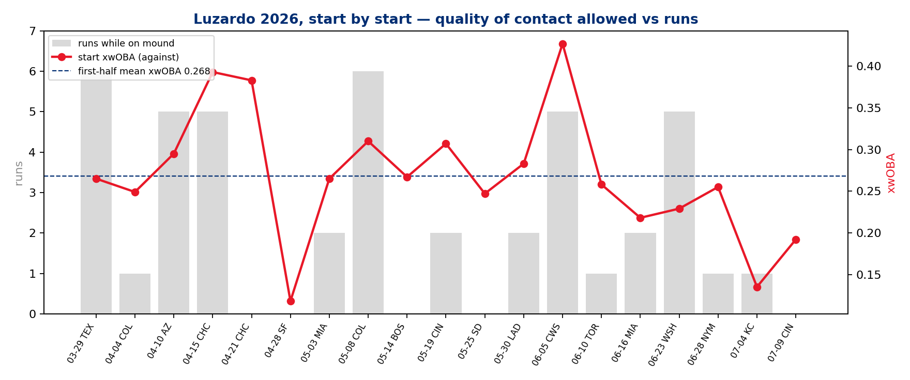
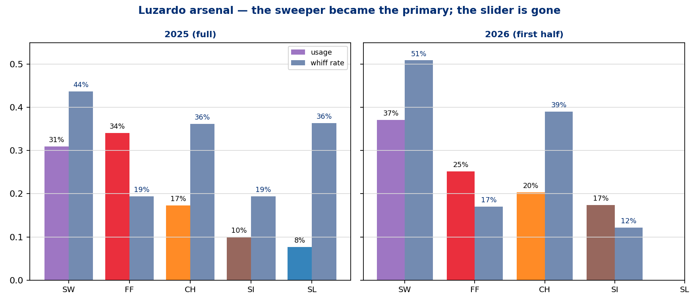
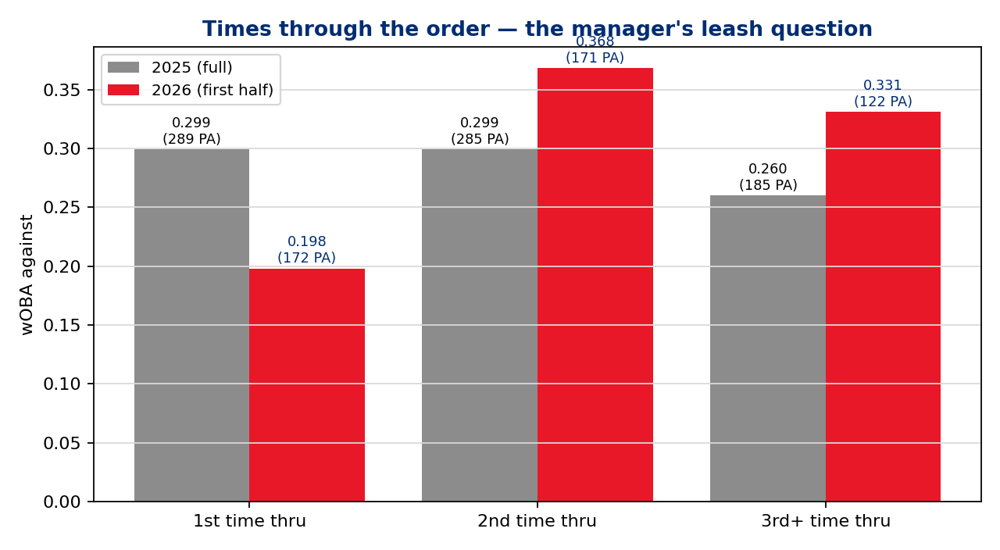

# First-Half Assessment — Jesús Luzardo (LHP), 2026 All-Star
### Phillies Pitching · 19 starts · 2026-03-29 through 2026-07-09 · First career All-Star selection

**Prepared for:** manager / pitching department / Luzardo / catcher — first-half review
**Throws:** L · **Arsenal:** 4 pitches (Sweeper, 4-Seam, Changeup, Sinker — the slider is retired)
**Governance:** Use Case #19 (`uc-pps-017`) · locked KPIs inherited verbatim from Baseball Functions via dp_uc11 · seven NEW derived KPIs (PD-1..PD-7) spec'd in `02_engineering_design.md`, provisional pending DPO ratification · pps mirror of the Marsh breakout retrospective (UC #18)

> ⚠️ **Read this first — data window & sample sizes.**
> • Source: `phils_2025` + `phils_2026` parquet, entity-locked to `pitcher == 666200`, regular season only, deduped. 2026 cache fresh through **2026-07-12**; Luzardo's last start 2026-07-09.
> • 2026 = **first half only** (19 starts, 465 PA). 2025 = **full season** (32 starts, 759 PA). Season-shape comparisons carry that asymmetry.
> • July 2026 split = **49 PA**. Marchán battery split = **70 PA**. Both below the 100-BF convention — directional only, PA printed everywhere they appear.
> • **IP is reconstructed from event outs** (may differ ~1 out from official). **Runs = runs scored while he was on the mound** (RA9, not earned-run accounting — official ERA is not computed here).
> • The All-Star selection itself is a **user-provided carry-in**, logged in the freshness manifest.
> • §6 persona narratives are *inference consistent with the data*, labeled as such — not observed fact.

---

## Bottom line

1. **The workload is the first-order All-Star case: 108.2 IP over 19 starts (5.2 IP/start, ~97 pitches/start), never missing a turn, with a 3.64 RA9 and 2.84 FIP.** Nineteen starts of rotation-anchor volume with a strikeout per inning (136 K, 29.2 K%) is the resume.

2. **The results line is a continuation of 2025; the process line is a step change.** wOBA against is flat (.289 → .295) but xwOBA against dropped .292 → **.269**, hard-hit rate fell **37.1% → 30.5%**, and whiff rate rose 30.8% → 32.5%. The 2026 gap (wOBA .295 vs xwOBA .269) says the results have been slightly *worse* than the contact quality deserved — that's a sustainability argument, not a luck warning.

3. **The engine is an arsenal redesign: the sweeper became the primary pitch (31% → 37%) and now runs a 50.9% whiff rate (.193 xwOBA against); the slider is gone; the sinker nearly doubled (10% → 17%); the 4-seam, down to 25% usage, gained velocity (96.5 → 97.1) and cut its xwOBA .364 → .312.** Less fastball, better fastball.

4. **He closed the half on a surge that made the selection: over the last 4 starts (6/23–7/9), 39 K in 99 PA with start xwOBAs of .229 / .255 / .135 / .192, and a July line of .175 wOBA / .164 xwOBA / 40.8 K% (49 PA — small, but it's the recency the voters saw).**

5. **The watch item is the second time through the order: 1st TTO is elite (.198 wOBA, 0 HR, 172 PA) but 2nd TTO is .368 (171 PA) — an inversion of 2025, when he was steady across all three.** The half worked partly because the leash was managed around it; the second half should be too.

---

## §1 — The results first (outcomes, 2026 first half vs 2025)

| | 2025 (full) | 2026 (first half) |
|---|---|---|
| Starts / IP | 32 / 179.1 | **19 / 108.2** |
| PA / K% / BB% | 759 / 28.5% / 7.5% | 465 / **29.2%** / 7.5% |
| wOBA / xwOBA against | .289 / .292 | .295 / **.269** |
| HR (per PA) | 16 (.021) | 9 (**.019**) |
| Hard-hit % | 37.1% | **30.5%** |
| RA9 / FIP | 3.76 / 2.89 | **3.64 / 2.84** |

Receipts: `dp_uc17_luzardo_season_line.csv`, `dp_uc17_luzardo_season_xwoba.csv`, `dp_uc17_luzardo_process_kpis_yoy.csv`.

**Staff context (2026, ≥500 pitches):** Luzardo's .269 xwOBA against is second among Phillies starters (Wheeler .254; Sánchez .279; Nola .318; Painter .348), and his **33.1% CSW leads the rotation** (Sánchez 32.7%, Wheeler 29.2%). Receipt: `dp_uc17_staff_benchmark_2026.csv`.

**Start-by-start (receipt: `dp_uc17_luzardo_start_log_2026.csv`, fig 2):** 19 starts, all between 86 and 106 pitches. Three blow-ups (3/29 TEX 6 runs, 5/8 COL 3 IP / 6 runs, 6/5 CWS .427 xwOBA) against seven starts of ≤1 run — the floor was rocky in April, the ceiling showed up from late April on, and the last month was the best pitching of his Phillies tenure.

## §2 — The surge that timed the nod (monthly, 2026)

| Month | PA | wOBA | xwOBA | K% | CSW |
|---|---|---|---|---|---|
| Mar/Apr | 146 | .303 | .287 | 28.1% | 33.0% |
| May | 140 | .322 | .278 | 26.4% | 30.9% |
| June | 130 | .303 | .278 | 29.2% | 34.3% |
| July | **49** | .175 | .164 | 40.8% | 36.6% |

(Mar+Apr pooled from the monthly receipt; July is 49 PA — directional.) The expected line was steady all half (~.278–.287) while results wobbled; July is when results caught down to process. Receipt: `dp_uc17_luzardo_monthly_2026.csv`.

## §3 — Driver 1: the arsenal redesign

| Pitch | Usage 25→26 | Velo 25→26 | Whiff 25→26 | xwOBA 25→26 |
|---|---|---|---|---|
| Sweeper | 31.0% → **37.1%** | 86.1 → 86.4 | 43.7% → **50.9%** | .199 → **.193** |
| 4-Seam | 34.1% → 25.2% | 96.5 → **97.1** | 19.4% → 17.0% | .364 → **.312** |
| Changeup | 17.3% → 20.3% | 87.9 → 86.2 | 36.2% → **39.0%** | .292 → .284 |
| Sinker | 10.0% → 17.4% | 95.8 → 96.0 | 19.4% → 12.2% | .370 → .323 |
| Slider | 7.7% → **retired** | — | — | — |

Receipt: `dp_uc17_luzardo_arsenal_yoy.csv`, fig 1. Three deliberate-looking moves: (a) the two breaking balls were consolidated into one sweeper thrown more and missing more bats; (b) fastball usage was cut 9 points while the pitch itself got harder and better; (c) the sinker took over east-west duty against RHB. The sweeper's 2-strike putaway (29.9%) is the strikeout engine.

## §4 — Driver 2: a chase-led process identity

| KPI | 2025 | 2026 |
|---|---|---|
| First-pitch strike | 67.2% | **60.0%** |
| In-zone rate | 50.5% | 46.8% |
| Chase rate | 30.4% | **33.3%** |
| Whiff rate | 30.8% | **32.5%** |
| CSW | 31.8% | **33.1%** |
| 2-strike putaway | 22.1% | **24.1%** |
| Hard-hit % | 37.1% | **30.5%** |

Receipt: `dp_uc17_luzardo_process_kpis_yoy.csv`. He is throwing *fewer* strikes — first-pitch strike rate down 7 points, zone rate down 3.7 — and getting *better* results, because hitters are chasing 3 points more and missing more when they swing. Crucially the walk rate did not move (7.5% both years): the out-of-zone pitching is bought back by chase, not paid for in walks. That trade holds only as long as the sweeper stays this deceptive — flagged in §7.

Count leverage receipt (`dp_uc17_luzardo_count_leverage_yoy.csv`) agrees: fewer pitches ahead in the count (32.2% → 27.9%), similar share of PA reaching two strikes (57.4% → 56.3%), better conversion once there.

## §5 — The splits: where the results and the process disagree

**By stand (receipt: `dp_uc17_luzardo_by_stand_yoy.csv`):**

| Split | PA | wOBA | xwOBA |
|---|---|---|---|
| vs LHB 2026 | 112 | **.209** | .212 |
| vs RHB 2026 | 353 | .323 | **.287** |
| vs RHB 2025 | 586 | .307 | .314 |

Lefties are a wipeout (sweeper-driven, results and process agree). Against righties the results line *worsened* (.307 → .323) while the expected line *improved* (.314 → .287) — the RHB results gap is loud but the process gap is silent; don't over-read it. He is fine against RHB; the ball just found grass in the first half.

**Times through the order (receipt: `dp_uc17_luzardo_tto_yoy.csv`, fig 3):**

| TTO | 2025 wOBA (PA) | 2026 wOBA (PA) |
|---|---|---|
| 1st | .299 (289) | **.198 (172)** — 0 HR |
| 2nd | .299 (285) | **.368 (171)** |
| 3rd+ | .260 (185) | .331 (122) |

2026 inverted his 2025 shape: the first look is now nearly unhittable and the second look is the danger zone. All 9 HR allowed came 2nd time through or later.

**Battery (receipt: `dp_uc17_luzardo_battery_2026.csv`):** Realmuto caught 1,549 of 1,836 pitches (.310 wOBA / .277 xwOBA, 34.2% chase, 25.0% putaway); Marchán's 287-pitch, **70-PA** sample (.211 wOBA / .224 xwOBA) is directional only. The chase-led identity in §4 runs through Realmuto's game-calling — that attribution is inference (see §6), but the volume is his.

## §6 — Persona actions: who did what, and what to do next

*Everything in this section is inference consistent with the data — plausible attribution, not observed fact. Each claim points at its indicator.*

### Pitching department
**Retrospective credit:** the arsenal redesign (§3) has the fingerprints of a deliberate offseason/spring plan — a pitch retired, the breaking-ball share consolidated into the sweeper, fastball usage cut while its velocity rose. That set of changes is what a pitching-dept pitch-design cycle produces; it is the single largest driver of the whiff and hard-hit gains.
**Second-half watch:** the sinker earns its 17% usage on contact management, not swing-and-miss (12.2% whiff, .323 xwOBA — worst pitch in the bag). Re-evaluate its share vs RHB before assuming the RHB xwOBA gain is arsenal-driven rather than sequencing-driven.

### Catcher (Realmuto)
**Retrospective credit:** the chase-led identity (§4) is executed at the game-calling level — zone rate down 3.7 points with zero walk-rate cost, CSW up to a rotation-best 33.1%, and 2-strike putaway up 2 points behind heavier 2-strike sweeper usage.
**Second-half watch:** protect the putaway edge — if chase regresses toward 2025 levels, the 60% first-pitch strike rate stops being affordable. The Marchán split (70 PA) is not evidence for a battery change in either direction; don't let it become one.

### Manager
**Retrospective credit:** the leash was consistent and protective — every start between 86 and 106 pitches, 5.2 IP/start average, no skipped turns. Given the 2nd-TTO cliff (.368), keeping starts in the 5–7 IP band is part of why the season line held.
**Second-half watch:** the hook decision now has a number — the danger window opens the second time through (all 9 HR came TTO 2+). Against RHB-heavy lineups, batters 19–27 are where the bridge reliever earns his roster spot. Post-All-Star fatigue management protects the July velocity (97.1 on the 4-seam).

### Luzardo
**Retrospective credit:** the execution gains are his — a full tick of added fastball velocity, a career-grade sweeper (50.9% whiff on 681 first-half sweepers), a June walk spike (10.8% BB) corrected to 4.1% in July, and the best month of his Phillies tenure timed exactly when it counted.
**Second-half watch:** the profile now depends on chase. If hitters start taking the sweeper, the 46.8% zone rate needs to come back up — the first-pitch strike rate (60.0%, down from 67.2%) is the early-warning gauge to keep on the dashboard.

## §7 — Sustainability & candid caveats

- **The case for sustaining:** the xwOBA (.269) is *better* than the results (.295), hard-hit is down 6.6 points, and the strikeout engine is a pitch-level trait (sweeper whiff), not a sequencing trick. Regression, if anything, points mildly upward.
- **The case for caution:** the whole identity leans on out-of-zone chase (33.3%). League adjustment to the sweeper-first look — especially 2nd time through, where the .368 wOBA says hitters already adjust within games — is the realistic failure mode.
- 2026 is a half-season vs a full 2025; per-start rates are comparable, season totals are not.
- IP from event outs (108.2) and RA9 from on-mound score deltas (3.64) are reconstructions — close to official, not official. **No official ERA/W-L appears in this report because the pitch log cannot compute them.**
- July (49 PA) and Marchán (70 PA) splits are below the 100-BF convention and labeled throughout.
- All-Star selection is user-provided context; artifact receipts: `out/dp_uc17_*.csv`, figures `out/dp_uc17_fig1-3.png`, DQ scorecard PASS (`dp_uc17_dq_scorecard.csv`), freshness manifest (`dp_uc17_freshness_manifest.csv`).
