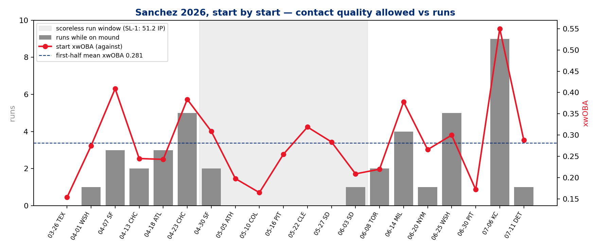
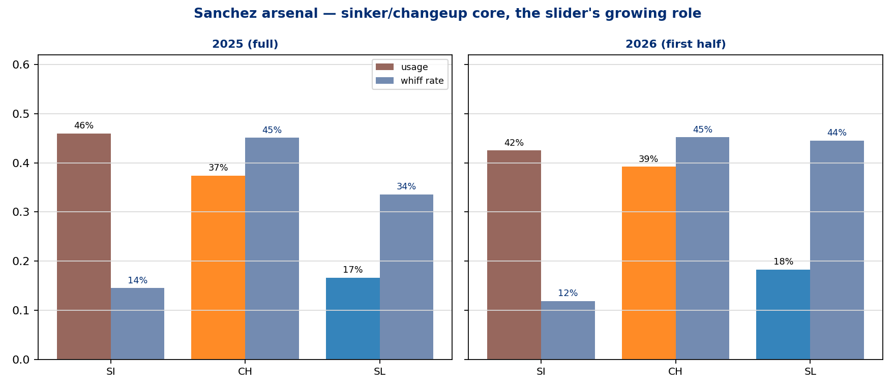
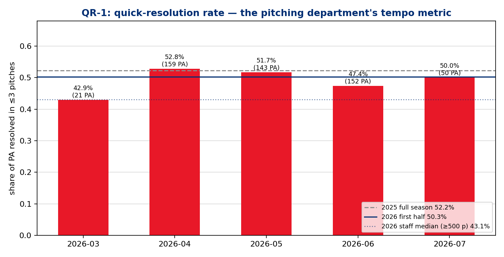

# First-Half Assessment — Cristopher Sánchez (LHP), 2026 NL All-Star Game Starter
### Phillies Pitching · 20 starts · 2026-03-26 through 2026-07-11 · Reigning NL Cy Young runner-up

**Prepared for:** manager / pitching department / Sánchez / catcher — first-half review
**Throws:** L · **Arsenal:** 3 pitches (Sinker, Changeup, Slider)
**Governance:** Use Case #22 (`uc-pps-019` / `dp_uc21`) · locked KPIs inherited verbatim from dp_uc17 (via dp_uc11) · NEW provisional KPIs QR-1..QR-3 + SL-1 spec'd in `02_engineering_design.md` · pps sibling of the Luzardo (uc-pps-017) and Duran (uc-pps-018) ASG retrospectives

> ⚠️ **Read this first — data window & sample sizes.**
> • Source: `phils_2025` + `phils_2026` parquet, entity-locked to `pitcher == 650911`, regular season only, deduped. 2026 cache fresh through **2026-07-12**; Sánchez's last start 2026-07-11.
> • 2026 = **first half only** (20 starts, 525 PA). 2025 = **full season** (32 starts, 809 PA). Season-shape comparisons carry that asymmetry.
> • **IP is reconstructed from event outs** (±~1 out vs official). **Runs = runs scored while he was on the mound** (RA9, not earned-run accounting — official ERA is not computed here). The **50.2 IP Phillies-record scoreless streak is a user-provided carry-in**; the log-derived receipt (SL-1) computes 51.2 IP over 2026-04-30 → 2026-06-03 — consistent within method tolerance, not a record adjudication.
> • July 2026 = **50 PA**, March = **21 PA**, Marchán battery = **71 PA**, Stubbs = **30 PA** — all below the 100-BF convention, directional only.
> • The NL ASG starter designation and Cy Young runner-up are carry-ins, logged in the freshness manifest.
> • §6 persona narratives are *inference consistent with the data*, labeled as such — not observed fact.

---

## Bottom line

1. **The All-Star case is workload plus a historic peak: 126.0 IP over 20 starts (6.1 IP/start, ~95 pitches/start), a 2.79 RA9 / 2.71 FIP, a 5.8 K/BB — and a 51.2-inning scoreless run (SL-1 receipt; officially 50.2, a Phillies record) spanning five straight scoreless starts from May 5 to May 27, including a 9-inning, 13-K complete game at Pittsburgh.**

2. **The process line is a carbon copy of the Cy-runner-up season; the results line has given some back.** xwOBA against is *identical* YoY (.279 → .279) and CSW is flat (32.6% → 32.7%), but wOBA against rose .263 → .292 and RA9 2.38 → 2.79. In 2025 he ran ahead of his contact quality; in 2026 he's running slightly behind it. The underlying pitcher is the same — that's the sustainability argument for the second half.

3. **The changeup remains the pitch: 39.2% usage (up from 37.4%), 45.2% whiff, .193 xwOBA against. The slider development is real and measurable: whiff 33.6% → 44.5%, 2-strike putaway 19.4% → 31.0%, xwOBA .318 → .261, on slightly more usage.** He now has two swing-and-miss secondaries instead of one.

4. **The leak is the sinker, and it maps directly onto the platoon split and the hard-hit rise.** Sinker xwOBA against jumped .327 → .371 with whiff down to 11.9%; overall hard-hit rate rose 39.8% → 43.8%; and vs RHB he's at .339 wOBA / .311 xwOBA (399 PA) against a near-unhittable .146 / .178 vs LHB (126 PA, 35.7 K%).

5. **On the department's tempo metric, the answer to the intake question is: no change — QR-1 (share of PAs resolved in ≤3 pitches) went 52.2% → 50.3%, and he was already the most extreme early-resolution starter on the staff (staff median 42.6%).** What did change is the cost of those quick PAs: wOBA in ≤3-pitch PAs rose .280 → .342, and **10 of his 12 HR allowed came inside three pitches** — while quick-PA xwOBA stayed flat (.314 → .313). The early-attack identity is intact; the early-count damage is the thing to manage. (§7)

---

## §1 — The results first (2026 first half vs 2025 full season)

| | 2025 (full) | 2026 (first half) |
|---|---|---|
| Starts / IP | 32 / 200.2 | **20 / 126.0** |
| PA / K% / BB% | 809 / 26.2% / 5.4% | 525 / **27.4%** / **4.8%** |
| wOBA / xwOBA against | **.263** / .279 | .292 / **.279** |
| HR (per PA) | 12 (.015) | 12 (.023) |
| Hard-hit % | 39.8% | 43.8% |
| RA9 / FIP | 2.38 / 2.55 | 2.79 / 2.71 |

Receipts: `dp_uc21_sanchez_season_line.csv`, `dp_uc21_sanchez_process_kpis_yoy.csv`.

The K/BB profile actually *improved* (K% up a point, BB% down to 4.8% — 144 K against 25 BB). What moved the results line is contact damage: the same 12 HR he allowed in 32 starts last year, he's allowed in 20 this year. Which contact — and in which counts — is §3/§7's subject.

**Staff context (2026, ≥500 pitches; receipt `dp_uc21_staff_benchmark_2026.csv`):** among the rotation, Sánchez's .279 xwOBA against sits third (Wheeler .254, Luzardo .269), his **32.7% CSW is second** (Luzardo 33.1%, Wheeler 29.2%, Nola 30.2%), and his 126.0 IP is the largest workload on the staff.

**Start-by-start (receipt: `dp_uc21_sanchez_start_log_2026.csv`, fig 2):** 20 starts, 83–108 pitches. Seven starts of zero runs against four of ≥4 runs. The Kansas City start (7/6) is the outlier of the half — 3 IP, 9 runs on the mound, .550 start xwOBA — and it accounts for 23% of his season run total in one afternoon. He rebounded five days later in Detroit (6.2 IP, 1 run, .288 xwOBA).

## §2 — The three acts of the half (monthly, 2026)

| Month | PA | wOBA | xwOBA | K% | CSW | QR-1 |
|---|---|---|---|---|---|---|
| March (1 start) | **21** | .145 | .154 | 47.6% | 31.0% | 42.9% |
| April | 159 | .354 | .311 | 25.2% | 32.2% | 52.8% |
| May | 143 | **.186** | .245 | 31.5% | **36.7%** | 51.7% |
| June | 152 | .271 | .256 | 27.0% | 30.5% | 47.4% |
| July (2 starts) | **50** | .527 | .398 | 16.0% | 31.2% | 50.0% |

Receipt: `dp_uc21_sanchez_monthly_2026.csv`.

**Act I — a rocky April** (.354 wOBA, three starts of 3+ runs) after a dominant opening turn in Texas. **Act II — the record run:** from April 30 through June 3, the SL-1 receipt shows a 51.2-inning stretch without a run scoring while he was on the mound — five consecutive complete scoreless starts (ATH 8.0, COL 7.0, PIT 9.0 CG/13 K, CLE 7.2, SD 7.0) bookended by partial outings. May's .186 wOBA / 36.7% CSW is the best month of his career by this log. **Act III — turbulence:** MIL (4 runs), WSH (5), the KC blowup — with two clean rebuilds (PIT 6/30, DET 7/11) in between. The intake framing ("majority dominant, a rough KC outing and a couple hiccups") is exactly what the log shows.

Receipt: `dp_uc21_sanchez_streak_receipt.csv` (SL-1 window and method caveats).

## §3 — Driver 1: two swing-and-miss secondaries now, and a sinker paying the bills late

| Pitch | Usage 25→26 | Velo 25→26 | Whiff 25→26 | Putaway 25→26 | xwOBA 25→26 |
|---|---|---|---|---|---|
| Sinker | 46.0% → 42.5% | 95.4 → 95.2 | 14.5% → 11.9% | 23.1% → 18.6% | .327 → **.371** |
| Changeup | 37.4% → **39.2%** | 86.3 → 86.9 | 45.1% → **45.2%** | 29.8% → 29.2% | .208 → **.193** |
| Slider | 16.6% → **18.3%** | 85.7 → 86.2 | 33.6% → **44.5%** | 19.4% → **31.0%** | .318 → **.261** |

Receipt: `dp_uc21_sanchez_arsenal_yoy.csv`, fig 1.

The changeup is what it has been for three years — a 45%-whiff, sub-.200-xwOBA outpitch he can throw two of every five pitches. The new information is the slider: an 11-point whiff jump and a putaway rate that went from the arsenal's worst (19.4%) to its best (31.0%). That is what "added to his effectiveness" looks like in the log — he no longer needs the changeup to finish every two-strike count. The offset: the sinker — still 42.5% of his pitches, the pitch that buys strike one — is getting hit harder than last year (.371 xwOBA, whiff down to 11.9%), and it is the natural suspect for the hard-hit and HR rises in §1.

## §4 — Driver 2: a sharper chase identity on the same command base

| KPI | 2025 | 2026 |
|---|---|---|
| First-pitch strike | 65.3% | **66.1%** |
| In-zone rate | 51.9% | 47.2% |
| Chase rate | 31.6% | **38.6%** |
| Whiff rate | 30.4% | **32.0%** |
| CSW | 32.6% | 32.7% |
| 2-strike putaway | 26.1% | 26.2% |
| Hard-hit % | 39.8% | 43.8% |

Receipt: `dp_uc21_sanchez_process_kpis_yoy.csv`.

The headline is the chase rate: **31.6% → 38.6%**, a seven-point jump, achieved while throwing *fewer* pitches in the zone (51.9% → 47.2%) and *without* paying in walks (BB% fell to 4.8%). Hitters are leaving the zone against him more than against anyone in his own recent history — consistent with two secondaries now tunneling off the same low-90s sinker line. Count leverage agrees (receipt `dp_uc21_sanchez_count_leverage_yoy.csv`): more pitches ahead in the count (31.1% → 33.3%) and more PAs reaching two strikes (48.6% → 52.6%).

## §5 — The splits: where the damage concentrates

**By stand (receipt: `dp_uc21_sanchez_by_stand_yoy.csv`):**

| Split | PA | wOBA | xwOBA |
|---|---|---|---|
| vs LHB 2026 | 126 | **.146** | .178 |
| vs RHB 2026 | 399 | .339 | .311 |
| vs LHB 2025 | 175 | .214 | .224 |
| vs RHB 2025 | 634 | .276 | .293 |

Lefties have essentially stopped competing (.146 wOBA, 35.7 K%, 1.6 BB%). The entire YoY results decline lives in the right-handed split: .276 → .339 wOBA, .028 HR/PA. The xwOBA move vs RHB (.293 → .311) is real but smaller than the results move — part results noise, part sinker leak.

**TTO (receipt: `dp_uc21_sanchez_tto_yoy.csv`):** flat by wOBA (.291 / .309 / .276 across the order in 2026) — no leash alarm; the 2nd-TTO HR clump (7 of 12, .039 HR/PA, 180 PA) is the one soft spot worth a look in sequencing.

**Battery (receipt: `dp_uc21_sanchez_battery_2026.csv`):** with Realmuto (424 PA, 81% of pitches): .265 wOBA / .257 xwOBA / 33.5% CSW. With Marchán (**71 PA** — directional): .372 / .365 / 27.7%. With Stubbs (**30 PA** — directional only): worse still. The with-JTR line *is* the All-Star line; splits this lopsided in sample are noted, not concluded on.

## §6 — Persona actions consistent with these outcomes *(inference, labeled per house rule — not observed fact)*

**Sánchez.** The slider's 11-point whiff gain on slightly higher velocity is the signature of deliberate off-season/in-season pitch development, not drift. Cutting the walk rate to 4.8% while *reducing* zone rate says the misses are now intentional — off the edge, not over the middle. The plausible player-level story: he invested in the slider as a second putaway pitch and trusts his command enough to pitch off the plate.

**Catcher (Realmuto).** The 2026 identity — first-pitch strike up, then a career-high chase rate — is a sequencing outcome as much as a stuff outcome. The two-secondary putaway mix (slider putaway 31.0%, changeup 29.2%) implies game-calling that stopped defaulting to the changeup with two strikes, keeping hitters off its scent. The battery split (directional) is at least consistent with the JTR pairing being part of the run-prevention machine.

**Manager (Thomson).** The leash tells its own story: a 9.0-inning complete game, an 8.0, a 7.2 — 6.1 IP/start on a staff-leading 126 innings, with a flat TTO profile justifying the third-time-through trust. The plausible dugout action is simply *not intervening* — and the KC start (pulled after 3) shows the leash still shortens when the log says so.

**Pitching department.** The chase-rate jump on stable command is the profile of a designed plan: attack early (66.1% first-pitch strike), then expand. On the department's own tempo metric — resolve PAs early — Sánchez was already the extreme case and stayed there (§7). The refinement the data suggests for the second half is not *more* early attack but *safer* early attack: the early-count sinker to RHB is where the HR damage concentrates.

## §7 — The intake question: is he resolving PAs in ≤3 pitches more often in 2026?

**No — and he didn't need to.** QR-1 (provisional KPI, spec in `02_engineering_design.md`):

| | QR-1 (≤3-pitch PA share) | Pitches/PA |
|---|---|---|
| 2025 (full, 809 PA) | **52.2%** | 3.58 |
| 2026 (first half, 525 PA) | **50.3%** | 3.62 |
| 2026 staff median (≥500 pitches) | 42.6% | — |

Monthly 2026: 52.8% (Apr) → 51.7% (May) → 47.4% (Jun) → 50.0% (Jul, **50 PA**). Receipts: `dp_uc21_sanchez_qr_yoy.csv`, `dp_uc21_staff_qr_2026.csv`, fig 3.

Three reads, in order of confidence:

1. **He is the staff's early-resolution pitcher, full stop.** At 50.3% he resolves half his PAs inside three pitches, ~8 points above the staff median and the highest among established starters (only Painter's 50.8% is nominally higher — with a .348 xwOBA against, quick resolution without quality). If the department emphasizes this, Sánchez is the poster, not the project.

2. **There has been no 2026 gain — a ~2-point decline, with June the softest month.** Given 525 PA, a 2-point move is within noise; the honest answer to the intake question is "flat, already elite."

3. **The cost of quick resolution went up, and that's the actionable finding** (receipt: `dp_uc21_sanchez_qr_quality_yoy.csv`). In ≤3-pitch PAs: wOBA .280 → **.342**, SLG .370 → .479, and **10 of 12 HR allowed** — while ≥4-pitch PAs held at .242-.243 wOBA both years. Quick-PA *xwOBA is flat* (.314 → .313), so the per-contact quality he concedes early is unchanged; more of it is simply clearing the fence (some HR clustering, some sinker location). Don't over-read the results gap — but the shape is clear: **everything expensive about Sánchez's 2026 happens in the first three pitches, off the sinker, to righties.** The second-half lever is early-count pitch selection to RHB, not tempo itself.

## §8 — Caveats and second-half watch items

- **Asymmetry:** 2025 is a full season; 2026 is a half. All YoY deltas carry that.
- **RA9 ≠ ERA; event-out IP ±1 out; SL-1 is a receipt, not a record ruling.** Official ERA/streak bookkeeping belongs to MLB's accounting, not this log.
- **Small cells printed inline:** March (21 PA), July (50 PA), Marchán (71 PA), Stubbs (30 PA) — directional only.
- **Watch item 1 — sinker vs RHB:** .371 xwOBA on his most-thrown pitch; the platoon gap is the widest of his career in this log.
- **Watch item 2 — quick-PA HR concentration:** 10 of 12 HR inside three pitches; if it persists at flat xwOBA, it stops being clustering and starts being predictability on early-count sinkers.
- **Watch item 3 — the department metric itself:** QR-1 is provisional (first governed use here). If it's to be tracked as a standard, ratify the spec and add it to the semantic layer so the definition doesn't drift.

---
*Receipts for every table: `<MLB repo>/out/dp_uc21_*.csv`. Build: `dp_uc21_sanchez_first_half.py` (this folder). Verification: `dp_uc21_verification.py` — independent recompute of headline claims, avoiding the locked kernel so agreement is evidence.*
