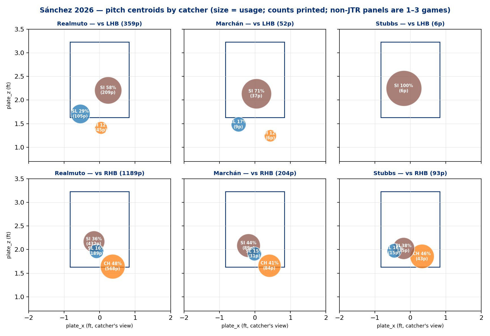

# Addendum A — Battery Pitch Maps (dp_uc21a) · v1.1.0
### uc-pps-019 · additive enhancement, 2026-07-15 · does NOT modify the v1.0.0 report

**Origin:** DPO-contributed visual pattern (plotly pitch-centroid map — location by catcher, sized by usage, faceted by stand, strike zone overlaid). Adopted here and recommended as a house format for battery/location questions going forward.

> ⚠️ **Sample warning, stronger than usual.** Realmuto = 17 games / 1,548 pitches. **Marchán = 3 games / 256 pitches** (04-07 partial, 04-30, 06-14). **Stubbs = 1 game / 99 pitches** (04-23 at CHC). Non-JTR panels are *game-level* observations wearing catcher labels. Receipt: `out/dp_uc21a_battery_game_mix.csv`.

## Finding 1 — The v1.0.0 battery split is substantially a game-mix effect (interpretation correction)

The main report (§5) printed battery wOBA splits with a "directional" flag. The game-mix receipt sharpens that: **Stubbs's .492 wOBA split is literally the April 23 Chicago start** (5 runs, the worst April outing) — it is one bad day, not a catcher effect. Marchán's .372 blends a rough 6/14 MIL start with **4/30 at SF — the start that opened the 51.2-IP scoreless window**. And Realmuto's .265 includes the KC blowup. Read §5's battery table as *which games each catcher happened to catch* first, catcher influence second, if at all.

## Finding 2 — One mechanism-level observation survives the caveat: changeup height

Receipt: `out/dp_uc21a_battery_pitch_map.csv` (vs RHB):

| Catcher | CH centroid height | CH in-zone | CH whiff | n |
|---|---|---|---|---|
| Realmuto (17 g) | 1.64 ft | **33.8%** | **46.6%** | 568 |
| Marchán (3 g) | 1.66 ft | 28.6% | 28.6% | 84 |
| Stubbs (1 g) | **1.86 ft** | **55.8%** | 34.6% | 43 |

With Realmuto, the changeup vs RHB lives at the bottom edge, out of the zone two times in three — the chase engine (§4's 38.6% chase identity) in spatial form. In the Stubbs start it sat ~2.5 inches higher and **in the zone more often than not**, and the whiff dropped 12 points. One game — but the *direction* is exactly what the pitch-design logic predicts: the changeup's value is below the zone. Marchán's games kept the location (1.66, 28.6% in-zone) and still got fewer whiffs — consistent with day/opponent variance, not location drift.

## Finding 3 — Non-JTR game plans ran sinker-heavier, and the sinker is the leak pitch

Usage within catcher×stand: Marchán games were 71.2% sinker vs LHB and 43.6% vs RHB (Realmuto: 58.2% / 36.3%). Given the main report's central finding — the damage concentrates on early-count sinkers to RHB (§7) — a sinker-heavier plan on a non-JTR day compounds the exposure. Directional, 3 games; worth a look in second-half game-planning, not a conclusion.

## Finding 4 — The leak is not a catcher problem

With Realmuto himself, the sinker vs RHB runs 64.4% hard-hit / 12.2% barrel / .422 xwOBA (432 pitches — a real sample). The v1.0.0 watch item stands on the primary battery's own data; the addendum removes the temptation to blame the backup catchers for it.

## Governance
- **Version:** v1.0.0 → **v1.1.0** (additive: new receipts, new figures, this doc; no v1.0.0 artifact modified — version-controller class: non-breaking).
- **No new formula-KPI.** Panel = locked KPIs + descriptive location centroids (plate_x/plate_z means) + barrel rate (existing glossary term, `launch_speed_angle == 6`). No ratification item added.
- **Receipts:** `out/dp_uc21a_battery_pitch_map.csv`, `out/dp_uc21a_battery_game_mix.csv`. Build: `dp_uc21a_battery_pitch_map.py`. Consistency check: catcher pitch totals match the v1.0.0 battery receipt exactly (1548/256/99).
- **Figures:** `dp_uc21a_battery_pitch_map.html` (interactive, DPO's plotly format, animation by catcher) · `out_dp_uc21a_fig4_battery_pitch_map.png` (static, Phillies brand).
- **Visual-standard note (for future UCs):** the pitch-centroid map (usage-sized, stand-faceted, zone-overlaid) is adopted as the standard visual for battery/location questions in pps retrospectives; interactive plotly for exploration, static brand PNG for the governed report.

