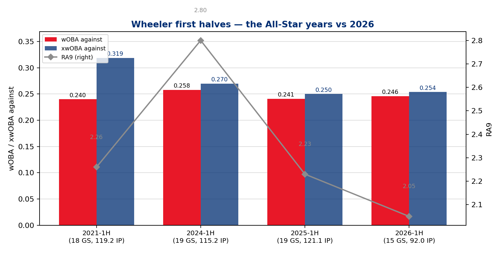
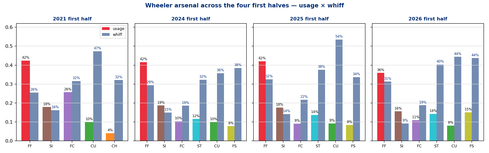
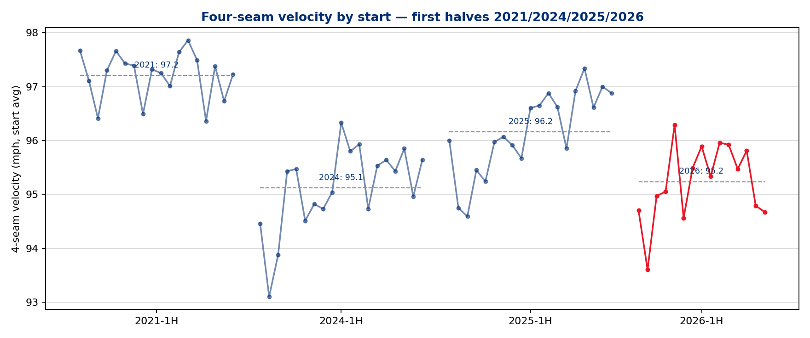

# First-Half Closeout — Zack Wheeler (RHP), the All-Star Who Wasn't
### Phillies Pitching · 15 starts · 2026-04-25 through 2026-07-12 · vs the All-Star first halves of 2021, 2024, 2025

**Prepared for:** manager / pitching department / Wheeler / front office — first-half review
**Throws:** R · **Arsenal (2026):** 6 pitches (4-Seam, Sinker, Cutter, Sweeper, Curveball, Split-Finger)
**Governance:** Use Case #24 (`uc-pps-020` / `dp_uc23`) · locked KPIs inherited verbatim from dp_uc21 (via dp_uc17/dp_uc11) · no new KPIs this UC · pps sibling of the Luzardo (uc-pps-017), Duran (uc-pps-018), and Sánchez (uc-pps-019) ASG retrospectives — inverted: this is the report on the one who stayed home

> ⚠️ **Read this first — data window & sample sizes.**
> • Source: `phils_{2021,2024,2025,2026}` parquet, entity-locked to `pitcher == 554430` (resolved from data, not hand-keyed), regular season only, deduped. First-half cutoffs are the user-provided last games: **2021-07-11, 2024-07-14, 2025-07-13**; 2026 cache fresh through **2026-07-12** (ASG 2026-07-14).
> • Two facts are **data-visible and load-bearing**: the 2025 log ends **2025-08-15** (no Wheeler pitches after), and the 2026 log begins **2026-04-25** (no earlier appearances). The *cause* of the truncated 2025 season and late 2026 debut is **not derivable from the pitch log** and is not asserted here — it is logged as an intake gap (01).
> • **IP is reconstructed from event outs** (±~1 out vs official). **Runs = runs scored while he was on the mound** (RA9, not earned-run accounting).
> • **xwOBA here is the contact-quality proxy** (mean of `estimated_woba_using_speedangle`, BIP only) — comparable across years, but it excludes strikeouts, which is why 2021's .319 sits far above its .240 wOBA: elite K% plus batted-ball fortune. Say which metric is doing the work; both are printed everywhere.
> • July 2026 = **71 PA**, April 2026 = **20 PA (1 start)** — directional only. TTO splits exist only for 2025/2026 (`n_thruorder_pitcher` absent from the 2021/2024 caches).
> • Wheeler's All-Star selections (2021/2024/2025) and 2026 non-selection are **manual carry-ins**, logged in the freshness manifest.
> • §5 persona narratives are *inference consistent with the data*, labeled as such — not observed fact.

---

## Bottom line

1. **On a rate basis, 2026 was the best first half of the four.** 2.05 RA9 — better than either All-Star peak (2.26 in 2021, 2.23 in 2025) — on a .246 wOBA / .254 xwOBA against, 30.4 K%, and the best wOBA and xwOBA against of any Phillies starter (Sánchez, the NL All-Star *starter*, allowed .292/.279). The performance did not decline. The volume did.

2. **The snub is a counting-stat story, visible in one row: 15 starts and 92.0 IP, against 18–19 starts and 115–121 IP in the All-Star halves.** He debuted April 25 and missed roughly a month of accumulation — about four starts, or ~25 IP and ~40 strikeouts at his own per-start rates (108 K vs 145/126/154 in the comparison halves). Selection narratives run on totals; his totals never caught up.

3. **The pitcher who came back is not the 2021 pitcher — and the redesign is why the rates held.** Four-seam velocity sits at 95.2 (97.2 in 2021, 96.2 in 2025), four-seam usage is down to 35.9% from 42%+, and the split-finger has nearly doubled to a career-high 15.1% usage with a 43.7% whiff rate. Zone rate dropped to 42.6% (career-low of the four halves) while chase rate hit a career-high 36.2% — he traded raw stuff for deception and got *more* outs, not fewer.

4. **The leak, if you want one: the sinker (9.2% whiff, .295 xwOBA against, worst of his six pitches)** — the same early-count sinker finding uc-pps-019 surfaced on Sánchez — plus hard-hit% continuing its four-half climb (29.1% → 31.4% → 32.9% → 34.5%). Contact is getting louder every year; results haven't paid for it yet because contact is rarer (whiff ~30%) and the K engine is intact.

5. **He finished the half as the hottest pitcher on the staff: July = .188 xwOBA against and a 47.9 K% over 71 PA (directional), including a 14-K game vs Cincinnati (7/7) and 10 K in Detroit (7/12).** Whatever the selection process missed, the second-half projection shouldn't.

---

## §1 — The results first: four first halves, side by side

| | 2021-1H ⭐ | 2024-1H ⭐ | 2025-1H ⭐ | **2026-1H** |
|---|---|---|---|---|
| Starts / IP | 18 / 119.2 | 19 / 115.2 | 19 / 121.1 | **15 / 92.0** |
| PA | 471 | 468 | 467 | 355 |
| K% / BB% | 30.8 / 5.3 | 26.9 / 7.5 | 33.0 / 5.6 | 30.4 / 6.2 |
| K / BB (counts) | 145 / 25 | 126 / 35 | 154 / 26 | **108 / 22** |
| wOBA / xwOBA against | .240 / .319 | .258 / .270 | .241 / .250 | .246 / .254 |
| HR per PA | .015 | .024 | .028 | .028 |
| Hard-hit % | 29.1 | 31.4 | 32.9 | **34.5** |
| RA9 / FIP | 2.26 / 2.23 | 2.80 / 3.31 | 2.23 / 2.73 | **2.05** / 2.96 |
| CSW | 30.0% | 28.3% | 30.1% | 29.2% |
| IP / start · pitches / start | 6.65 · 100.3 | 6.09 · 98.2 | 6.39 · 100.4 | 6.13 · **96.9** |

Receipts: `dp_uc23_wheeler_firsthalf_line.csv`, `dp_uc23_wheeler_process_kpis.csv`.

Read the table top to bottom and the story writes itself. Every rate line is All-Star-grade — the wOBA against sits within .006 of both All-Star peaks, the RA9 is the best of the four, the K% matches 2021. The only rows where 2026 loses are the two the voting process actually sees: starts and innings. The RA9-vs-FIP gap (2.05 vs 2.96) says he ran a bit ahead of his component line this half — the honest caveat — but FIP of 2.96 is itself a top-of-rotation number, and 2024's All-Star half carried a *worse* FIP (3.31).

**Staff context (2026, ≥500 pitches; receipt `dp_uc23_staff_benchmark_2026.csv`):** Wheeler leads all Phillies starters in both wOBA against (.246) and xwOBA against (.254). Sánchez — the NL starter — allowed .292/.279 over 525 PA; Luzardo .295/.269. Only Duran (.227/.229, 126 PA in relief) has a better line in the building. Three Phillies pitchers made the team; the one with the best rate line stayed home.

## §2 — Where the half actually happened (2026 start by start)

Receipt: `dp_uc23_wheeler_start_log_2026.csv`.

| Date | Opp | IP | K | BB | HR | R | xwOBA | FF velo |
|---|---|---|---|---|---|---|---|---|
| 04-25 | ATL | 5.0 | 6 | 3 | 0 | 2 | .275 | 94.7 |
| 05-01 | MIA | 6.0 | 8 | 2 | 0 | 1 | .226 | 93.6 |
| 05-06 | ATH | 6.1 | 4 | 1 | 1 | 3 | .247 | 95.0 |
| 05-12 | BOS | 7.1 | 4 | 0 | 0 | 1 | .430 | 95.1 |
| 05-17 | PIT | 6.2 | 8 | 1 | 0 | 0 | .278 | 96.3 |
| 05-23 | CLE | 6.0 | 6 | 1 | 0 | 0 | .225 | 94.6 |
| 05-29 | LAD | 6.0 | 4 | 1 | 4 | 4 | .284 | 95.5 |
| 06-04 | SD | 7.0 | 8 | 3 | 1 | 2 | .287 | 95.9 |
| 06-09 | TOR | 6.0 | 5 | 0 | 1 | 1 | .281 | 95.3 |
| 06-15 | MIA | 6.0 | 9 | 3 | 0 | 0 | .185 | 96.0 |
| 06-21 | NYM | 5.1 | 7 | 3 | 1 | 2 | .256 | 95.9 |
| 06-26 | NYM | 6.2 | 5 | 1 | 0 | 1 | .248 | 95.5 |
| 07-01 | PIT | 4.2 | 10 | 1 | 1 | 3 | .251 | 95.8 |
| 07-07 | CIN | 7.0 | **14** | 0 | 1 | 1 | **.111** | 94.8 |
| 07-12 | DET | 6.0 | 10 | 2 | 0 | 0 | .207 | 94.7 |

Fifteen starts, all between 84 and 104 pitches. Five starts of zero runs on the mound, one start of 4 (the LAD game, 5/29 — the only start with a multi-walk *and* multi-run blemish). No start above .430 xwOBA, and that one (Boston, 5/12) was a 7.1-IP, 1-run outing anyway — contact quality and results disagreeing in his favor. The monthly ramp (receipt `dp_uc23_wheeler_monthly_2026.csv`) is the arc of a pitcher rebuilding into form: April/May K% of ~24–30%, June 28.3%, then **July: 47.9 K%, .188 xwOBA, 32.9% CSW** (71 PA — directional, but the direction is straight up).

## §3 — Why the rates held: the arsenal is a different machine now

Receipts: `dp_uc23_wheeler_arsenal_yoy.csv`, `dp_uc23_wheeler_velo_by_start.csv`.

**The velocity ledger, first-half averages (4-seam, start-level):** 97.2 (2021) → 95.1 (2024) → 96.2 (2025) → **95.2 (2026)**. The 2026 line is a full tick under last year and two under the 2021 peak — but it is essentially the 2024 All-Star level, and the per-start trace (fig 3) shows it climbing through May–June before settling in the mid-95s. This is not a red-flag collapse; it is an aging curve being managed.

**What changed is what he throws, not just how hard:**

| Pitch | 2021 usage → 2026 usage | 2026 whiff | 2026 xwOBA against |
|---|---|---|---|
| 4-Seam | 42.4% → **35.9%** | 31.3% | **.244** (best of his four FF years) |
| Cutter | 25.7% → 11.0% | 18.8% | .298 |
| Sinker | 17.9% → 15.6% | **9.2%** | .295 |
| Split-Finger | — (2024: 7.8%) → **15.1%** | **43.7%** | .214 |
| Sweeper | — (2024: 11.6%) → 14.3% | 40.3% | .242 |
| Curveball | 9.9% → 8.1% | 44.4% | .239 |

The 2021 All-Star was a two-pitch power pitcher (68% four-seam + cutter) at 97. The 2026 pitcher throws six pitches, none over 36%, with **three distinct 40%+ whiff secondaries** (split, sweeper, curve). The split-finger is the headline: nearly double its 2024-25 usage, a 43.7% whiff rate, and a .214 xwOBA against — it has become the putaway pitch the velocity no longer has to be.

**And the location strategy moved with it (receipt `dp_uc23_wheeler_process_kpis.csv`):** in-zone rate fell off a cliff — 50.8/50.4/51.0 in the All-Star halves, **42.6%** in 2026 — while chase rate jumped to a career-high **36.2%** (vs 30.5–32.3 prior). He is pitching out of the zone on purpose and getting hitters to follow. The proof it works: first-pitch strike rate *recovered* to .654 (from 2025's .609), and the share of PAs reaching two strikes hit .600, tied for his best (receipt `dp_uc23_wheeler_count_leverage.csv`). Fewer strikes thrown, more strikes earned.

**The honest flags in the same receipts:** the sinker's whiff rate has decayed to 9.2% with a .295 xwOBA — it's now a contact pitch living in an arsenal built on avoiding contact — and hard-hit% has climbed every half in this study (29.1 → 31.4 → 32.9 → 34.5). Putaway rate (22.9%) also sits below the 2021/2025 marks (25.0/25.4) — with two strikes he's finishing slightly less often, leaning on the chase game to get there.

## §4 — Splits that matter (and one that doesn't)

Receipts: `dp_uc23_wheeler_by_stand_yoy.csv`, `dp_uc23_wheeler_tto_yoy.csv`.

**vs RHB, 2026: .235 wOBA / .212 xwOBA, 32.6 K%, 2.8 BB% (141 PA)** — that is closing-argument dominance. **vs LHB: .252 / .281, with an 8.4 BB%** — lefties are the ones spoiling the zone-avoidance approach by taking their walks. This is the mirror of the 2024 half, when LHB got him for a .314 wOBA and a 10.0 BB%; 2026's lefty line is fine, just not the RHB line.

TTO (2025/2026 only): first and second time through are near-identical YoY (.230/.232 wOBA in 2026); the third-time line (.292 over 85 PA) is louder than 2025's (.281) but at a 18.8 K% — small sample, don't over-read it. The manager's 6.13 IP/start leash already reflects it.

## §5 — Personas: what was done, what it produced, what's next

*Everything in this section is inference consistent with the receipts above — plausible readings of the record, not observed decisions.*

**The pitcher.** The data shows a redesign, and redesigns are choices: cut the four-seam share six points, double the split, live outside the zone at a career-high chase rate. A 36-year-old arm at 95.2 posting a *better* RA9 than his 97.2 self is the entire argument for that choice. Second-half homework mirrors Sánchez's: the sinker (9.2% whiff, .295 xwOBA) is the one pitch not pulling its weight — either relocate it (early-count strike-stealer only) or keep shrinking it.

**The manager / medical-performance staff.** The eased re-entry is visible in the workload receipts: 96.9 pitches/start and 6.13 IP/start, both the lowest of the four halves, after a debut that came a month late. Whatever kept him out of April (not asserted here — intake gap), the management of the return protected the rates that make him valuable. The July line (CSW 32.9%, K% 47.9%) says the leash can lengthen now.

**The pitching department.** Two actionable reads. First, the arsenal migration *is the department's aging-curve playbook working* — three 40%-whiff secondaries built up over three seasons meant the velocity dip cost nothing; that sequencing (develop the pitch *before* you need it) is the transferable lesson for Nola (.355 wOBA against this half) and the young arms. Second, this is now the **second consecutive pps UC to flag a sinker leak** (Sánchez: .371 xwOBA; Wheeler: .295, 9.2% whiff) — worth a staff-level look at early-count sinker deployment rather than two pitcher-level fixes.

**The front office / DPO value stream.** The snub itself is the data-product lesson: **selection processes consume counting stats, and counting stats are a function of availability, not quality.** Wheeler's rate line was the best among Phillies starters and better than at least one of his own All-Star halves (2024) on every rate metric. A per-start receipt package like §2 — rate-basis case, workload context, trajectory — is exactly the artifact to put in front of award/selection advocacy next time the totals lag the talent. That product exists now; it just shipped one half too late. Renewal option: refresh this UC at season's end as the full-year Cy Young advocacy brief.

## §6 — Caveats, in one place

- **RA9 outran FIP** (2.05 vs 2.96) — some batted-ball fortune this half; the claim defended here is "All-Star-grade," not "best half of his career."
- **xwOBA is the contact-only proxy** — 2021's .319/.240 gap is the loudest illustration; cross-year *comparisons* of the proxy are apples-to-apples, absolute levels are not full-PA xwOBA.
- **July (71 PA) and April (20 PA) are below the 100-BF convention** — flagged inline everywhere they're cited.
- **IP from event outs; runs are on-mound score deltas** — official ERA/IP bookkeeping may differ by hairs.
- **TTO unavailable for 2021/2024** (field absent from those caches).
- **The cause of the 2025 season ending 8/15 and the 2026 debut on 4/25 is not in the data.** Both facts are printed as data-visible; the explanation is a carry-in gap the DPO should backfill in the spec.
- **All-Star selections/non-selection are user-provided carry-ins**, logged in `dp_uc23_freshness_manifest.csv`.

---

*Receipts: 15 CSVs + 3 figures in `out/dp_uc23_*` · DQ scorecard: all structural checks PASS (`dp_uc23_dq_scorecard.csv`) · Build: `dp_uc23_wheeler_first_half.py`, run 2026-07-15 against caches fresh to 2026-07-12.*
