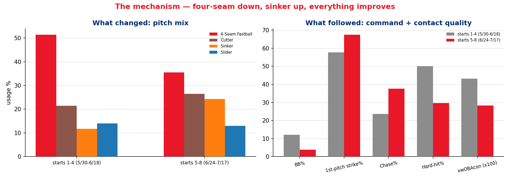
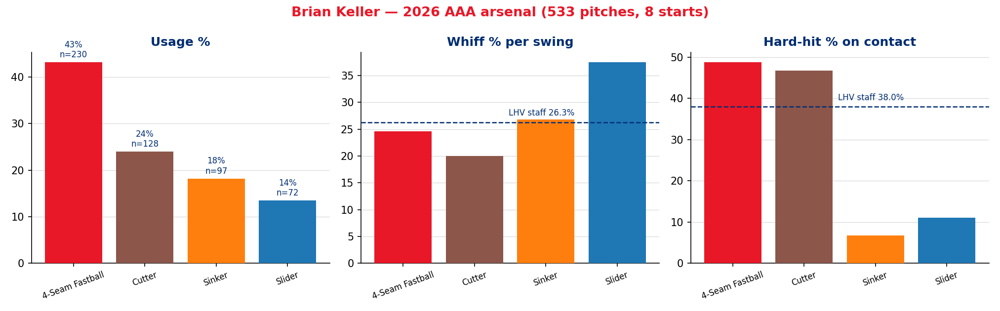
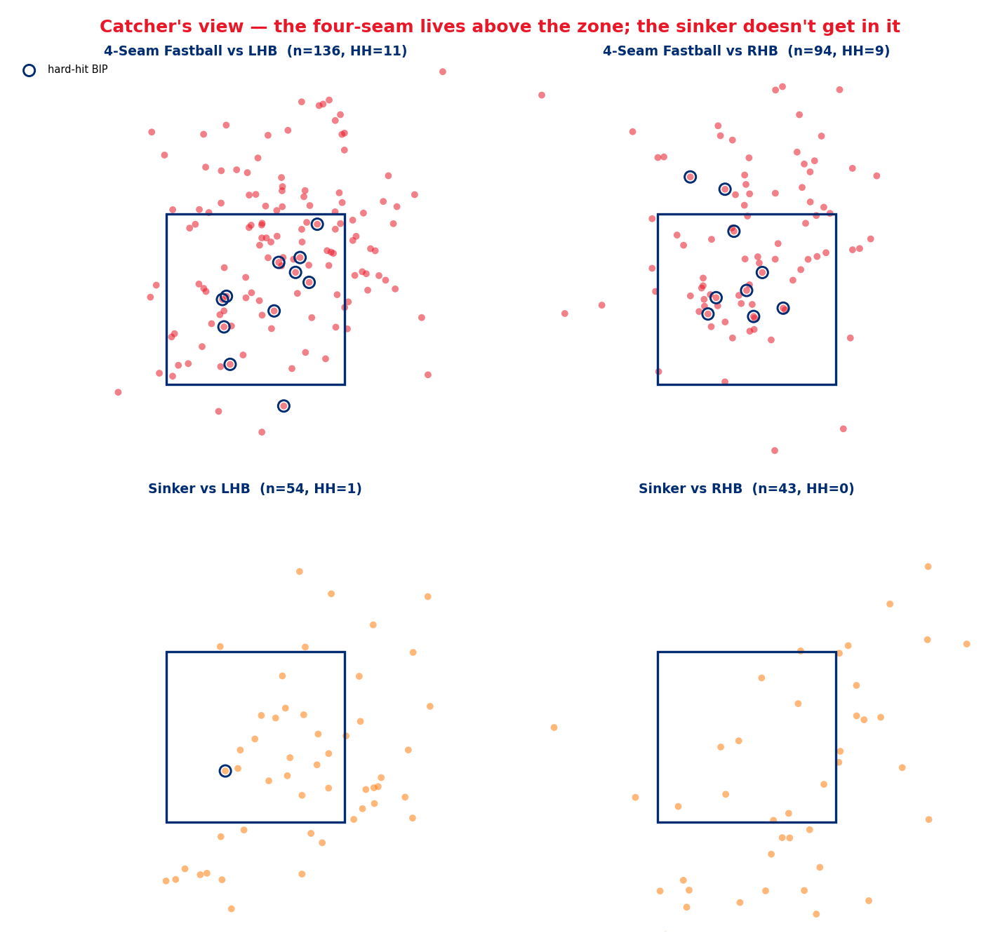
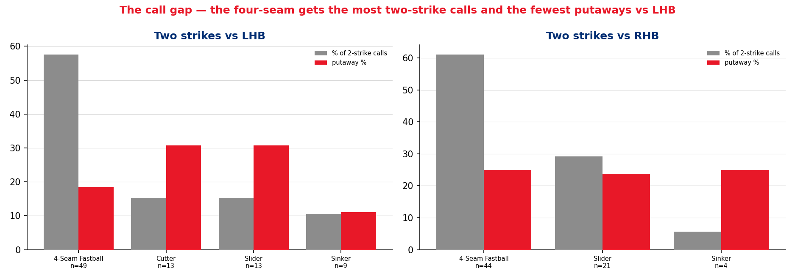

# Player Report — Brian Keller (RHP), Lehigh Valley IronPigs
### 2026 season through 2026-07-17 · 8 starts · 36.2 IP · prepared 2026-07-25

**Prepared for:** manager · pitching coach & staff · J.T. Realmuto · Brian Keller · player development
**Throws:** R · **Age:** 32 · **Arm slot:** 36° (low three-quarters, ±2.5° across the arsenal)
**Arsenal:** 4 usable pitches — four-seam, cutter, sinker, slider (plus 6 career-2026 curveballs)
**Governance:** Use Case #27 (`uc-pps-022` / `dp_uc26`). All 11 rate KPIs inherited verbatim from the locked UC#8 → UC#11 → UC#26 line. One PROVISIONAL KPI (SR-M1). 107/107 independent verification checks pass.

> ⚠️ **Read this first — data window, sample size, and what this report cannot tell you.**
>
> - **Source:** `data/opponents/lhvp26.parquet`, Lehigh Valley pitching, 2026. Entity locked to `pitcher == 662144`. **The same file contains Brad Keller (641745)** — a name filter blends two pitchers. Cache fresh through 2026-07-23; Keller's last logged start 2026-07-17.
> - **Sample: 533 pitches · 146 batters faced · 8 starts.** That clears the 100-BF publication convention for whole-season rates. It does **not** clear it for the splits — slider 18 PA, sinker 19 PA, third-time-through 16 PA. Every table below prints its own `n`. Read them.
> - **This is all Triple-A. Keller has thrown zero major-league pitches.** No AAA→MLB translation factor is applied because the repo doesn't have one. **Directions transfer; magnitudes do not.** Where this report projects to a call-up, it is reasoning from mechanism, not from a translated number.
> - **Every rate is benchmarked against the 2026 LHV staff excluding Keller** (41 pitchers, 14,427 pitches, 3,702 BF) — same league, same season, same park mix, same tracking rig. A raw AAA number on its own is uninterpretable, so no raw AAA number appears alone.
> - **SR-M1 ("Mayza Success Rate") is PROVISIONAL and not ratified.** It appears in §7 under a banner. Do not cite it outside this document until the ratification decisions in the governance trail are answered.

---

## Bottom line

**1. The results are excellent, and about 70% of that is real.**
`.194/.260/.343` and a **.268 wOBA** allowed against a **.343** staff baseline. That is a
top-of-the-staff line. But **xwOBAcon .348 vs .358** — his contact quality is roughly
*average*. The surplus is coming from strike-throwing and strikeouts, not from missing
barrels. The results gap is loud; the contact-quality gap is nearly silent.

**2. Something changed in mid-June, and it is the most important fact in this report.**
Across starts 5-8 versus starts 1-4: **walk rate 12.1% → 3.8%** (zero walks in each of his
last three starts, 55 batters), **first-pitch strikes 57.8% → 67.5%**, **chase 23.6% → 37.6%**,
**hard-hit 50.0% → 29.6%**, **xwOBAcon .431 → .283**. This is a step change, not a trend.

**3. The mechanism is a pitch-mix change.** Over the same split the **four-seam fell 51.4% →
35.5%** and the **sinker rose 11.7% → 24.3%**. The four-seam is his worst contact pitch
(**48.8% hard-hit**); the sinker is his best (**6.7% hard-hit, 75.4 mph average exit velocity**).
He stopped leaning on the pitch that was getting hit. Everything downstream followed.

**4. The exposure is left-handed hitters, and it is concentrated.**
vs RHB: **.230 wOBA, .309 xwOBAcon, 31.1% K, 57.1% ground balls, zero home runs.**
vs LHB: **.296 wOBA, .370 xwOBAcon, 22.4% K, 34.4% ground balls, and all five home runs.**
Not one of the five was hit by a right-handed batter.

**5. The gameplan writes itself, and it is mostly a two-strike problem.**
Against lefties, **57.6% of his two-strike pitches are four-seams** — and that pitch produces
his **worst two-strike whiff rate (18.2%)** and **worst putaway rate (18.4%)**. The slider,
which gets **60.0% whiffs** in the same spot, is called **15.3%** of the time. **The single
biggest available gain in this profile is calling fewer two-strike fastballs to left-handed
hitters.**

---

## 1. The results

| | Keller | LHV staff (ex-Keller) | Read |
|---|---|---|---|
| Pitches / BF | 533 / **146** | 14,427 / 3,702 | small but publishable |
| IP (computed) | **36.2** *(110 outs)* | — | 8 starts, ~4.2 IP average |
| AVG / OBP / SLG | **.194 / .260 / .343** | .266 / .354 / .420 | comfortably better on all three |
| **wOBA allowed** | **.268** | .343 | **−75 points** |
| **xwOBAcon** | **.348** | .358 | **−10 points** — the honest number |
| K% | **26.0%** | 22.9% | above average |
| BB% | **7.5%** | 11.3% | well above average |
| HR% | 3.4% | 2.5% | **worse than baseline** |

**How to read the gap between wOBA and xwOBAcon.** wOBA charges him for everything that
happened; xwOBAcon asks only "given the exit velocity and launch angle of the balls he
allowed, how hard was the contact?" He beats the league by 75 points on the first and by 10
points on the second. The difference is the part of his line that comes from *not putting
runners on* (fewer walks, more strikeouts) rather than from *suppressing contact* — plus some
ordinary batted-ball luck across only 96 balls in play.

That is not a criticism. Strike-throwing is a skill and it is the skill that travels best.
But it means the correct expectation on promotion is a pitcher who limits free bases, not one
who misses barrels.

### Start by start

*Innings are in standard baseball notation — "6.2" is six innings and two outs, not 6.7. The
receipts carry both representations (`ip_baseball` and `ip`, plus `outs_recorded`) so the two
can never be confused.*

| Date | Opp | Site | IP | BF | P | K | BB | H | HR |
|---|---|---|---|---|---|---|---|---|---|
| 05-30 | BUF | away | 2.0 | 9 | 45 | 3 | 1 | 2 | 0 |
| 06-04 | ROC | home | 4.0 | 19 | 61 | 4 | 3 | 4 | 0 |
| 06-10 | SWB | away | 4.1 | 19 | 66 | 2 | 2 | 4 | **2** |
| 06-18 | WOR | home | 3.2 | 19 | 85 | 7 | 2 | 6 | **2** |
| 06-24 | SYR | home | **6.2** | 25 | 82 | 5 | 3 | 2 | 0 |
| 07-01 | ROC | away | 4.0 | 13 | 44 | 5 | **0** | 1 | 0 |
| 07-07 | COL | home | 6.0 | 21 | 74 | 6 | **0** | 4 | 0 |
| 07-17 | OMA | away | 6.0 | 21 | 76 | 6 | **0** | 3 | 1 |

The walk column reads `1, 3, 2, 2, 3, 0, 0, 0`. The last three starts are 16 innings, 55
batters, **zero walks, 17 strikeouts**. The workload also stepped up — from 45-66 pitches
early to a steady 74-82 — without the command degrading.

---

## 2. The mechanism — what changed in mid-June

The split is starts 1-4 (5/30 → 6/18) against starts 5-8 (6/24 → 7/17). It was chosen on the
walk pattern alone, before looking at any outcome data, so the split isn't fitted to the
answer.

| | Starts 1-4 (66 BF) | Starts 5-8 (80 BF) | Δ |
|---|---|---|---|
| **Four-seam usage** | **51.4%** | **35.5%** | −15.9 |
| **Sinker usage** | **11.7%** | **24.3%** | +12.6 |
| Cutter usage | 21.4% | 26.4% | +5.0 |
| Slider usage | 14.0% | 13.0% | −1.0 |
| First-pitch strike % | 57.8% | **67.5%** | +9.7 |
| Walk rate | 12.1% | **3.8%** | −8.3 |
| Chase rate | 23.6% | **37.6%** | +14.0 |
| Swinging-strike % | 11.7% | 13.8% | +2.1 |
| **Hard-hit %** | **50.0%** | **29.6%** | −20.4 |
| **xwOBAcon** | **.431** | **.283** | −.148 |
| wOBA allowed | .387 | **.170** | −.217 |

Read the top two rows and the bottom four together. He traded roughly 16 points of four-seam
usage for 13 points of sinker (and 5 of cutter), and his contact quality allowed collapsed by
20 points of hard-hit rate. Given that the four-seam surrenders hard contact on **48.8%** of
balls in play and the sinker on **6.7%**, that is not a coincidence — it is arithmetic.

The command improvement is a second-order benefit of the same change. Throwing fewer
elevated four-seams and more sinkers and cutters at the bottom of the zone got him ahead more
often (+9.7 first-pitch strikes), and hitters expanded once he was ahead (+14.0 chase).

**Caveat, stated plainly.** 66 and 80 batters faced. A 20-point swing in hard-hit rate on 42
and 54 balls in play carries a wide error bar, and some of the wOBA collapse is ordinary
variance. What raises this above noise is that **five independent indicators moved in the same
direction at the same time**, and there is a stated mechanical cause sitting upstream of all
of them.

---

## 3. The arsenal

| Pitch | Usage | Velo (max) | Spin | Arm-side break | Vert break | Whiff/swing | Hard-hit | GB% | xwOBAcon |
|---|---|---|---|---|---|---|---|---|---|
| **4-Seam** | **43.2%** | 92.6 (95.8) | 2255 | +0.5" | 1.5" | 24.6% | **48.8%** *(n=41)* | 36.6% | .358 |
| **Cutter** | **24.0%** | 87.9 (91.7) | 2319 | −0.4" | 2.3" | 20.0% | **46.7%** *(n=30)* | 43.3% | .325 |
| **Sinker** | **18.2%** | 91.2 (94.9) | 2101 | +1.2" | 2.0" | 26.8% | **6.7%** *(n=15)* | 46.7% | .309 |
| **Slider** | **13.5%** | 81.2 (85.1) | 2370 | −1.1" | 3.1" | **37.5%** | **11.1%** *(n=9)* | **66.7%** | .314 |
| Curveball | 1.1% | 79.2 | 2352 | −1.2" | 3.6" | *n=6 — excluded from rate tables* | | | |

*Staff baselines: whiff/swing 26.3%, hard-hit 38.0%.*

**This is a four-pitch mix with the usage upside-down.** The two pitches he throws most
(four-seam + cutter = 67% of everything) give up hard contact at **48.8%** and **46.7%**. The
two he throws least (sinker + slider = 32%) give it up at **6.7%** and **11.1%** and produce
his only above-average whiff rate.

Three qualifiers, in the interest of honesty:

1. **The sinker and slider sample sizes are tiny.** 15 and 9 balls in play. A 6.7% hard-hit
   rate on 15 batted balls is one hard-hit ball away from 13.3%. The *direction* is
   well-supported — 75.4 mph average exit velocity on the sinker versus 89.2 on the four-seam
   is a large gap — but do not treat these as stable rates.
2. **Usage and contact quality are not independent.** The sinker gets thrown in situations the
   four-seam doesn't, and some of its advantage is selection rather than pitch quality. That
   said, the mid-June natural experiment in §2 is exactly the test that matters: usage moved,
   and outcomes moved with it.
3. **The velocity is average, not a weapon.** 92.6 mph on the four-seam with 6.8 ft of
   extension. At AAA that plays. This is a pitcher who will have to win with sequencing and
   location, not with stuff.

### Where the pitches live

| | Above zone | Mean height | Heart % | Zone-edge % | Chase-zone % |
|---|---|---|---|---|---|
| Keller — all pitches | 24.0% | 2.57 ft | **21.4%** | 24.6% | 32.3% |
| Staff baseline | 16.1% | 2.26 ft | 17.9% | 25.4% | 34.8% |
| **Keller — 4-seam** | **34.8%** | **2.96 ft** | 24.3% | 25.2% | 29.6% |
| Staff — 4-seam | 25.5% | 2.65 ft | 20.3% | 27.8% | 29.7% |
| **Keller — sinker** | 13.4% | **2.05 ft** | 12.4% | **14.4%** | **43.3%** |
| Staff — sinker | 13.8% | 2.35 ft | 20.6% | 28.8% | 27.8% |

Two things stand out, and they are the two most actionable items in this report.

**The four-seam is an elevated fastball.** 34.8% of them finish above the rulebook zone
against a staff rate of 25.5%, and they average 3.5 inches higher. Elevating a 92.6 mph
four-seam is a real approach, but it is the highest-variance version of that approach — it
needs either more velocity or more induced vertical break than he has to consistently beat
barrels. At AAA it produced a 48.8% hard-hit rate and four of his five home runs came off
pitches at or above 2.75 ft.

**The sinker is being thrown as a chase pitch, not a strike pitch.** It sits at 2.05 ft — a
full 0.30 ft *below* the staff's average sinker — reaches the zone edge on only **14.4%** of
throws against a staff rate of **28.8%**, and finishes in the chase zone **43.3%** of the time
versus **27.8%**. He is burying his best contact-suppression pitch under the zone, where a
disciplined hitter simply takes it. His first-pitch strike rate with the sinker is **54.5%**
to lefties and **46.7%** to righties — the worst of any pitch he throws.

**That is the single largest untapped gain in this profile: the sinker at the knees instead
of below them.** It costs him nothing — the pitch is already in his hand 18% of the time —
and it converts a wasted chase offering into a strike from a pitch that has allowed a 75.4
mph average exit velocity.

---

## 4. The handedness split — where the risk lives

| | vs LHB (85 BF) | vs RHB (61 BF) | Staff vs LHB | Staff vs RHB |
|---|---|---|---|---|
| wOBA allowed | .296 | **.230** | .340 | .340 |
| **xwOBAcon** | **.370** | **.309** | .356 | .360 |
| K% | 22.4% | **31.1%** | 21.3% | 24.5% |
| BB% | **5.9%** | 9.8% | 11.1% | 11.2% |
| **Whiff/swing** | **22.0%** | **30.3%** | 24.9% | 27.6% |
| **Ground-ball %** | **34.4%** | **57.1%** | 45.0% | 49.1% |
| Home runs | **5** | **0** | — | — |
| Slider usage | **7.7%** | **21.0%** | — | — |

This split is not subtle and it is not a results artefact — the process metrics agree with the
outcome metrics all the way down. Against right-handed hitters he is a genuinely good pitcher:
above-average whiffs, 57% ground balls, an xwOBAcon 50 points better than the staff. Against
left-handed hitters he is **below** the staff baseline on whiff rate and ground-ball rate, and
his xwOBAcon is *worse* than the league's.

**The usage row explains most of it.** His best pitch — the slider, 37.5% whiffs, 66.7% ground
balls — is thrown to lefties **7.7%** of the time and to righties **21.0%**. Against LHB he is
essentially a three-pitch pitcher (four-seam 45%, cutter 28%, sinker 18%), and two of those
three are his hard-contact pitches.

### The five home runs

| Date | Stand | Pitch | Count | TTO | Height | In heart? | EV |
|---|---|---|---|---|---|---|---|
| 07-17 | L | 4-Seam | 3-1 | 1st | 2.75 ft | **yes** | 102.3 |
| 06-18 | L | Sinker | 1-2 | **2nd** | 2.09 ft | **yes** | 105.6 |
| 06-18 | L | Cutter | 0-0 | **2nd** | 2.85 ft | no | 98.4 |
| 06-10 | L | 4-Seam | 0-1 | **2nd** | 3.11 ft | no | 97.7 |
| 06-10 | L | Curveball | 1-1 | **2nd** | 2.96 ft | no | 103.0 |

All five to left-handed hitters. **Four of five the second time through the order.** Four of
five on pitches at or above 2.75 ft. Three of five in hitter's or even counts. And the one
sinker home run is the exception that supports the rule — it is the only one thrown *in the
heart of the zone at 2.09 ft*, i.e. the one time the sinker was elevated into the middle
rather than kept at the knees.

### Times through the order

| TTO | BF | wOBA | SLG | HR | xwOBAcon | Whiff/swing |
|---|---|---|---|---|---|---|
| 1st | 72 | .248 | .277 | 1 | .333 | 27.8% |
| **2nd** | **58** | **.325** | **.481** | **4** | **.367** | **21.2%** |
| 3rd | 16 | .157 | .133 | 0 | .339 | 29.0% |

The second time through is where the damage is: SLG jumps 204 points, whiff rate drops 6.6
points, and four of the five home runs land. The third-time-through line looks fine but it is
**16 batters faced** — it is not evidence of anything, and the fact that he has only reached a
third pass 16 times is itself the point.

### And the velocity comes down

| Inning | 1 | 2 | 3 | 4 | 5 | 6 |
|---|---|---|---|---|---|---|
| **4-seam velo** | **93.6** | 93.0 | 92.4 | 92.1 | 91.0 | **90.5** |
| *(pitches, n)* | *53* | *54* | *54* | *41* | *13* | *15* |

Monotonic decline, **3.1 mph from the first inning to the sixth**. On a fastball that starts at
92.6, arriving in the fifth and sixth at 90.5 with an elevated approach is a thin margin. The
innings-5-6 samples are small (13 and 15 four-seams), but the decline is smooth across all six
buckets rather than jumping at the end, which is what makes it credible.

**Put the three findings together — second time through, elevated four-seam, declining
velocity — and the workload recommendation is not a judgement call.**

---

## 5. The gameplan — how this game should be called

### Two strikes

| Stand | Pitch | Share of 2K calls | n | Whiff/swing | Putaway |
|---|---|---|---|---|---|
| **L** | **4-Seam** | **57.6%** | 49 | **18.2%** | **18.4%** |
| L | Cutter | 15.3% | 13 | 25.0% | 30.8% |
| L | **Slider** | **15.3%** | 13 | **60.0%** | **30.8%** |
| L | Sinker | 10.6% | 9 | 16.7% | 11.1% |
| **R** | **4-Seam** | **61.1%** | 44 | 26.9% | 25.0% |
| R | **Slider** | **29.2%** | 21 | **45.5%** | 23.8% |
| R | Sinker | 5.6% | 4 | 33.3% | 25.0% |
| R | Cutter | 2.8% | 2 | — | *(2 of 2 K)* |

**The pattern is the same on both sides and it is worse against lefties.** The four-seam gets
roughly 60% of all two-strike calls to both handedness groups. Against right-handers that is
defensible — it whiffs at 26.9% there. Against left-handers it whiffs at **18.2%**, the worst
mark of any pitch in any two-strike situation, and it still gets **57.6%** of the calls.

Meanwhile the slider, on 13 two-strike pitches to lefties, whiffed on **3 of 5 swings** and
struck out 4 of 13. *Thirteen pitches and five swings is a directional signal, not a fact* —
but it points the same way as the slider's full-season 37.5% whiff rate and 66.7% ground-ball
rate, and it points away from a four-seam that is failing on a much larger sample.

### First pitch

| Stand | Pitch | Share of 0-0 | n | Strike rate |
|---|---|---|---|---|
| L | 4-Seam | 41.2% | 35 | 68.6% |
| L | **Cutter** | 25.9% | 22 | **72.7%** |
| L | Sinker | 25.9% | 22 | 54.5% |
| R | 4-Seam | 28.8% | 17 | 70.6% |
| R | **Cutter** | 28.8% | 17 | **76.5%** |
| R | Sinker | 25.4% | 15 | **46.7%** |
| R | Slider | 15.3% | 9 | 33.3% |

**The cutter is the most reliable first-pitch strike he has** — 72.7% to lefties, 76.5% to
righties, the best of any pitch on either side. It is also his second-worst contact pitch,
which is fine on 0-0: a called strike or a foul is the goal, and the risk of damage on a
first-pitch swing is a cost worth paying to get to 0-1.

**The first-pitch sinker is the problem.** 46.7% strikes to righties, 54.5% to lefties. That
is the location issue from §3 showing up in the count: he is throwing it *under* the zone on
0-0 and starting behind. The same pitch thrown at the knees instead of below them is the
single highest-leverage adjustment in this report, because it fixes his weakest first-pitch
offering and his best contact-suppressor in one move.

### The single attack rule

> **Cutter to start it. Sinker at the knees, not under them. Slider to finish it — especially
> to lefties, where it is currently the least-called and best-performing two-strike pitch he
> owns.**

---

## 6. Actions by persona

Every recommendation below is tagged with the evidence that supports it and the confidence it
deserves. Nothing here is a roster recommendation — this is a report about pitching, not about
personnel.

### J.T. Realmuto — calling the game

| # | Call | Evidence | Confidence |
|---|---|---|---|
| **R1** | **Cut the two-strike four-seam to left-handed hitters.** It is 57.6% of those calls at an 18.2% whiff rate. Target roughly a third, replacing them with sliders and cutters | 49 two-strike four-seams to LHB — the largest cell in the grid | **High** — the failing pitch has the big sample |
| **R2** | **Put the slider back in play against lefties.** It's at 7.7% overall usage and 15.3% of two-strike calls. Push toward 15% overall / 30% two-strike, matching his RHB pattern | Slider 37.5% whiff, 66.7% GB overall; 60% whiff on 5 two-strike swings vs LHB | **Medium** — the season-long slider numbers are solid, the LHB-specific split is 13 pitches |
| **R3** | **First pitch: cutter, both sides.** Best strike rate he has (72.7% L / 76.5% R). Avoid the first-pitch sinker until the location is fixed | 39 first-pitch cutters vs 37 first-pitch sinkers | **High** |
| **R4** | **Sinker at the bottom of the zone, not below it.** Set the target at the knees. Currently 43.3% chase-zone, 14.4% zone-edge — half the staff rate | 97 sinkers; location profile vs baseline | **High** on the location gap, **Medium** on the payoff |
| **R5** | **Second time through a lefty, change the shape.** 4 of 5 HR came on the second pass, all to LHB. If the first at-bat was fastball-led, lead with something else | 58 BF on the second pass; .481 SLG | **Medium** — small, but consistent with the LHB profile |
| **R6** | **Don't chase the elevated fastball as a putaway when the velocity is down.** By inning 5-6 the four-seam is 90.5-91.0. Below ~91 the elevated four-seam is a strike, not a chase pitch | Velo-by-inning, monotonic | **Medium** — 13-15 pitches in the late buckets |

### The pitching coach / pitching staff

| # | Action | Evidence |
|---|---|---|
| **P1** | **Protect the mid-June change.** Four-seam ≤ 40%, sinker ≥ 20% is the configuration that produced .283 xwOBAcon and zero walks in three starts. This is the report's headline and it should be the first thing checked after every future start | §2 in full |
| **P2** | **Sinker location is the bullpen priority.** 2.05 ft average, 0.30 ft below the staff sinker. Work the pitch to the bottom rail. This is a location fix, not a shape fix — the pitch is already good | §3 location table |
| **P3** | **Build a left-handed slider plan.** He has a plus slider he doesn't trust against lefties. Whether that's a shape question (backfoot vs back-door), a confidence question, or a sequencing question is a bullpen conversation, but the usage gap (7.7% vs 21.0%) is the largest single asymmetry in his profile | §4 |
| **P4** | **Re-examine the elevated four-seam.** 34.8% above the zone at 92.6 mph produced a 48.8% hard-hit rate. Either the pitch needs more ride to support that plan, or the plan should be a smaller part of the mix | §3 location + arsenal |
| **P5** | **No mechanical red flags.** Arm slot 36° ± 2.5° with essentially identical release points across all five pitch types (`release_pos_x` −2.00 to −2.21 ft). Nothing here suggests tipping or slot inconsistency | Arsenal receipt |

### The manager — usage and leash

| # | Action | Evidence |
|---|---|---|
| **M1** | **Two times through the order is the design point.** The second pass is .325 wOBA / .481 SLG with 4 of 5 HR; velocity is down 3.1 mph by the sixth. Plan for ~5 innings / ~75-80 pitches and have the pen ready for the third turn | §4 TTO + velo |
| **M2** | **Leverage the handedness split when choosing his spot.** vs RHB he's .230 wOBA / .309 xwOBAcon; vs LHB .296 / .370. A right-handed-heavy lineup is a materially better matchup, and that consideration should outrank most others in scheduling him | §4 |
| **M3** | **Bulk relief / piggyback is a genuinely good fit.** One-to-two turns through the order is where he is at his best, and a 32-year-old with average velocity and a real strike-throwing skill fits that role better than a rotation slot | §4, §1 |
| **M4** | **Manage the third time through actively, not reactively.** He's reached it 16 times all season. If it happens in a major-league game it should be a decision, not a default | §4 TTO |

### Brian Keller — what to hold onto

| # | Point |
|---|---|
| **K1** | **What you changed in mid-June worked, and the data says exactly why.** Fewer four-seams, more sinkers. Walks went 12.1% → 3.8%, hard contact went 50% → 30%. Don't drift back |
| **K2** | **Your sinker is the best pitch on the staff at avoiding hard contact — 75.4 mph average exit velocity — and you're throwing it under the zone.** Getting it to the knees turns your worst first-pitch-strike pitch into a strike pitch without changing anything about how you throw it |
| **K3** | **You trust the slider against righties and not against lefties.** Righties whiff on 45.5% of two-strike sliders. Lefties, on a much smaller sample, whiffed on 60%. There's no evidence in this data that the pitch stops working against left-handed hitters — only evidence that you stop calling it |
| **K4** | **Your strike-throwing is the skill that travels.** 7.5% walk rate against a 11.3% league mark, and zero walks in your last three starts. Command is the most transferable thing a pitcher can bring up a level — more than velocity, more than a single put-away pitch |
| **K5** | **The honest caveat: your contact quality is average, not elite.** .348 xwOBAcon against a .358 baseline. Your results are better than your contact profile. Sinker and slider usage is the lever that closes that gap |

---

## 7. PROVISIONAL — SR-M1 "Mayza Success Rate"

> ⚠️ **This KPI is NOT RATIFIED.** It is published here under a banner at the DPO's request as
> part of a ratification review. **Do not cite these numbers outside this document and do not
> inherit this metric into another use case** until the six ratification decisions in the
> governance trail (`04_ §5.7`) are answered.

**Intent as supplied:** a "quick at-bat" — reaching two strikes, or inducing a ground ball,
within three pitches.

| Cut | Keller | Baseline | n (PA) |
|---|---|---|---|
| Overall | **.411** | .366 | 146 |
| vs LHB | .365 | .364 | 85 |
| vs RHB | **.475** | .368 | 61 |
| Starts 1-4 | .318 | — | 66 |
| Starts 5-8 | **.488** | — | 80 |

Keller ranks **5th of 28** LHV pitchers with 40+ plate appearances.

**Why this matters beyond the number:** SR-M1 independently reproduces both of this report's
central findings — the right-handed advantage (.475 vs .365) and the mid-June inflection
(.318 → .488) — from a completely different construction than the whiff/chase/contact-quality
panel that produced §2 and §4. Two unrelated metric families pointing at the same two
conclusions is the strongest available evidence that those conclusions are structural rather
than an artefact of how one statistic was built.

**The governance finding.** The supplied implementation and the supplied sentence do not
measure the same thing. Because `strikes` is a *pre-pitch* count, the function actually
measures "reached two strikes within the first **two** pitches (and the at-bat continued), or
a ground ball in the first three." The literal reading of the interview — two strikes within
**three** pitches — returns **.637** for Keller and **.604** for the staff.

| Variant | Keller | Staff |
|---|---|---|
| **A — as written** | **.411** | .366 |
| B — two strikes by pitch 2 | .452 | .408 |
| C — two strikes by pitch 3 *(literal intent)* | .637 | .604 |

The recommendation to the DPO is to **ratify variant A** — the as-written version — but rename
it, because A discriminates between pitchers (staff range roughly .30 to .43) while C is close
to a league constant and separates nobody. The full reconciliation, the six ratification
decisions, and six recommended code hardenings are in `04_ §SR-M1`. The DPO's own instinct
that the `np.where` OR-condition prevents double-counting is **correct** — that part of the
function is sound.

---

## 8. Candid caveats

Everything that could make this report wrong, named.

1. **146 batters faced.** Clears the publication convention for whole-season rates and clears
   nothing else. The slider (18 PA), the sinker (19 PA), the third time through the order
   (16 PA), and every two-strike cell are **directional only**. Every one of them prints its
   `n`.
2. **Zero major-league pitches.** No translation factor is applied because the repo has none.
   Everything here is Triple-A. Mechanisms transfer; magnitudes do not. The gameplan section
   is reasoning from *why* something works, not from a projected number.
3. **The 4/4 recency split is a construct.** Chosen on the walk pattern before looking at
   outcomes, which protects against fitting the split to the answer — but eight starts is
   eight starts, and a different cut point would give different magnitudes.
4. **Usage and outcome are entangled.** The sinker's contact-suppression advantage is partly
   pitch quality and partly the situations it gets thrown in. The mid-June natural experiment
   is the best available test and it is not a controlled one.
5. **AAA tracking is a lower-fidelity environment than MLB.** The exit-velocity and expected-
   wOBA fields are 100% populated on all 96 balls in play here, which is why this report uses
   them — but they are only ever compared against a same-league, same-season population, never
   against an MLB benchmark. Bat-tracking fields (`bat_speed`, `swing_length`) do not exist at
   this level and no conclusion depends on them.
6. **wOBA constants are MLB constants.** Applied identically to Keller and to his benchmark, so
   the *comparison* is valid; the absolute level is approximate.
7. **The benchmark population contains rehab and spot appearances** (Zack Wheeler 45 PA,
   Andrew Painter 79 PA, among others). This makes the baseline slightly *harder* than a pure
   AAA staff — i.e. it is conservative with respect to Keller.
8. **The curveball is excluded from every rate table.** Six pitches, one of them a home run.
   A 1.480 xwOBAcon on one batted ball is not a finding.
9. **SR-M1 is provisional.** §7 in full.
10. **This report deliberately does not answer "should he be called up?"** That is a roster
    decision requiring information this data product does not contain — 40-man status, options,
    organisational need, medicals. What it answers is *what he is, why, and how to use him*.

---

### Artefacts

| | |
|---|---|
| Build script | `dp_uc26_keller_lhv_2026.py` |
| Verification harness | `dp_uc26_verification.py` — **107/107 checks pass** |
| Receipts | `out/dp_uc26_*.csv` (25 files) · `out/dp_uc26_fig*.png` (4 figures) |
| Governance trail | `00_` through `07_` |
| Persona card | `dp_uc26_keller_realmuto_card.pdf` |
| Certification | **READY** — `07_ §7` · Publish decision: **internal**, `00_ §6` |

*Use Case #27 · `uc-pps-022` · `dp_uc26` · Phillies Pitching value stream · prepared by the agentified data product organisation, 2026-07-25.*
