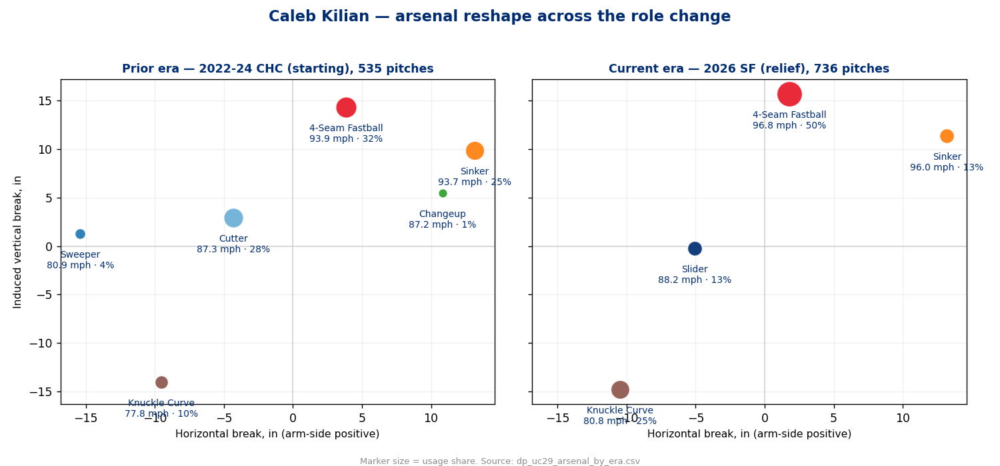
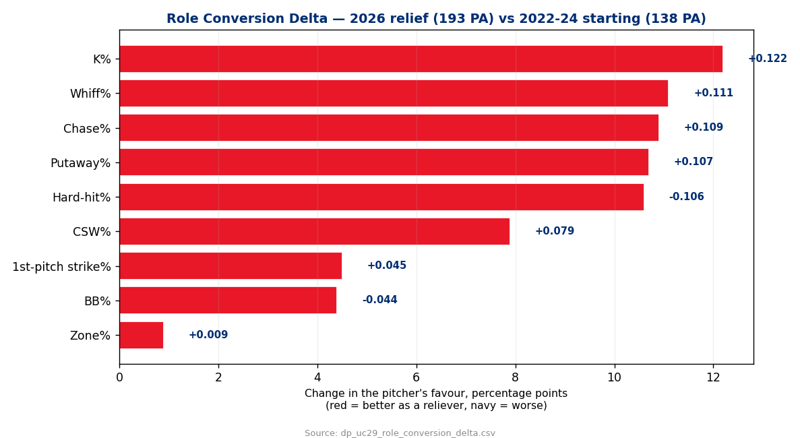
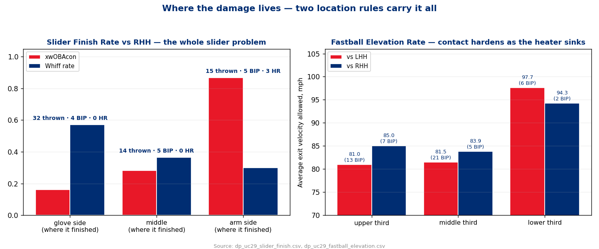
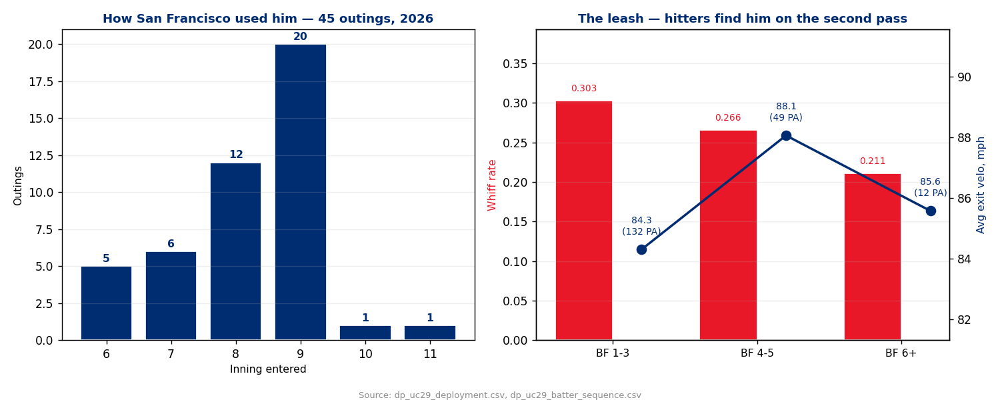

# Acquisition Read — Caleb Kilian (RHP)
### Trade-deadline acquisition · first Phillies work · prepared 2026-08-04 · data through 2026-08-01

**Prepared for:** Don Mattingly (manager) · pitching department · catchers + Kilian (battery) — acquisition onboarding meeting
**Throws:** R · **Age-cohort:** MLBAM 668873 · **Arsenal:** 4 pitches (4-seam, knuckle curve, slider, sinker)
**Governance:** Use Case #30 (`uc-pps-024`), build `dp_uc29`. Locked KPIs inherited verbatim from `dp_uc28` (Painter). Three new KPIs specified before use: **Slider Finish Rate**, **Fastball Elevation Rate**, **Role Conversion Delta**. `xwOBAcon` is the DQ-hardened balls-in-play definition adopted from `uc-pps-021` open item O1 — the contaminated pitch-level column is not cited anywhere in this report.

> ⚠️ **Read this first — data window & sample sizes.**
> • **Source:** `data/opponents/kilian.parquet`, entity-locked to `pitcher == 668873`, regular season only, deduped on game/at-bat/pitch. 1,271 pitches total.
> • **Two eras, never blended.** *Current tier* = 2026 San Francisco, relief: **736 pitches / 193 PA / 45 outings.** *Prior tier* = 2022-24 Chicago, starting: **535 pitches / 138 PA / 8 outings.** The prior tier exists to size what the role change did. It does not describe the pitcher you just acquired.
> • **2025 is a true gap.** No MLB service; this repo holds no Sacramento minor-league cache. It is recorded as absent and never interpolated. There is no supporting tier for this report.
> • **No opponent dimension.** Kilian has never thrown a pitch for this organization and has no assigned role yet. Opponent modelling is deliberately descoped, not forgotten.
> • **Small cells, named.** Everything below the arsenal level runs thin. Slider vs RHH is **61 pitches / 14 balls in play**. The fastball vertical thirds split contact into cells of **2 to 21 balls in play**. Where a cell is thin this report leads with **exit velocity and raw home-run counts** — which are stable — and treats xwOBAcon as corroboration, with its BIP denominator printed. Do not read a .868 xwOBAcon off 5 batted balls as a rate.
> • **Manual carry-in:** the acquisition itself and any intended role are supplied by the front office, not derived from Statcast.

---

## Bottom line

1. **The bullpen conversion worked, and it is not a small effect.** Every process indicator moved the right way at once: strikeout rate **15.2% → 27.5%**, walk rate **13.8% → 9.3%**, whiff rate **17.7% → 28.8%**, chase rate **21.1% → 32.0%**, two-strike putaway **13.6% → 24.3%**, first-pitch strikes **58.7% → 63.2%**. The four-seamer gained **+2.9 mph (93.9 → 96.8)**. Ten of ten tracked KPIs improved. That is not noise; that is a different pitcher.

2. **He now prevents contact, not damage.** Hard-hit rate fell **46.2% → 35.6%** and average exit velocity **89.8 → 85.3 mph** — real. But xwOBAcon moved only **.370 → .346** (118 balls in play). When hitters do square him up, the ball still leaves at a major-league damage rate. **The value is in the swing-and-miss and the strike-throwing. Do not buy this as a contact-management profile.**

3. **He is a reverse-platoon reliever — and that is the finding the deployment plan hangs on.** He misses far more bats against right-handed hitters (**37.5% whiff vs 22.9%**), yet *all* the damage is there: **all five home runs, 42.2% hard-hit, .410 xwOBAcon (45 BIP) vs RHH**, against **zero home runs in 110 PA, 31.5% hard-hit, .309 xwOBAcon (73 BIP) vs LHH**. The strikeouts say righty-killer. The scoreboard says the opposite. Trust the scoreboard.

4. **One pitch, one location, explains most of it.** Three of his five home runs are sliders to right-handed hitters that **backed up to the arm side** instead of finishing away. Sliders that finished glove-side: **32 thrown, 57.1% whiff, 78.4 mph average exit velocity, zero home runs.** Sliders that backed up: **15 thrown, 30.0% whiff, 98.4 mph, three home runs.** A quarter of his sliders go to the wrong side of the plate and that quarter is his entire slider problem.

5. **The so-what.** This is a **one-inning, front-half-of-the-lineup, left-handed-heavy** weapon with a fixable slider and an already-elite fastball. He is not a closer and the usage log says San Francisco never treated him as one. Deploy him for **four batters, then get him** — the second pass through is where he gets hit. Two clean, teachable fixes (finish the slider, stop the sinker vs lefties) are available before he throws a competitive pitch for this organization.

---

## What the role change actually did

He came up as a six-pitch starter and is now a four-pitch reliever. The cutter — 27.6% of everything he threw in Chicago — is **gone**, and so are the sweeper and changeup. What replaced them is concentration: the four-seamer went from a third of his pitches to **half**, and the knuckle curve from a change-of-pace at 9.6% to a genuine second pitch at **24.7%**.

| Era | Outings | Pitches | PA | K% | BB% | Whiff | Chase | Putaway | Hard-hit | Avg EV | xwOBAcon |
|---|---|---|---|---|---|---|---|---|---|---|---|
| 2022-24 CHC — **starting** | 8 | 535 | 138 | 15.2% | 13.8% | 17.7% | 21.1% | 13.6% | 46.2% | 89.8 | .370 |
| 2026 SF — **relief** | 45 | 736 | 193 | **27.5%** | **9.3%** | **28.8%** | **32.0%** | **24.3%** | **35.6%** | **85.3** | **.346** |

The honest framing: **the strike-throwing and the bat-missing are transformed; the contact quality is only modestly better.** A 24-point xwOBAcon improvement on 118 balls in play is directional at best. Everything else on that row is a genuine step change, and the mechanism is obvious — three fewer pitches to command and three extra miles per hour on the one that matters.

**Season-by-season, so the eight-start prior sample can't hide:**

| Season | Outings | PA | K% | BB% | Whiff | Hard-hit | Avg EV | xwOBAcon |
|---|---|---|---|---|---|---|---|---|
| 2022 | 3 | 57 | 15.8% | 19.3% | 16.7% | 44.1% | 91.1 | .283 |
| 2023 | 3 | 33 | 15.2% | 6.1% | 15.9% | 63.6% | 93.7 | .437 |
| 2024 | 2 | 48 | 14.6% | 12.5% | 20.2% | 37.1% | 86.2 | .411 |
| 2025 | — | — | — | — | — | — | — | *no MLB service — true gap* |
| 2026 | 45 | 193 | 27.5% | 9.3% | 28.8% | 35.6% | 85.3 | .346 |

Eight career starts spread across three seasons is not a baseline anyone should lean on. The 2026 line is the only sample here that clears the 100-BF publishing threshold on its own, and it is the one to plan against.

---

## The arsenal, as it stands today

| Pitch | Usage | Velo | IVB | HB (arm-side +) | Whiff | Chase | Avg EV | BIP | xwOBAcon | HR |
|---|---|---|---|---|---|---|---|---|---|---|
| 4-Seam Fastball | **49.6%** | 96.8 | +15.7" | +1.8" | 19.2% | 27.3% | 84.3 | 54 | .319 | 1 |
| Knuckle Curve | **24.7%** | 80.8 | −14.8" | −10.5" | **42.3%** | 35.7% | 86.2 | 24 | .382 | 1 |
| Slider | 12.9% | 88.2 | −0.2" | −5.1" | **42.6%** | **41.7%** | 88.5 | 17 | .429 | **3** |
| Sinker | 12.8% | 96.0 | +11.4" | +13.2" | 26.7% | 27.8% | 84.3 | 23 | .308 | 0 |

*Usage is computed over **728 tracked pitches** — the 8 `automatic_ball` rows (pitch-timer violations, no pitch thrown) are excluded from every pitch-mix and location denominator in this report, and retained for plate-appearance outcomes.*

**The fastball is the asset.** 96.8 mph with **+15.7 inches of induced vertical break** is a genuine ride-and-elevate pitch, and it plays: **81.0 mph average exit velocity in the upper third against lefties.** It is not a big bat-misser on its own (19.2% whiff) — it is a weak-contact and strike-getting pitch that sets up everything else.

**The knuckle curve is the separator.** A 16-mph gap off the fastball with **−14.8" of vertical break** and −10.5" of glove-side sweep — that is 30 inches of vertical separation from the heater off an identical arm slot. 42.3% whiff. It is the best swing-and-miss pitch he owns.

**The slider is the problem child.** 42.6% whiff and 41.7% chase say weapon. Three home runs on 94 pitches says otherwise. Both are true, and the location section below resolves them.

**The sinker is a situational strike-getter.** Zero home runs, and against right-handed hitters it is genuinely good (80.9 mph exit velocity on 13 balls in play). Against lefties it is the worst pitch in the arsenal — see below.

---

## Where the damage lives — two location rules

### Rule 1 — the slider must finish glove-side (NEW KPI: Slider Finish Rate)

Against right-handed hitters, sorted by where the pitch actually arrived:

| Where it finished | Thrown | Share | Whiff | BIP | Avg EV | HR |
|---|---|---|---|---|---|---|
| **Glove side** (finished away) | 32 | 52.5% | **57.1%** | 4 | **78.4** | **0** |
| Middle | 14 | 23.0% | 36.4% | 5 | 94.3 | 0 |
| **Arm side** (backed up) | 15 | 24.6% | 30.0% | 5 | **98.4** | **3** |

The gap is 20 mph of exit velocity and three home runs, on the same pitch, thrown by the same pitcher, in the same season. When the slider finishes where it is designed to finish, it is one of the better sliders in the game. When it backs up onto a right-hander's inner half, it is batting practice — **and it backs up on one in four.**

Every one of his five home runs, regardless of pitch type, was located on the arm side of the plate (`plate_x` between −0.19 and −0.56 ft). This is not a slider problem so much as a **finish problem that shows up worst on the slider.**

*Sample discipline: 61 sliders and 14 balls in play against RHH. The whiff and exit-velocity readings are the reliable part; the three home runs are a hard count, not a rate. This is a strong signal, not a precise one.*

### Rule 2 — the fastball must be up (NEW KPI: Fastball Elevation Rate)

Average exit velocity allowed, by vertical third of each batter's own strike zone:

| Third | vs LHH | | vs RHH | |
|---|---|---|---|---|
| | **Share / EV (BIP)** | Whiff | **Share / EV (BIP)** | Whiff |
| Upper | 52.9% · **81.0** (13) | 18.8% | 46.4% · **85.0** (7) | 32.4% |
| Middle | 22.9% · 81.5 (21) | 2.9% | 20.3% · 83.9 (5) | 30.0% |
| Lower | 24.2% · **97.7** (6) | 13.3% | 33.3% · **94.3** (2) | 14.3% |

A 16-inch-ride fastball at 97 belongs at the top of the zone, and the numbers agree emphatically: **elevated it yields 81-85 mph contact; down it yields 94-98.** He already elevates about half the time against lefties. Against righties he drops it into the lower third a **third** of the time, and that is the leakiest bucket in the whole report.

*The lower-third cells are 6 and 2 balls in play. Small — but the direction is consistent across both handedness splits and matches what the pitch shape predicts, which is why it earns a place in the plan.*

---

## Approach vs left-handed hitters

**110 PA · .232 BA · 24.5% K · 8.2% BB · 22.9% whiff · 33.5% chase · 31.5% hard-hit · 84.4 mph · .309 xwOBAcon (73 BIP) · ZERO home runs**

Against lefties he is essentially a **two-pitch pitcher**: four-seam **52.7%**, knuckle curve **31.7%** — 84% of everything. The sinker and slider split the remaining 16%.

| Pitch vs LHH | Thrown | Usage | Whiff | Chase | BIP | Avg EV | xwOBAcon | HR |
|---|---|---|---|---|---|---|---|---|
| 4-Seam Fastball | 223 | 52.7% | 13.3% | 27.7% | 40 | 83.7 | .273 | 0 |
| Knuckle Curve | 134 | 31.7% | 35.0% | 37.8% | 20 | 85.1 | .338 | 0 |
| Slider | 33 | 7.8% | 42.1% | 42.1% | 3 | 76.1 | .302 | 0 |
| **Sinker** | 33 | 7.8% | 22.2% | 36.4% | 10 | **88.3** | .398 | 0 |

**How he works them:** heavy fastball in every count (50-56% across all four count states), knuckle curve as the finisher — **36.6% usage with two strikes**, the highest two-strike usage of any pitch to either side. He does not chase strikeouts here; he takes weak contact and lets the curve steal the ones that expand. Chase rate against lefties (**33.5%**) is actually *higher* than against righties, which is why the walk rate is lower on this side.

**The one leak: the sinker.** Thirty-three pitches, ten balls in play, **88.3 mph average exit velocity and a 50% hard-hit rate** — the worst contact quality of any pitch/hand combination in his arsenal. Five of those ten balls in play left the bat at **97 mph or harder**. A 96 mph sinker running arm-side to a left-handed hitter runs *toward* the barrel and flattens out over the plate. It is only 7.7% usage; there is no cost to removing it entirely. Small sample, named as such — but the pitch shape and the outcomes agree, and the pitch is redundant with a better fastball.

---

## Approach vs right-handed hitters

**83 PA · .229 BA · 31.3% K · 10.8% BB · 37.5% whiff · 29.9% chase · 42.2% hard-hit · 86.8 mph · .410 xwOBAcon (45 BIP) · ALL FIVE home runs**

This is where the profile gets interesting, and where the plan needs the most work. He throws a genuine **four-pitch mix** here, and misses bats at an elite clip — **37.5% whiff, 31.3% strikeouts, 31.0% two-strike putaway.** He also gives up all of the damage.

| Pitch vs RHH | Thrown | Usage | Whiff | Chase | BIP | Avg EV | xwOBAcon | HR |
|---|---|---|---|---|---|---|---|---|
| 4-Seam Fastball | 138 | 45.2% | 29.7% | 26.6% | 14 | 85.9 | .470 | 1 |
| Slider | 61 | 20.0% | 42.9% | 41.4% | 14 | **91.2** | .456 | **3** |
| Sinker | 60 | 19.7% | 29.6% | 24.0% | 13 | **80.9** | .232 | 0 |
| Knuckle Curve | 46 | 15.1% | **66.7%** | 30.8% | 4 | 92.0 | .598 | 1 |

**How he works them:** sinker-heavy early (**24.4% on 0-0**, nearly triple the 8.3% he opens left-handers with), then slider as the primary weapon when ahead (**32.9% in ahead/even counts**), then a two-strike split between slider (20.2%) and knuckle curve (33.3%).

**Three things are wrong with that sequence.**

- **The slider is his most-used out pitch here and his most damaging pitch overall.** It works when it finishes and it is a home run when it does not — and it does not, a quarter of the time.
- **The knuckle curve is drastically underused.** 66.7% whiff, and he throws it **15.1%** of the time — against lefties, where it whiffs at half that rate (35.0%), he throws it **31.7%**. He has his usage backwards on his best swing-and-miss pitch. *(46 pitches, 4 balls in play — the whiff figure is the trustworthy part, the contact numbers are not.)*
- **The sinker is his best contact-suppressor against righties (80.9 mph, .232, zero home runs) and he only throws it a fifth of the time** — while using it as a first-pitch pitch rather than a contact pitch when he needs an out.

**The reverse split, honestly stated.** The wOBA-style gap between the two sides is loud, and the underlying gap is loud *in the same direction* — 42.2% vs 31.5% hard-hit, 86.8 vs 84.4 mph, .410 vs .309 xwOBAcon. When results and process agree, the split is real. What keeps it from being conclusive is size: **83 PA and 45 balls in play against righties**, and five home runs is a count that can move a rate by a lot. Treat it as a strong prior that shapes deployment, not as a settled platoon coefficient. **Re-test it at 150 PA in Phillies uniform.**

---

## For the pitching department — the development plan

He arrives having never worked with this staff. Three interventions, in priority order, all of which are location or usage changes rather than mechanical rebuilds:

1. **Fix the slider finish. Highest value, most teachable.** A quarter of his sliders to right-handed hitters arrive on the arm side. That quarter carries three of his five home runs and 20 mph more exit velocity than the ones that finish. This is a release-and-intent fix — the pitch shape (88.2 mph, −0.2" IVB, −5.1" HB) is fine, the finish is not. Track **Slider Finish Rate** in bullpens: the target is moving glove-side finish from **52.5% toward 70%+** and cutting arm-side arrivals below 15%.

2. **Re-weight the arsenal against right-handed hitters.** Knuckle curve up from 15.1% (it whiffs at 66.7% and he barely uses it), slider down from 20.0% until the finish is fixed, sinker up in two-strike and contact-needed spots. The pitches are already good; the distribution is wrong.

3. **Retire the sinker against left-handed hitters.** 7.8% usage, 50% hard-hit, 88.3 mph. Redundant with a better fastball. Replace those 33 pitches with elevated four-seamers and the profile against lefties gets cleaner at zero cost.

**Also worth logging:** fastball elevation against righties. He goes to the lower third **33.3%** of the time there versus 24.2% against lefties, and the lower third is where his contact quality collapses on both sides. Elevation discipline is a bullpen-session metric, not a game-plan one, but it belongs on his card.

**What not to touch.** The velocity is stable and needs no management — monthly four-seam averages run **96.8 (Apr), 96.5 (May), 97.1 (Jun), 96.8 (Jul), 97.4 (Aug)** with no fade, and on two-inning outings the second inning comes in at **96.2** against 96.8 in the first. He is not a fatigue case. Whiff rate, chase rate and zone rate are flat across all five months. There is no trend to chase here, in either direction.

---

## For the battery — the pitch-selection card

**The single attack rule:** *Fastballs up, breaking balls glove-side, and never let the slider drift back over the arm side to a right-handed hitter.*

**Vs LHH — ride and drop.**
- Four-seam **up** — the upper third is 81.0 mph contact, the lower third is 97.7. There is no reason to go down here.
- Knuckle curve is the finisher: 35.0% whiff, 37.8% chase, and he already goes to it 36.6% with two strikes. Keep that.
- Slider is a fine change-of-pace glove-side (42.1% whiff on 33 pitches). Fine to keep at low usage.
- **Sinker: shelve it.** 50% hard-hit, 88.3 mph on 10 balls in play. Nothing it does here the four-seam doesn't do better.

**Vs RHH — expand, don't challenge.**
- Sinker or four-seam to open — he throws first-pitch strikes **62.7%** of the time on this side, and the sinker is his cleanest contact pitch here (80.9 mph, .232).
- **Knuckle curve is the out pitch, not the slider.** 66.7% whiff. Get it to 25-30% usage, especially with two strikes. Directional on 46 pitches, but it is the highest whiff figure in the entire report and he is under-using it by half.
- Slider **only glove-side, only below the belt.** In the lower half of the zone it's 86.8 mph exit velocity and one home run on 47 pitches; in the upper half it's **99.1 mph** and two home runs on 14. If he can't finish it that day, take it out of the plan for that outing.
- **Never the fastball to the lower third.** 94.3 mph average exit velocity on this side.

**Count-state notes for the catchers.** He is fastball-first everywhere (52-55% on 0-0 to both sides), and he does not lose the zone when behind — **48.1% zone rate overall, 63.2% first-pitch strikes**, and when he falls behind he goes to the four-seam 52-56% of the time to both sides. That is a reliever you can call a fastball for in a 2-0 count without holding your breath. The 9.3% walk rate is average, not a problem, and it's the *lefty* side (8.2%) that's tidier.

**For Kilian himself, in one line:** *the stuff is already there — the fastball plays at the top and the curve is a real out pitch. The whole gap between your strikeout rate and your run prevention is one pitch that doesn't finish.*

---

## For the manager — how to use him

**How San Francisco used him: 45 outings, 16.4 pitches and 4.3 batters per appearance, one inning 37 times and two innings 8 times.**

**He was not a closer, and the log is unambiguous about it.** He entered in the ninth 20 times — but of those, **thirteen came up two-or-more runs** and only **two came with a one-run lead**. Across all 45 outings the entry score state was: up 4+ (11), up 2-3 (11), tied (9), down 5+ (5), down 1 (4), down 2-4 (3), up 1 (2). That is a **clean-inning, comfortable-margin** usage pattern on a losing team — closer innings without closer leverage.

**Four recommendations:**

1. **One inning, four batters, then get him.** This is the firmest deployment finding in the report and it does not depend on the platoon question. Through his first three hitters he runs a **30.3% whiff rate and 84.3 mph average exit velocity (132 PA)**. On batters four and five that becomes **26.6% whiff and 88.1 mph (49 PA)**. Velocity is *identical* across those buckets (96.7 / 97.0 mph) — this is not fatigue, it is hitters getting a second look at a four-pitch mix in one sitting. **Extending him to a fifth and sixth batter costs about four miles per hour of contact quality.**

2. **Point him at left-handed-heavy stretches of the order.** This is the counterintuitive one and it will fight the strikeout column. He has faced **110 left-handed hitters without allowing a home run**, with a 31.5% hard-hit rate and .309 xwOBAcon. Against righties he strikes out more (31.3%) and gives up everything else (all five homers, 42.2% hard-hit). If a lineup spot forces a choice, **give him the lefties.** Re-check this at 150 PA in red pinstripes before treating it as permanent.

3. **He can hold a lead but shouldn't be asked to protect a one-run ninth yet.** Sixth or seventh inning bridge, the eighth with a two-plus-run cushion, or a two-inning middle-relief block are all well inside what he has already done. The home-run risk against right-handed hitters is a genuine one-swing exposure in a tie or one-run game, and the slider fix should land before that exposure gets tested.

4. **He is available often, and he can go multiple.** Eight of his 45 outings came on one day's rest and fourteen on two; he handled two innings eight times with essentially no velocity loss (**96.8 → 96.2 mph**). His longest outing was 35 pitches (six batters); his largest batter workload was seven, reached three times. He also entered with **inherited runners 13 times**, so the mid-inning role is not new to him — though note that the second-pass finding argues against using him as a long man on nights the game is still live.

**The role that fits, in one sentence:** *a one-inning, left-handed-leaning setup arm you can use three times a week and stretch to two innings when the schedule demands — with a clear path to higher leverage the moment the slider starts finishing.*

---

## Candid data-window & freshness caveats

- **Cache freshness:** `data/opponents/kilian.parquet` runs through **2026-08-01**, three days before this report. Any appearance after that date is not in these numbers.
- **The 2026 sample clears the bar; nothing beneath it does.** 193 PA passes the 100-BF publishing threshold for a pitcher. The **platoon splits (110 / 83 PA)** and every **pitch-by-hand cell (3-40 balls in play)** do not. Cells are printed with their denominators throughout precisely so no one quotes a .598 xwOBAcon off four batted balls.
- **The prior-era comparison is eight starts across three seasons.** It passes 100 BF on a technicality (138 PA) and should be read as "what he looked like as a starter," not as a stable baseline. The Role Conversion Delta receipt flags this explicitly.
- **2025 does not exist in this data product.** No MLB service, no minor-league cache for Sacramento in this repo. There is no bridging tier between the 2024 starter and the 2026 reliever, so the conversion is measured across a two-year gap that includes an unobserved developmental season. **This is the single largest interpretive limitation in the report** — some unknown share of the improvement happened in 2025 where we cannot see it.
- **No Phillies data exists for this pitcher**, by definition. Everything here is San Francisco and Chicago usage against National and American League opponents, in those parks. Park and catcher effects are unmodelled.
- **No opponent dimension.** No role has been assigned and no next opponent exists. A follow-on `uc-pps` should add the matchup layer once he has a defined role.
- **Eight untracked pitches excluded from pitch-mix and location numbers.** The 2026 feed carries 8 `automatic_ball` rows — pitch-timer violations where no pitch is thrown, so pitch type, zone and location are all null. They count as balls toward plate-appearance outcomes and are excluded from every usage share and location denominator. **Published usage rates use 728 tracked pitches, not 736.** *(New DQ finding this session.)*
- **Zone rate is published on the strict definition (48.1%), not the locked one (48.6%).** The inherited `chase_rate()` derives in-zone rate as `(pitches − out-of-zone) / pitches`, and a null zone is not "out of zone" — so those 8 untracked rows land in the in-zone numerator and inflate the rate by half a point. The locked function was **not modified** (inheritance rule); a strict variant is published alongside it, exactly as `xwobacon` supersedes the contaminated pitch-level column. **Logged as open item O2 for repo-wide resolution.**
- **`launch_speed` is populated on 114 foul balls in this feed**, not only on balls in play. Every exit-velocity figure in this report filters to `type == 'X'`. An earlier draft of the slider vertical-half table did not, and read 6-7 mph low; it was caught by independent verification and corrected. Flagging it because the same trap will catch any future UC that averages `launch_speed` without the filter.
- **xwOBAcon is the balls-in-play definition** (`estimated_woba_using_speedangle` averaged over `type=='X'` only), adopted from the `uc-pps-021` hardening. The contaminated pitch-level column is quarantined and is not cited anywhere above. This closes open item **O1** for this UC's scope.
- **Batted-ball fields are ~31% populated across all pitches** — expected, since they only exist on contact. On balls in play they are >99% complete. Bat-speed and swing-path fields are 46% populated and are excluded from every published KPI.
- **All five home runs came in a six-week window (2026-04-11 to 2026-05-29)** and none since. That is either a fixed problem or a small sample; **1,271 pitches cannot tell you which.** The slider-finish mechanism is the reason to believe it's fixable, not the home-run drought.

**Artifacts:** build script `dp_uc29_kilian_acquisition_read.py` · 17 CSV receipts + 4 figures in `out/` · governance trail `00_`–`07_` in this folder · use-case contract `uc-pps-024-Caleb Kilian PHI 20260804.md` · independent verification `dp_uc29_verification.py`.

**Closure step:** re-run this read at **150 PA in Phillies uniform** to re-test the reverse platoon split and measure Slider Finish Rate against the 70% target.
