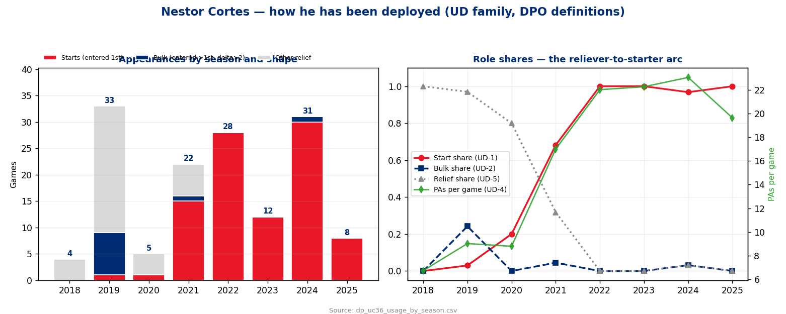
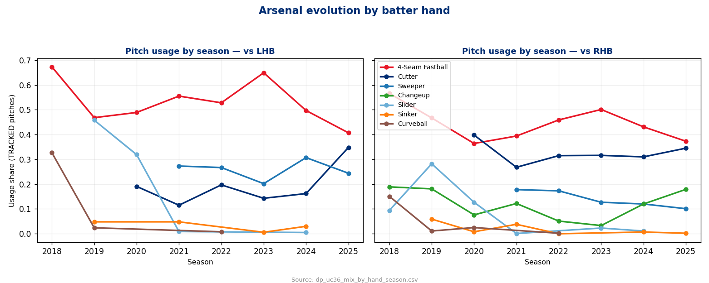
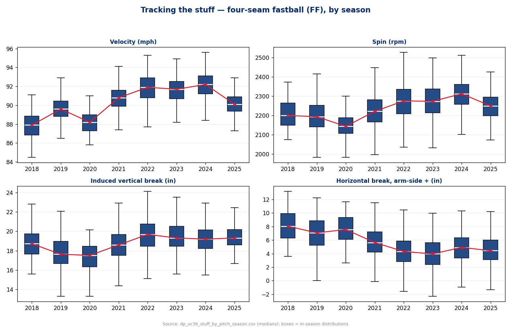
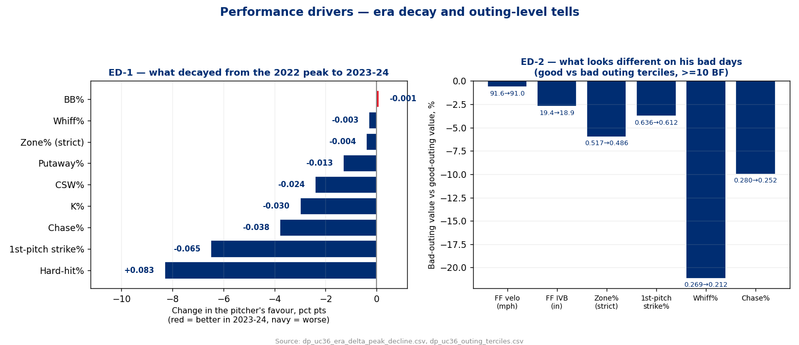
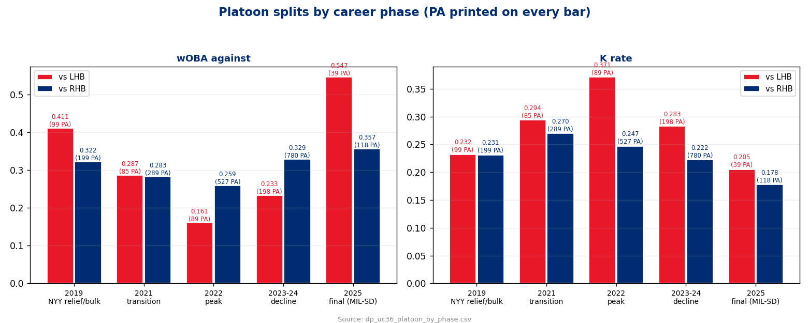

# Acquisition Read — Nestor Cortes (LHP)
### Signed by the Phillies 2026-08-19 · 1-yr prorated major-league deal · returning from arm surgery · the pre-return baseline

**Prepared for:** manager / battery / pitching department — onboarding dossier, not an opponent attack plan
**Throws:** L · **Arsenal (2023-25):** 4-Seam, Cutter, Sweeper, Changeup (+ trace Sinker/Slider)
**Governance:** Use Case #37 (`uc-pps-026`) · build `dp_uc36` · KPIs inherited verbatim from the dp_uc29/dp_uc30 acquisition chain · NEW: UD deployment family (UD-1..6, DPO-supplied definitions) · third acquisition-onboarding read, first that is also a return-from-surgery read

> ⚠️ **Read this first — data window & sample sizes.**
> - Source: `data/opponents/cortes.parquet`, entity lock `pitcher == 641482`, career 2018-03-31 → 2025-09-03, regular-season rates only. Postseason (incl. the 2024 World Series) is context, never blended.
> - **He has thrown zero competitive pitches since 2025-09-03.** Arm surgery mid-Oct 2025 (type not publicly specified — not guessed here). **2026 is a true gap.** Everything below is a baseline to measure his return against, and says so wherever it matters.
> - 2025 is 8 games / 157 PA and was already injury-interrupted (MIL 2 starts Mar–Apr → four-month gap → SD 6 starts Aug–Sep). **Every 2025 number prints its PA.**
> - 2023 is a 12-start injury season (266 PA). His last sustained relief work is 2019–21 — leverage evidence is era-dated and flagged as such.
> - Manual carry-ins: signing date/terms, **Brian Keller DFA'd for the 40-man spot (DPO correction to the intake doc)**, surgery timing, 2022 All-Star selection, reported expectation of a multi-inning role.

---

## Bottom line

1. **He has done every job the Phillies might ask — and the bulk job specifically.** 2019: 33 appearances, 24.2% bulk share (8 bulk outings by the DPO's definition) plus long relief. 2021: live conversion year (15 starts of 22 games). 2022 on: a starter, full stop (78 of 79 appearances were starts, 2022–25). The six-man-rotation / bulk conversation is not a projection — it's his résumé.
2. **The lefty edge is real and it survived the decline.** Career vs LHB .301 wOBA (533 PA) vs RHB .309 (1,961 PA) looks neutral — but since 2022 it isn't: **.161 wOBA vs LHB in 2022 (89 PA, 37.1% K)** and **.233 vs LHB across 2023-24 (198 PA)** while RHB did the damage (.329, 780 PA). The decline was a right-handed-batter problem, not a lefty one.
3. **What decayed from the 2022 peak was contact management and the first pitch, not the swing-and-miss.** 2022 → 2023-24: hard-hit% **+8.3 pts** (34.7→43.0), xwOBAcon .321→.360, first-pitch-strike% **−6.5 pts** (67.2→60.7), chase −3.8 pts. Whiff (24.5→24.2) and zone rate (51.4→50.9 strict) barely moved. The stuff still missed bats; the misses over the plate got punished harder, and he stopped winning pitch one.
4. **The number to watch on his return is 92, not 19.** His four-seam ride is stable (IVB ~19.3 in every year since 2022). His velocity is not: 92.1 mph across 2024 (climbing to 92.7 by September), then **90.1 in the injury-broken 2025** — a two-mph drop that predates the surgery. If the rebuilt arm gives back 91.5+, the 2022-24 profile is live; at 90, the 2025 damage profile (.440 xwOBAcon, 46.2% hard-hit, 157 PA) is the honest prior.
5. **So what:** deploy him as a **multi-inning/bulk lefty on a two-pass leash (≈18 BF)** while the velocity answers the question, spot him at left-handed stretches on merit, and treat a one-run ninth as earned later, not assumed now. The specific persona plans are below.

## How he has been deployed — the UD family (Business Question 1)

| Season | G | Starts | Bulks | Start share | Bulk share | Relief share | IP/gm (delta) | PA/gm | Role label |
|---|---|---|---|---|---|---|---|---|---|
| 2018 (BAL) | 4 | 0 | 0 | .000 | .000 | 1.000 | 0.50 | 6.8 | relief-heavy |
| 2019 (NYY) | 33 | 1 | 8 | .030 | **.242** | .970 | 1.45 | 9.0 | bulk/hybrid |
| 2020 (SEA) | 5 | 1 | 0 | .200 | .000 | .800 | 0.80 | 8.8 | relief-heavy |
| 2021 (NYY) | 22 | 15 | 1 | .682 | .045 | .318 | 3.50 | 17.0 | bulk/hybrid |
| 2022 (NYY) | 28 | 28 | 0 | 1.000 | .000 | .000 | 5.04 | 22.0 | start-heavy |
| 2023 (NYY) | 12 | 12 | 0 | 1.000 | .000 | .000 | 4.83 | 22.3 | start-heavy |
| 2024 (NYY) | 31 | 30 | 1 | .968 | .032 | .032 | 4.94 | 23.0 | start-heavy |
| 2025 (MIL→SD) | 8 | 8 | 0 | 1.000 | .000 | .000 | 3.75 | 19.6 | start-heavy |

*IP/gm is the DPO's delta definition (exit inning − entry inning); innings-appeared ships alongside in the receipt. The DPO's notebook classification reproduces exactly — this table is that analysis, kernel-computed and receipted.*

The arc the use case hypothesized is confirmed and sharpened: reliever with real bulk work (2019) → transition (2021) → pure starter (2022-25). Two details matter for 2026. First, his 2019 bulk outings were genuine multi-inning stints behind another pitcher — the exact shape the reporting expects him to fill now. Second, **his 2025 starts averaged only 75 pitches (range 57–90)** — even before surgery he was being run at bulk length, not workhorse length.

## What he throws, and to whom (Business Question 2)

**vs LHB (2023-25, 877 tracked pitches):** three pitches — four-seam 51.2%, sweeper 27.7%, cutter 18.7% — and **68.5% of everything lives glove-side (away)**, exactly the pattern the DPO's own figure flagged. The sweeper is the weapon: .247 xwOBAcon, 35.1% whiff. The four-seam is the current problem: **.457 xwOBAcon, 61.4% hard-hit, 7 of the 10 HR he has allowed to LHB since 2023** — when a LHB gets the heater, he hasn't missed it lately.

**vs RHB (2023-25, 3,639 tracked pitches):** a four-pitch look — four-seam 44.1%, cutter 31.6%, changeup 10.6% (arm-side away, mean plate_x +0.87), sweeper 12.0%. Two-strike RHB see changeup 15.1% (32.7% whiff — his best RHB putaway) and four-seam 47.7%. When behind vs RHB he leans cutter (44.8%) — a scoutable tell. The sweeper vs RHB is his riskiest offering (.409 xwOBAcon).

| Split | PA | wOBA | K% | Whiff% | Hard-hit% | xwOBAcon |
|---|---|---|---|---|---|---|
| **2022 peak** vs LHB | 89 | **.161** | 37.1% | 33.0% | 32.7% | .309 |
| 2022 peak vs RHB | 527 | .259 | 24.7% | 23.1% | 35.0% | .323 |
| **2023-24** vs LHB | 198 | **.233** | 28.3% | 29.4% | 38.2% | .320 |
| 2023-24 vs RHB | 780 | .329 | 22.2% | 23.0% | 44.2% | .369 |
| 2025 vs LHB | **39** | .547 | 20.5% | 21.0% | 71.4% | .678 |
| 2025 vs RHB | 118 | .357 | 17.8% | 26.3% | 37.2% | .355 |

The 2025 vs-LHB line is ugly and it is **39 PA in an injury-broken season — directional only, don't over-read it.** The 287-PA post-peak lefty record (2023-24) is the better evidence, and it says the platoon edge held.

## The stuff, and what was trending before the injury (Business Question 3)

| FF by season | Pitches | Velo | Spin | IVB (in) | HB (in) | Whiff% | xwOBAcon |
|---|---|---|---|---|---|---|---|
| 2019 | 607 | 89.6 | 2189 | 17.8 | 6.9 | 26.5% | .461 |
| 2021 | 653 | 90.7 | 2223 | 18.6 | 5.6 | 23.1% | .370 |
| 2022 | 1,155 | 91.8 | 2270 | 19.5 | 4.5 | 25.8% | .324 |
| 2023 | 560 | 91.6 | 2273 | 19.4 | 4.1 | 25.1% | .314 |
| 2024 | 1,266 | 92.1 | 2309 | 19.2 | 4.9 | 21.5% | .378 |
| **2025** | **228** | **90.1** | 2248 | 19.3 | 4.5 | 19.4% | .513 |

Three reads, in order of importance:

1. **Velocity is the injury tell and the return cue.** The DPO's intake said "he is slowing down but not particularly fast" — half right. He was actually *gaining* velo through 2024 (monthly receipt: 91.5 in April 2024 → 92.7 in September 2024). Then 2025 opened at 90.6 (MIL), and the post-layoff SD stint sat 90.1 with his final start at 89.5. **The two-mph gap between late-2024 and 2025 is the single most important number in this product.**
2. **The ride is his identity and it never wavered.** IVB has been 19.2–19.5 since 2022 — flat through the decline and flat through the injury year at ~19.3. Shape survived; the engine didn't. That is the optimistic read for a surgical return: the pitch design needs no rebuild.
3. **The mechanical drift is real and worth a baseline.** Arm angle has climbed steadily (45.1° in 2022 → 48.7° 2023 → 51.2° 2025) and his release point has moved ~0.9 ft toward the center line (release_pos_x 1.97 → 1.11) and ~0.4 ft higher since 2019. None of this is flagged as a defect — Cortes famously manipulates slots — but the department should photograph his post-surgery slot against this receipt (`dp_uc36_mechanics_by_season.csv`) in his first bullpens.

## What drives his good and bad stretches (Business Question 4)

**Era level (2022 peak → 2023-24, 616 vs 978 PA):** the decline signature is hard-hit% +8.3 pts, xwOBAcon +.039, first-pitch-strike% −6.5 pts, chase% −3.8 pts, K% −3.0 pts — while whiff, zone rate and BB% held. He didn't lose the ability to miss bats; he lost the ability to *manage the contact he allowed* and stopped stealing pitch one.

**Outing level (114 career outings ≥10 BF, terciled by wOBA-against):** his bad days carry a legible signature — whiff .269→.212 (−21% relative), zone-strict .517→.486, FF velo 91.6→91.0, chase .280→.252, hard-hit .355→.426. **The in-game tell is whiffs and zone, not radar-gun collapse** — velo moves only ~0.6 mph between his best and worst days, but the swing-and-miss evaporates.

**Season co-movement (receipt `dp_uc36_season_indicators.csv`):** across his eight seasons, wOBA-against tracks hard-hit%/xwOBAcon and FPSR far more tightly than it tracks velo or whiff — consistent with both reads above. Eight seasons is eight data points; this is ranked co-movement, not inference.

## Platoon summary figure

## The persona plans

### Manager — deployment

1. **Bulk/multi-inning first, rotation later.** His 2019 season is a proven template (8 bulk outings), his 2025 starts were already ~75-pitch outings, and there is no 2026 game data to justify more. A six-man-rotation slot is the *destination* if velocity returns; the stretch-run role is 2-4 innings behind a starter or opener.
2. **Two passes, then get him.** Career TTO: .280 wOBA first time through (855 PA) → .305 second (814) → .334 third-plus (400). Velocity holds through the order (91.6/91.5/91.6) — the fade is familiarity, not fatigue. An 18-BF leash captures his best.
3. **High-leverage lefty innings: earn, don't assume.** The platoon case is real (bottom line 2), but his relief-leverage résumé is thin and old — of 47 relief entries 2019-21, only 12 came in one-run-margin or tied states; most were mop-up shapes. Use him at left-handed stretches inside his bulk outings first; a defined late-inning role should wait for post-return evidence. *(Profile-driven, not H2H-driven — and it says so.)*
4. **Rest: no signal to plan around.** wOBA-against by rest before starts: 4 days .276 (37 GS), 5 days .303 (39), 6+ .343 (18). No measurable benefit to extra rest in the record — routine over rest.
5. **The Freeman clause.** The use case asked, so the receipt exists: 2024-10-25, World Series, 10th inning, first pitch, 92.2-mph four-seam — grand slam. Postseason context only. The serious version of the joke is bottom line 4: that pitch was thrown at 92; don't ask the 90-mph version of him for it.

### Battery — pitch selection

1. **vs LHB: sweeper-first mentality, fastball as the change of eye level.** The sweeper (.247 xwOBAcon, 35.1% whiff) should be the identity pitch away; the four-seam at 51% usage is carrying .457 xwOBAcon and 7 HR — cut its share, and when it goes, go up, not middle-away at the belt.
2. **vs RHB: cutter-in, changeup-away, four-seam up.** The changeup is the two-strike putaway (32.7% whiff); keep it arm-side low (its lived location, +0.87 ft). Don't fall into the behind-in-the-count cutter tell (44.8% when behind).
3. **First pitch is the fix with the highest leverage.** Peak FPSR .672 → decline .607. His whole decline-era profile improves if pitch one lands; nothing about it requires velocity.

### Pitching department — monitoring cues

1. **Velo band:** 2024 baseline 92.1 (Sept 92.7); 2025 pre-surgery 90.1. **Green ≥91.5, yellow 90.5-91.5, red <90.5** on the four-seam, measured over rolling 50-pitch windows in rehab/bulk outings.
2. **Shape check:** IVB ~19.3 in is his signature — any post-surgery reading below ~18.5 is a mechanical flag even if velo looks fine.
3. **Slot baseline:** arm angle has drifted 45°→51° over three years; capture his first post-surgery bullpens against `dp_uc36_mechanics_by_season.csv` and decide *on purpose* which slot is being rebuilt.
4. **In-game health proxy:** his bad-day signature is whiff/zone decay at near-normal velo. A 90+ radar reading is not, by itself, evidence he's right.
5. **Two developmental levers that don't need the arm:** first-pitch strike restoration (−6.5 pts from peak) and the four-seam-to-LHB usage cut (battery item 1).

## Candid data-window & freshness caveats

- **2026 true gap:** no competitive pitches since 2025-09-03; surgery mid-Oct 2025, procedure not publicly specified and not guessed. This is a pre-return baseline, not a current-form read.
- **2025 = 8 G / 157 PA**, itself split MIL(2)/SD(6) around a four-month in-season gap. Directional everywhere it appears; PA printed.
- 2023 is a 12-start injury season; "2023-24 decline" carries 978 PA total and is the product's best decline evidence.
- Relief-leverage evidence is 2019-21 vintage under different rules and roles.
- ERA/IP/saves are not derivable in this repo for this pitcher (no `gms_AI`); the deployment story runs on appearance-grain KPIs instead.
- Locked-function hygiene: published zone rate is the strict (tracked-population) variant; every EV mean is BIP-only; xwOBAcon is BIP-only (O1/O2/O3 hardenings inherited).
- Postseason (D .283 wOBA/42 PA · L .457/11 · W .256/8) is context and never blends into rates.
- Receipts for every number: `out/dp_uc36_*.csv` (28 files) · figures 1-5 · DQ scorecard (29 checks, 0 FAIL, 1 WARN — a sample-size disclosure) · freshness manifest with all manual carry-ins.
- **Closure step:** re-run and grade this baseline at his first 100 Phillies batters faced (or after 3 rehab outings if a MiLB cache lands). The three falsifiable calls to grade: velocity band determines results; the lefty edge holds; first-pitch strike rate is the leading indicator of outing quality.
