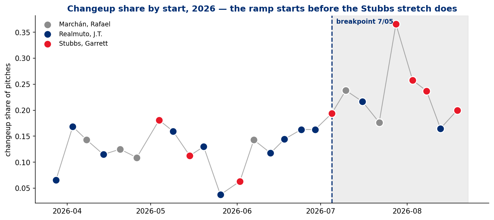
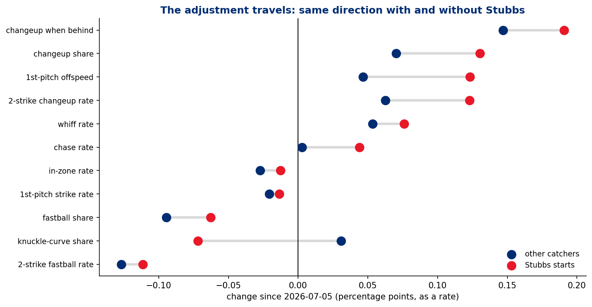
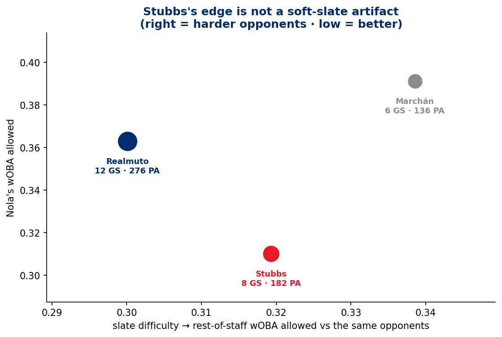
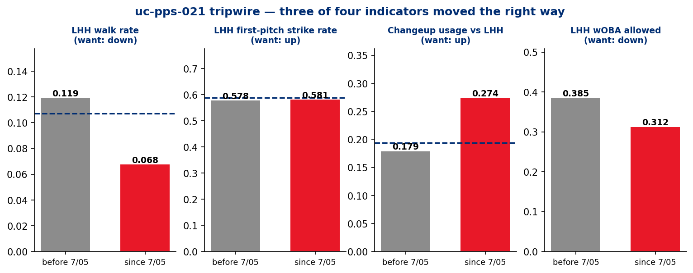

# The Battery — Aaron Nola and Garrett Stubbs

### Game-planning under a changed catcher · PHI @ SEA · T-Mobile Park · Wednesday, August 26, 2026 · UC #38 · `uc-pps-027` · `dp_uc38`

**Prepared for:** pitching coach · catching coordinator · Nola · Stubbs · advance group
**Throws:** R · **Arsenal:** 6 pitches (knuckle curve, 4-seam, sinker, changeup, cutter, slider)
**Fifth extension of the Nola advance file:** UC8 → UC15 → UC25 (`uc-pps-021`) → UC35 (`uc-pos-012`) → **UC38**
**First delivered consumer of** `uc-cat-001` (catcher game-calling philosophy)

---

> ### ⚠️ Read this first — three constraints that shape every claim below
>
> **1 · Pitch-call attribution is not in the data.** Statcast carries no PitchCom sender field.
> This product measures **what was thrown**, never **who chose it**. The unit of analysis is
> *the battery*, never a person. Where the report reasons about who is driving a change, it
> does so from a **design** (does the change appear without Stubbs?), not from an attribution
> field that does not exist. Glossary term **AT-1**; guardrail **G4**; receipt
> `dp_uc38_attribution_guard.csv`.
>
> **2 · Catcher assignment is not random.** Stubbs is the backup. His starts differ in
> opponent, venue, rest and date. A confound panel ships with every split
> (`dp_uc38_confound_panel.csv`) and an opponent-difficulty control ships beside it
> (`dp_uc38b_catcher_opponent_difficulty.csv`). Guardrail **G3**.
>
> **3 · The samples are small and they are printed.** Stubbs has caught Nola **31 times in
> four seasons**, **8 of them in 2026**. Every rate in this report rides with its PA or pitch
> count. Floors are **flags, not filters** (**G5**).
>
> **Data window.** `data/phillies/phils_2015..2026.parquet`, entity-locked to **MLBAM 605400**
> (not Nolan Hoffman 676510), regular season only, deduped on
> `game_pk+at_bat_number+pitch_number`. **29,499 pitches · 311 starts · 2015–2026.** Fresh
> through Nola's most recent start, **2026-08-19**; the frame itself runs through **2026-08-24**.
> `fielder_2` (the catcher CDE) is **0.0000% null**. Tonight's start and the Stubbs pairing are
> **DPO prose, not a posted lineup** — confirm before first pitch.

---

## 1 · Bottom line

**1 · The game plan did change — and it is Nola's change, not Stubbs's.**
Since **July 5** the battery throws a materially different game: changeup share **12.7% → 22.8%**,
two-strike fastball rate **47.8% → 35.4%**, changeup-when-behind **12.5% → 28.2%**, first-pitch
offspeed **12.4% → 21.2%**. The decisive test is whether that change *travels*: **10 of 12
approach metrics move in the same direction inside the Stubbs starts and inside the non-Stubbs
starts**. On two of them — the two-strike fastball retreat and the first-pitch-strike dip — the
**non-Stubbs move is larger**. An adjustment that survives a change of catcher is a **pitcher-level**
adjustment. With PitchCom on Nola's belt, that is consistent with him driving it; the data
cannot confirm that, and does not need to in order to rule out "Stubbs changed the plan."

**2 · What Stubbs adds is *degree*, not direction.** He carries the most extreme version of the
same plan — changeup **25.0%** in his starts since 7/5 vs **19.8%** for the others, two-strike
changeup **21.6%** vs **15.0%**, first-pitch offspeed **24.2%** vs **17.2%**. Two things do *not*
travel: with Stubbs the **knuckle curve retreats** (34.2% → 27.0%) while it *rises* for everyone
else (34.1% → 37.2%), and **chase rate climbs 4.4 pts** against a flat 0.3. Both are honest
candidates for a battery effect. Both are thin: the curve retreat is **two starts** (7/28 and
8/3 at ~20%; 8/8 and 8/19 are back at 28.9% and 34.0%).

**3 · The results follow, and the opponent control survives.** In 2026 Nola's wOBA allowed is
**.310 with Stubbs (8 GS, 182 PA)** against **.363 with Realmuto (12 GS, 276 PA)** and **.391 with
Marchán (6 GS, 136 PA)**. The obvious objection — Stubbs draws the soft slate — is **wrong**: the
rest of the Phillies staff allowed **.319** against Stubbs's opponents and **.300** against
Realmuto's. Stubbs's slate was the **harder** one.

**4 · But the career panel says: careful.** Across four seasons the battery is a **coin flip** —
Stubbs **.307** (31 G), Realmuto **.300** (161 G). In **2024**, when the two split Nola's starts
**16–16**, they landed on **.315 (Stubbs)** and **.304 (Realmuto)**. The 2026 gap is **new**. It is
either a real change in the pairing or an 8-start sample doing what 8-start samples do — and
this design cannot tell you which.

**5 · The `uc-pps-021` prescription was adopted, and three of its four tripwires moved.**
The July 22 report prescribed leaning on the changeup to lefties and finishing with the
secondary. Since then: **changeup vs LHH 17.9% → 27.4%**, **LHH walk rate 11.9% → 6.8%**,
**LHH wOBA .385 → .313**. The fourth did not move: **first-pitch strike rate to lefties is
57.8% → 58.1%.** He is not getting ahead of lefties — he is **escaping** them with the changeup.
That is a fix downstream of the problem, and it is the fragility to watch tonight.

**6 · The bill is coming due on the other side.** Against righties since 7/5 the changeup is new
(4.5% → 12.7%) and it is costing him: **walk rate 1.9% → 7.4%**, **wOBA .340 → .369**. And the
damage channel the whole 2026 file has flagged is **not fixed** — home runs per PA is **5.6%
since 7/5**, above the .050 that preceded it. **The strikeouts are real. The damage is not solved.**

---

## 2 · Exposure — how much battery is there to read?

Before any rate is trusted, this is the denominator.

| Battery | Starts | Pitches | PA | Seasons | wOBA allowed |
|---|---:|---:|---:|---|---:|
| Realmuto, J.T. | 161 | 15,277 | 3,926 | 2019–2026 | **.300** |
| Rupp, Cameron | 47 | 4,297 | 1,171 | 2015–2018 | .290 |
| Alfaro, Jorge | 33 | 3,180 | 818 | 2016–2018 | .253 |
| **Stubbs, Garrett** | **31** | **2,971** | **764** | 2022–2024, 2026 | **.307** |
| Knapp, Andrew | 25 | 2,213 | 561 | 2017–2021 | .265 |
| Marchán, Rafael | 14 | 1,250 | 313 | 2020–2026 | .386 |
| Ruiz, Carlos | 4 | 311 | 82 | 2015 | .419 |

*Receipt: `dp_uc38_battery_career.csv`. Identity resolution: `dp_uc38_catcher_identity.csv` —
7 ids, 0 unresolved, 0 cross-check disagreements.*

Two facts to hold on to.

**Stubbs did not catch Nola at all in 2025.** His book is 4 starts (2022), 3 (2023), **16 (2024)**,
and 8 (2026). "Prior work with Stubbs" is mostly a **2024** conversation, and the pitcher who
threw those 16 starts is not the pitcher who takes the ball tonight.

**The 2026 shift is real and recent.** Stubbs caught **3 of Nola's first 17 starts (18%)** and
**5 of the last 9 (56%)** — **4 of the last 5**. That is the pairing the DPO is describing, and it
is six weeks old.

*Receipt: `dp_uc38b_travel_test_exposure.csv`, `dp_uc38_start_log.csv`.*

Four of Nola's 311 career starts had more than one catcher behind the plate; they are assigned
to the modal catcher and flagged (`catcher_split` in `dp_uc38_start_log.csv`). None is in 2026.

---

## 3 · The game plan — what was actually thrown

### 3.1 The changeup ramp (BAT-1)

The single largest composition change of Nola's 2026 is the changeup, and it does not begin
where the narrative expects.

| Month, 2026 | CH | KC | FF | SI | FC |
|---|---:|---:|---:|---:|---:|
| March | 6.6% | 29.7% | 37.4% | 22.0% | 4.4% |
| April | 13.2% | 30.1% | 26.8% | 19.3% | 10.6% |
| May | 12.7% | 37.6% | 24.2% | 18.1% | 7.3% |
| June | 13.2% | 35.5% | 18.3% | 24.3% | 6.0% |
| **July** | **23.8%** | 32.2% | 22.8% | 13.6% | 6.8% |
| **August** | **21.5%** | 30.4% | 25.6% | 14.8% | 7.7% |

*Receipt: `dp_uc38b_monthly_pitch_type_mix.csv` (group-level: `dp_uc38b_monthly_approach_2026.csv`).*

The step is in **July**. The Stubbs-heavy stretch starts **July 28**. The first three starts of
the ramp — 7/05 (Stubbs, 19.4%), 7/10 (Marchán, 23.8%), 7/16 (Realmuto, 21.7%) — are caught by
**three different catchers**.

Career context matters here: **this is not an invention, it is a return.** Nola's changeup share
by season runs .115 (2015) → .198 (2018) → **.274 (2020)** → .096 (2024) → .162 (2026). The
second-half rate (~23%) sits between his 2018 and 2020 selves.
*Receipt: `dp_uc38b_changeup_by_season_career.csv`.*

### 3.2 How hitters get started (BAT-2)

First-pitch **offspeed** share, since the breakpoint vs before:

| Stratum | before 7/05 | since 7/05 | Δ |
|---|---:|---:|---:|
| Stubbs starts | 11.9% | **24.2%** | +12.3 |
| All other catchers | 12.5% | **17.2%** | +4.7 |

The first pitch of a plate appearance is the purest game-plan decision in the log — nothing has
happened yet. Both strata moved. Stubbs's moved further.

### 3.3 How hitters get finished (BAT-3 / BAT-4)

| Stratum | 2-strike FB rate before | since | Δ | 2-strike CH rate before | since | Δ |
|---|---:|---:|---:|---:|---:|---:|
| Stubbs starts | 46.4% | 35.3% | **−11.1** | 9.3% | 21.6% | +12.3 |
| All other catchers | 48.2% | 35.5% | **−12.7** | 8.7% | 15.0% | +6.3 |

**This is the row that settles Q2.** On `uc-cat-001`'s philosophy axis, two-strike fastball rate
is the strength-exploitation indicator — "trust the stuff." It fell by **more without Stubbs than
with him.** Whatever moved this, it was not the catcher.

*Receipts: `dp_uc38b_travel_test.csv`, `dp_uc38b_two_strike_mix.csv`, `dp_uc38_putaway_pitch_mix.csv`.*

---

## 4 · The travel test — the mechanism question, answered by design

**The question:** Nola has PitchCom on his belt and can call his own pitches. Stubbs has been
back there for most of a good stretch. Which of them is the game plan?

**Why the obvious approach fails:** there is no pitch-call field to read (**G4**), and catcher
assignment is not random (**G3**), so a Stubbs-vs-others comparison confounds the catcher with
everything else that differs about those games.

**The design that works:** hold the *time* split fixed and ask whether each approach change shows
up **inside both strata**. A change that only appears with Stubbs is a battery-effect candidate.
A change that appears in the non-Stubbs starts too cannot have been caused by Stubbs being
there — he wasn't. This is **TR-1**, and guardrail **G7** governs how it is read: *a delta that
appears in only one stratum of a non-random split is a hypothesis, never a finding.*

| Metric | Stubbs Δ | Others Δ | Travels? |
|---|---:|---:|:--|
| Changeup when behind | +19.1 | +14.7 | ✅ pitcher-level |
| Changeup share | +13.1 | +7.0 | ✅ pitcher-level |
| First-pitch offspeed | +12.3 | +4.7 | ✅ pitcher-level |
| Two-strike changeup rate | +12.3 | +6.3 | ✅ pitcher-level |
| Whiff rate | +7.6 | +5.4 | ✅ pitcher-level |
| **Chase rate** | **+4.4** | **+0.3** | ❌ Stubbs-only candidate |
| In-zone rate | −1.3 | −2.7 | ✅ pitcher-level |
| First-pitch strike rate | −1.3 | −2.1 | ✅ pitcher-level |
| Fastball share | −6.3 | −9.5 | ✅ pitcher-level |
| **Knuckle-curve share** | **−7.2** | **+3.1** | ❌ Stubbs-only candidate |
| Two-strike fastball rate | −11.1 | −12.7 | ✅ pitcher-level |

*Values in percentage points. Exposure: Stubbs 3 GS / 269 pitches before, 5 GS / 485 after;
others 14 GS / 1,250 before, 4 GS / 371 after. Receipt: `dp_uc38b_travel_test.csv`.*

**Ten of twelve travel.** The approach change is a property of the pitcher, not of the pairing.

**The two that don't, examined honestly.** The knuckle-curve retreat looks like the strongest
battery signature in the file — until you look per start. Stubbs's four starts since 7/5 run
**20.4% (7/28), 19.6% (8/3), 28.9% (8/8), 34.0% (8/19)**. The last of those is *above* his career
rate. Two starts is a plan for two hitters' lineups, not a philosophy.
*Receipt: `dp_uc38b_per_start_approach_2026.csv`.*

The chase-rate gain (+4.4 vs +0.3) is the more interesting survivor, and it is exactly what
`uc-cat-001` would predict from a weakness-exploitation catcher: more pitches designed to be
chased, more chases. It is also 485 pitches. **Call it a hypothesis and test it forward.**

### Is the breakpoint doing the work? (TR-2)

An era boundary is a researcher degree of freedom (**G6**), so it gets scanned rather than
asserted. Across all eight candidate boundaries from 6/18 to 7/28, the changeup delta lands
between **+9.0 and +10.2 points** and never changes sign; the changeup-when-behind delta runs
**+11.9 to +16.0**; the two-strike-fastball delta runs **−6.4 to −13.1**. **No headline in this
report depends on where the line is drawn.**

*Receipt: `dp_uc38b_breakpoint_scan.csv`.*

---

## 5 · Outcomes — and whether the process supports them

| Window | GS | IP* | PA | wOBA | K% | BB% | HR/PA |
|---|---:|---:|---:|---:|---:|---:|---:|
| Career (2015–26) | 311 | 1,828.7 | 7,635 | **.296** | 26.4% | 6.2% | 3.2% |
| 2025 | 17 | 92.7 | 406 | .344 | 23.9% | 6.9% | 4.4% |
| 2026 season | 26 | 134.7 | 594 | .353 | 24.6% | 7.4% | 5.2% |
| 2026 before 7/05 | 17 | 83.7 | 378 | **.366** | 23.0% | 7.7% | 5.0% |
| **2026 since 7/05** | **9** | **51.0** | **216** | **.330** | **27.3%** | 6.9% | **5.6%** |
| Last 8 starts | 8 | 44.0 | 188 | .343 | 27.7% | 8.0% | 6.4% |
| Last 5 starts | 5 | 27.7 | 118 | .324 | 28.8% | 8.5% | 5.1% |
| Last 3 starts | 3 | 16.7 | 71 | **.304** | **35.2%** | 7.0% | 4.2% |

*\*IP computed from terminal events in the pitch log, not box scores. Receipts:
`dp_uc38b_era_overall.csv`, `dp_uc38_start_log.csv`.*

**Premise adjudication.** "He has pitched well in his last few starts" — **supported, with a
qualifier.** The strikeout rate is the cleanest evidence: **23.0% → 27.3%** since the breakpoint
and **35.2%** over the last three, driven by a whiff rate that moved **26.2% → 31.6%**. But the
last-5 wOBA (**.324**) is still well above his career **.296**, the walk rate over that stretch
(**8.5%**) is *worse* than his season, and the home-run rate has not improved. **He is missing more
bats. He is not yet limiting damage.**

### 5.1 By catcher, 2026

| Catcher | GS | PA | wOBA | K% | BB% | Whiff | 2-strike FB | Slate difficulty† |
|---|---:|---:|---:|---:|---:|---:|---:|---:|
| **Stubbs, Garrett** | 8 | 182 | **.310** | 25.8% | 5.5% | 28.5% | **39.8%** | **.319** |
| Realmuto, J.T. | 12 | 276 | .363 | 25.0% | 7.2% | 28.5% | 46.7% | .300 |
| Marchán, Rafael | 6 | 136 | .391 | 22.1% | 10.3% | 26.6% | 42.2% | .339 |

*†Slate difficulty = wOBA the **rest of the Phillies staff** allowed against the same opponents in
2026. Higher = harder. Receipts: `dp_uc38_battery_season.csv`,
`dp_uc38b_catcher_opponent_difficulty.csv`.*

**The soft-slate objection fails.** Stubbs's opponents (KC, MIA ×3, PIT, SD, TOR, WSH) were
**harder** on the rest of the staff than Realmuto's (.319 vs .300). If anything the raw gap
understates the pairing.

**The career panel is the counterweight.** Over four seasons the battery is a wash — Stubbs
**.307**, Realmuto **.300** — and the cleanest natural experiment in the file is **2024**, when the
two split Nola's starts **16–16** and finished at **.315** and **.304**. Whatever is happening in
2026 did not happen in 2024.

| Season | Stubbs GS | Stubbs wOBA | Realmuto GS | Realmuto wOBA |
|---|---:|---:|---:|---:|
| 2022 | 4 | .282 | 28 | .259 |
| 2023 | 3 | .289 | 29 | .304 |
| **2024** | **16** | **.315** | **16** | **.304** |
| 2025 | 0 | — | 12 | .322 |
| 2026 | 8 | **.310** | 12 | .363 |

*Receipt: `dp_uc38_battery_season.csv`.*

### 5.2 The lefty channel — the `uc-pps-021` diagnosis, re-asked

`uc-pps-021` (2026-07-22) reduced Nola's left-handed problem to one number: **the free pass.**
Contact quality was identical by side; the entire gap was a **10.7% walk rate vs LHB on 58.8%
first-pitch strikes**. Its prescription: lean on the changeup, finish with the secondary.

| Indicator | at `uc-pps-021` | before 7/05 | since 7/05 | Wanted | Verdict |
|---|---:|---:|---:|:--|:--|
| Changeup usage vs LHH | .194 | .179 | **.274** | up | ✅ adopted |
| LHH walk rate | .107 | .119 | **.068** | down | ✅ moved |
| LHH wOBA allowed | — | .385 | **.313** | down | ✅ moved |
| LHH first-pitch strike rate | .588 | .578 | **.581** | up | ❌ **flat** |

*Receipt: `dp_uc38b_uc_pps_021_tripwire.csv`, `dp_uc38b_handedness_era.csv`.*

**The walk leak closed without the first-pitch problem being solved.** He still falls behind
lefties at the same rate — he now **escapes** those counts instead of walking out of them, on a
**changeup-when-behind rate that went 16.0% → 31.4% vs LHH**. That is a real skill and a real
result. It is also **a fix applied downstream of the failure**, which means it depends on the
changeup continuing to miss bats.

**And the changeup's own numbers carry a warning.**

| | Changeups | Velo | Zone% | Swings | Whiff% | BIP | xwOBAcon |
|---|---:|---:|---:|---:|---:|---:|---:|
| vs LHH before 7/05 | 165 | 85.7 | 33.9% | 72 | 20.8% | 31 | .285 |
| **vs LHH since 7/05** | 159 | 85.5 | 34.6% | 75 | **32.0%** | 26 | **.351** |
| vs RHH before 7/05 | 27 | 85.2 | 33.3% | 11 | 18.2% | 4 | .059 |
| **vs RHH since 7/05** | 34 | 85.5 | 38.2% | 17 | **41.2%** | 6 | .570 |

*Receipt: `dp_uc38b_changeup_panel.csv`.*

**The pitch did not change — the usage did.** Same velocity, same zone rate, and the whiff rate
jumped. That is a sequencing and expectation effect, not new stuff. But when it *is* hit, it is
hit harder than before (xwOBAcon .285 → .351 vs LHH, on 26 balls in play — small, flagged).
**Whiff or damage, with less in between.**

### 5.3 The other side of the ledger — righties

| | PA | wOBA | BB% | K% | CH share |
|---|---:|---:|---:|---:|---:|
| vs RHH before 7/05 | 160 | .340 | **1.9%** | 25.0% | 4.5% |
| vs RHH since 7/05 | 68 | **.369** | **7.4%** | 30.9% | **12.7%** |

*Receipt: `dp_uc38b_handedness_era.csv`.*

Nola's command of righties was a **1.9% walk rate** — near-perfect. Since he began showing them
the changeup it is **7.4%**, and the wOBA is worse. **68 PA is thin.** But it is the one place in
this report where the new plan is visibly costing something, and it is worth a conversation
before it becomes a trend.

---

## 6 · Framing against `uc-cat-001` — closing an open thread

`uc-cat-001` posed the axis: **strength exploitation** ("throw what's working" — fastball-forward,
especially with two strikes) vs **weakness exploitation** ("attack the scouting report" — chase-
and sequence-driven). It reached Layer 2 and never shipped a report. This product is its **first
delivered consumer**, and it ships two of its ten KPIs for the first time (**BAT-4** two-strike
fastball rate, **BAT-9** in-zone whiff rate).

| 2026, with Nola | 2-strike FB rate (BAT-4) | In-zone whiff (BAT-9) | Chase rate | Arsenal entropy (BAT-6) | Repeat-pitch (BAT-5) |
|---|---:|---:|---:|---:|---:|
| Stubbs | **.398** | .150 | **.333** | **.709** | .203 |
| Realmuto | .467 | .175 | .341 | .691 | .231 |
| Marchán | .422 | .139 | .283 | .703 | .173 |
| *Nola career, all catchers* | *.475* | *.181* | *.319* | *.710* | *.294* |

*Receipts: `dp_uc38_battery_season.csv`, `dp_uc38_nola_baseline.csv`.*

**Stubbs sits furthest toward weakness exploitation** — lowest two-strike fastball rate, highest
arsenal entropy (least predictable), lowest repeat-pitch rate. Realmuto sits closest to strength
exploitation. That is the axis behaving exactly as `uc-cat-001` hypothesised.

**But read it with §4 in hand.** Every one of those gaps also narrowed *without* Stubbs after
7/5. The honest statement is: **Stubbs's book and Nola's current plan point the same direction**,
and that alignment is worth something even if the catcher is not the cause of it. A pitcher who
has decided to pitch backwards is easier to catch for someone whose instinct is already to call
it that way.

**What `uc-cat-001` still owes:** seven KPIs and a staff-wide report. This UC delivered two of
its ten against a single pitcher. Fast-follow candidate — see §9.

---

## 7 · Tonight — what this product does and does not say about Seattle

**Out of scope, stated plainly.** A Mariners advance was priced as a bid option and **not taken**.
This is a battery product, not a lineup product.

What the frame does hold:

- **Nola has faced Seattle twice, both on the road, both a lifetime ago:** 2017-06-27 (7.0 IP,
  28 PA, .308 wOBA, Rupp catching) and 2022-05-10 (5.1 IP, 27 PA, .334, Realmuto). Neither
  roster survives. *Receipt: `dp_uc38_start_log.csv`.*
- **The Phillies have seen Seattle once in 2026** — the series opener on **8/24**, 39 PA, in which
  Seattle put up a **.483 wOBA** against the staff on a **21 L / 18 R** split. **One game.** It is
  context, not a read.

**The three things to watch, drawn from this report:**

1. **First pitch to lefties.** The one tripwire that has not moved (58.1%). If he gets ahead of
   left-handed hitters tonight, the changeup escape becomes a luxury instead of a necessity.
2. **The changeup to righties.** 12.7% usage, 7.4% walk rate. If the walks to righties show up
   again, the plan is over-extended.
3. **The knuckle curve's share with Stubbs.** 20% in the first two starts of the pairing, back
   to 29% and 34% in the last two. If it stays at 34%, the "Stubbs shelves the curve" hypothesis
   is dead and should be retired rather than carried.

---

## 8 · What this product does not tell you

| # | Limit | Why |
|---|---|---|
| L-1 | **Who called any pitch** | No PitchCom sender field exists in Statcast. AT-1 / G4. The travel test bounds the question; it does not resolve it |
| L-2 | **Whether Stubbs *causes* the 2026 gap** | Catcher assignment is non-random and 8 starts is not a design. The opponent control rules out one confound, not all of them |
| L-3 | **Catcher framing, blocking, or throwing** | No catcher-defence model in this data plane. `ooz_called_strike_rate` is the only receiving-adjacent proxy shipped |
| L-4 | **Anything about tonight's Seattle lineup** | Explicitly de-scoped; priced as a bid option and not taken |
| L-5 | **Sequence-order effects beyond adjacent pairs** | BAT-5 measures consecutive repeats; BAT-6 is first-order entropy. Neither sees three-pitch patterns |
| L-6 | **Postseason** | Regular season only (G2). Never blended |

---

## 9 · Open items for the DPO

| # | Item | Type |
|---|---|---|
| **E-1** | Ratify or retire **BAT-5 / BAT-6 / BAT-7** (repeat-pitch rate, arsenal entropy, ahead-vs-behind divergence) — provisional since design | KPI governance |
| **E-2** | Ratify **TR-1 / TR-2 / OC-1** as reusable governed methods. The travel test generalises to any non-random-assignment question; the opponent control generalises to every split in the pps stream | Method promotion |
| **E-3** | **O-12 defect closed this session**: the catcher name cross-check compared accented and unaccented spellings raw and raised a spurious DQ FAIL on Marchán. Fixed with NFKD folding. Precedent: Sánchez 650911 | Defect register |
| **E-4** | Confirm tonight's battery and the game date. This UC was reopened from an 08-25 assumption to **08-26** | Pre-game |
| **E-5** | `uc-cat-001` fast-follow: seven KPIs and the staff-wide report still owed. This UC shipped two of ten against one pitcher | Scoping |
| **E-6** | Arm the **RHH walk tripwire**: RHH BB% 1.9% → 7.4% since 7/05. Re-check after two more starts | Monitoring |
| **E-7** | Paste the ledger patch (`uc_ledger_AI_PATCH_uc-pps-027-nola-stubbs.md`) | Housekeeping |
| **E-8** | Post-game backtest hook for tonight — projected approach vs actual. Offered, not scheduled | Closure |

---

## 10 · Receipts

Every number in this report traces to a CSV written by `dp_uc38_nola_stubbs_battery.py` or
`dp_uc38b_battery_addendum.py` in this session. Nothing is quoted from a prior product's cache
except where explicitly labelled *"at `uc-pps-021`"*.

**Primary build (`dp_uc38_*`)** — 23 files: `battery_career`, `battery_season`, `battery_window`,
`nola_baseline`, `start_log`, `catcher_identity`, `confound_panel`, `mix_by_catcher`,
`mix_by_catcher_window`, `first_pitch_mix`, `putaway_pitch_mix`, `zone_by_count_state`,
`count_state_mix`, `sequencing_window`, `window_sensitivity`, `attribution_guard`,
`freshness_manifest`, `dq_scorecard`, `headlines.json`, fig1–fig4.

**Addendum build (`dp_uc38b_*`)** — 20 files: `travel_test`, `travel_test_exposure`,
`breakpoint_scan`, `opponent_control`, `catcher_opponent_difficulty`, `handedness_panel`,
`handedness_era`, `changeup_panel`, `changeup_by_season_career`, `two_strike_mix`,
`count_state_changeup`, `uc_pps_021_tripwire`, `era_by_catcher`, `era_overall`,
`monthly_approach_2026`, `monthly_pitch_type_mix`, `per_start_approach_2026`, `dq_scorecard`,
`headlines.json`, figA–figD.

**DQ:** 0 FAIL / 0 WARN across both builds. Entity lock PASS (1 pitcher id, 1 player name).
`fielder_2` null rate 0.0000%. Catcher identity cross-check 7/7 AGREE.

**Verification:** `dp_uc38_verification.py --full` **48 PASS** + `dp_uc38b_verification.py` **69 PASS** = **117/117**, zero FAIL. Package audit `dp_uc38_package_audit.py` **43 PASS**. See
`05_quality_certification.md`.

---

*UC #38 · `uc-pps-027` · `dp_uc38` · Company of Agents · delivered 2026-08-26.
Governance spine: `00_`–`07_`. Bid and economics: `BID_2026-08-25_uc-pps-027-nola-stubbs.md`,
`telemetry/run_economics_ledger.csv`.*
