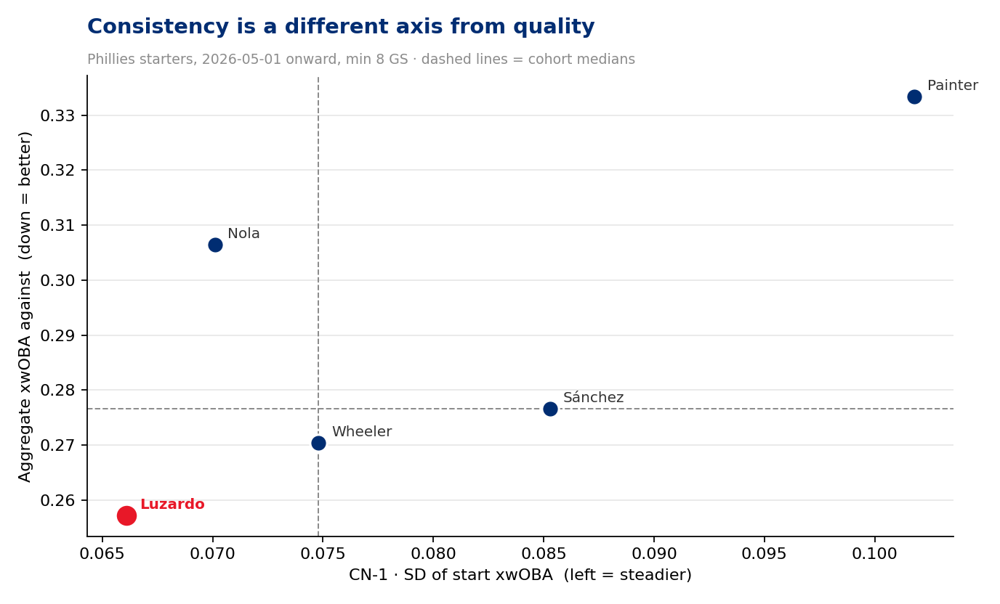
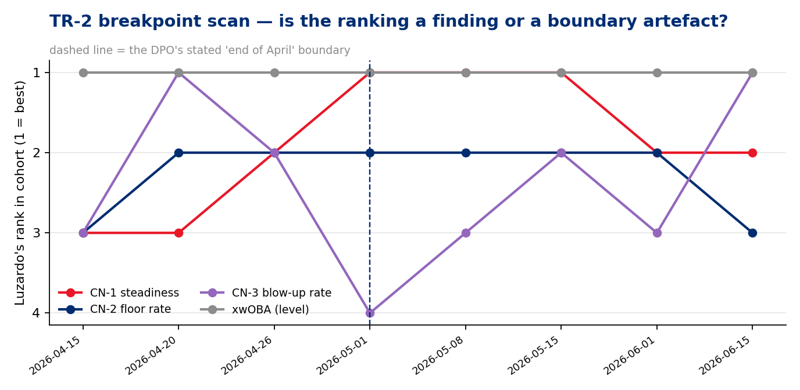
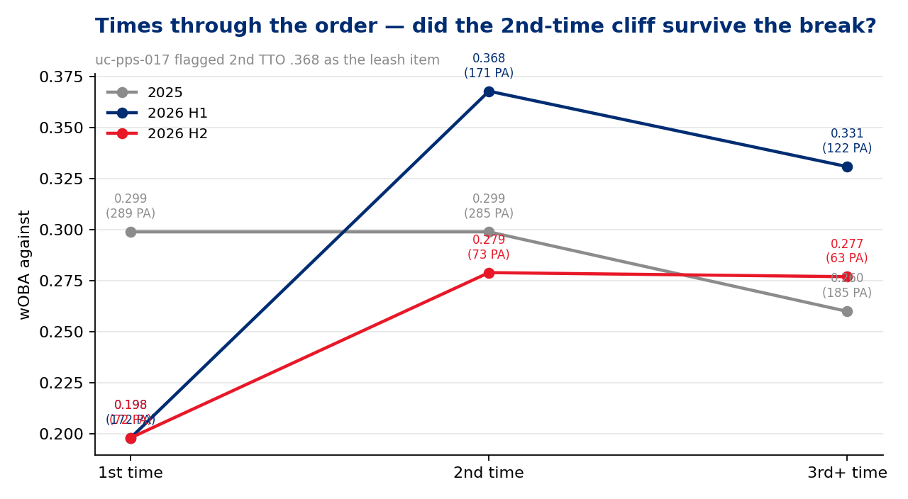
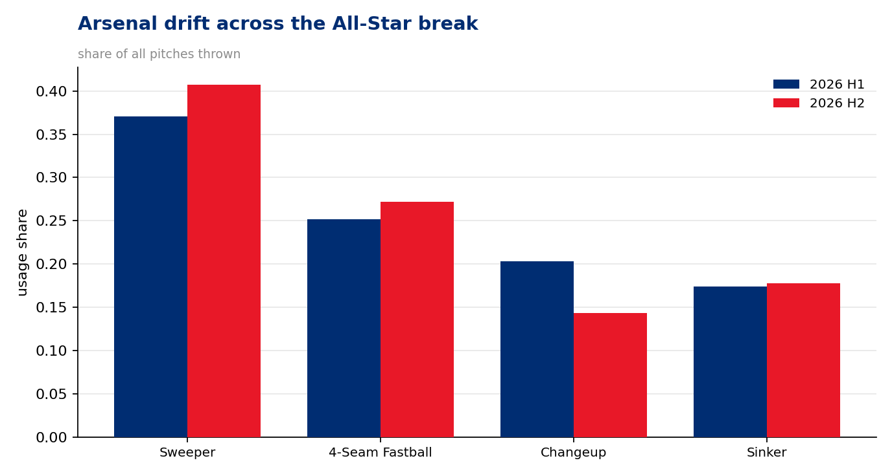

# Pre-Scout — Jesús Luzardo (LHP) vs Arizona
### Phillies Pitching · 2026-09-01 · 27 starts · extends the All-Star-break assessment (uc-pps-017)

**Prepared for:** Data Product Owner · manager · pitching department · catcher
**Throws:** L · **Arsenal:** 4 pitches (Sweeper, 4-Seam, Sinker, Changeup — the slider stayed retired)
**Governance:** Use Case #39 (`uc-pps-028` / `dp_uc39`) · locked KPIs inherited verbatim from Baseball Functions via dp_uc11 → dp_uc17 · NEW provisional consistency family **CN-1…CN-6** spec'd in `02_engineering_design.md` · **195/195 verification checks PASS · 0 DQ FAIL** · continuity check: this build reproduces all 17 published `uc-pps-017` first-half figures

> **Read this first — data window, carry-ins, and what is *not* known.**
> • Source: `phils_2025` + `phils_2026` parquet, entity-locked to `pitcher == 666200`, regular season only, deduped. 2026 cache fresh through **2026-08-30**; Luzardo's last start **2026-08-26** (SEA). Tonight he pitches on **6 days' rest**.
> • **No confirmed Arizona lineup existed at build time.** The hitter panel in §6 is built from batters Luzardo has actually faced and is labelled **UNVERIFIED** throughout. Treat every name as a candidate, not a card.
> • The second-half sample is **8 starts / 208 PA** — above the 100-BF convention in aggregate, but every split inside it is small and its PA count is printed.
> • Head-to-head vs Arizona is **22 PA in 2026** (one start, 4/10). That is *directional only*. The plan in §6 is **profile-driven**, not H2H-driven, and says so.
> • **IP is reconstructed from event outs** (may differ ~1 out from official). **Runs = runs scored while he was on the mound** (RA9 basis, not earned-run accounting — no official ERA is computed here).
> • §7 persona narratives are *inference consistent with the data*, labelled as such — not observed fact.

---

## Bottom line

1. **The DPO's premise splits cleanly in two, and the two halves get different verdicts.** "He has been very good since the end of April" is **robustly true** — Luzardo owns the **best expected contact quality on the Phillies staff (.257 xwOBA) and he ranks #1 at every one of the eight window boundaries tested, including the full season.** That claim does not depend on where you cut the year.

2. **"Most consistent" is the weaker half of the premise, and it belongs to Cristopher Sánchez.** On the axes that actually describe a floor — blow-up rate (**9.5% vs Luzardo's 14.3%**), floor-start rate (**81.0% vs 76.2%**), innings per start (**6.35 vs 6.03**) — Sánchez wins. Luzardo's **#1 ranking in start-to-start variation exists only if you cut the season on May 1**: move the boundary a week earlier and he falls to 2nd or 3rd. That is a boundary artefact, and it is reported as one.

3. **The honest framing is: Luzardo has the best stuff, Sánchez has the best floor, and Luzardo's *workload* consistency is genuinely first — the narrowest pitch-count band on the staff (90–110, SD 5.8) across 21 straight turns with zero missed starts.** If "consistent" means "you know exactly what you're getting when he takes the ball," that's the axis where he actually leads.

4. **Every second-half watch item `uc-pps-017` left open closed favourably except one.** The 2nd-time-through-the-order cliff — the report's headline leash concern at **.368** — collapsed to **.279**. The first-pitch-strike early-warning gauge recovered **60.0% → 65.4%**. Chase held (33.3% → 33.9%) and the walk rate stayed paid for (7.5% → 7.2%). Second-half line: **8 starts, 51.2 IP, 2.26 RA9, .250 wOBA / .251 xwOBA, 32.2% K.**

5. **The one degraded tripwire is contact quality, and it is the thing to watch tonight: hard-hit rate jumped 30.5% → 38.2%.** He is allowing *better-struck* contact (avg EV 85.9 → 88.1, barrel rate 5.3% → 8.9%, launch angle 6.2° → 12.6°) but *less* of it, and striking out more — so the expected line still improved. **That trade is only stable while the strikeout rate holds.** It is the first thing to check in the fifth inning tonight.

---

## §1 — The level claim: is he actually this good?

| | 2025 (full) | 2026 H1 *(uc-pps-017)* | 2026 H2 (new) | 2026 (full) |
|---|---|---|---|---|
| Starts / IP | 32 / 179.1 | 19 / 108.2 | **8 / 51.2** | 27 / 160.1 |
| PA | 759 | 465 | 208 | 673 |
| K% / BB% | 28.5% / 7.5% | 29.2% / 7.5% | **32.2% / 7.2%** | 30.2% / 7.4% |
| wOBA / xwOBA against | .289 / .292 | .295 / .269 | **.250 / .251** | .281 / **.264** |
| Hard-hit % | 37.1% | 30.5% | **38.2%** (watch) | 32.8% |
| CSW / chase / zone | 31.8% / 30.4% / 50.5% | 33.1% / 33.3% / 46.8% | 32.4% / 33.9% / 45.7% | 32.8% / 33.5% / 46.5% |
| First-pitch strike | 67.2% | 60.0% | **65.4%** | 61.7% |
| RA9 / FIP | 3.76 / 2.89 | 3.64 / 2.82 | **2.26 / 2.73** | **3.20 / 2.79** |

Receipts: `dp_uc39_season_line.csv`, `dp_uc39_process_kpis_h1_h2.csv`.

Read the last column against the first. Across a full 2026 he has improved on 2025 in every direction that matters — 1.7 points more strikeouts, four points less hard contact, .028 better expected wOBA, half a run better RA9 — while walking the same share of hitters. **The second half is the best pitching in the file: a 2.26 RA9 across eight starts with a strikeout in nearly a third of plate appearances.**

## §2 — The consistency claim, tested adversarially

The premise asked a superlative over a self-chosen window. Both are researcher degrees of freedom, so the product operationalises "consistency" as **six independent axes reported separately** (no composite index — a composite is a weighting knob, and a weighting knob is how a premise gets confirmed), ranks every axis against the whole rotation, and then **scans the window boundary**.

**Phillies starters, 2026-05-01 onward, minimum 8 starts** (receipt: `dp_uc39_consistency_cohort.csv`, `dp_uc39_consistency_ranking.csv`):

| Pitcher | GS | IP | xwOBA | RA9 | **CN-1** start-xwOBA SD | **CN-2** floor rate | **CN-3** blow-up rate | **CN-4** roll-3 range | **CN-5** pitch-count SD | **CN-6** IP/GS |
|---|---|---|---|---|---|---|---|---|---|---|
| **Luzardo** | 21 | 126.2 | **.257** ① | 2.84 | **.066** ① | .762 ② | .143 (3) | **.109** ① | **5.8** ① *(90–110)* | 6.03 ② |
| Sánchez | 21 | 133.1 | .277 ③ | **2.23** ① | .085 ④ | **.810** ① | **.095 (2)** ① | .146 ④ | 6.8 ② *(83–108)* | **6.35** ① |
| Wheeler | 21 | 121.1 | .270 ② | 3.19 | .075 ③ | .714 ③ | .143 (3) | .112 ② | 9.5 ④ *(68–116)* | 5.78 ③ |
| Nola | 21 | 109.1 | .307 ④ | 4.61 | .070 ② | .619 ④ | .143 (3) | .130 ③ | 7.1 ③ *(77–101)* | 5.21 ④ |
| Painter | 13 | 66.2 | .333 ⑤ | 4.99 | .102 ⑤ | .615 ⑤ | .308 (4) ⑤ | .179 ⑤ | 12.8 ⑤ *(62–103)* | 5.13 ⑤ |

*CN-2 floor rate = share of starts going ≥5.0 IP with ≤3 runs. CN-3 blow-up rate = share allowing ≥5 runs or failing to finish 4 innings. Full definitions in `02_engineering_design.md`.*

**What the table actually says.** Luzardo leads on *variation* (CN-1, CN-4) and on *workload predictability* (CN-5) and on *quality* (xwOBA). Sánchez leads on *floor* (CN-2, CN-3, CN-6, RA9). Those are different definitions of "consistent" and the honest answer is that they point at different pitchers. Luzardo's three blow-ups since May 1 (5/08 COL, 6/05 CWS, 6/23 WSH) are one more than Sánchez's two, and Sánchez has thrown seven more innings.

**And the boundary matters.** The TR-2 scan (inherited from `uc-pps-027`) recomputes every rank at eight candidate window starts (receipt: `dp_uc39_consistency_breakpoint_scan.csv`):

| Window opens | Luzardo GS | CN-1 rank | CN-2 rank | CN-3 rank | CN-4 rank | **xwOBA rank** |
|---|---|---|---|---|---|---|
| 2026-04-15 | 24 | 3 | 3 | 3 | 2 | **1** |
| 2026-04-20 | 23 | 3 | 2 | 1 | 2 | **1** |
| 2026-04-26 | 22 | 2 | 2 | 2 | 2 | **1** |
| **2026-05-01** *(the premise)* | 21 | **1** | 2 | 4 | **1** | **1** |
| 2026-05-08 | 20 | **1** | 2 | 3 | 2 | **1** |
| 2026-05-15 | 18 | **1** | 2 | 2 | 3 | **1** |
| 2026-06-01 | 15 | 2 | 2 | 3 | 3 | **1** |
| 2026-06-15 | 13 | 2 | 3 | 1 | 3 | **1** |

**The xwOBA column is flat at 1 across every boundary — and it is still 1 on the full uncut season (control receipt: `dp_uc39_consistency_full_season_control.csv`).** The CN-1 column is not: #1 appears in a three-boundary band around May 1 and nowhere else. Guardrail **G6** applies — *"consistency" as the DPO framed it is a boundary-dependent claim; "quality" is not.* On the full season, Luzardo's CN-1 rank is **3rd**, behind Nola and Wheeler, while his xwOBA rank is still **1st**.

## §3 — The second half: closing every `uc-pps-017` tripwire

`uc-pps-017` shipped five watch items. Eight starts later (receipt: `dp_uc39_uc17_tripwire_closure.csv`):

| # | Watch item | H1 | H2 | Verdict |
|---|---|---|---|---|
| T1 | First-pitch strike rate — *the early-warning gauge* | .600 | **.654** | **RECOVERED** |
| T2 | Chase rate — *the identity the profile leans on* | .333 | **.339** | **HELD** |
| T3 | Walk rate — *the price of the out-of-zone plan* | .075 | **.072** | **HELD** |
| T5 | Hard-hit rate — *the contact-quality floor* | .305 | **.382** | **DEGRADED** |
| T6.2 | **2nd time through the order** — *the leash item* | **.368** | **.279** | **CLOSED** |
| T6.3 | 3rd+ time through | .331 | .277 | improved |
| T7.L | vs LHB | .209 (112 PA) | **.101** (51 PA) | improved |
| T7.R | vs RHB | .323 (353 PA) | .299 (157 PA) | improved |

**The 2nd-TTO cliff was the single biggest structural worry in the first-half product, and it is gone.** He is now .198 / .279 / .277 across the three looks (72 / 73 / 63 PA — small, and printed). The manager-facing consequence is direct: the hook logic built around "the danger window opens in the second time through" **no longer has a number behind it.** Two second-half home runs came the first time through, one the second, two the third.

The first-pitch-strike recovery is the mechanism. He bought back five points of strike-one without giving up any chase — the trade `uc-pps-017` flagged as fragile turned out to be reversible in his favour.

## §4 — The one thing that got worse, and why the expected line still improved

Hard-hit rate went **30.5% → 38.2%**. That is a real move, not noise dressing. The batted-ball detail says what changed:

| | H1 (285 BIP) | H2 (123 BIP) |
|---|---|---|
| Average exit velocity | 85.9 | **88.1** |
| Average launch angle | 6.2° | **12.6°** |
| Barrel rate | 5.3% | **8.9%** |
| Ground-ball share | 52.3% | 44.7% |
| Fly-ball share | 20.4% | 26.0% |
| **Balls in play per PA** | .613 | **.591** |
| **K%** | 29.2% | **32.2%** |

**He is allowing better-struck, higher-launched contact — and less of it.** The extra strikeouts and the slightly lower contact rate more than paid for the harder contact, which is why xwOBA still fell (.269 → .251) even as hard-hit climbed eight points. Expected wOBA *on contact* was essentially flat (.334 → .328).

**This is a conditional profile, and the condition is the strikeout rate.** A 32% K rate absorbs 38% hard-hit contact. A 27% K rate does not. Receipt: `dp_uc39_process_kpis_h1_h2.csv`.

## §5 — The arsenal now

| Pitch | H1 usage | H2 usage | Velo H1→H2 | Whiff H1→H2 | xwOBA H1→H2 |
|---|---|---|---|---|---|
| **Sweeper** | 37.1% | **40.7%** | 86.4 → 85.4 | .509 → .427 | **.193 → .163** |
| 4-Seam | 25.2% | **27.2%** | 97.1 → 96.3 | .170 → **.216** | .312 → **.288** |
| Sinker | 17.4% | 17.8% | 96.0 → 95.2 | .122 → .111 | .323 → .335 |
| **Changeup** | 20.3% | **14.3%** ↓ | 86.2 → 85.2 | .390 → .345 | .284 → **.317** |

Two real drifts. **The sweeper took another three and a half points of usage and got harder to square up** (.163 xwOBA in the second half, best mark on any pitch in the file), even though its whiff rate came off its absurd first-half peak. **And he is shelving the changeup** — six points of usage gone, whiff down, expected damage up. Receipt: `dp_uc39_arsenal_h1_h2.csv`.

Velocity is down about a tick across the board (4-seam 97.1 → 96.3). Over eight late-summer starts on a career-high workload that reads as normal seasonal attrition rather than a flag, but it is the number to re-check after tonight.

## §6 — Arizona: what the record actually supports

> **Sample warning.** One 2026 start (4/10, 22 PA), one 2025 start (25 PA), four pre-Phillies starts (2019–24, 81 PA). **No confirmed lineup.** Everything below is *directional*; the actionable plan is profile-driven.

**History (receipt: `dp_uc39_ari_history_line.csv`):**

| Window | G | PA | IP | R | K% | BB% | wOBA | xwOBA |
|---|---|---|---|---|---|---|---|---|
| 2026 (4/10) | 1 | 22 | 4.2 | 5 | 36.4% | 13.6% | .314 | .295 |
| 2025 | 1 | 25 | 5.1 | 2 | 24.0% | 4.0% | .375 | .323 |
| 2019–2024 (pre-PHI) | 4 | 81 | 17.2 | 8 | 23.5% | 12.3% | .348 | .319 |

Arizona is one of the few clubs with a *positive* career line against him — but it is 128 career PA spread over seven seasons and three organisations, and the 4/10 start was his third-worst of the season by result while sitting mid-pack by expected contact (.295 xwOBA). **Don't build a narrative on it.**

**The 4/10 start, replayed (receipt: `dp_uc39_ari_start_20260410_mix.csv`):**

| Pitch | # | Usage | Velo | Whiff | xwOBA |
|---|---|---|---|---|---|
| Sweeper | 29 | 33.7% | 87.0 | **55.6%** | **.019** |
| 4-Seam | 22 | 25.6% | 97.4 | 33.3% | .279 |
| **Changeup** | 18 | 20.9% | 86.8 | 60.0% | **.534** (watch) |
| **Sinker** | 17 | 19.8% | 96.1 | **0.0%** (8 swings) | .391 |

**The sweeper was untouchable and the two secondary fastball/change looks were where the damage came from.** He has since cut the changeup by six points of usage league-wide — that drift moves in exactly the right direction for this opponent.

**Head-to-head, current-era tier only** (batters faced in 2025–26; names parsed from the play-by-play, never hand-keyed — receipt: `dp_uc39_ari_h2h_batters.csv`. Historical-only opponents from 2019–23 are tiered out and excluded from planning):

| Batter | Side | PA | H | BB | K | wOBA | xwOBA | Whiff% |
|---|---|---|---|---|---|---|---|---|
| **Ketel Marte** | R | **14** | 5 | 3 | 2 | **.490** | **.436** | 23.1% |
| Gabriel Moreno | R | 7 | 2 | 1 | 0 | .404 | **.639** | 15.4% |
| Lourdes Gurriel Jr. | R | 6 | 4 | 0 | 1 | .650 | .125 | 9.1% |
| Geraldo Perdomo | R | 6 | 1 | 2 | 3 | .378 | .374 | 30.0% |
| Corbin Carroll | L | 6 | 2 | 0 | 1 | .294 | .230 | 18.2% |
| Alek Thomas | L | 5 | 1 | 0 | 0 | .178 | .164 | 0.0% |
| Eugenio Suárez | R | 3 | 0 | 0 | 2 | .000 | .035 | 42.9% |
| Josh Naylor | L | 3 | 1 | 0 | 2 | .294 | .243 | 85.7% |
| Nolan Arenado | R | 2 | 0 | 0 | 1 | .000 | .047 | 40.0% |

**Only Marte clears 10 PA, and only Marte clears the "worth a specific plan" bar.** Everything else on this list is 2–7 PA and belongs in the "he's seen him" column, not the game plan. Marte and Moreno are the two names where both the result and the expected line agree that Luzardo has been beaten.

**The profile-driven plan (this is the part with real sample behind it — 2026 full season, receipts `dp_uc39_attack_plan_by_stand.csv`, `dp_uc39_two_strike_menu_by_stand.csv`):**

| vs **LHB** (241 PA equivalent) | Usage | Whiff | Chase | xwOBA |
|---|---|---|---|---|
| Sweeper | **48.2%** | **.548** | .421 | **.136** |
| Sinker | 35.2% | .127 | .317 | .250 |
| 4-Seam | 13.7% | .222 | .176 | .233 |

| vs **RHB** | Usage | Whiff | Chase | xwOBA |
|---|---|---|---|---|
| Sweeper | 35.2% | **.448** | .347 | **.201** |
| 4-Seam | 29.5% | .181 | .340 | .314 |
| Changeup | 23.3% | .381 | .348 | .309 |
| **Sinker** | 12.1% | .108 | .119 | **.404** (watch) |

**Two-strike menu:** vs LHB the sweeper is **64.1%** of two-strike pitches at a .471 whiff rate; vs RHB it is **44.5%** at .434, with the 4-seam taking 32.3% at a much weaker .197.

**The read for tonight.** Arizona's current-era hitters in this record skew heavily right-handed — Marte, Moreno, Perdomo, Suárez, Arenado, Gurriel — with Carroll, Thomas and Naylor the left-handed exceptions. That matters because **the sinker is his single worst pitch against right-handed hitters (.404 xwOBA, 10.8% whiff, and a 11.9% chase rate that says righties simply don't offer at it).** He has already largely stopped using it there (12.1%). Tonight's arsenal decision is whether that number goes to zero against a righty-heavy card, with the sweeper and the 4-seam absorbing the share. Against the three lefties, the sweeper at 48% is the whole plan and there is no reason to change it.

*(Marte is a switch-hitter; the `stand` field records the side he actually batted from in each PA, so his line above mixes sides.)*

## §7 — Persona actions

*Inference consistent with the data, labelled as such. Each claim names its indicator.*

### Manager
**Tonight:** the 2nd-TTO leash rule from `uc-pps-017` is **retired** — .279 across the second look. The new constraint is workload, not order position: his last three starts were **109, 110, 104 pitches**, the three highest of his season, on a career-high innings pace. Six days' rest tonight is normal for him (median 6). **The number to watch is not an inning, it's the strikeout rate** — §4 says the harder contact he now allows is only affordable while he's missing bats at 32%.
**Retrospective:** the leash held all year — 27 starts, zero missed turns, a 90–110 pitch band that is the tightest on the staff (CN-5).

### Pitching department
**Tonight:** the sinker-vs-RHB question is live. .404 xwOBA, 10.8% whiff, 11.9% chase — it is the worst pitch in the bag against the handedness Arizona is built around, and the 4/10 start is a small but consistent data point (0 whiffs on 8 swings). Usage is already down to 12.1%; consider whether it goes to zero.
**Retrospective:** the second-half sweeper is the best pitch in this file — **40.7% usage at .163 xwOBA.** Whatever changed there should be documented before the offseason, because the whole profile now rests on it.
**Open item:** the changeup is being shelved (20.3% → 14.3%, whiff down, xwOBA up). Decide whether that is a deliberate retirement or drift — it is still 23.3% of his mix against righties, which is the exact population it is performing worst against.

### Catcher (Realmuto)
**Tonight:** first-pitch strike rate is back to 65.4% and chase held at 33.9% — the game-calling trade is working and does not need adjusting. Against a righty-heavy card the two-strike menu is thinner than it looks: the sweeper is 44.5% of two-strike pitches to RHB and the 4-seam behind it whiffs at only .197.
**Retrospective:** he has caught **2,365 of 2,652 pitches (89%)**, and the entire second-half improvement runs through him. Marchán's 70-PA split is unchanged from `uc-pps-017` and is still not evidence of anything.

### Luzardo
**Retrospective:** the second half is the best sustained stretch in the file — 2.26 RA9, .250 wOBA, and the second-time-through problem that defined his first half is simply gone.
**Watch:** velocity is down about a tick since the break (4-seam 97.1 → 96.3) on a career-high workload. Normal for September; worth re-checking after tonight.

## §8 — Sustainability & candid caveats

- **What is solid:** the xwOBA lead over the rotation (#1 at all eight boundaries *and* on the full uncut season), the second-half TTO repair, the strike-one recovery, and the pitch-count discipline. These do not depend on a window choice.
- **What is not:** the "most consistent" title. On the floor axes it is Sánchez's, and Luzardo's variation ranking only reaches #1 inside a narrow band around May 1. Stated plainly so nobody re-quotes the #1 without the boundary attached.
- **The real risk in the profile** is §4's conditional: 38% hard-hit contact is affordable at 32% strikeouts and not at 27%.
- **Sample honesty:** H2 is 8 starts / 208 PA. The ARI head-to-head is 22 PA in 2026 and 128 PA over seven seasons across three organisations. **No confirmed Arizona lineup was available** — every batter named in §6 is a candidate.
- **Known open defects carried, not hidden:** `O-5` — 3 `truncated_pa` events are counted as plate appearances by the locked `get_stats`; `O-8` — the locked `hard_hit_rate` counts 2 untracked balls in play as not-hard-hit (a tracked-denominator shadow rate is emitted alongside and differs by <0.3 points). Both logged as WARN in the DQ scorecard, neither material at this sample.
- **Three build defects were found and fixed during this run** (`D-1` completeness tested at the wrong grain; `D-2` replay-review prose contaminating batter-name parsing; `D-3` a career opponent panel silently mixing 2019 and 2026 rosters). All three are repo-wide patterns — see `05_quality_certification.md`.
- IP (160.1) and RA9 (3.20) are reconstructions from the pitch log, close to official but not official. **No official ERA or W–L appears in this report because the pitch log cannot compute them.**
- Artifacts: 30 receipts in `out/`, five figures, DQ scorecard (**0 FAIL**), freshness manifest, and `dp_uc39_verification.py` (**195/195 PASS**).
