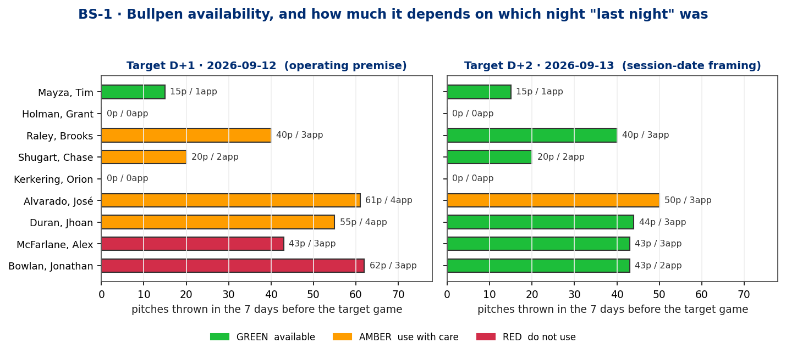
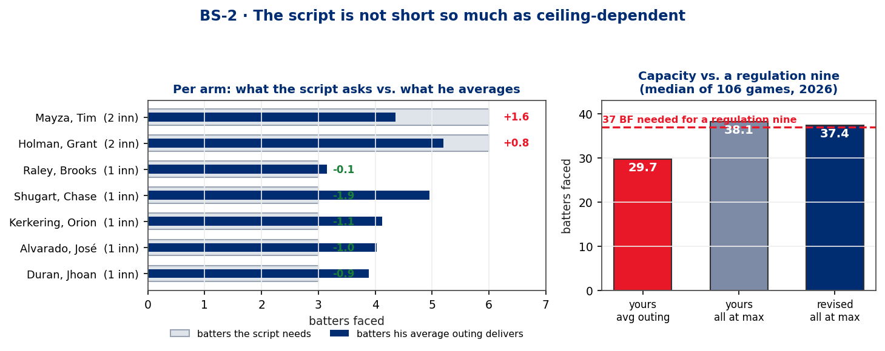
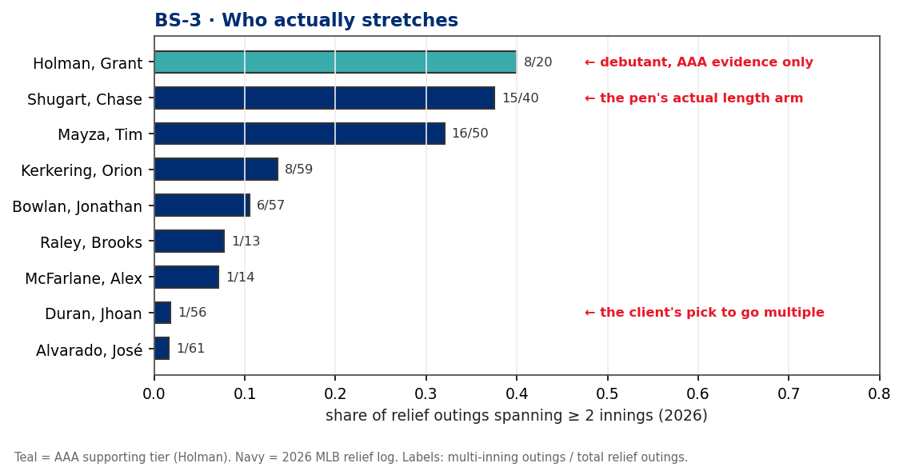
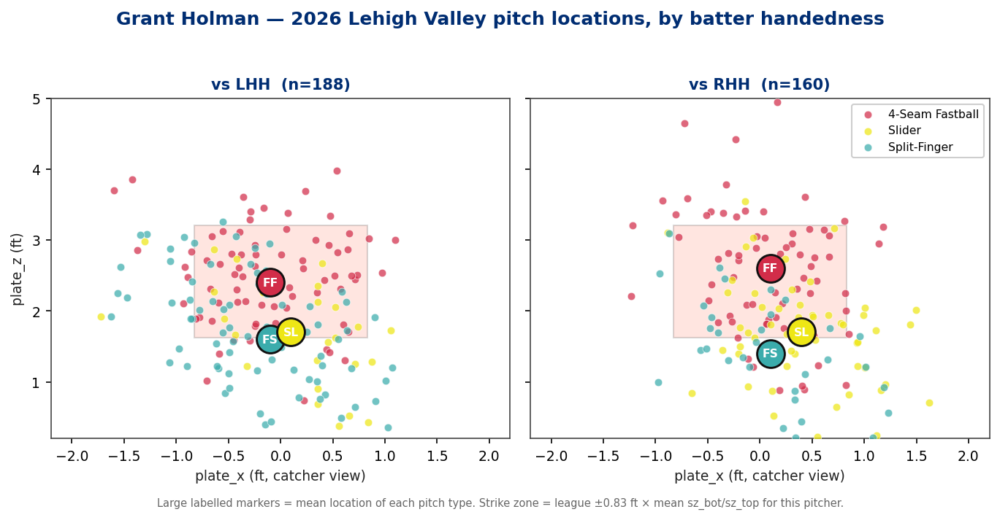

# Game 2 Bullpen Script — Mayza opens, Holman debuts

**UC #43 · `uc-pps-029` · build `dp_uc43` · v1.0.0 · delivered 2026-09-13**
Value stream: Phillies Pitching Staff (`pps`) · Requester: Kellen Short (human DPO)
Every number below is computed by `dp_uc43_bullpen_script.py` this session and traces to a CSV in `out/`.

> **Data window — read this first.** The Phillies pitch log is complete through **2026-09-11**, which is the
> last game in the cache and the game whose fingerprint matches your "last night." The four arms you named
> all appear in it. So this package is built for **the next game after 2026-09-11 (D+1, 2026-09-12)** and is
> **T-1** — normal. The session clock says 2026-09-13. If the target is actually 2026-09-13, a 09-12 game is
> missing from the cache and **the availability ledger cannot be certified** — the tier calls move for five of
> nine arms. Both framings are priced below (§3). Everything else in this report is framing-independent.

> **Supporting-tier warning.** Grant Holman has **no MLB pitches**. Everything about him here is Lehigh Valley
> (AAA) Statcast, labelled as a supporting tier and never blended with MLB rates. wOBA/xwOBA are **not
> computed** for that tier — the AAA frame carries no wOBA weights and applying MLB constants to it would be
> a comparability violation (DQ-5). Usage, velocity, shape, location, whiff, chase and counting outcomes only.

---

## 1 · Bottom line

**The script is sound in who it uses and fragile in what it assumes they can do.** Three findings, in order
of how much they should change tonight:

1. **The script is not short so much as ceiling-dependent — and its biggest ceiling belongs to the
   debutant.** Priced at each arm's *average* 2026 outing, nine innings from seven arms delivers **29.7
   batters faced** against a **37-batter** regulation median: **7.3 short, about 2.4 innings**. Priced at
   every arm's *season high* it delivers **38.1** and just covers. So it works — if everybody goes to his
   high-water mark on the same night. The single largest number in that ceiling is **10 batters faced**,
   and it is **Grant Holman's, set at Triple-A**, in a game that would be his major-league debut.
2. **The arm you'd bet on to go multiple is the worst bet on the list.** Duran has gone two innings in
   **1 of 56** relief outings this year (1.8%). The pen's actual length is **Shugart (15 of 40, 37.5%,
   44-pitch high)**, **Mayza (16 of 50, 32.0%)** and, on AAA evidence, **Holman (8 of 20, 40%)**.
3. **The arm missing from your "four down" list is the most-worked arm in the pen — and you have him
   scripted for the 8th.** Alvarado threw on 09-11 on **zero days rest**, his **fourth appearance in seven
   days**, with **61 pitches** in that window. He is the only arm that stays AMBER under *both* date
   framings. Meanwhile two of the four you wrote off — Shugart and Raley — threw **nine pitches each**.

**The recommendation is a reallocation, not a replacement.** Keep all seven arms. Move the two-inning asks
off (Mayza, Holman) and onto (Mayza, Shugart). That prices at **37.4** under the same ceiling assumption —
statistically the same number — but every stretch in it has been done in the major leagues by the arm being
asked to do it. Details in §6.

## 2 · The premise, adjudicated against the log

You wrote: *"Last night cost four arms at an inning apiece — McFarlane, Bowlan, Shugart, and Raley. Duran
should be ok."*

The 2026-09-11 game at Atlanta went **11 innings**. Nola threw 101 pitches over 7. Then:

| Arm | Innings | Pitches | BF | Rest entering | Named by you? |
|---|---|---|---|---|---|
| Alvarado, José | 7th | **9** | 2 | 0 days | **no** |
| McFarlane, Alex | 8th | **15** | 4 | 1 day | yes |
| Bowlan, Jonathan | 9th | **22** | 6 | 1 day | yes |
| Shugart, Chase | 10th–11th | **9** | 4 | 2 days | yes |
| Raley, Brooks | 11th | **9** | 3 | 2 days | yes |

*Receipt: `out/dp_uc43_anchor_game_ledger.csv`.*

Three corrections fall out of that table:

- **It was five arms, not four.** Alvarado pitched the 7th.
- **"An inning apiece" overstates it for three of them.** Bowlan (22p) and McFarlane (15p) each threw at or
  above their season average outing. Alvarado, Shugart and Raley threw **nine pitches each**. Shugart's nine
  covered *two* innings. Nine pitches is not a spent arm; it is a warm-up.
- **The unnamed arm is the tired one.** Alvarado's nine pitches came on zero days rest at the end of a
  four-appearance week. Shugart's nine came on two days rest after an eleven-pitch week.

The unit of unavailability is not *an appearance*. It is pitches and density. That is what BS-1 measures.

---

## 3 · BS-1 · Availability, and the date that decides it

**Operating premise (D+1, 2026-09-12)** — the log is complete to the night before:

| Arm | Last outing | Rest | P yesterday | P/app, last 7d | Season avg | Tier |
|---|---|---|---|---|---|---|
| Mayza, Tim | 09-08 | 3 | 0 | 15p / 1 | 17.7 | **GREEN** |
| Holman, Grant | — (AAA 08-30) | — | 0 | 0p / 0 | — | **GREEN** (debut) |
| Kerkering, Orion | 09-04 | 7 | 0 | 0p / 0 | 17.0 | **GREEN** |
| Raley, Brooks | 09-11 | 0 | 9 | 40p / 3 | 11.7 | AMBER |
| Shugart, Chase | 09-11 | 0 | 9 | 20p / 2 | 19.5 | AMBER |
| Alvarado, José | 09-11 | 0 | 9 | **61p / 4** | 16.9 | AMBER |
| Duran, Jhoan | 09-10 | 1 | 0 | 55p / 4 | 15.5 | AMBER |
| McFarlane, Alex | 09-11 | 0 | **15** | 43p / 3 | 15.0 | **RED** |
| Bowlan, Jonathan | 09-11 | 0 | **22** | 62p / 3 | 16.4 | **RED** |

*Receipts: `out/dp_uc43_availability_D1.csv`, `out/dp_uc43_availability_D2.csv`,
`out/dp_uc43_date_framing_sensitivity.csv`.*

**Sensitivity.** Under the session-date framing (D+2, 2026-09-13) **five of nine tiers move**: Raley,
Shugart, Duran, McFarlane and Bowlan all clear to GREEN; only Alvarado stays AMBER. That is the difference
between a two-RED pen and a zero-RED pen — it changes the script. It is escalated, not defaulted (§8), and
the D+2 ledger is explicitly **not certifiable**, because if a 09-12 game was played it is not in the cache
and every "days of rest" in that column would be one game stale.

---

## 4 · BS-2 · What the script actually buys

Nine innings, seven distinct arms (Mayza ×2, Holman ×2). **An arm delivers one outing however many innings
you give him**, so capacity sums over arms, not over slots. Priced at each arm's own 2026 average:

| Arm | Innings asked | Batters the script needs | Batters his average outing delivers | Gap |
|---|---|---|---|---|
| Mayza, Tim | 2 | 6 | 4.36 | **+1.64 short** |
| Holman, Grant | 2 | 6 | 5.20 *(AAA)* | **+0.80 short** |
| Raley, Brooks | 1 | 3 | 3.15 | −0.15 |
| Shugart, Chase | 1 | 3 | 4.95 | −1.95 spare |
| Kerkering, Orion | 1 | 3 | 4.12 | −1.12 spare |
| Alvarado, José | 1 | 3 | 4.03 | −1.03 spare |
| Duran, Jhoan | 1 | 3 | 3.89 | −0.89 spare |
| **Total** | **9** | — | **29.70** | — |

The trap is thinking in innings. Nine slots filled by nine arm-innings looks complete. But a regulation
Phillies game has taken a **median of 37 batters faced and 147 pitches** from the staff across **106**
nine-inning games in 2026 — not 27, because baserunners exist.

**Two ways to price it, and the difference is the whole story:**

| Script | Capacity basis | Expected BF | vs. 37 needed |
|---|---|---|---|
| Yours | every arm at his **average** outing | **29.7** | **7.3 short ≈ 2.4 innings** |
| Yours | every arm at his **season high** | **38.1** | covers, by 1.1 |
| Revised (§6) | every arm at his **season high** | **37.4** | covers, by 0.4 |

Your script clears the bar only under the second assumption. That assumption is not unreasonable — the two
bullpen games in this season's log ran **5.0 BF per arm** (2026-07-25, 7 arms, 35 BF, 9 innings) and **7.1**
(2026-04-30, 7 arms, 50 BF, 10 innings), both well above the 4.2 the average priced. But a ceiling is only as
good as the evidence behind it, and the largest ceiling your script leans on is Holman's AAA maximum of 10
batters, in his first major-league game. The revision in §6 gets the same total with every stretch backed by
an MLB outing.
*Receipts: `out/dp_uc43_script_coverage.csv`, `out/dp_uc43_script_capacity_modes.csv`,
`out/dp_uc43_staff_game_workload.csv`, `out/dp_uc43_bullpen_game_precedents.csv`.*

## 5 · BS-3 · Who actually stretches

| Arm | Multi-inning relief outings | Rate | ≥6 BF | Max pitches | Max BF |
|---|---|---|---|---|---|
| Holman, Grant *(AAA)* | 8 / 20 | .400 | 9 (45%) | 39 | 10 |
| Shugart, Chase | 15 / 40 | .375 | 13 (33%) | **44** | 9 |
| Mayza, Tim | 16 / 50 | .320 | 16 (32%) | 36 | 8 |
| Kerkering, Orion | 8 / 59 | .136 | 9 (15%) | 33 | 7 |
| Bowlan, Jonathan | 6 / 57 | .105 | 7 (12%) | 35 | 7 |
| Raley, Brooks | 1 / 13 | .077 | 1 (8%) | 23 | 6 |
| McFarlane, Alex | 1 / 14 | .071 | 1 (7%) | 26 | 6 |
| **Duran, Jhoan** | **1 / 56** | **.018** | 3 (5%) | 33 | 9 |
| Alvarado, José | 1 / 61 | .016 | 6 (10%) | 35 | 8 |

*Receipt: `out/dp_uc43_multi_inning_propensity.csv`.*

Your instinct — *"Duran's the name on the list I'd bet on to do it"* — is the one the log rejects hardest.
He has been asked for a second inning **once in fifty-six relief appearances**. Alvarado, also scripted, is
the same story (1 of 61). If somebody has to cover two, it is Shugart, Mayza or Holman, and the script has
two of those three already at two.

---

## 6 · Recommended revision

Judgment, clearly labelled: **same seven arms, different shape.** All seven are needed — dropping one leaves
eight innings' worth of names for a nine-inning game.

| Inn | Your script | Revised | Why |
|---|---|---|---|
| 1–2 | Mayza | **Mayza** — unchanged | Opener precedent: 4 starts in 2026, **3 reached the 2nd**, mean 25.8p / 6.5 BF, high of 33p. Platoon fits — Atlanta's 1-3-4 all bat left against a lefty. |
| 3 | Holman | **Holman — one inning** | Debut; **13 days** since his last competitive pitch; **all four AAA home runs were to LHB**. The 7-8-9 turn (Riley R / Yastrzemski L / Murphy R) is the soft landing. Asking him for two is asking a debutant for his Triple-A career high. |
| 4–5 | Holman / Raley | **Shugart — the two** | The pen's genuine length arm: 15 of 40 multi-inning, **44-pitch high, 9-BF high**, and he threw nine pitches on 09-11. This is the swap that matters. |
| 6 | Shugart | **Kerkering** | **7–8 days rest and zero pitches in the prior week** — the only arm carrying no recent load at all. |
| 7 | Kerkering | **Raley** | Lightest arm in the pen (11.7 p/outing, 1 of 13 multi-inning). One inning is his shape. |
| 8 | Alvarado | **Alvarado — break-glass slot** | He is AMBER under both framings, 61 pitches in 7 days, and 1-of-61 multi-inning. Use him for the matchup, not the inning; this is the slot to spend a 10th arm on if one exists. |
| 9 | Duran | **Duran** — unchanged | Correct closer. Do **not** plan a second inning: 1 of 56. |

Under the ceiling assumption the revision prices at **37.4 BF** against yours at **38.1** — the same number
inside the noise. What changes is *whose* ceiling the game rests on: Shugart's 9-batter, 44-pitch high was set
in the major leagues this season; Holman's 10-batter high was set in the International League.

**One gap the revision does not close.** Seven arms at their averages cover about six and a half innings under
either shape. Either an eighth arm is available and isn't on your list, or one of Mayza / Shugart is going past
his season high tonight. Naming which, before the game, is the decision this report exists to force.

## 7 · Grant Holman, properly

**RHP, MLBAM 680880. 20 appearances, 348 pitches, 104 PA at Lehigh Valley, 2026-05-10 → 2026-08-30.**
Three pitches, and the mix is genuinely handedness-split:

| vs | Pitch | Usage | Velo | Spin | Horiz (in) | Vert (in) | Whiff | Chase |
|---|---|---|---|---|---|---|---|---|
| **LHB** | Split-Finger | **44.1%** | 87.8 | 1177 | −12.0 | −0.0 | **.349** (43 sw) | .385 |
| | 4-Seam | 42.6% | **95.0** | 1982 | −9.6 | +14.4 | .154 (52 sw) | .440 |
| | Slider | 13.3% | 86.5 | 2048 | −2.4 | +1.2 | .500 (16 sw) | .538 |
| **RHB** | 4-Seam | **45.0%** | **94.9** | 1982 | −8.4 | +15.6 | .135 (37 sw) | .240 |
| | Slider | 32.5% | 86.3 | 1999 | −1.2 | +2.4 | **.370** (27 sw) | .296 |
| | Split-Finger | 22.5% | 87.8 | 1154 | −12.0 | −0.0 | .333 (21 sw) | .440 |

*Receipts: `out/dp_uc43_holman_mix_by_stand.csv`, `out/dp_uc43_holman_whiff_chase.csv`.
Sign convention derived empirically, not assumed (O-15 standing rule): for this RHP the splitter carries the
most negative `pfx_x` and the slider the least, so **negative = arm-side**.*

- **The splitter is the pitch.** ~15 inches of vertical separation off a 95 mph four-seam at only 7 mph of
  velocity gap, thrown to a mean height of **1.4–1.6 ft** against a four-seam at **2.4–2.6 ft**. That is the
  tunnel, and it is why the chase rates are where they are.
- **The fastball does not miss bats** — .135–.154 whiff. It is a strike-getter: 65–69% in-zone.
- **He throws strikes.** First-pitch strike **76.8% vs LHB / 66.7% vs RHB**; walk rate 3.6% L / 6.2% R.
  Putaway .296 L / .209 R.
- **Velocity has held all season**: FF 94.2 (May) → 95.5 (Jul) → 95.1 (Aug).
- **The vulnerability is left-handed.** 56 PA vs LHB: **4 home runs** (7.1% of PA), K-rate .286. 48 PA vs
  RHB: **0 home runs**, K-rate .188. The splitter gets the whiffs *and* the damage.
- **Two gaps in the log worth knowing.** A **44-day** hole (05-24 → 07-08), and **no appearance since
  08-30** — the AAA log runs to 09-06, so he definitively did not pitch at Lehigh Valley in that window.
  Whatever that was, he arrives with **13 days** since his last competitive pitch. Neither gap's cause is in
  the data and neither is asserted here.

*On sample: every rate above is 16–83 pitches deep. Treat the slider-vs-LHB .500 whiff (16 swings) as noise.
The splitter numbers (43 and 21 swings) are directional. The home-run split (4 vs 0 in 104 PA) is small but it
is the only signal in the file that points at a specific way he gets hurt, so it is reported rather than
rounded away.*

---

## 8 · Opponent context

**The opposing starter (client-named "Mahle"; resolved to MLBAM 641816 — see the caveat below).**
Three looks at the Phillies in 2026, **six innings in every one of them**, 82–94 pitches, 22–24 batters.
Pooled: **.217/.300/.283, .266 wOBA, zero home runs in 70 PA.**

| Look | Date | P | BF | Last inn | PHI wOBA |
|---|---|---|---|---|---|
| 1 | 2026-04-08 (for SF) | 94 | 24 | 6 | .228 |
| 2 | 2026-04-28 (for SF) | 82 | 22 | 6 | .372 |
| 3 | **2026-09-06 (for ATL)** | 94 | 24 | 6 | .208 |

Two things matter for tonight:

- **His splitter usage is climbing and it is the pitch beating you**: 23.4% → 26.8% → **39.4%** across the
  three looks, with the cutter falling 22.3% → 10.6%. Phillies hitters chase it out of the zone at **54.2%**
  (26 of 48) and whiff on it at 25.0%.
- **The damage is right-handed**: PHI LHB are **.128/.234/.154 (.192 wOBA, 47 PA)** against him; PHI RHB are
  **.381/.435/.524 (.419 wOBA, 23 PA)**. Small, but one-sided.
- **This is an asymmetric bullpen game.** He has taken six innings off you three times out of three. Your pen
  is being asked for nine while theirs is being asked for three.

**Atlanta's order from the 09-11 card**, and how it turns over against a left-handed opener:

| Spot | Hitter | vs RHP | vs LHP | |
|---|---|---|---|---|
| 1 | Drake Baldwin | L | **L** | |
| 2 | Ronald Acuña Jr. | R | R | |
| 3 | Matt Olson | L | **L** | |
| 4 | Michael Harris II | L | **L** | |
| 5 | Mauricio Dubón | R | R | |
| 6 | Ozzie Albies | L | R | switch — flips against Mayza |
| 7 | Austin Riley | R | R | |
| 8 | Mike Yastrzemski | L | **L** | |
| 9 | Sean Murphy | R | R | |

**Three of the first four are left-handed against a lefty.** That is the case for Mayza opening, and it is a
better case than the script makes for itself. His 2026 platoon is modest (.257 wOBA vs LHB, .281 vs RHB,
whiff .195 L / .262 R) but the *sequencing* is where the value is.

One structural note that removes a worry: **a two-inning open exposes Mayza to no hitter twice.** Batters 1–6
are still first-time-through. Every one of his 987 pitches in 2026 has come at `n_thruorder_pitcher == 1`, so
there is no in-season evidence on his second look — and the two-inning ask does not need any. **The binding
constraint on Mayza is pitch count, not the order.** His opener high is 33.

*Receipts: `out/dp_uc43_opp_starter_*.csv`, `out/dp_uc43_atl_order.csv`, `out/dp_uc43_mayza_*.csv`,
`out/dp_uc43_h2h_reliever_vs_atl.csv`.*

---

## 9 · Head-to-head, and why it isn't load-bearing

Every Phillies reliever's 2026 history against this nine is **4 to 23 plate appearances**. Mayza leads at 23
PA across eight hitters — three or fewer against seven of them. At those sizes the per-hitter numbers are
printed in `out/dp_uc43_h2h_reliever_vs_atl.csv` for reference and **no matchup call in §6 is made on them**.
Everything in the revision is profile- and workload-driven. Where a number below five PA appears anywhere in
this package, the PA is printed next to it.

---

## 10 · Candid caveats

1. **The target date is unresolved and it matters.** Five of nine availability tiers move between D+1 and
   D+2. §3 gives both. If a 2026-09-12 game was played, the cache does not have it and the D+2 column is
   stale by one game.
2. **The opposing starter's identity is inferred, not confirmed.** The Statcast frame carries no name for
   opponent pitchers (standing defect O-10). MLBAM **641816** is the only pitcher in the log who fits every
   constraint — RHP, three starts against the Phillies in 2026, a four-seam/splitter/cutter arsenal at 92.9 /
   86.2 / 87.8, and a mid-season move from San Francisco to Atlanta. That is strong but circumstantial.
   Everything in §8 about him is correct *for 641816*; if that is not Mahle, §8 is about the wrong pitcher.
3. **Holman is AAA-only evidence.** No MLB pitch exists. AAA hitters are not major-league hitters and AAA
   tracking is thinner (6 of his 73 batted balls have no exit velocity, which is why no hard-hit rate is
   quoted). Read the mix and the shape; discount the rates.
4. **`innings_spanned` is a span, not outs recorded.** A reliever who records one out in the 7th and two in
   the 8th "spans two innings." BS-3 therefore slightly over-counts length. The BF columns alongside it are
   the honest check, and they tell the same story.
5. **BS-1's thresholds are this build's judgment, not a ratified standard.** GREEN/AMBER/RED is defined in
   `dp_uc43_kernel.py` and is provisional. The *inputs* (rest, rolling load, season average) are governed
   and inherited; the cut-points are new and should be reviewed before a second use.
6. **Two defects were found in the governed kernel during this build**, both repo-wide, both remediated
   build-locally rather than patched in place. See `05_quality_certification.md`. The larger one (**D-8**)
   means `pitcher_season_workload(relievers_only=True)` has been silently returning an **empty DataFrame**
   for every caller that passes a single-team frame — which is every caller.
