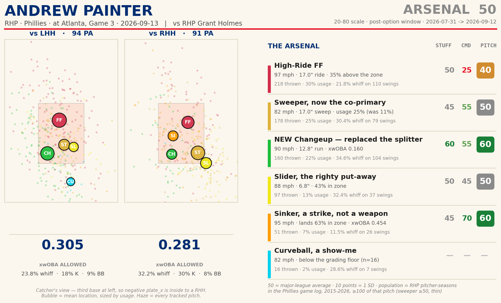
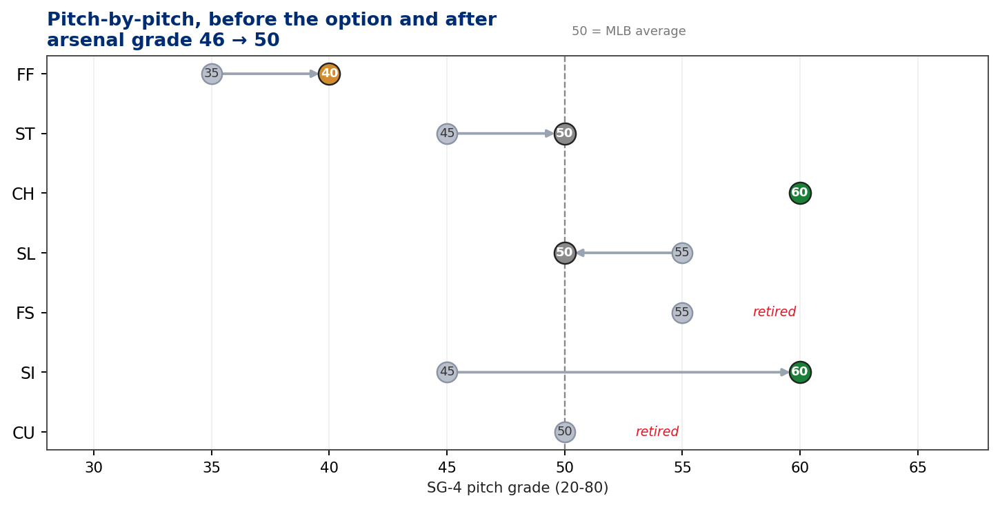
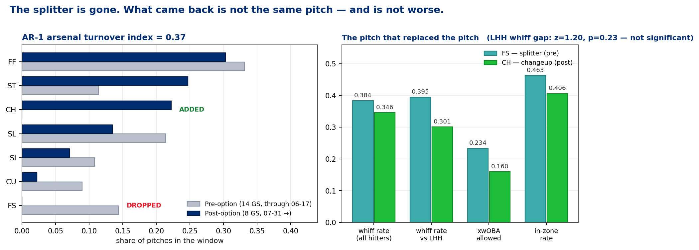
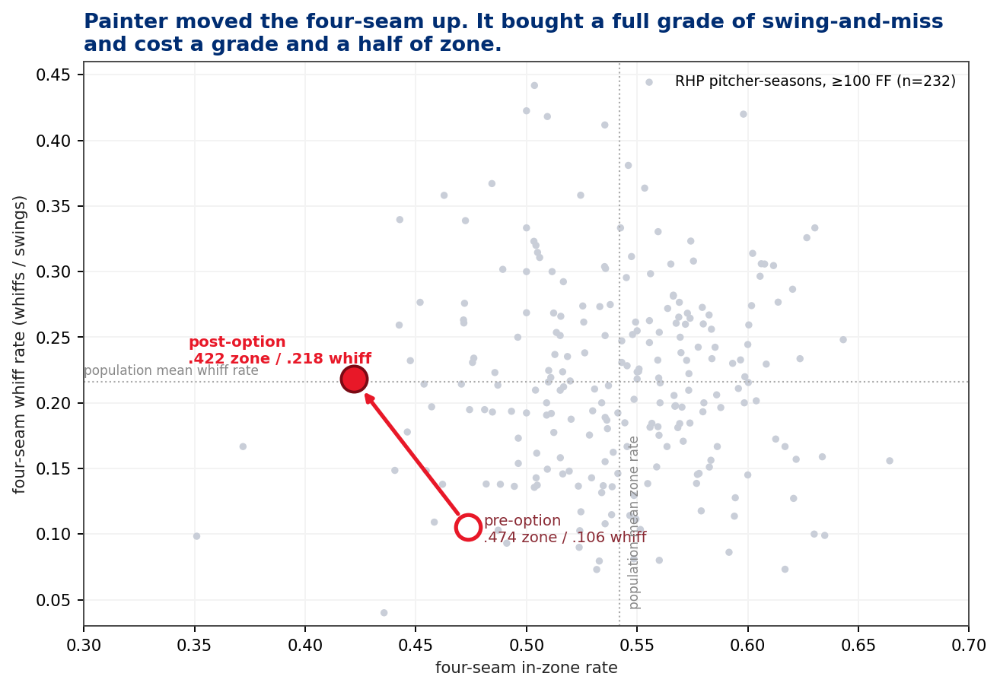
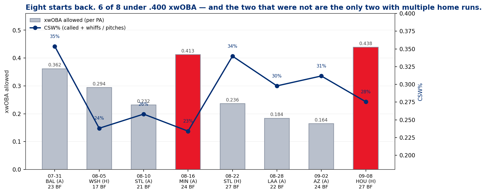

# Advance Scout — Andrew Painter (RHP) vs the Atlanta Braves
### Philadelphia @ Atlanta · Truist Park · 2026-09-13 · Series Game 3 · vs RHP Grant Holmes

**Prepared for:** manager / pitching coach / catcher / Painter — advance meeting
**Throws:** R · **Arsenal:** 6 pitches (FF, ST, CH, SL, SI, CU) — *one of them did not exist in June*
**Governance:** Use Case #44 (`uc-pps-030`), build `dp_uc44`. KPIs inherited verbatim from `Baseball Functions.ipynb` via `dp_uc43_kernel`. Seven new governed objects introduced here (SG-1…SG-5, AR-1, PM-1), all provisional. Full trail: `Agents for Data Products/data-products/uc-pps-030-painter-vs-braves-001/`.

> ⚠️ **Read this first — data window & sample sizes.**
>
> - **Entity lock:** `pitcher == 691725` (MLBAM), never a name filter. Resolves to exactly one `player_name`. Opponent starter locked to `656550` (Grant Holmes), confirmed externally, not inferred.
> - **Source:** `data/phillies/phils_2026.parquet`, regular season only, current through **2026-09-12** (T-1). 52 spring-training pitches excluded. Target game is D+1.
> - **The grading window is the 8 starts since the option** (2026-07-31 → 09-08): **720 pitches, 185 PA**. The 14 starts before it (1,141 pitches, 299 PA) are shown for contrast, **not blended**.
> - **Small samples, printed everywhere.** The by-stand, by-pitch cells run 7–131 pitches. Every rate in this report carries its denominator. Nothing below 50 pitches gets a grade; nothing below 25 swings gets a whiff grade. The curveball (16 pitches) is therefore **ungraded**, on purpose.
> - **Head-to-head with Atlanta is 47 PA, all of it from April**, and against an arsenal he has since turned over by **33%**. It is history, not evidence.
> - **Manual carry-ins from the client, accepted as given and not verified in the log:** the Phillies are three games up on Arizona and one back of the Cubs for the top wild-card seed; Atlanta is out of reach; Holmes starts tonight. None of this is in the parquet.
> - **Descoped:** arm-slot analysis. `arm_angle` is null on 54% of the graded window (DQ-6 FAIL). uc-pps-023's arm-spread finding cannot be refreshed on this cache and is not restated here.

---

## Bottom line

**1 · Your notecard is right three times, and one of those three is about a pitcher who no longer exists.** All three numbers reconcile to the log exactly. But "Plus FS — 39.5% whiff to LHB" is **.395 on 76 swings, every one of them thrown before June 18**. Painter has thrown **zero splitters in eight starts back**. The four-seam line (21.8% whiff, 17.0" of ride) is the *current* pitcher; the splitter line is the one who got optioned.

**2 · He replaced the splitter with a changeup, and the changeup is now the best pitch he throws.** 22% usage, 90.5 mph (+3.1 on the splitter), 12.8" of arm-side run (+3.0), **.160 xwOBA allowed — a 75 on the results grade.** It misses fewer lefty bats than the splitter did (.301 vs .395) but the gap is **not statistically distinguishable** (z = 1.20, p = 0.23, 73 vs 76 swings), and it gives up materially less damage (.178 vs .234 xwOBA). This is not a downgrade dressed as a change. The league's splitter usage did **not** fall over the same window (4.1% in June → 5.4% in September, 6 arms throwing 165 of them), so this is a pitcher decision, not a classifier artifact.

**3 · The four-seam bought swing-and-miss with strikes, and the bill comes due in pitch count.** Elevation rate went .307 → **.349** (population mean .200, sd .076 — a **70** on the elevation grade). Whiff doubled, .106 → .218; **stuff grade 35 → 50**. In-zone rate fell .474 → .422 — **command grade 25**, two and a half standard deviations below the population. That 25 is not wildness: his overall first-pitch-strike rate *improved* (.612 → .638) and his three-ball rate *fell* (.096 → .065). It is a deliberate trade, and it costs him 90 pitches a start for 23 batters.

**4 · The platoon has flipped, and Atlanta is built to exploit the new weak side.** Post-option he misses **32.2%** of righty swings and **23.8%** of lefty swings (z = −1.78, **p = 0.075** — directional, not significant, so read it as a lean, not a fact). Strikeout rate: **29.7% vs RHH, 18.1% vs LHH.** Of Atlanta's nine most-used bats against Philadelphia this year, **six hit left-handed**.

**5 · The Houston start was a home-run start, not a command start — and the fix is a pitch-selection fix against lefties.** 27 BF, 6 K, 2 BB, CSW 27.6% (normal for him), but **.438 xwOBA and .550 xwOBAcon on 19 tracked balls in play**. Six of eight starts back are under .400 xwOBA; the two that aren't are the only two with multiple home runs. The visible leak: **the sweeper to left-handed hitters** — 17% usage, thrown in the zone **64.5%** of the time, only a **20.0%** whiff, and **.523 xwOBA on 9 tracked plate appearances**. Tiny sample, but it is the one cell where he is both predictable and hittable.

---



---

## 1 · The card, checked against the log

Falsify-before-describe is standing policy here. Every number on the index card was recomputed from the pitch log before anything was written around it.

| Card claim | Claimed | Computed | Denominator | Window it actually describes | Verdict |
|---|---|---|---|---|---|
| High-Ride FF — 21% whiff | 0.210 | **0.218** | 24 whiffs / 110 swings | 2H cut (≥ 2026-07-21) | **Reconciles.** Full-season FF whiff is .148 |
| High-Ride FF — 16.8" vert | 16.8" | **16.97"** | 218 pitches | 2H cut | **Reconciles** (±0.2") |
| Plus FS — 39.5% whiff to LHB | 0.395 | **0.395** | 30 whiffs / 76 swings | **Full season = entirely pre-option** | **Reconciles — but stale.** 0 splitters since 06-17 |
| Lands breaking balls — above-average IZR | — | **0.477** | 767 breaking pitches | stable in both windows (.4769 / .4777) | **Confirmed: grade 55**, 68th pctile, z = +0.50 |

The third row is the finding. The number is right; the pitcher it describes was optioned to Lehigh Valley eleven weeks ago.

## 2 · The 20-80 scale, and what it is actually doing

The scouting scale is a z-score in costume. This build makes that identity explicit rather than decorative:

```
grade = clip( 50 + 10 × z , 20, 80 ),  rounded to the nearest 5
```

**Population (SG-2):** every right-handed pitcher who threw in a Phillies regular-season game, 2015–2026, with at least 100 pitches of the graded type in that season — Phillies staff *and* every opponent arm that faced them. Pitcher-seasons, not pitchers. Where that yields fewer than 25 pitcher-seasons the floor drops to 50 and the grade is stamped **THIN** (this happens only for the sweeper, n = 29).

**This is a Phillies-schedule population, not a league population.** Clubs Philadelphia plays often are over-weighted, and an arm that faced them twice counts as much as one that faced them ten times. The grades mean "relative to the arms this club actually sees." They are **not** interchangeable with a Statcast league percentile, and the report never calls them that.

**The normality assumption was tested, and it does not hold everywhere.** Whiff rate — the input to the stuff grade — passes Shapiro-Wilk at .05 for five of the six graded families (FF .062, CH .108, SL .210, SI .287, CU .277) and **fails for the sweeper (p = .015, skew +0.92)**, which is also the one population that had to drop to the lowered floor. In-zone rate — the input to the command grade — passes for FF (.078), ST (.210), SL (.310) and CU (.059) and **fails for the changeup (p = .006) and the sinker (p < .001)**. Three of the twelve headline grades on the card therefore sit on populations a purist would not z-score.

They are published anyway, for a reason that is checkable rather than convenient: every grade ships with a rank-derived twin (empirical percentile → normal quantile), and **eleven of the twelve headline grades come back identical either way**. The twelfth — slider command — differs by 5 points (z-grade 45, rank-grade 50), which is half the flag threshold. The distributions are skewed; Painter is not standing anywhere the skew matters much. The flag exists for the case where he is, and on this card it never fired.

**Shape is reported but not scored.** A pitch is worth what it misses and where it lands. Grading velocity, ride and run *into* the pitch grade double-counts the same pitch and makes a beautiful pitch nobody swings through look plus — which is precisely the four-seam's problem, and precisely what this report needs to be able to say.

| Pitch | n | Usage | Velo | Ride | Run | Whiff | Zone% | xwOBA | Stuff | Cmd | **Pitch** | Pop n |
|---|---|---|---|---|---|---|---|---|---|---|---|---|
| FF | 218 | 30.3% | 96.5 | +17.0" | −1.9" | .218 | .422 | .361 | 50 | **25** | **40** | 232 |
| ST | 178 | 24.7% | 82.5 | +1.6" | +17.0" | .304 | .506 | .304 | 45 | 55 | **50** | 29 † |
| CH | 160 | 22.2% | 90.5 | +5.0" | −12.8" | .346 | .406 | **.160** | 60 | 55 | **60** | 56 |
| SL | 97 | 13.5% | 87.7 | +2.8" | +6.8" | .324 | .433 | .312 | 50 | 45 | **50** | 92 |
| SI | 51 | 7.1% | 95.0 | +11.4" | −12.7" | .115 | **.627** | .454 | 45 | **70** | **60** | 138 |
| CU | 16 | 2.2% | 81.8 | −9.1" | +8.0" | .286 | .438 | — | — | — | **ungraded** | 45 |

† sweeper population is THIN (floor lowered to 50 pitches, n = 29 pitcher-seasons). Its grades are directional.

**Arsenal grade: 50**, covering 98% of post-option usage — up from **45** on the arsenal that got optioned. Negative plate_x is the third-base side, i.e. inside to a right-handed hitter; this convention is asserted from the data, not assumed.



Read the movement: the four-seam and the sweeper are the pitches that changed. Everything else is roughly where it was. The splitter simply leaves the chart.

## 3 · The arsenal turnover (AR-1)



**AR-1 arsenal turnover index = 0.37.** Read it as: about a third of the arsenal on either side of the option date is not shared with the other side.

| | Pre-option (14 GS) | Post-option (8 GS) | Δ |
|---|---|---|---|
| FF | 33.1% | 30.3% | −2.8 |
| ST (sweeper) | 11.4% | **24.7%** | **+13.3** |
| CH (changeup) | **0.0%** | **22.2%** | **ADDED** |
| SL | 21.4% | 13.5% | −7.9 |
| SI | 10.8% | 7.1% | −3.7 |
| CU | 8.9% | 2.2% | −6.7 |
| FS (splitter) | **14.4%** | **0.0%** | **DROPPED** |

The changeup and the splitter are not the same pitch wearing a different tag. The changeup is **3.1 mph harder, 3.1" flatter, and runs 3.0" more**. Against left-handed hitters it misses fewer bats and allows less damage — and the whiff difference does not clear significance:

| | Splitter (pre) | Changeup (post) |
|---|---|---|
| Whiff, all hitters | .384 (33/86 sw) | .346 (36/104 sw) |
| **Whiff vs LHH** | **.395** (30/76 sw) | **.301** (22/73 sw) |
| xwOBA allowed | .234 | **.160** |
| In-zone rate | .463 | .406 |

*z = 1.20, p = 0.23 on the lefty whiff gap.* The honest sentence is: **the lefty weapon was replaced, not lost.** The card's .395 should not be retired from the file — it should be re-dated.

## 4 · The four-seam trade



| | Pre-option | Post-option | Population (n = 232) |
|---|---|---|---|
| Above the zone | .307 | **.349** | .200 (sd .076) → **elevation grade 70** |
| Below the zone | .095 | .138 | — |
| In-zone rate | .474 | **.422** | .542 (sd .050) → **command grade 25** |
| Whiff | .106 | **.218** | .216 (sd .075) → **stuff grade 50** |
| Mean plate_z | 2.79 ft | 2.75 ft | — |

He moved a 96.5 mph, 17"-of-ride four-seam up above the zone and doubled its whiff rate, from a 35 to a 50. The cost is that only 42% of them are strikes, which is a 25. The 25 is the *design*, not a defect — but the design has a price, and the price is **90 pitches for 23 batters a start**, five-and-a-fraction innings when the contact goes badly.

| | Pre-option | Post-option |
|---|---|---|
| Pitches / BF | 3.82 | 3.89 |
| Pitches / start | 81.5 | 90.0 |
| BF / start | 21.4 | 23.1 |
| First-pitch strike | .612 | **.638** |
| 3-ball count rate | .096 | **.065** |

## 5 · Eight starts back: process vs results



| Date | Opp | BF | IP reached | K | BB | HR | CSW | Whiff | xwOBA | xwOBAcon | Hard-hit |
|---|---|---|---|---|---|---|---|---|---|---|---|
| 07-31 | BAL (A) | 23 | 6 | 6 | 3 | 1 | .354 | .265 | .362 | .444 | 8/14 |
| 08-05 | WSH (H) | 17 | 4 | 4 | 1 | 0 | .238 | .333 | .294 | .324 | 1/11 |
| 08-10 | STL (A) | 21 | 6 | 6 | 3 | 0 | .258 | .273 | .232 | .231 | 4/12 |
| 08-16 | MIN (A) | 24 | 5 | 2 | 3 | **2** | .234 | .143 | **.413** | .392 | 7/17 |
| 08-22 | STL (H) | 27 | 7 | 8 | 0 | 0 | .340 | .333 | .236 | .336 | 10/19 |
| 08-28 | LAA (A) | 22 | 6 | 6 | 3 | 0 | .298 | .356 | .184 | .147 | 3/13 |
| 09-02 | AZ (A) | 24 | 7 | 6 | 0 | 0 | .312 | .250 | .164 | .219 | 4/18 |
| **09-08** | **HOU (H)** | **27** | **5** | **6** | **2** | **2** | **.276** | **.264** | **.438** | **.550** | **8/19** |

The Houston start's strikeout and walk numbers are ordinary for him; its CSW is fifth of eight, inside his own range. What separates it is **.550 xwOBA on contact** and two home runs. Four of his five post-option home runs came in the two starts where xwOBA cleared .400. One start is evidence, not a verdict — but the evidence points at contact quality, not at command.

*All hard-hit counts are hits ≥95 mph over **tracked** balls in play; both numerators and denominators are printed because untracked BIP would otherwise be silently scored as soft (known defect O-8; exposure this build: 0 of 123).*

## 6 · The matchup — Atlanta

Atlanta's nine most-used bats against Philadelphia pitching this season, 2026 regular season, all Phillies arms:

| Bat | S | PA | H | HR | K | Whiff | Chase | xwOBA | vs Painter (H2H) |
|---|---|---|---|---|---|---|---|---|---|
| Ronald Acuña Jr. | R | 55 | 17 | 4 | 8 | .231 | .328 | **.447** | 7 PA, 2 H, 1 K |
| Michael Harris II | **L** | 42 | 15 | 3 | 6 | .231 | .386 | **.436** | 3 PA, 3 H |
| Austin Riley | R | 50 | 11 | 4 | 13 | .290 | .349 | .374 | 5 PA, 0 H |
| Drake Baldwin | **L** | 58 | 14 | 0 | 15 | .274 | .403 | .318 | 5 PA, 0 H, 2 K |
| Matt Olson | **L** | 54 | 9 | 2 | 10 | .277 | .306 | .312 | 5 PA, 2 H |
| Mike Yastrzemski | **L** | 23 | 7 | 0 | 6 | .176 | .298 | .307 | 5 PA, 1 H |
| Mauricio Dubón | R | 48 | 10 | 1 | 8 | .161 | .387 | .262 | 5 PA, 1 H, 1 K |
| Ozzie Albies | **L** | 54 | 12 | 0 | 5 | .198 | **.462** | .224 | 5 PA, 2 H, 1 K |
| Dominic Smith | **L** | 18 | 3 | 1 | 2 | .182 | **.467** | .217 | 5 PA, 2 H |

**Six of the nine are left-handed** — the side where Painter's whiff rate is 8 points lower and his strikeout rate 12 points lower.

**The head-to-head is not usable as a plan.** 47 PA across two April starts, maximum 7 PA for any one hitter, and the arsenal turnover between that sample and tonight is **0.33**. Harris II's 3-for-3 is three plate appearances. Every per-hitter line above is **profile-driven, not H2H-driven**, and the H2H column is printed only so nobody re-derives it and believes it.

**The exploitable pattern is chase, not damage.** Albies (.462), Smith (.467), Dubón (.387), Baldwin (.403) and Harris (.386) all expand. Painter's post-option chase rate is **.387 vs LHH** — higher than vs righties. The changeup below the zone is the pitch that rate is built on.

### The single attack rule

> **Changeup, not sweeper, to the lefties.** The changeup allows **.178** xwOBA to LHH on 31% usage. The sweeper to LHH goes in the zone **64.5%** of the time, misses **20.0%** of swings, and has allowed **.523** xwOBA — on 9 tracked plate appearances, which is why this is a usage instruction and not a claim about the pitch.

### What each side gets

| | vs LHH (94 PA) | vs RHH (91 PA) |
|---|---|---|
| Primary | FF 36.3% (.171 whiff, .332 xwOBA) | ST 32.3% (.352 whiff, .214 xwOBA) |
| Weapon | **CH 31.0% (.301 whiff, .178 xwOBA)** | **CH 13.4% (.452 whiff, .130 xwOBA)** |
| Leak | **ST 17.2% (.645 zone, .200 whiff, .523 xwOBA / 9 PA)** | SI 12.3% (.087 whiff, .468 xwOBA / 13 PA) |
| Outcome | .305 xwOBA · 18.1% K · 8.5% BB | .281 xwOBA · 29.7% K · 7.7% BB |

The changeup is his best whiff pitch **against right-handers** (.452) and he throws it to them 13% of the time. That is the cheapest available gain in the whole card.

### The other half — Grant Holmes

Locked to MLBAM 656550. Philadelphia has seen him **three times this year (260 pitches, 69 PA)** and hit him: **.372 xwOBA allowed**, .317 whiff rate against.

| Pitch | n | Usage | vs LHH | vs RHH | Velo | Ride | Run |
|---|---|---|---|---|---|---|---|
| Slider | 100 | 38.6% | 33.5% | **47.3%** | 85.0 | −5.2" | +2.2" |
| 4-Seam | 90 | 34.7% | 31.7% | 39.8% | 94.7 | +16.0" | −7.7" |
| Cutter | 20 | 7.7% | 11.4% | 1.1% | 92.0 | +11.9" | −0.8" |
| Curveball | 19 | 7.3% | 10.2% | 2.2% | 83.8 | −9.6" | +4.3" |
| Changeup | 17 | 6.6% | 9.6% | 1.1% | 89.5 | +2.2" | −14.0" |
| Sinker | 13 | 5.0% | 3.0% | 8.6% | 93.7 | +6.8" | −16.7" |

Against right-handed Phillies bats he is a **two-pitch pitcher — slider and four-seam, 87% of everything**. Against lefties he opens up to five. *Sample caveat: this is Holmes against Philadelphia only. It is not his season profile, and the repo holds no other Holmes data.*

## 7 · Game-plan takeaways

1. **Lead the lefties with the changeup and the elevated four-seam.** That pair is 67% of what he already throws them and accounts for essentially all of the swing-and-miss on that side.
2. **Cut the sweeper to left-handed hitters.** It is the only pitch in the arsenal he throws into the zone at a 64% clip while missing fewer than a quarter of swings. If it stays, it stays below the zone as a chase pitch, not above it as a strike.
3. **Throw the changeup more to right-handers.** .452 whiff, .130 xwOBA, 13% usage. Acuña and Riley are the two bats in this lineup that have actually damaged Philadelphia pitching; the changeup is the pitch he is currently under-using against them.
4. **Expect 90 pitches for roughly 23 batters.** The elevated four-seam design costs strikes. Plan the bullpen for a five-to-six-inning start, not seven, and do not read a 95-pitch fifth inning as a warning sign — it is the design working as intended.
5. **Do not re-run the April head-to-head.** 47 PA against an arsenal that is a third different. If anyone asks for Painter-vs-Acuña, the answer is 7 PA and the splitter he no longer throws.
6. **The Houston start does not change the plan.** Its process was normal; its contact quality was not. One start of .550 xwOBAcon is a data point about batted balls, not a diagnosis.

## 8 · Candid data-window & freshness caveats

- **The whole grading window is 185 plate appearances.** That is below the repo's 100-BF floor only in the by-pitch, by-stand cells — which is why those cells print denominators and why three of them (ST vs LHH at 9 tracked PA, SI vs RHH at 13, SL vs LHH at 7) are flagged in-line rather than converted into grades.
- **The platoon split is a lean, not a fact.** z = −1.78, p = 0.075. It is reported because it aligns with a mechanism (the lefty weapon changed) and with the lineup Atlanta will run. It would not survive as a standalone claim.
- **The sweeper grades are THIN.** Population n = 29 pitcher-seasons at a lowered floor. Read them as ±1 grade.
- **The benchmark is a Phillies-schedule population**, not a league one. A 60 here is not a Savant 60.
- **Arm-slot analysis is descoped.** `arm_angle` is null on 54% of the graded window. The uc-pps-023 arm-spread finding (13.8° vs a 4.25° pool median) is **not** refreshed here and should not be assumed to still hold.
- **`release_extension` is null on 1 of 720 pitches** and excluded from the mean rather than imputed.
- **One `truncated_pa`** sits in the graded window and is counted as a plate appearance by the governed `get_stats` (known defect O-5). Effect on any published rate: under one part in 185.
- **Standings, probable starters and lineup are carry-ins from the client.** Nothing in the parquet confirms who starts tonight or where anyone sits in the wild-card race.
- **AAA is not blended.** Painter's Lehigh Valley rows were loaded unweighted and used for context only; no MLB rate in this report contains a minor-league pitch.

**Artifacts:** build `dp_uc44_painter_vs_braves.py` · kernel `dp_uc44_kernel.py` · figures `dp_uc44_build_figs.py` · dashboard `dp_uc44_painter_scouting_card.html` · 21 CSV receipts + payload in `out/` · verification `dp_uc44_verification.py` · governance trail `00`–`07`.

**Closure step:** post-game backtest — projected attack plan vs actual pitch mix and results, eight checks, specified at `07_platform_marketing.md` §4. A single start records evidence, not a verdict.
