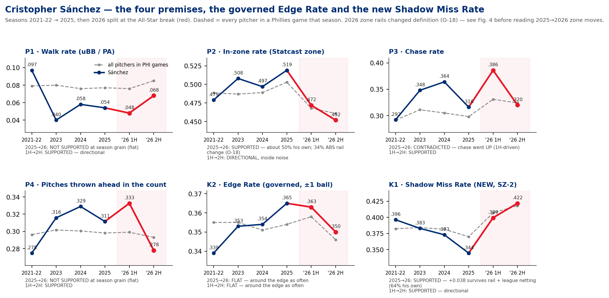
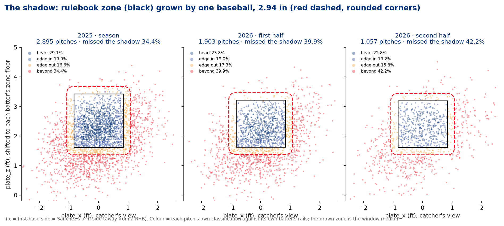
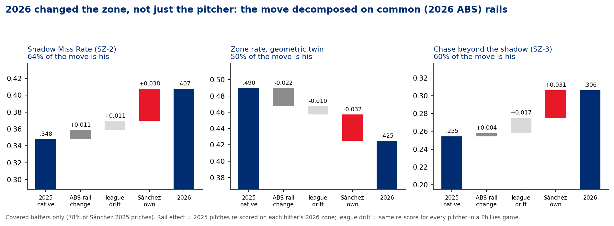
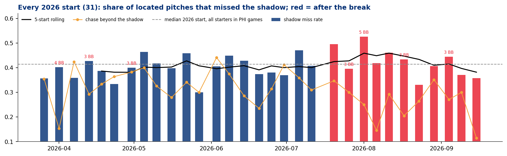
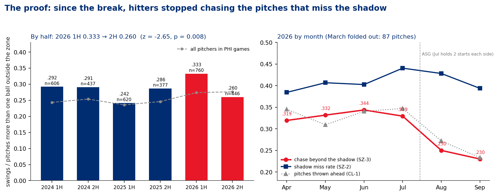
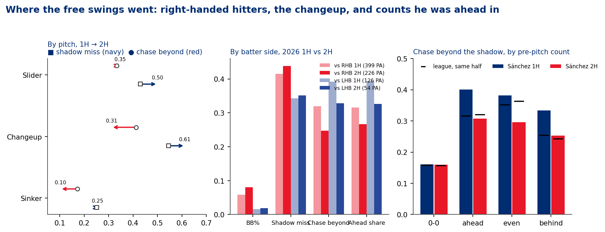

# Command Diagnosis — Cristopher Sánchez (LHP)
### Is he near the zone? · 2021–2026 · data through 2026-09-15 · prepared 2026-09-16

**Prepared for:** pitching coach · pitching analyst · catcher · manager · Sánchez

**Throws:** L · **Arsenal:** sinker, changeup, slider (every 2026 pitch)

**Governance:** Use Case #45 (`uc-pps-031`) · build `dp_uc45` · Baseball Functions kernel inherited verbatim · governed **Edge Rate** (UC8) inherited verbatim · **NEW, provisional:** Shadow Zone family SZ-0…SZ-5, CL-1 `count_leverage` (PD-7 promoted), PN-1 pitcher peer delta, ZC-1 common-rail re-score · new data finding **O-18**

> ⚠️ **Read this first: data window, sample sizes, and a rulebook change.**
> • Source: `phils_2021…2026.parquet`, regular season, deduplicated; entity lock `pitcher == 650911`. Cache current through **2026-09-15** (Sánchez started that night). 31 starts in 2026, **2,960 pitches / 805 PA**.
> • **2021 and 2022 are combined** (873 pitches, a swingman sample). Read that column loosely.
> • 2026 is split at the **All-Star break** (first half through 07-13: **1,903 pitches / 525 PA**; second half: **1,057 pitches / 280 PA**, 11 starts).
> • **The 2026 strike zone is defined differently from 2025 (O-18).** Every hitter now has one fixed zone top and bottom (the height-based ABS zone), and for the same hitters the top of the zone sits a median **0.23 ft (2.8 in) lower** than in 2025. Every pitcher's zone numbers moved. Section 3 separates Sánchez from the rulebook, so don't read a 2025→2026 zone number before you've read it.
> • Walk rate is the kernel's `bbrate` (unintentional BB / PA). Sánchez has **0** intentional walks since 2021, so here it equals public BB%.

---

## Bottom line

1. **At the season level, only one of your four premises holds up.** His walk rate is flat (**.054 → .055**), chase went **up** (.316 → .362) and so did his share of pitches thrown ahead (.311 → .313, essentially flat). His in-zone rate did drop (**.519 → .465**), but about a third of that drop is the new zone definition.
2. **Since the All-Star break, all four premises hold.** Walks **.048 → .068**, in-zone **.472 → .452**, chase **.386 → .320** (p = .008), pitches thrown ahead **.333 → .278** (p = .002). League numbers in Phillies games barely moved over the same stretch.
3. **He's around the edge as often as ever, but he misses the shadow more often.** The governed Edge Rate is flat (**.365 → .358**). His Shadow Miss Rate (share of pitches more than one baseball outside the zone) rose from **.344 to .407**. Put 2025 on 2026 rails and net out the league, and **+.038 of that is his own (64%)**. In 2025 he beat the median starter by a wide margin. In 2026 he is the median starter.
4. **The proof: hitters stopped chasing his misses.** On pitches outside the shadow, first-half hitters swung **33.3%** of the time. That spike produced the largest 2025→2026 rise in chase beyond the shadow among 11 comparable arms. Since the break it's **26.0%** (z = −2.65, p = .008), while the league held at .274 → .276. When he was ahead in the count, the rate fell from **.401 to .307**, which is league average (.320).
5. **The leak is the changeup to right-handed hitters.** In the second half, **62.1%** of the changeups he throws to righties miss the shadow (up from 54.1%), and righties chase those misses **30.2%** of the time, down from 39.9%. **Put plainly: he is missing the shadow only slightly more often than in the first half, but the misses have moved to spots hitters don't chase.** The fix is getting the changeup back into the shadow, not throwing more strikes in the heart of the zone.

---

## 1 · The premises, adjudicated

| # | Premise | 2025 → 2026 season | 2026 1H → 2H | Verdict |
|---|---|---|---|---|
| P1 | Walk rate is up | .054 → .055 (44 BB each, 809 / 805 PA), p = .98 | **.048 → .068** (25/525 → 19/280), p = .23 | **Second half only**, and directional. Add HBP and it's .051 → .082 |
| P2 | In the zone less | **.519 → .465**, p < .001; league .503 → .465 | .472 → .452, p = .29; league .468 → .461 | **Yes, but only half is his.** On common rails, 50% of the geometric drop is his own and 34% is the rail change (§3) |
| P3 | Less chase | **.316 → .362**, up, p = .008 | **.386 → .320**, p = .008; league .331 → .324 | **Season: contradicted.** A first-half chase spike hid the problem. **Second half: supported** |
| P4 | Ahead in the count less | .311 → .313, p = .89 | **.333 → .278**, p = .002; league .299 → .293 | **Second half only**, and strongly. Pitches thrown behind rose from .229 to .273, and PAs reaching three balls from .149 to .196 |

**Where "ahead" comes from.** This is the existing count-leverage definition PD-7 (`uc-pps-017`), now promoted to a function (CL-1): the share of pitches thrown with fewer balls than strikes before the pitch. First-pitch strike rate tells the same story from the other end: **.661 → .629** across the break.

**Were results actually worse?** A little. Kernel wOBA allowed rose from **.263 (2025) to .298 (2026)**, but expected wOBA only moved from **.279 to .286**, and his strikeout rate went *up* (.262 → .267). The second half is where the expected numbers moved too: xwOBA **.279 → .299**, K% .274 → .254.

---

## 2 · Edge vs shadow: two different questions, one geometry

You asked for two things. First, the edge rate you had already defined: pitches within one baseball of the zone line, inside or outside. Second, a new "shadow" measure: a target one baseball larger than the zone, and how often he misses it completely.

**The edge rate already exists and is governed.** `edge_rate(level, df)` dates to UC8, has glossary approval, carries disposition **A** in the Baseball Functions intake register, and uses the ratified constant **`BALL_FT = 2.94/12 ft`**. It is carried here verbatim. *It has not yet been pasted into `Baseball Functions.ipynb`* (escalation E-2).

**The shadow is built on the edge's geometry, so the two can't drift apart.** SZ-0 classifies every tracked pitch with the same distance function as `edge_rate`:

| Region | Definition | 2025 | 2026 1H | 2026 2H |
|---|---|---|---|---|
| heart | inside, > 1 ball from every edge | .291 | .238 | .228 |
| edge in | inside, ≤ 1 ball from an edge | .199 | .190 | .192 |
| edge out | outside, ≤ 1 ball from the perimeter | .166 | .173 | .158 |
| **beyond** | **> 1 ball outside: "missed the shadow"** | **.344** | **.399** | **.422** |

By construction, **Edge Rate = edge in + edge out**, **Shadow Zone Rate (SZ-1) = heart + edge in + edge out**, and **Shadow Miss Rate (SZ-2) = beyond**. The build asserts that SZ's edge twin matches the governed `edge_rate` in every season (max difference 0.0004, rounding only).

**Semantic consistency with other definitions in the repo.** Two other "shadow" definitions already exist. The organization reconciled against both rather than adding a fourth (`out/dp_uc45_geometry_crosswalk.csv`):

- **OZ family** (`uc-pos-005`, batter side) uses a *rectangular* ±1-ball band. It disagrees with SZ only at the four corners: **38 of 10,985** Sánchez pitches (0.35%).
- **Attack Zone** (`uc-pps-022`) calls anything within **0.33 ft** outside the zone "shadow". That constant comes from UC #11 and was still being used on 07-25, the day after the ball-width ruling, which it doesn't match. It would move **5.5%** of Sánchez's pitches from "beyond" back into the shadow. Escalated as E-3; SZ does not use it.
- The geometric zone (`plate_x`, per-pitch rails) and Statcast's `zone` attribute disagree on **4.0%** of pitches. The kernel's `in_zone_rate` (which uses `zone`) is still the governed number for P2; the geometric twin is used only where a re-score needs geometry.

---

## 3 · 2026 changed the zone (O-18) — how much of the move is Sánchez?

The 2026 cache defines the zone differently. For batters with 100+ pitches, **100% of 2026 batters have a single fixed zone top and bottom** (within-batter SD 0.000 ft, vs 0.071 in 2025). For the **32** hitters seen 100+ times in both seasons, the top of the zone fell a median **0.234 ft**, and it fell for **84%** of them. The bottom barely moved (+0.008). That matches MLB's published ABS zone: top at 53.5% of the batter's height, bottom at 27%. The external definition is used here only to explain what the data shows; it enters no computation.

Every pitcher's zone numbers moved with it. Across all pitchers in Phillies games, in-zone rate fell **.503 → .465** and Shadow Miss Rate rose **.370 → .411**.

**Two controls, and why the second one is the one to trust.**

- **PN-1 (peer-netted, native rails)** compares Sánchez with the 12 arms in the log that threw 200+ pitches in both seasons. It says his shadow-miss rise (+.063) matches the peer median (+.060). **This control is misleading here:** how much the lower zone top hurts a pitcher depends on where he locates vertically, and Sánchez lives low.
- **ZC-1 (common-rail re-score)** re-scores every 2025 pitch against the same hitter's 2026 zone (78% coverage). Measured that way, the rail change moves his 2025 Shadow Miss Rate only from **.348 to .359**. The league re-scored the same way moves only **+.011** from 2025 to 2026.

| Metric (covered batters) | 2025 native | Rail change | League drift | **Sánchez's own** | 2026 |
|---|---|---|---|---|---|
| Shadow Miss Rate | .348 | +.011 | +.011 | **+.038 (64%)** | .407 |
| Zone rate, geometric | .490 | −.022 | −.010 | **−.032 (50%)** | .425 |
| Chase beyond the shadow | .255 | +.004 | +.017 | **+.031 (60%)** | .306 |
| Edge Rate | .351 | +.010 | −.005 | +.003 | .358 |

Re-run on common rails, PN-1 agrees with ZC-1. Against the 11 covered arms, Sánchez's Shadow Miss Rate rose **+.027 more than the peer median** (4th-largest rise), his zone rate fell **−.031 more** (3rd-largest drop), and his chase beyond the shadow rose **+.039 more, the largest rise in the group**.

---

## 4 · So is he near the zone?

**He's near the edge as often as ever, and missing the shadow more.** Both of the outcomes you described are happening, in sequence:

- **All season, he has missed the shadow more often.** This is real and not just the rulebook: +.038 of his own. In 2025 his median start missed the shadow **.371** of the time in the first half and **.311** in the second, against a field median of about .37. In 2026 his median start is **.401 / .418** against a field median of **.413 / .415**. He went from elite to average at this.
- **Since the break, the misses land farther outside and in different spots.** The median miss lands **0.659 ft** beyond the zone perimeter, up from 0.595 in the first half. Low misses fell from **55.9%** of misses to **43.5%**. Glove-side misses (in on a right-handed hitter's hands) rose from **14.9% to 23.8%**, and high misses from 2.9% to 5.4%. A low miss gets chased; a miss in on a righty's hands or up usually doesn't (`dp_uc45_miss_direction.csv`).

---

## 5 · The proof — chase when the pitch is outside the shadow

| 2026 split | Beyond-shadow pitches 1H / 2H | Chase 1H → 2H | p | League, same split |
|---|---|---|---|---|
| All pitches | 760 / 446 | **.333 → .260** | .008 | .274 → .276 |
| vs RHB | 617 / 376 | **.319 → .247** | .016 | .279 → .273 |
| vs LHB | 143 / 70 | .392 → .329 | .37 | .270 → .280 |
| Changeup | 407 / 218 | **.413 → .312** | .013 | .319 → .305 |
| Sinker | 203 / 127 | .172 → .102 | .08 | .216 → .200 |
| Slider | 150 / 101 | .333 → .347 | .83 | .311 → .302 |
| Pitcher ahead in count | 322 / 166 | **.401 → .307** | .043 | .315 → .320 |
| Two strikes | 284 / 148 | .416 → .378 | .46 | .365 → .384 |

**How to read this.** In the first half, hitters chased his misses far more than the league did: .333 against .274, and .401 against .315 when he was ahead. That was his highest half since 2023, and it covered for a shadow-miss rate that had already risen. **In the second half that chase fell back to league level.** He kept missing the shadow as often (.399 → .422, p = .23), but those misses stopped turning into free strikes. Counts went the other way: pitches thrown ahead .333 → .278, three-ball PAs .149 → .196, walks .048 → .068.

The month view says the same thing: chase beyond the shadow ran **.319 / .332 / .344 / .329** from April through July, then fell to **.250** in August and **.230** in September.

---

## 6 · Where it leaks

- **Right-handed hitters are the problem.** Against RHB in the second half: BB% **.080** (226 PA), Shadow Miss Rate **.438**, chase beyond the shadow **.247**, and pitches thrown ahead **.267**. Against LHB the season Shadow Miss Rate is flat (.342 → .346) and so is the walk rate (.017 in 2026).
- **The changeup accounts for most of it.** Against RHB its Shadow Miss Rate went **.541 → .621** (695 → 330 pitches) and its beyond-shadow chase **.399 → .302**. The pitch still misses bats when hitters swing (whiff **.438 → .465**), so the problem is where it ends up, not the pitch itself.
- **The sinker is fine.** Its Shadow Miss Rate barely moved against RHB (**.270 → .256**) and it still lands in the zone **.597** of the time. It was never getting chased much (.127 → .080).
- **The slider misses more but still gets chased.** Shadow Miss Rate .430 → .500, chase .333 → .347. Watch it; it's not the cause.

---

## 7 · Your notebook cell, reproduced

The organization ran your cell as written: kernel functions, month grain for 2026, season grain for 2023–25 (`out/dp_uc45_notebook_reproduction.csv`).

| game_year | month | pitches | PA | bbrate | in_zone | chase | barrel | hard hit | FPSR |
|---|---|---|---|---|---|---|---|---|---|
| 2023 | All | 1460 | 396 | .040 | .508 | .348 | .082 | .402 | .665 |
| 2024 | All | 2797 | 755 | .058 | .497 | .364 | .054 | .345 | .658 |
| 2025 | All | 2896 | 809 | .054 | .519 | .316 | .057 | .398 | .653 |
| 2026 | 4 | 562 | 159 | .082 | .475 | .359 | .104 | .415 | .692 |
| 2026 | 5 | 504 | 143 | .021 | .478 | .388 | .053 | .436 | .671 |
| 2026 | 6 | 564 | 152 | .046 | .465 | .417 | .078 | .408 | .645 |
| 2026 | 7 | 386 | 103 | .049 | .451 | .377 | .067 | .427 | .631 |
| 2026 | 8 | 570 | 148 | .074 | .451 | .313 | .033 | .367 | .615 |
| 2026 | 9 | 287 | 79 | .063 | .456 | .308 | .100 | .350 | .620 |

March (1 start, 87 pitches) is in the receipt and left out here. **Known-defect exposure in this cell:** `whiff_rate`'s inner join (D-1/D-2) would drop **2** of 135 appearances (2021–26) at game grain but drops nothing at month grain. `fpsr` returns only groups that threw at least one first-pitch ball, which drops **1** appearance at game grain. `chase_rate` counts a null `zone` as in-zone (D-7): **1** pitch in 2025. `hard_hit_rate` counts untracked balls in play as not hard-hit (O-8): **8** balls in play. None of these changes a published number.

---

## Actions

**Pitching coach / Sánchez.** The target is the shadow, not the heart of the zone. Adding strikes over the middle would give up damage he isn't currently allowing (xwOBA on contact is only .361 → .365 across the break). **Get the changeup to righties back within one baseball of the zone**: its misses have drifted from low and chaseable to far outside and easy to take. Measure progress by Shadow Miss Rate on that pitch against RHB (2026 2H vs RHB **.621**; 2025, both sides, **.490**).

**Catcher.** When he's ahead, righties have stopped chasing (.401 → .307). Set the target *inside* the shadow on the chase pitch; a target at the bottom edge is being missed by more than a ball.

**Analyst.** Any 2025→2026 zone comparison should go through ZC-1 (common rails) first. Peer-netting on native rails hides the fact that low-zone pitchers were affected less by the lower zone top (O-18). Tripwires are armed in `07` §4.

**Manager.** Results have moved less than process: season xwOBA is .279 → .286. Treat this as a location problem with one pitch against one side of the plate, not a general decline.

---

## Candid data-window & freshness caveats

- **Sample sizes.** The second half is **11 starts, 280 PA**. Walk-rate and in-zone changes across the break are *directional* (p = .23 and .29). The chase and count-leverage changes are the ones that clear significance.
- **O-18 is a definition change, not a data error.** ZC-1 covers only batters who appear in 2026 (78% of Sánchez's 2025 pitches). The Statcast `zone` attribute can't be re-scored, so P2's decomposition uses the geometric twin, which disagrees with `zone` on 4.0% of pitches.
- **The PN-1 cohort is thin** (12 arms native, 11 on common rails) and mixes Phillies staff with opponents who pitched a lot against the Phillies. It is a Phillies-schedule cohort, not a league cohort.
- **League controls are every pitcher who pitched in a Phillies game**, not MLB as a whole.
- **Not examined here:** release point and arm angle (`arm_angle` is only 77.7% complete for Sánchez in 2026 — DQ-17 WARN), catcher effects (a battery split needs the catcher × game receipt), ABS challenge outcomes (not in the cache), and pitch-shape changes.
- **wOBA method.** Kernel wOBA (FanGraphs weights over PA) sits about .01 below Statcast's `woba_value` scale, as documented in `uc-pps-019` §05. The kernel number is the governed one.
- **The 20-80 scouting grades (SG-1) were considered and not used.** Under a single zone definition, the pitcher-season population in the log is only 13 arms at 500 pitches — too few to grade against.

*Receipts: `out/dp_uc45_*.csv` (29) · figures `out/dp_uc45_fig1…fig6` · interactive: `dp_uc45_command_dashboard.html` · governance: `00`–`07` in this folder.*
