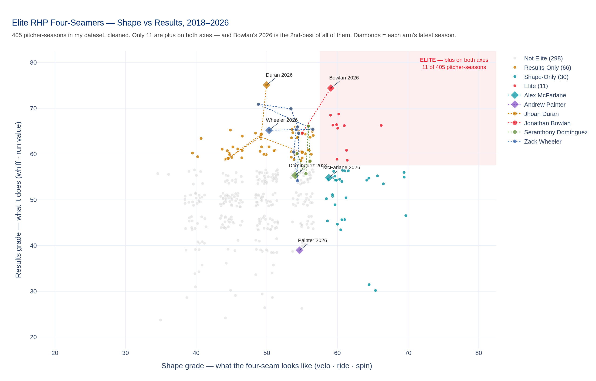
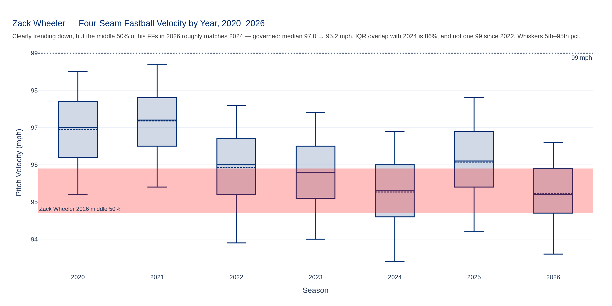
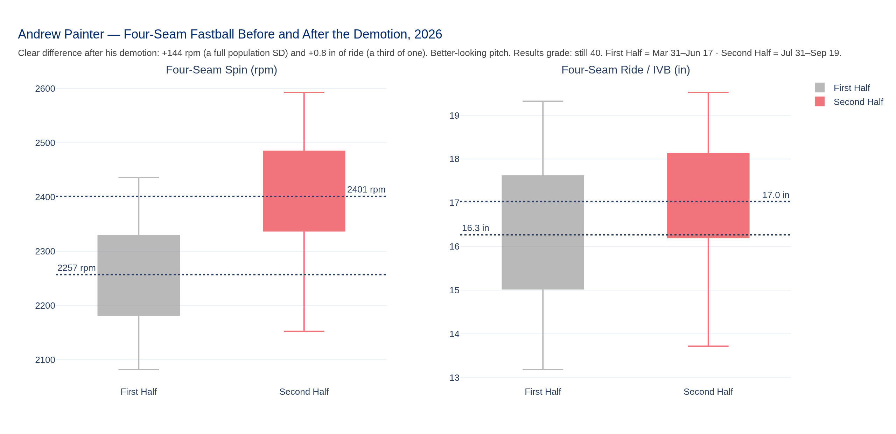
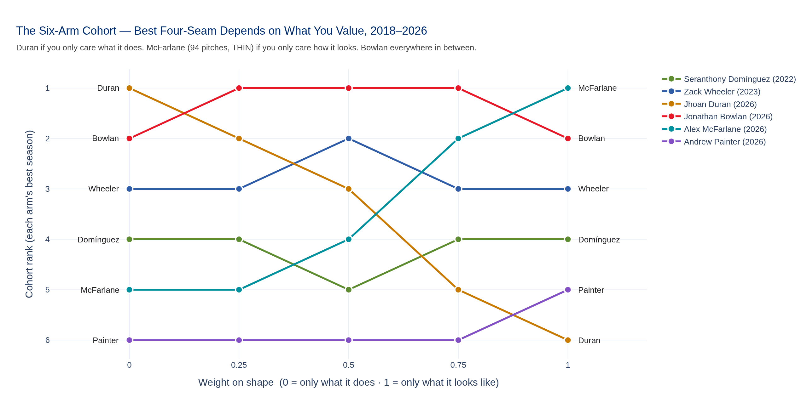
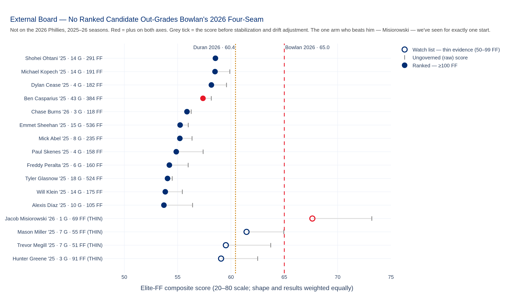
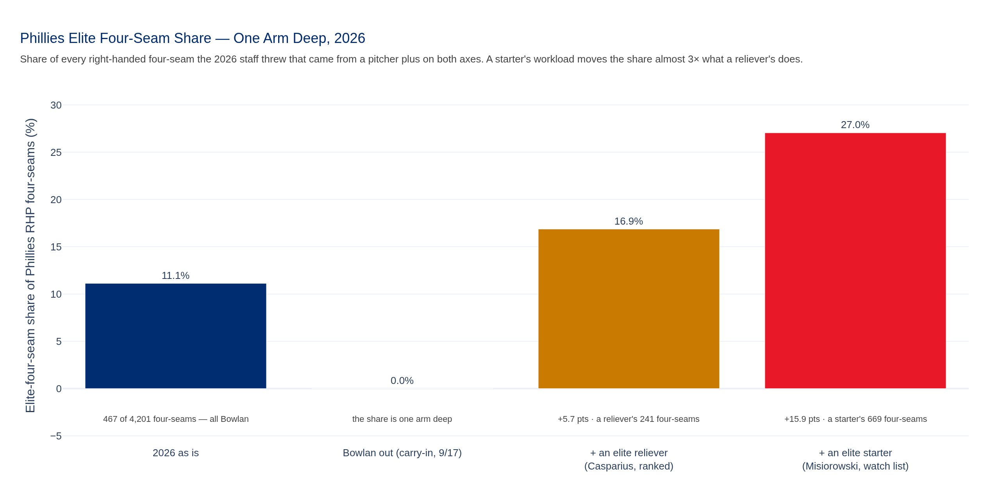
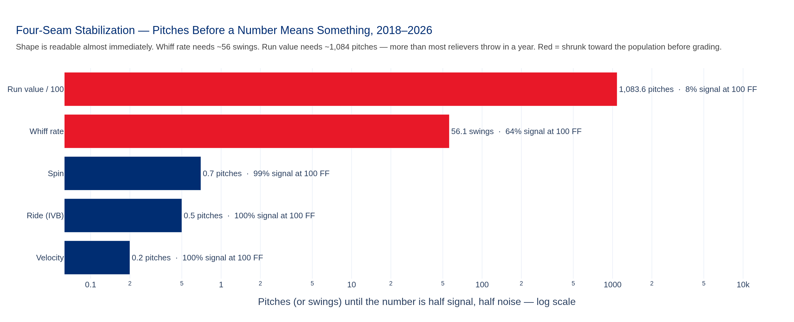

# Eleven Percent, All of It Bowlan
### Archetype Gap Analysis · pilot: the Elite RHP Four-Seamer · Phillies-affiliated cohort + external gap board · 2018–2026 · data through 2026-09-20

**Prepared for:** Kellen Short (DPO) · front office · pitching staff
**The question:** *Given the 2026 roster, which player archetype — and which player embodying it — would move the needle most if added?* Pilot archetype: the elite right-handed four-seam fastball.
**Governance:** Use Case #47 (`uc-pps-032`), build `dp_uc47`, value stream `pps` with a scope note (DPO decision 9). Grading engine inherited from `uc-pps-030` (SG-1 / SG-2) — this is its second use. Full trail: `Agents for Data Products/data-products/uc-pps-032-elite-rhp-ff-archetype-gap-001/`.

> ⚠️ **Read this first — what this frame is and is not.**
>
> - **It is not MLB-wide** (DPO decision 11). The population is every right-handed four-seam in *your dataset* — the Phillies logs plus the 128 `nphl` files — cleaned: **164,755 minor-league rows removed, 30,229 rows that duplicate the Phillies logs removed, 17,464 internal duplicates removed.** 405 pitcher-seasons, 2018–2026, ≥100 four-seams each. A 60 here is not a Savant 60.
> - **It is aspirational** (decision 12). No contracts, no availability, no service time. "Would move the needle" means *if he threw those four-seams for us*, not *can we get him*.
> - **Entity locks** by MLBAM id: Wheeler 554430 · Painter 691725 · McFarlane 686934 · Duran 661395 · Bowlan 680742 · Domínguez 622554. One external identity check (694819 = Jacob Misiorowski) — identity only, no data.
> - **Every grade is in 2026 terms.** The league throws +0.16 mph and +8 rpm harder every season; velocity and spin are drift-adjusted before grading. Ride, whiff and run value did not drift and are left alone.
> - **Thin evidence is labelled, not hidden.** McFarlane has 94 four-seams (graded, stamped THIN). External arms with fewer than 100 four-seams in a season go on a **watch list**, not the board.
> - **Carry-in, not data:** Bowlan left the 9/17 game at Citi Field with what looked like an oblique (your notebook, `September 2026.ipynb` cell 85). Nothing in the parquet says so. Every scenario that uses it says "carry-in".

---

## The short version

**1 · The best four-seam in the room is Jonathan Bowlan's, and it's the second-best in the entire frame.** 97.0 mph, 18.0 inches of ride, a .370 whiff rate, +2.27 runs per 100. Plus on both axes — shape **60**, results **75**, composite **70** — and **#2 of 405** pitcher-seasons since 2018, a hair behind Walker Buehler's 2020. Only **11** of the 405 are plus on both axes. The Phillies own one of them.

**2 · That one arm is the entire elite-four-seam share.** Of the **4,201** four-seams Phillies right-handers threw in 2026, **467** came from an arm that's plus on both axes — **11.1%**, every one of them Bowlan's. Take him out (carry-in) and the share is **zero**.

**3 · Nobody out there that we've actually seen throws a better one.** On the board of external arms with a real season of evidence (≥100 four-seams, 2025–26), the best is Shohei Ohtani's 2025 at **58.5** — below Bowlan's **65.0** and below Duran's **60.4**. Only **one** ranked arm clears both bars: **Ben Casparius**, a Dodgers reliever. The one pitcher who out-grades Bowlan — **Jacob Misiorowski, 101.7 mph** — we've seen for **one start**.

**4 · The needle lives in the rotation, not the pen.** A starter's workload is **669** four-seams; a reliever's is **241**. An elite reliever moves the share **+5.7 points**. An elite starter would move it **+15.9**. The rotation's four-seams score 57 (Wheeler), 46 (Rangel), 45 (Painter) and 39 (Nola) — that is where the gap actually is.

**5 · Your notebook was right more often than not.** Wheeler's velocity *is* trending down and 2026 *does* match 2024; Painter's spin and ride *did* jump after the demotion; Bowlan's ride *is* exceptional and his spin *isn't*. The Duran "70 FF" card is half right: it's a 75 on what the pitch does and a 50 on what it looks like.

---

## 1 · Citi Field, the eighth inning

*(From your notebook, September 17 — not from the parquet.)* For the second night running a Phillies starter had gone seven scoreless and the pen needed six outs to lock down a 3–0 win. Bowlan got the eighth. Somewhere in the at-bat with Lindor he grabbed at his side, and Tim Mayza came in to finish it. Duran slammed the door.

That's the scene. Here's why it matters for this report: the pitch Bowlan was throwing is the reason this archetype exists as a question. Every one of the **467** four-seams the 2026 Phillies got from a plus-on-both-axes arm came out of his hand. The team's elite-fastball share isn't thin. It's **one arm deep**.

So the question in the notebook — *which archetype, and which player, would move the needle most?* — turns out to have a sharper version: **what does this staff look like without its only elite four-seam, and is there anyone out there who fills it?**

## 2 · What makes a four-seamer elite

Two different questions, and a fastball can answer one without the other.

| Axis | Asks | Metrics (20–80, each graded against the 405) |
|---|---|---|
| **Shape** | What does it *look* like? | Velocity · induced vertical break ("ride") · spin |
| **Results** | What does it *do*? | Whiff rate (per swing) · run value per 100 (pitcher's side) |

An axis grade is the average of its metric grades; **plus (60+) on an axis raises its flag**. Plus on both is the archetype: `ff_elite_archetype_flag`. The composite is the average of the two axes, weighted evenly unless you say otherwise (§3 shows what happens when you do).

Across the 405 pitcher-seasons it sorts like this:

| Tier | Pitcher-seasons | Share |
|---|---|---|
| **ELITE** — plus on both | **11** | 2.7% |
| Results-only | 66 | 16.3% |
| Shape-only | 30 | 7.4% |
| Neither | 298 | 73.6% |

> **One naming decision the organization made for you.** Your draft called the physical axis `ff_elite_stuff_flag`. In this repo "Stuff grade" already means the **whiff** grade (SG-4, `uc-pps-030`). Two meanings for one word is how metrics drift, so the physical axis is **`ff_elite_shape_flag`** — the house's existing word for velocity/ride/movement. Your name is kept as a retired alias in the glossary.

## 3 · The room: six fastballs, six characters

| Arm | Best season | Shape / Results | Rank of 405 | Latest | Shape / Results | Tier (latest) |
|---|---|---|---|---|---|---|
| **Jonathan Bowlan** | 2026 | 60 / 75 | **2** | 2026 · 467 FF | 60 / 75 | **ELITE** |
| **Zack Wheeler** | 2023 | 55 / 70 | 7 | 2026 · 877 FF | 50 / 65 | Results-only |
| **Jhoan Duran** | 2026 | 50 / 75 | 14 | 2026 · 241 FF | 50 / 75 | Results-only |
| **Alex McFarlane** | 2026 | 60 / 55 | 31 | 2026 · **94 FF (THIN)** | 60 / 55 | Shape-only |
| **Seranthony Domínguez** | 2022 | 55 / 65 | 39 | 2024 · 263 FF | 55 / 55 | Neither |
| **Andrew Painter** | 2026 | 55 / 40 | 339 | 2026 · 665 FF | 55 / 40 | Neither |

**Bowlan — the complete one.** Nothing on his fastball is a 70 to look at: velocity 60, ride 60, spin 55. What makes it elite is that everything is above average at once, and it misses bats like a closer's — whiff grade **75**, run value **70**. You called this in 2025 ("exceptional vert… spin? not really… whiff rate ridiculous?") and the governed grades agree with all three parts of that sentence (§6).

**Wheeler — the results without the look.** Nine graded seasons, **zero** of them elite, and that's not an insult: eight of the nine are results-only. His four-seam has never been more than a 55 to look at, and it has been a 65–70 at getting outs every year since 2021. The velocity is going the way you drew it:

**Duran — brute force.** Velocity grades **75–80** every season. Ride grades **35–45**, spin **30–40**. Averaged, that's a 50 to look at — a fastball built on velocity alone. And then it goes out and grades **75** on results, **#14** of 405 in 2026. It's the clearest case in the frame for why shape and results have to be graded separately: combine them early and Duran's fastball looks average; it isn't.

**McFarlane — the look without the proof.** 99.96 mph and 2,573 rpm: velocity **70**, spin **70**. It's a genuinely plus shape. It's also **94 pitches**. Results sit at 55. He's graded because he clears the 50-pitch subject floor; he's stamped THIN because he doesn't clear the 100 that population members need. Ask again in May.

**Seranthony — the one that got away, twice.** Best in 2022 (whiff grade 70). By 2024 it had slid to 55 / 55 — above average, no longer plus — and there's no graded 2025 or 2026 season for him in the frame — so he isn't on the external board either.

**Painter — a better-looking pitch that still isn't landing.** Your charts caught something real: after the demotion his four-seam spun **+144 rpm** harder — a full population standard deviation — and carried **+0.76 inches** more. It *looks* better. It still misses **16.0%** of swings (grade **40**) and costs **1.96 runs per 100** (grade **35**). Shape 55, results 40: **339th of 405**.

### Who's best depends on what you value

The composite weights shape and results evenly. That's a choice, and choices are knobs, so here is the knob turned all the way both ways:

If you only care what the pitch does, it's **Duran's**. If you only care how it looks, it's **McFarlane's** — on 94 pitches. **Bowlan** wins at every weight in between (0.25, 0.50, 0.75) and is second at both extremes. That's the most defensible "best" a composite can give you: not the top of one ranking, but never worse than second on any of them.

## 4 · Out there: the external board

**Who's eligible:** anyone who didn't throw a pitch for the 2026 Phillies, graded on his most recent 2025–26 season. **Who's ranked:** only seasons with ≥100 four-seams — the same bar the population had to clear. That gives **55 ranked arms** and a **63-arm watch list**.

| # | Arm | Season | Evidence | Shape / Results | Score | Tier |
|---|---|---|---|---|---|---|
| 1 | Shohei Ohtani | 2025 | 14 G · 291 FF · complete | 55 / 60 | 58.5 | Results-only |
| 2 | Michael Kopech | 2025 | 14 G · 191 FF · complete | 65 / 55 | 58.5 | Shape-only |
| 3 | Dylan Cease | 2025 | 4 G · 182 FF · partial | 65 / 55 | 58.2 | Shape-only |
| 4 | **Ben Casparius** | 2025 | 43 G · 384 FF · complete | **60 / 60** | 57.4 | **ELITE** |
| 5 | Chase Burns | 2026 | 3 G · 118 FF · partial | 70 / 45 | 55.9 | Shape-only |
| 6 | Emmet Sheehan | 2025 | 15 G · 536 FF · complete | 55 / 55 | 55.2 | Neither |
| 7 | Mick Abel | 2025 | 8 G · 235 FF · complete | 60 / 55 | 55.2 | Shape-only |

Three things jump off it.

**The gap is negative.** The best external four-seam on real evidence grades **6.5 points below** Bowlan's. Even with Bowlan out (carry-in), it's **1.9 below** Duran's. For this archetype, the Phillies aren't chasing the league — they're one arm ahead of the frame and one injury from level.

**Only Casparius is the archetype.** Plus on both axes, 43 games, 384 four-seams, 96.1 mph with 17.9 inches of ride and a .333 whiff rate. Nobody will write a feature about it. It's the only ranked fastball outside Philadelphia that clears both bars.

**The most electric fastball in the frame belongs to a pitcher we've seen once.** Jacob Misiorowski faced the Phillies on June 12: **69 four-seams at 101.7 mph and 2,618 rpm, 23 whiffs on 40 swings.** Stabilized, that .575 whiff rate comes back to .364 — and he *still* grades **65 / 70**, a **67.6**, the only external arm above Bowlan. One start is one start. That's why he's on the watch list, and why he's the most interesting name on it.

Mick Abel, a Phillie as recently as 2025, is seventh. Paul Skenes is eighth — a 65 on results and a 45 on shape, because his four-seam carries only 11.7 inches.

## 5 · The needle

Everything in §4 is a score. The notebook asked something harder: what moves *2026's* elite-four-seam share? That depends on how many four-seams the new arm would actually throw, and on whose four-seams they'd replace.

- **Elite-four-seam share (EFS):** the share of the staff's right-handed four-seams thrown by an arm plus on both axes. 2026: **11.1%**. By the shape flag alone, 17.0%; by the results flag alone, **46.6%** — this staff misses bats with its fastballs; it just doesn't do both things at once.
- **The swap:** a candidate takes a typical Phillies workload for his role — **669** four-seams for a starter, **241** for a reliever — away from the staff's lowest-graded four-seam in that role. That's an accounting device, not a roster move.

The rotation is where the math lives. The lowest-scoring rotation four-seam belongs to **Aaron Nola — 39**, 92.3 mph with a .135 whiff rate on 673 pitches, about a quarter of what he throws. That isn't a verdict on Nola, whose game is built on the other three-quarters. It's a statement about where 669 four-seams of upgrade would land.

| Arm | Role | Replaces (ledger) | Staff four-seam score | EFS |
|---|---|---|---|---|
| Shohei Ohtani | SP | Nola's 669 | **+3.1** | +0.0 |
| Dylan Cease | SP | Nola's 669 | +3.0 | +0.0 |
| Chase Burns | SP | Nola's 669 | +2.7 | +0.0 |
| Michael Kopech | RP | Richards' 241 | +0.8 | +0.0 |
| **Ben Casparius** | RP | Richards' 241 | +0.8 | **+5.7** |
| *Jacob Misiorowski (watch)* | *SP* | *Nola's 669* | *+4.6* | ***+15.9*** |

A good starter's fastball moves the staff more than an elite reliever's. Only an elite fastball moves the *share*. The one arm who'd do both is the one we've seen once.

## 6 · Your notebook, graded

House standard: reproduce your method first, then run it governed, and say which one moved.

| # | Your claim | Governed read | Verdict |
|---|---|---|---|
| HP-1a | Wheeler FF "clearly trending down" | Median 97.0 (2020) → 95.2 (2026); −0.30 mph/season, p = .021 | **Supported** |
| HP-1b | "…the middle 50% of his FFs in 2026 roughly matches 2024" | IQR 94.6–96.0 vs 94.7–95.9; **86% overlap** | **Supported** |
| HP-1c | "Not approaching that 99 mph mark like prior years" | 99+ share 3.7% in 2021; **0.0% every season since 2023** | **Supported** |
| HP-2 | Painter "has elite velo" | 96.6 mph → grade **55** | Partly — above average, not elite |
| HP-3 | Painter spin: "Clear difference after his demotion" | 2,257 → 2,401 rpm, **+1.07 population SD**, p < .001 | **Supported** |
| HP-4 | Painter ride: "Noticeably more after going down to AAA" | 16.3 → 17.0 in, **+0.34 SD** (≈3 grade points), p < .001 | Supported — small |
| HP-5 | Duran card (9/17): "70 FF" | Results **75**, shape **50**, composite **65** | Partly |
| HP-6a | Bowlan "gets exceptional vert" | Ride grade **60** in 2025 and 2026 | **Supported** |
| HP-6b | Bowlan spin: "Not really" | Spin grade 50 (2025) / 55 (2026) | **Supported** |
| HP-6c | Bowlan: "his FF whiff rate is ridiculous?" | 2025: .435 on 124 swings → **80** | **Supported** |

Two things about *how* those were drawn, not whether they were right:

- **Your comparison frame has three leaks, and none of them changed your answer.** `pd.concat([pps, pos, nphl])` for four-seams carries **9,698 duplicate pitches**, **51,435 minor-league pitches**, and **124,330 left-handed pitches**. Bowlan's 25th-percentile ride sits above **63.6%** of that frame and **64.5%** of the governed one. Same conclusion. The frame only gets cleaned once; FR-1 now does it.
- **One chart label is only true if you run the cells in order.** In the Painter velocity chart, the red band labelled *"Zack Wheeler 2026 middle 50%"* is computed from whatever `df` holds at that moment. Run top to bottom and it's Wheeler (94.7–95.9, correct). Re-run it after the ride chart reassigns `df = ap` and the same label sits on Painter's numbers. The governed build asserts every labelled band against its receipt before it draws.

## 7 · How the organization kept itself honest

**The frame.** 554,289 Phillies-log rows + 905,751 `nphl` rows → **1,219,975** regular-season MLB pitches, **zero** duplicate pitch keys. Team pulls like `giants-of-rangers-of-24` turned out to be *batter*-keyed, so a pitcher's name is only trusted from pitcher-keyed rows; everyone else is named from wild-pitch and balk text ("…by pitcher Chase Burns"), which matched the keyed names **97.9%** of the time on 242 overlapping arms (after folding accents, the five misses were suffixes and middle initials — *Henderson Alvarez III*, *Mark Leiter Jr.*, *A.J. Minter* — never a different pitcher). Five population pitcher-seasons are still unnamed and print as MLBAM ids.

**Stabilization — how many pitches before a number means anything.**

Velocity, ride and spin are readable within a handful of pitches. Whiff rate needs **~56 swings** to be half signal. Run value needs **~1,084 pitches** — more four-seams than most relievers throw in a year — so a single-season run value is mostly noise, and the grader shrinks it toward the population accordingly. That shrinkage is why Misiorowski fell from 73.2 to 67.6, and why Kopech and Ohtani traded the top spot.

**Drift.** Velocity +0.16 mph and spin +8.3 rpm per season (both p < .01) — a 2018 four-seam gets +1.3 mph and +66 rpm before it's graded. Ride, whiff and run value showed no significant trend and were left alone.

**Does the answer survive the method?**

| Variant | Population | Cohort #1 | Board #1 |
|---|---|---|---|
| Governed (stabilized + drift-adjusted) | 405 | Bowlan | Ohtani |
| No stabilization | 405 | Bowlan | Kopech |
| No drift adjustment | 405 | Bowlan | Ohtani |
| Raw values | 405 | Bowlan | Kopech |
| Phillies logs only (the `uc-pps-030` population) | 187 | Bowlan | Ohtani |
| Complete-coverage seasons only | 266 | Bowlan | Ohtani |

Bowlan is #1 in the room under all six. The top of the external board is a coin flip between two arms who both sit well below him — which is the finding.

**The scale's assumption.** A 20–80 grade assumes a bell curve. Ride and run value fail that test (Shapiro p < .001); velocity, spin and whiff pass. Every grade also ships with a rank-derived twin; they agree exactly on 80–92% of pitcher-seasons, never differ by more than 5, and the 10-point skew flag fired **zero** times.

**Scorecard:** 19 data-quality rules — **16 pass, 3 warn, 0 fail.** The warnings are permanent and on purpose: five unnamed ids, two non-normal metrics, and the frame itself not being MLB-wide.

## 8 · What this can't tell you

- **Who's available.** Decision 12 made this aspirational. Ohtani at #1 is a statement about a four-seam, not a trade idea.
- **Anyone the frame hasn't seen enough of.** 139 of the 405 population seasons are partial coverage — two starts against us, or a few at-bats against a hitter you pulled. The board's evidence floor keeps them honest; it doesn't make them complete.
- **Whether Bowlan is okay.** Carry-in. If he's out, EFS is zero and the best four-seam in the room is Duran's (results-only).
- **Left-handers, sinkers, anything else.** One archetype, by design. The engine takes a new spec, not new code (§9).
- **A 2027 projection.** Every grade is a season that already happened.

## 9 · What's next

**The engine is general.** An archetype here is a spec object — pitch, hand, era, two lists of metrics and a bar. The next one is a new instance, not a new build: an elite LHP sweeper, a ground-ball sinker, a ride-first reliever four-seam.

**Decisions for you:**
1. **Ratify SG-1 / SG-2.** This is their independent second use: the grades held their shape on a new population, the normality test was re-run, and the skew flag stayed silent. The organization recommends ratification.
2. **Adopt the rename** (`ff_elite_stuff_flag` → `ff_elite_shape_flag`), or overrule it.
3. **Pull full seasons for the watch list's top arms** — Misiorowski first. One `nphl` player file each would move them onto the board or off it.
4. **Decide whether "not MLB-wide" is permanent.** If the archetype engine becomes a trade board, it needs a league-wide pull; that's a data-sourcing project, not an analytics one.

*Chart subtitles are written in the voice of your notebook; the prose is the organization's. Every number in this report is read from `out/dp_uc47_*` receipts and re-checked by `dp_uc47_verification.py` family F against a fresh rebuild.*
