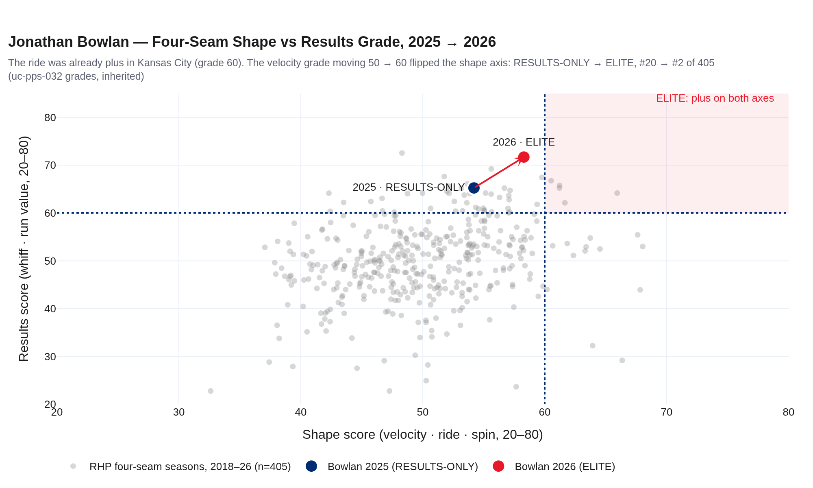
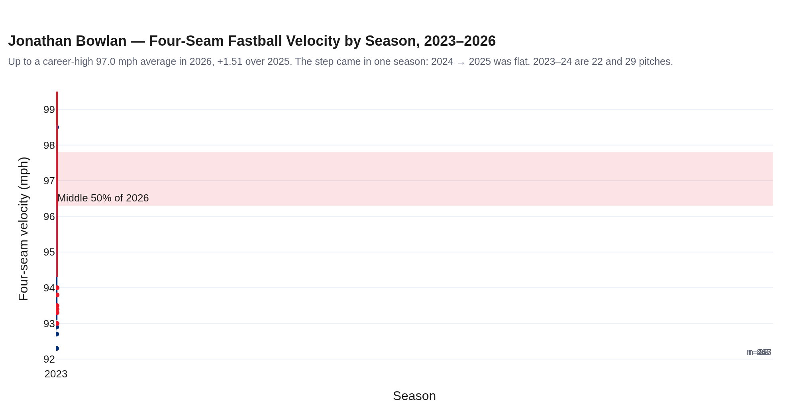
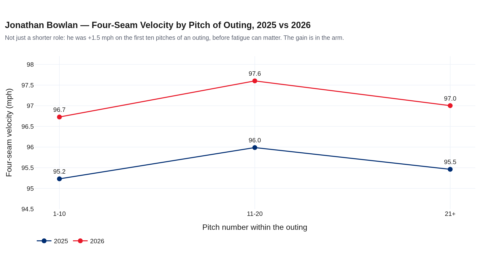
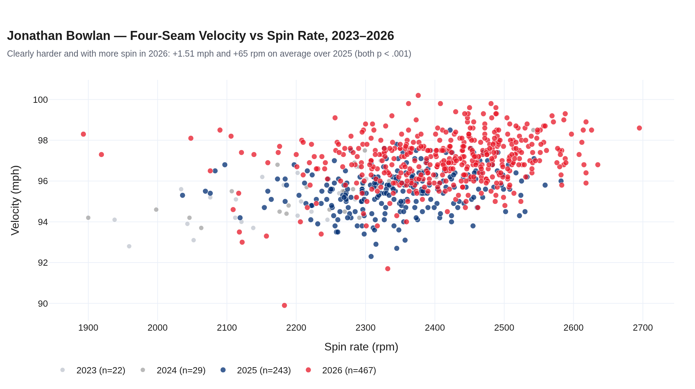
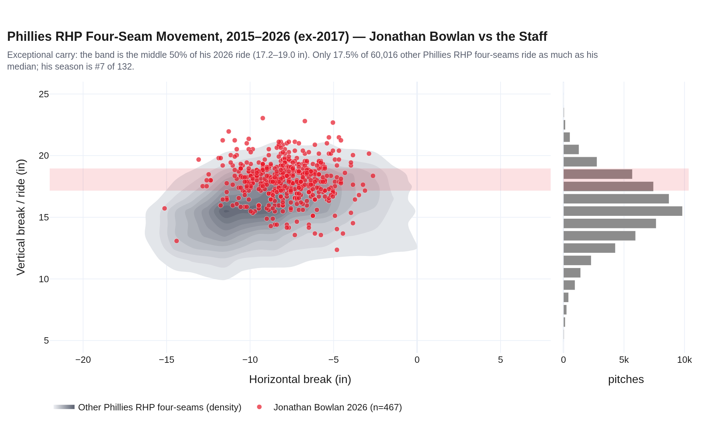
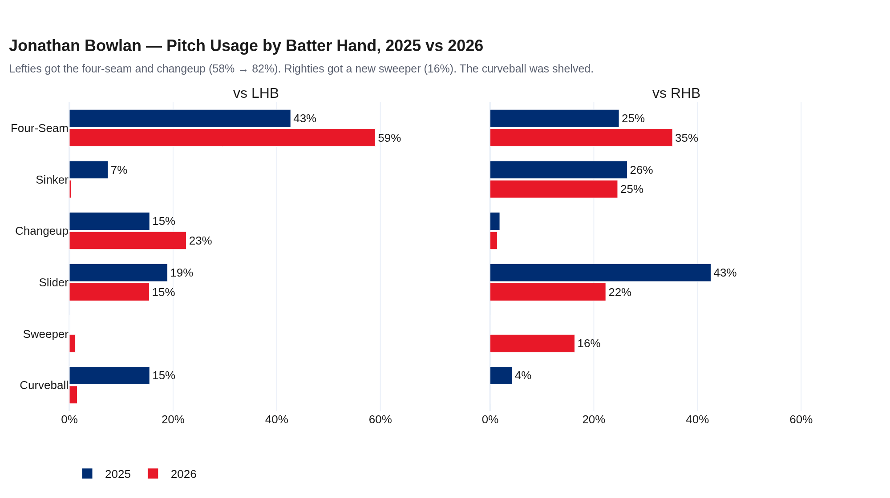
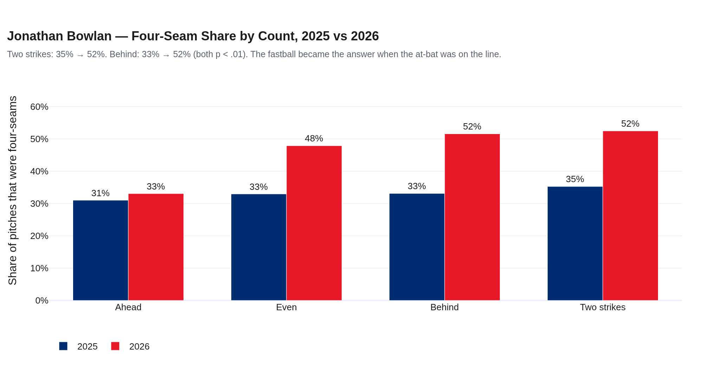
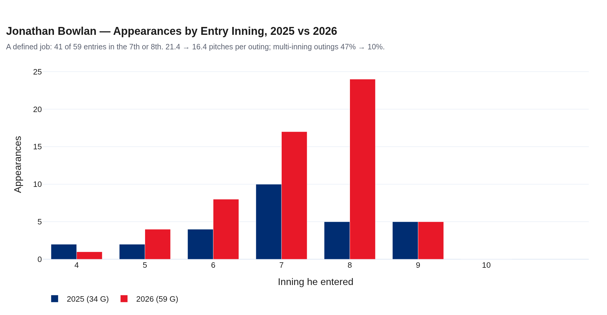
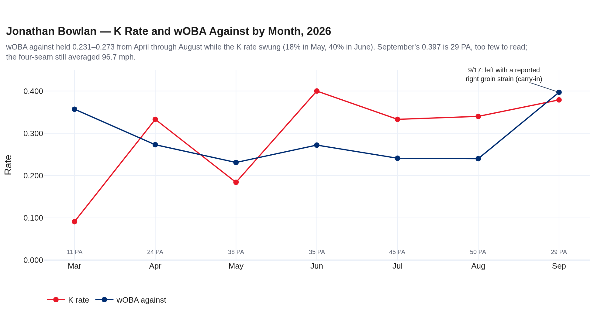

# The Tick and a Half — Jonathan Bowlan, 2026
### Season recap · RHP · Philadelphia Phillies · 59 appearances · data through 2026-09-23

**Prepared for:** front office · pitching coach · pitching analyst · catchers · manager · Jonathan Bowlan

**Arsenal (2026):** four-seam 48.3% · slider 18.5% · changeup 13.0% · sinker 11.3% · sweeper 8.0% · curveball 0.8%

**Governance:** Use Case #48 (`uc-pps-033`) · build `dp_uc48` v1.0.0 · kernel inherited by import from `dp_uc44_kernel.py` (sha256-pinned). `runs_created` and `xwobacon` are transcribed verbatim from approved house code. Four-seam grades are inherited from `uc-pps-032` and not re-graded. New objects (CF-1, SR-1, KP-1, AR-2, US-1, VE-1, CS-1, PA-1) are provisional. Independently verified; see `05_quality_certification.md`.

**Companion:** `dp_uc48_bowlan_2026_dashboard.html`, the interactive version with the persona lens and the pitch-type drill-through.

> ⚠️ **Read this first: data window and sample sizes.**
>
> - **Entity lock:** MLBAM 680742, never a name filter. Regular season only; 47 spring-training rows were excluded.
> - **Sources:** `phils_2026.parquet` (Phillies pitching, 967 pitches, anchored 2026-09-23) and `data/opponents/bowlan.parquet` (Royals 2023–25). 19 duplicated pitches (KC @ PHI, 2025-09-13) were removed by precedence.
> - **Small seasons:** 2023 is 14 PA and 2024 is 17 PA. They are context only and never drive a finding. The 2025 → 2026 comparison is 181 PA against 232 PA. That is enough to see direction, but not always enough to settle it, so every rate change below prints its p-value.
> - **Percentiles** are house-frame: 198 Phillies pitcher-seasons, 2015–2026, ≥100 PA. They are **not MLB-wide**.
> - **Carry-ins, never computed on:** the offseason trade of LHP Matt Strahm to Kansas City for Bowlan (MLB.com); the 9/17 exit, reported as a right groin strain with no IL placement (Philadelphia Inquirer, 2026-09-18). The notebook's "suspected oblique" is superseded.
> - **Persona actions are hypotheses.** Neither repository holds coaching notes, pitch calls or lab sessions. The ledger reports the *signature* an action would leave and whether that signature is present.

---

## Bottom line

1. **The Phillies bought the carry, not the ERA.** In 2025 his four-seam graded 60 on ride and 80 on whiff (uc-pps-032). He still carried a .302 wOBA against, because a velocity grade of 50 held the shape axis to 55. It ranked #20 of 405 and was RESULTS-ONLY.
2. **The tick and a half flipped the archetype.** The four-seam went from 95.5 to 97.0 mph (+1.51, p < .001) with 65 more rpm. The ride held: 17.7 → 18.0 in. The velocity grade went 50 → 60, shape went 55 → 60, and the pitch became **ELITE, #2 of 405**. The gain showed up on the first ten pitches of an outing (95.2 → 96.7), so it is in the arm and not only the shorter role.
3. **The arsenal was rebuilt by platoon, and the fastball took over the counts that matter.** Against lefties, four-seam plus changeup went from 58% to 82% of pitches. Righties got a new sweeper (16%). With two strikes the four-seam share rose 35% → 52% (p < .001); behind in the count it rose 33% → 52% (p < .001).
4. **The results followed, but only partly settled.** K rate went 25.4% → 31.5% (92nd house percentile, #2 on the staff behind Duran) and BB rate 9.4% → 6.5%. On one season of relief PA neither change is statistically settled (p = 0.18 and 0.27). The walk cut did **not** come from getting ahead: first-pitch strikes fell 67% → 60%.
5. **One inning, late, often.** He made 59 appearances (41 began in the 7th or 8th), threw 16.4 pitches per outing (21.4 in 2025) and went multi-inning in 10% of outings (47% in 2025). 38 of 59 outings were scoreless. The log shows no velocity warning before 9/17. For 2027 the questions are the **sinker** (whiff .176 → .055), the unproven **sweeper** (−6.1 RV/100 on 77 pitches), and frequency (6 back-to-backs, median 2 days' rest).

---

## 1 · The buy: what Kansas City had

| Season | G | PA | wOBA | K% | BB% | FF mph | FF ride (in) | FF shape / results | Tier (uc-pps-032) |
|---|---|---|---|---|---|---|---|---|---|
| 2023 (KC) | 2 | 14 | .395 | 21.4% | 0.0% | 94.9 | 17.2 | — | — |
| 2024 (KC) | 1 | 17 | .639 | 17.6% | 17.6% | 95.6 | 18.8 | — | — |
| 2025 (KC) | 34 | 181 | .302 | 25.4% | 9.4% | 95.5 | 17.7 | 55 / 65 | RESULTS-ONLY (#20) |
| **2026 (PHI)** | **59** | **232** | **.272** | **31.5%** | **6.5%** | **97.0** | **18.0** | **60 / 75** | **ELITE (#2 of 405)** |

The pitch did not change shape. It became faster, and speed was the only axis between it and the elite corner. A front office that grades four-seams on shape and whiff saw this in the 2025 data. One that reads ERA and wOBA did not.

## 2 · The tick and a half

Every pitch gained speed: four-seam +1.5, sinker 96.1 → 97.1, slider 85.8 → 86.8, changeup 88.4 → 90.5. When the whole arsenal speeds up at once, the usual cause is the body and the delivery, not a grip. Spin rose with the velocity (2345 → 2411 rpm).

Could the shorter role explain it? Relievers throw harder in short stints. But on the **first ten pitches** of an outing, before fatigue can matter, he went from 95.2 to 96.7 mph. The role helps; the arm did most of it.

## 3 · The carry that stayed

His 2026 four-seam ride (18.0 in) ranks **#7 of 132** Phillies RHP four-seam seasons since 2015 (≥100 four-seams, 2017 excluded). Only 17.5% of 60,016 other Phillies RHP four-seams ride as much as his median pitch. The 2017 exclusion in the notebook is justified: that season's staff four-seams average 17.3 in of ride against 14.8–15.9 in every other season (z = 5.1). That is a level shift across the whole season, not a few outliers. We do not assert a cause.

**Notebook note (O-25).** The notebook prints "18.0" for both 2025 and 2026 because `pitch_mix` rounds `pfx_z` to 0.1 ft before the ×12, so vert can only move in 1.2-inch steps. The unrounded values are 17.7 and 18.0.

## 4 · Rebuilt by platoon

| Pitch | 2025 usage | 2026 usage | 2026 mph | Whiff/swing 2025 → 2026 | xwOBAcon 2025 → 2026 | RV/100 2025 → 2026 |
|---|---|---|---|---|---|---|
| Four-seam | 33.4% | 48.3% | 97.0 | .435 → .370 | .446 → .321 | +0.1 → +2.3 |
| Slider | 31.2% | 18.5% | 86.8 | .402 → .344 | .441 → .299 | +0.7 → −0.5 |
| Changeup | 8.4% | 13.0% | 90.5 | .143 → .299 | .399 → .324 | −3.4 → −0.0 |
| Sinker | 17.3% | 11.3% | 97.1 | .176 → .055 | .187 → .393 | +4.3 → −1.4 |
| Sweeper | — | 8.0% | 84.7 | — → .269 | — → .492 | — → −6.1 |

The four-seam changed jobs. It stopped being mainly a whiff pitch and became a weak-contact pitch: fewer whiffs, far weaker contact, and run value up from +0.1 to +2.3 per 100. The changeup doubled its whiff rate after gaining 2.1 mph. **Watch items for 2027:** the sinker lost its whiff and started getting hit, and the sweeper has not earned its keep yet. Seventy-seven pitches is far too few to judge run value, which needs about 1,084 pitches to be half signal (uc-pps-032 SG-7).

## 5 · The fastball when it matters

| Rate | 2025 | 2026 | p | Read |
|---|---|---|---|---|
| Four-seam share, two strikes | 35.3% | 52.5% | < .001 | significant |
| Four-seam share, behind | 33.1% | 51.6% | .001 | significant |
| K rate | 25.4% | 31.5% | 0.18 | not settled |
| BB rate | 9.4% | 6.5% | 0.27 | not settled |
| Chase rate | 31.4% | 35.2% | 0.23 | not settled |
| First-pitch strike rate | 67.0% | 60.3% | 0.16 | opposite of "get ahead" |

The clearest change in how he was used on the mound is *when* the four-seam was thrown. The strikeout rate is his own: its 92nd house percentile ranks 15th of 198 Phillies pitcher-seasons since 2015, which fills the notebook's "xxth". It is second on the 2026 staff to Jhoan Duran. The walk cut came from winning *from behind* with the four-seam, not from getting ahead.

## 6 · The eighth-inning job

| Usage | 2025 (KC) | 2026 (PHI) |
|---|---|---|
| Appearances | 34 | 59 |
| Pitches per appearance | 21.4 | 16.4 |
| Multi-inning share | 47% | 10% |
| Entered at start of an inning | 65% | 78% |
| Entered 7th or later | 59% | 78% |
| Back-to-back days | 5 | 6 |
| Median rest (days) | 3 | 2 |

"Runs created" in the house library means every run that scored while he pitched, inherited runners included. It is not runs charged to him. The 15 outings he began with men on base produced 13 of his 30 runs. That is why runs per PA rose (.099 → .129) while wOBA fell (.302 → .272).

His last five outings averaged 96.9 mph on the four-seam, against 97.0 for the season. There was no velocity warning before the 9/17 exit.

## 7 · Persona action ledger: what people could have done, and whether the data carries its signature

| Persona | Hypothesis | Signatures | Strength | What would confirm it |
|---|---|---|---|---|
| Front Office | **FO-1** Bought the carry, not the ERA | 3 of 3 present | STRONG | Pro-scouting file / trade rationale |
| Pitching Coach | **PC-1** Added velocity to the whole arsenal | 5 of 5 present (incl. pitches 1–10) | STRONG | Strength program, lab and bullpen notes |
| Manager | **MG-1** One inning, late, mostly clean | 4 of 4 present | STRONG | The role conversation; leverage index |
| Pitching Analyst | **AN-1** Arsenal built by platoon | 4 of 4 present | STRONG | Pitch-design sessions, grip changes |
| Catcher | **CA-1** Four-seam when it matters | 2 present, K rate WEAK (p = 0.18) | SUPPORTED | Pitch calls / PitchCom sequences |
| Catcher | **CA-2** Cut walks by getting ahead | first-pitch strikes CONTRA | UNSUPPORTED | — |
| Pitcher | **PI-1** Got hitters to expand | chase WEAK, four-seam contact PRESENT | SUPPORTED | His own intent |
| Pitching Coach | **WA-1** WATCH: the sinker stopped working | 2 of 2 present | STRONG | Grip/usage intent |
| Pitching Analyst | **WA-2** WATCH: the sweeper hasn't earned its keep | present | STRONG | A season of sweepers |
| Manager | **MG-2** Workload preceded 9/17 (velocity tell) | ABSENT | UNSUPPORTED | Medical and workload records (carry-in only) |

Decision rule (PA-1, `03_governance.md` §2): a signature is PRESENT when it moves the predicted way by at least its declared threshold, and at p < .05 where a test applies. A hypothesis is STRONG when every signature is present and SUPPORTED when most are and none contradicts it.

## 8 · Your notebook, graded

22 claims from cells 115–117 were re-run by your method, then governed: **17 held, 4 partly held, 1 state hazard** (the full table is in the dashboard and `out/dp_uc48_hp_reconciliation.csv`). The ones that matter:

- **"xxth Percentile"** → **92nd** (house frame, rank 15 of 198).
- **".269 wOBA"** → .272 on the anchored log. No season-end state of the log reproduces .269.
- **"60 games, nearly doubled his career"** → 59 games. 2026 alone is **1.6×** his entire prior career (37 games).
- **"Slightly less slug"** → SLG fell 49 points, more than OBP (31 points).
- **"In-zone fastball whiff down a touch"** → −9 points (.412 → .320), not settled (p = 0.16).
- **"Maintained elite shape"** → by the uc-pps-032 bar, the shape *became* elite in 2026, because of the velocity.
- **HP-18, state hazard:** the subtitle's `gy` is whatever the `for gy in jb.game_year.unique()` loop left behind. It reads 2026 only because `nphl` is concatenated before `pps`. `season_recap()` removes the leak.
- **The Gemini 2×2:** it works in the notebook only because cell 4 imports `make_subplots`. It plotted breaks in feet while your convention is inches, and it showed 22-pitch seasons as confidently as 467-pitch ones. The governed version fixes all three.

## Candid caveats

- **Not MLB-wide.** Every percentile is against Phillies pitcher-seasons; the four-seam grade is against uc-pps-032's bounded frame of 405.
- **One season of relief.** 232 PA do not settle rate changes of 3–6 points. The significant findings are the usage shifts and the velocity; the outcome shifts are directional.
- **Persona actions are inferred from signatures.** A signature being present is consistent with an action. It does not prove the action happened.
- **Runs created is not runs allowed.** It includes inherited runners and excludes his own runners who scored after he left.
- **Run value by pitch** is noisy below about 1,000 pitches; the sweeper and changeup RV/100 are directional.
- **Carry-ins** (the trade, the 9/17 injury) are sourced, dated and never computed on.
- **Artifacts:** `out/dp_uc48_*` (receipts), `dp_uc48_verification.py` (harness), and the governance trail at `Agents for Data Products/data-products/uc-pps-033-bowlan-2026-recap-001/`.
