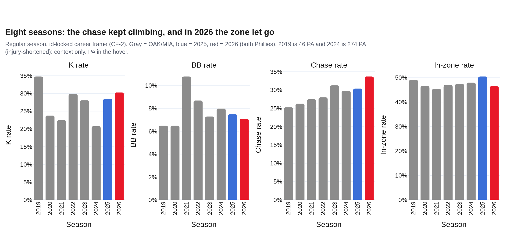
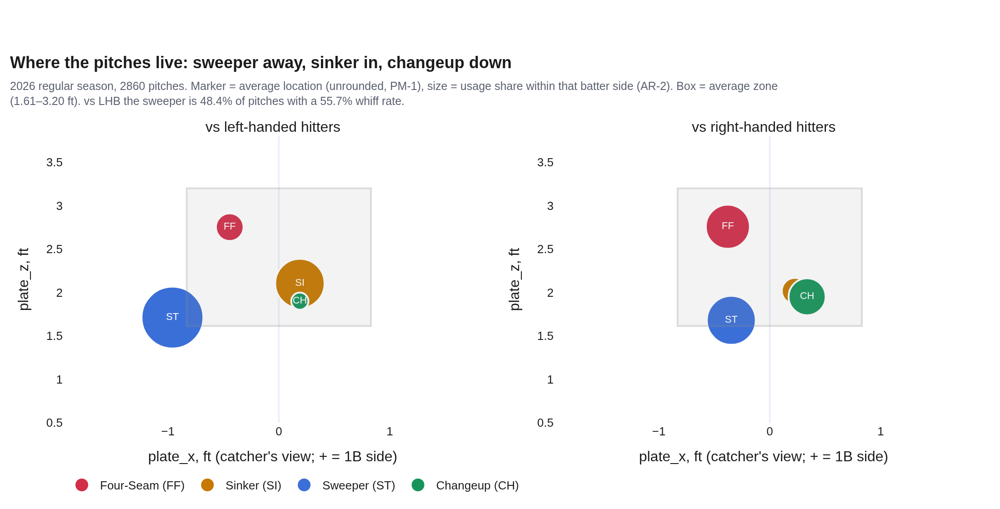
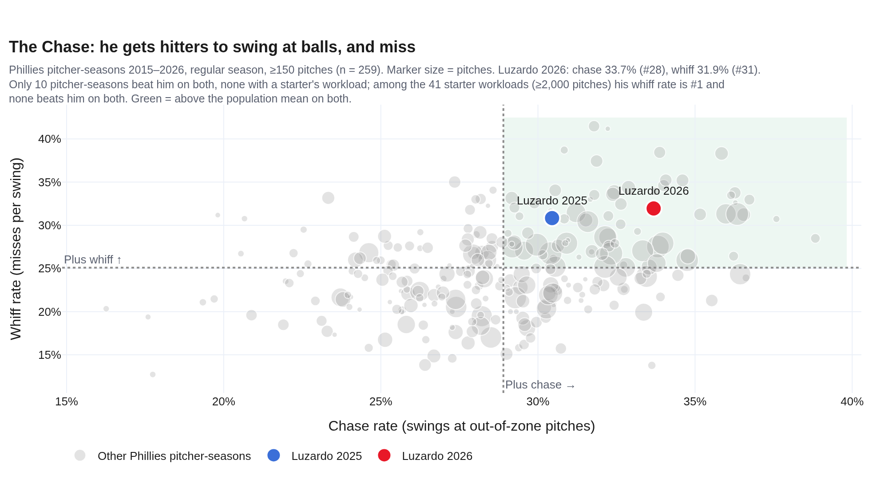
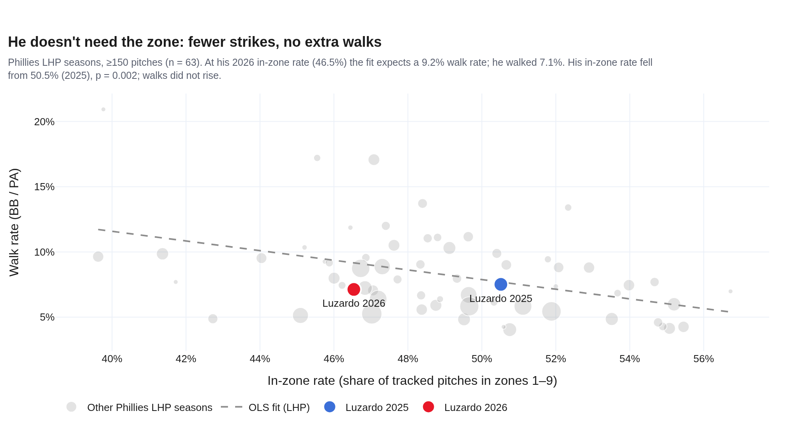
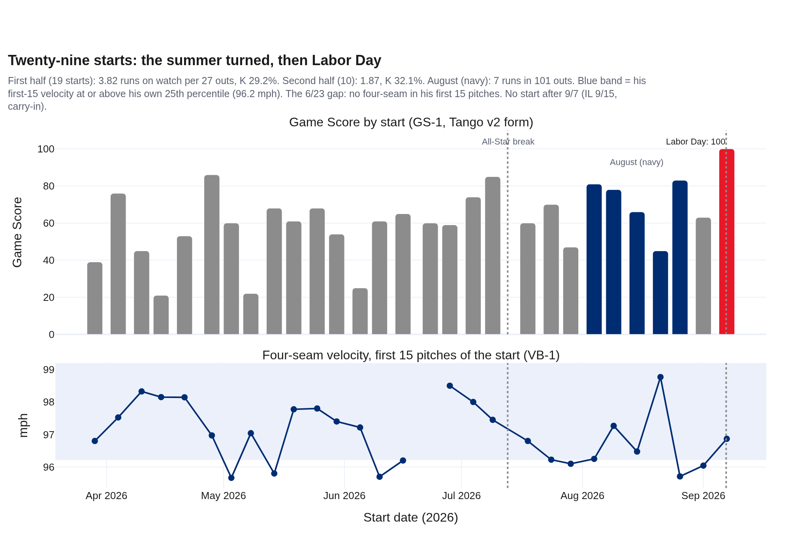
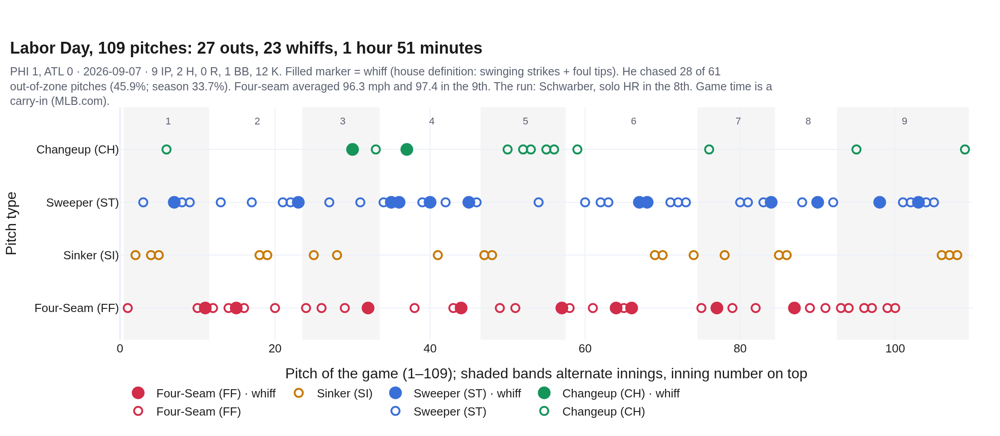
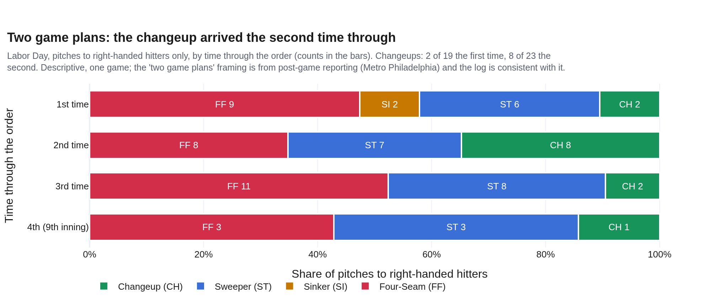
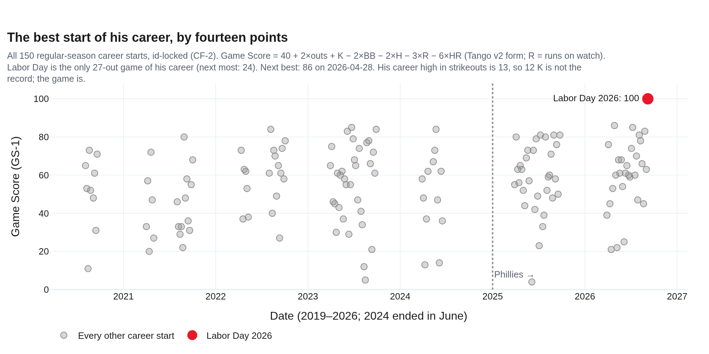

# The Chase — Jesús Luzardo, 2026
### Season recap · LHP · Philadelphia Phillies · 29 starts · data through 2026-09-26

**Prepared for:** pitching department · front office · broadcast and content · Jesús Luzardo

**Arsenal (2026):** sweeper 38.2% · four-seam 26.2% · changeup 18.3% · sinker 17.3%

**Governance:** Use Case #49 (`uc-pps-034`) · build `dp_uc49` v1.0.0 · kernel `dp_uc49_kernel.py` imports `dp_uc48_kernel` (sha256 `0f63857a…`), which imports `dp_uc44_kernel` (`a2c11909…`). `season_recap` (SR-1) is on its second use. New objects (CF-2, CX-1/1b, GS-1, OU-1, VB-1, OC-1, NF-1, BN-1) are provisional. Independently verified; see `05_quality_certification.md`.

**Companion:** `dp_uc49_luzardo_2026_dashboard.html`, the same story in eight chapters, with a drill-through on the chase board and a pitch-by-pitch replay of Labor Day.

> ⚠️ **Read this first: data window, sources, carry-ins.**
>
> - **Entity lock:** MLBAM 666200, never a name filter. Regular season for every rate; 165 spring-training rows excluded. Postseason pitches appear only in §7.
> - **Sources:** the Phillies log (2025–26, anchored 2026-09-26) and `data/opponents/luzardo.parquet` (OAK/MIA, 2019–24). His pitches also sit in 20 other opponent files (batter-keyed pulls); the career frame de-duplicates all 21 by pitch key (1,188 duplicates removed, 0 pitches added).
> - **"House" percentiles and ranks** are Phillies pitcher-seasons, 2015–2026. They are **not MLB-wide**.
> - **"Runs on watch"** means runs that scored during the plate appearances he threw (house `runs_created`). It includes unearned runs and is not ERA.
> - **Carry-ins, never computed on:** the December 2024 trade from Miami (MLB.com); the 5-year, $135M extension covering 2027–31 (MLB.com, 3/10); his first All-Star selection, named 7/7, with the game at Citizens Bank Park (MLB.com); NL Pitcher of the Month for August and the Labor Day game time of 1:51 (MLB.com, 9/7); scratched 9/12 with shoulder stiffness, 15-day IL 9/15 with shoulder inflammation, 2.87 ERA in 29 starts (Phillies Nation, 9/24); activated for Game 162 as a reliever (SI, 9/27).
> - **The shoulder.** The log shows velocity and workload. It does not show an injury, and nothing here infers one.

---

## Bottom line

1. **He missed more bats than any Phillies starter of the Statcast era.** Among 41 Phillies seasons with a starter's workload (≥2,000 pitches, 2015–2026), his 2026 whiff rate (31.9%) is **#1** (next: Wheeler 2025, 31.5%), his chase rate is #8, and no season beats it on both. Across all 259 pitcher-seasons with ≥150 pitches he is #28 in chase and #31 in whiff, and none of the 10 seasons that beat him on both carried a starter's workload.
2. **He stopped needing the zone.** His in-zone rate fell from 50.5% to 46.5% (p = 0.002) while his chase rate rose to a career-high 33.7% (p = 0.057) and his walk rate held (7.5% → 7.1%). A Phillies lefty at his zone rate would be expected to walk 9.2%.
3. **The second half was a different pitcher.** Before the All-Star break: 19 starts, 3.82 runs on watch per 27 outs, wOBA .295. After it: 10 starts, 1.87 per 27 outs, K 32.1%, wOBA .239. August was 5 starts, a 34.6% K rate and 7 runs in 101 outs.
4. **Labor Day was the best start of his career, and it is not close.** Game Score 100, #1 of 150 career starts (next best 86). It is his only 27-out game (next most: 24). Hitters chased 28 of his 61 pitches out of the zone, he got 23 whiffs, and his four-seam was faster in the ninth (97.4) than across the game (96.3). The changeup arrived the second time through the order.
5. **Then the log goes quiet, and October is the open question.** There is no pitch after 9/7. What a *defining* October would look like is written down in §8 before it happens: four signatures, each with a bar drawn from his own 2026 starts.

---

## 1 · The arrival and the bet

| Season | Team | G | PA | wOBA | K% | BB% | Whiff | Chase | In-zone | FF mph |
|---|---|---|---|---|---|---|---|---|---|---|
| 2019 | OAK | 6 | 46 | .194 | 34.8% | 6.5% | 37.7% | 25.3% | 49.1% | 96.7 |
| 2020 | OAK | 12 | 248 | .317 | 23.8% | 6.5% | 29.6% | 26.3% | 46.6% | 95.5 |
| 2021 | OAK/MIA | 25 | 436 | .373 | 22.5% | 10.8% | 29.9% | 27.5% | 45.5% | 95.7 |
| 2022 | MIA | 18 | 401 | .266 | 29.9% | 8.7% | 31.7% | 28.0% | 47.0% | 96.3 |
| 2023 | MIA | 32 | 740 | .307 | 28.1% | 7.3% | 31.4% | 31.3% | 47.5% | 96.7 |
| 2024 | MIA | 12 | 274 | .314 | 20.8% | 8.0% | 29.6% | 29.8% | 48.0% | 95.2 |
| 2025 | PHI | 32 | 759 | .289 | 28.5% | 7.5% | 30.8% | 30.4% | 50.5% | 96.5 |
| **2026** | **PHI** | **29** | **730** | **.275** | **30.3%** | **7.1%** | **31.9%** | **33.7%** | **46.5%** | **96.8** |

*2019 (46 PA) and 2024 (274 PA, season ended in June) are context only.*

The Phillies traded for him in December 2024. His first season in red was solid, and his October was better than solid: 6.0 scoreless innings in a Division Series start at home and 1.2 more in relief in Los Angeles, 23 outs without a run on his watch. In March the club bought the next five seasons.

What they were buying is in the arsenal. The slider became a sweeper in 2025, and in 2026 the sweeper became his first pitch: 38.2% of everything he threw, with a 47.6% whiff rate and the best run value in his mix (+2.1 per 100). The four-seam gave up share (34.1% → 26.2%) and the sinker grew (10.0% → 17.3%). Against left-handed hitters the sweeper was 48.4% of pitches and drew whiffs on 55.7% of swings. The sweeper-first redesign was first documented in `uc-pps-017`; this recap reproduces that product's first-half figures exactly (19 starts, K 29.2%, wOBA .198 the first time through the order and .368 the second, 4/4).

## 2 · The chase

Your notebook said it first: *he does not need to be in the strike zone, he gets chase and whiff.* The governed version of your scatter agrees and puts a size on it.

- **All Phillies pitcher-seasons, ≥150 pitches (n = 259):** chase 33.7% (#28), whiff 31.9% (#31). Only **10** seasons beat him on both, and none of them carried a starter's workload.
- **Left-handers (n = 63):** chase #7, whiff #9.
- **Starter workloads, ≥2,000 pitches (n = 41):** whiff **#1**, chase #8, and **no** season beats him on both.

The plus/plus quadrant in your chart holds 76 seasons, so being in it is not rare. Being that deep in it as a starter is.

## 3 · Letting go of the zone

| | 2025 | 2026 | p |
|---|---|---|---|
| In-zone rate (tracked pitches) | 50.5% | **46.5%** | **0.002** |
| Chase rate | 30.4% | 33.7% | 0.057 |
| Whiff rate (per swing) | 30.8% | 31.9% | 0.53 |
| K rate | 28.5% (216 of 759) | 30.3% (221 of 730) | 0.44 |
| BB rate | 7.5% (57) | 7.1% (52) | 0.78 |
| First-pitch strike rate | 67.2% | 62.6% | — |

The only change from 2025 that is statistically settled is the one that matters to the story: **he threw fewer pitches in the zone.** His first-pitch strike rate fell too. Walks did not follow. On the population fit of walk rate against in-zone rate for Phillies lefties, his 46.5% zone rate predicts a 9.2% walk rate. He walked 7.1%, a better walk residual than 79% of Phillies lefty seasons.

His K rate sits in the **89th house percentile** (#21 of 198 Phillies pitcher-seasons with ≥100 PA) and third on the 2026 staff behind Duran and Bowlan. His whiff rate is 86th (second on the staff), his chase rate 87th and his wOBA against 80th.

## 4 · The summer

| | Starts | PA | K% | BB% | wOBA | Runs on watch / outs | Per 27 outs |
|---|---|---|---|---|---|---|---|
| Before the All-Star break | 19 | 465 | 29.2% | 7.5% | .295 | 46 / 325 | 3.82 |
| After it | 10 | 265 | 32.1% | 6.4% | .239 | 14 / 202 | **1.87** |
| August alone | 5 | 133 | 34.6% | 6.8% | .237 | 7 / 101 | 1.87 |

He was named an All-Star on July 7, for the first time in his career, and the game was played in his home park a week later. The second half is where the season turned from good to the best of his career. The 2026 split by time through the order is .197 (262 PA), .333 (262) and .305 (197); the second-time-through cliff that `uc-pps-017` flagged at .368 in the first half did not come back.

His workload was a band, not a dial: 86 to 110 pitches in every start (standard deviation 6.2), with Labor Day's 109 the second-highest.

## 5 · Labor Day

**Phillies 1, Braves 0 · 2026-09-07 · 9 IP, 2 H, 0 R, 1 BB, 12 K · 109 pitches**

The log reconciles to the published box on every item it can check: 109 pitches, 2 hits, 1 walk, 12 strikeouts, 23 whiffs (22 swinging strikes plus one foul tip, the house definition), and the only run a Kyle Schwarber home run in the eighth (107.8 mph off the bat). He faced 30 batters: the 27 outs, two singles, the walk to Acuña in the ninth and a hit batter (Riley, third inning).

- **The chase, concentrated.** Braves hitters swung at 28 of his 61 pitches out of the zone (45.9%, against 33.7% for his season). 42 of his 109 pitches were called or swinging strikes (38.5%).
- **Economy.** No inning took more than 17 pitches; the fastest took 8.
- **Stronger at the end.** The four-seam averaged 96.3 mph and 97.4 in the ninth, topping out at 98.1.
- **Two game plans.** Post-game reporting described two plans, and the log is consistent with it. To right-handed hitters he threw 2 changeups in 19 pitches the first time through and **8 in 23** the second, then went back to the four-seam (11 of 21) the third time. One game, descriptive, not a tendency.

Your notebook called it *the best shift of his Major League career*. By Game Score it is: **100, #1 of 150 career starts**, fourteen points clear of the next (86, 7.0 scoreless innings against San Francisco on 2026-04-28). It is also his only 27-out game. It is **not** his strikeout high (13), which is why the verdict rests on the whole line and not the K column.

## 6 · The silence

There is no pitch in the log after Labor Day. The reporting (carry-ins): he was scratched from his next turn on 9/12 with shoulder stiffness, went on the 15-day IL on 9/15 with shoulder inflammation, threw a 30-pitch bullpen on 9/25, and was activated for Game 162 to pitch in relief.

What the log can say about the days before, and nothing more:

- His first-15 four-seam velocity on Labor Day was **96.9 mph**, against a season median of 97.0 and a 25th percentile of 96.2.
- The four-seam was **97.4 in the ninth inning**.
- One earlier start sat below his band: **8/26 at Seattle, 95.4 mph** on average (first 15: 95.7). He threw seven innings of one-hit ball that night.
- The 109 pitches were his second-highest count of the year (high: 110).

That is velocity and workload. It is not a medical record, and this report does not read one into it.

## 7 · His Octobers so far

| Date | Round | For | Home team | Role | Line | Pitches |
|---|---|---|---|---|---|---|
| 2019-10-02 | Wild Card | OAK | OAK | relief | 3.0 IP, 1 H, 0 R, 2 BB, 4 K | 46 |
| 2020-09-29 | Wild Card | OAK | OAK | start | 3.1 IP, 6 H, 3 R, 0 BB, 5 K | 59 |
| 2020-10-07 | Division Series | OAK | HOU | start | 4.1 IP, 5 H, 4 R, 2 BB, 2 K | 73 |
| 2023-10-03 | Wild Card | MIA | **PHI** | start | 3.2 IP, 8 H, 3 R, 0 BB, 5 K | 90 |
| 2025-10-06 | Division Series | PHI | PHI | start | 6.0 IP, 3 H, 0 R, 1 BB, 5 K | 82 |
| 2025-10-09 | Division Series | PHI | LAD | relief | 1.2 IP, 2 H, 0 R, 0 BB, 3 K | 30 |

*Six games, 94 batters, 66 outs, 10 runs on watch. "Home team" is the scheduled home club; the 2020 Division Series was played at a neutral site.*

The ledger holds the arc your notebook wrote about. In 2023, the season the Phillies rue, he started the Wild Card opener **at Citizens Bank Park, for Miami**, and the Phillies knocked him out in the fourth. Two Octobers later he was theirs, and he did not allow a run.

## 8 · October: what "defining" would look like, written down first

A season recap can only look back. This one also registers, on 2026-09-27 and before any postseason pitch, what his October would have to look like to be *his* October. Each bar is the edge of his own 2026 range across 29 starts, and each reads the same for a start or a relief outing.

| # | Signature | Holds when | Bar | His 2026 median |
|---|---|---|---|---|
| OC-A | Arm: four-seam velocity over the first 15 pitches | at or above | 96.2 mph | 97.0 mph |
| OC-B | The chase: share of out-of-zone pitches swung at | at or above | 29.2% | 32.6% |
| OC-C | Swing-and-miss: whiffs per 100 pitches | at or above | 12.0 | 14.0 |
| OC-D | Control: walks per plate appearance | at or below | 10.7% | 7.1% |

**An outing is on-script when it holds at least 3 of the 4.** The card grades every postseason outing in v1.1.0.

**Calibration, stated plainly.** Run on his own 2026 starts, the card calls 21 on-script, 7 off-script and 1 incomplete (6/23: no four-seam in his first 15 pitches). The off-script starts allowed *fewer* runs (2.34 per 27 outs against 3.13). So this is a **sameness card**: it tells you whether October Luzardo is the pitcher of this season. It does not predict runs, and the report will not pretend it does. On his six past postseason outings it reads 5 on-script and 1 off (the 2020 Division Series start).

---

## 9 · Your notebook, graded

| # | Your notebook said | Verdict | The governed build |
|---|---|---|---|
| HP-01 | He does not need the zone; he gets chase and whiff | **Supported** | In-zone 46.5% (from 50.5%, p = 0.002), lowest since 2021; chase a career-high 33.7%; walks 2.0 points under the population fit |
| HP-02 | Better than most pitchers in my dataset | **Supported, sized** | #28 chase / #31 whiff of 259; 10 beat him on both (none a starter's workload); among starters, #1 whiff and unbeaten on both |
| HP-03 | The best shift of his Major League career | **Supported** (Game Score, not strikeouts) | GS-1 100, #1 of 150; only 27-out game; K high is 13 |
| HP-04/05 | First All-Star; home for the next 5 seasons | Carry-in, verified | MLB.com (7/7; 3/10) |
| HP-06 | One of Dombrowski's best acquisitions | **Not graded** | No transaction table exists in either repo; offered as the next use case |
| HP-07 | "Done for the regular season" | **Superseded** | Done since 9/7 (IL); activated for Game 162 as a reliever |
| HP-08 | `jl = pps[pn] + nphl[pn]` | Differs, explained | Carries 380 postseason pitches inside season rows; loses 230 regular-season pitches to `nphl`'s keep-first dedup (O-26). 2026 is identical |
| HP-09 | Whiff × chase, "min 150 pitches" | Reproduced | n = 260 by your keys vs 259 by id; ranks #31 / #25 vs #31 / #28 |
| HP-10 | `trendline='ols'` with `color='jl_color'` | **Chart defect** | Plotly fits a line per color group, so "Luzardo" gets a line through his own two seasons. Governed: one fit per handedness |
| HP-11/12 | Pitch map; subtitle reads `gy` after the loop | Reproduced; correct by accident | Rounding (O-25) moves centroids ≤0.05 ft; `gy` is right only because the frame is one season |
| HP-13 | `def edge_rate(...)` (unfinished) | **Rule-1: exists** | Edge rate is an approved UC8 KPI. Inherit it |

Full text: `out/dp_uc49_hp_reconciliation.csv`.

## Candid caveats

- **Nothing here is MLB-wide.** Every rank and percentile is inside the Phillies frame (2015–2026). "Best Phillies starter season for whiffs" is a strong statement about this franchise's Statcast era and a weaker one about the league.
- **The starter cut (≥2,000 pitches) is declared, not natural.** The harness moves it: at ≥1,500 pitches (51 seasons) and ≥2,500 (26) his 2026 whiff rate is still #1.
- **Game Score here is log-derived.** Outs come from event codes; runs are runs on watch (unearned included). It ranks his own starts well. It is not the published Game Score.
- **Most 2025 → 2026 rate changes are directional.** Only the in-zone drop is settled at p < .05; chase is borderline (p = 0.057).
- **Labor Day's "two game plans" is one game.** The changeup spike is 8 pitches.
- **The October card measures sameness, not success.** Its own backtest says so.
- **Carry-ins** are reported facts from the named sources. The shoulder is not modeled, inferred or predicted.
